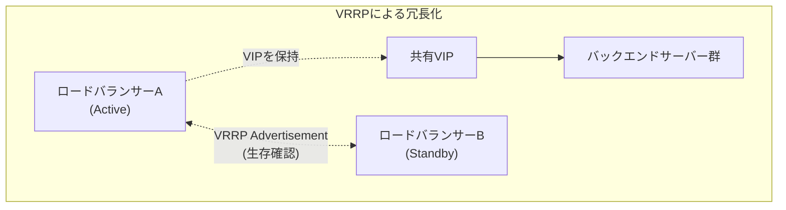

## はじめに

- **この記事で得られること**: [L4/L7の違い](/articles/load-balancing-fundamentals-guide)で扱ったVIP(Virtual IP)という概念を前提に、**ロードバランサー自身を冗長化する**仕組みである**VRRP**(Virtual Router Redundancy Protocol)と、そのLinux実装である**keepalived**が、複数台のロードバランサー間でVIPをどう引き継いでいるのかを体系的に理解します。
- **対象読者**: ロードバランサーがバックエンドサーバーを冗長化する仕組みは理解しているものの、「ロードバランサー自体が壊れたらどうなるのか」を考えたことがない方を想定しています。
- **読むのにかかる想定時間**: 約16分

この記事は[『上位1%』シリーズ 全記事ガイド](/sitemap)の一部、[ロードバランシング基礎シリーズ](/sitemap#シリーズ一覧)の7本目です。この後の[keepalived+HAProxyハンズオン](/articles/load-balancing-keepalived-handson-guide)で、ここで扱う内容を実際に手を動かして構築します。

## 前提知識

- **VIP(Virtual IP)の概念**: [ロードバランサーのL4とL7の違い](/articles/load-balancing-fundamentals-guide)で扱った、クライアントが直接意識する、ロードバランサーが公開する仮想的なIPアドレスです。本記事では、このVIPを、複数台のロードバランサー間でどう引き継ぐかを扱います。

## 全体像をつかむ

[HAProxyハンズオン](/articles/load-balancing-haproxy-handson-guide)で構築したロードバランサーは、1台だけで動作していました。しかし、**そのロードバランサー1台自身が故障すれば、バックエンドサーバーがいくら冗長化されていても、サービス全体が止まってしまいます。** ロードバランサーは、複数のバックエンドサーバーを冗長化する一方で、自分自身が新たな単一障害点になってしまっては意味がありません。

## 基礎から徹底解説

### VRRP:複数台のルーター(ロードバランサー)が、1つのVIPを共有する仕組み

**VRRP**(Virtual Router Redundancy Protocol)は、もともとルーターの冗長化のために設計されたプロトコルですが、ロードバランサーの冗長化にもそのまま応用できます。複数台のロードバランサーが、**1つの共有VIPに対して、どちらが現在「本物」として応答するかを、お互いに通知し合う**仕組みです。

- **Master(Active)**: 現在、実際にVIPを保持し、クライアントからの通信に応答している機体です。
- **Backup(Standby)**: VIPを保持していない、待機中の機体です。Masterからの生存通知を監視しています。

MasterとBackupは、**VRRP Advertisement**という生存確認パケットを、定期的にやり取りします。MasterからのAdvertisementが、一定時間(通常は数秒)途絶えると、Backupは「Masterが機能していない」と判断し、**自分自身をMasterへ昇格させ、VIPを自分のインターフェースに付与します。**

### keepalived:Linux上でVRRPを実現するソフトウェア

**keepalived**は、Linux上でVRRPを実装し、動作させるためのOSSソフトウェアです。[HAProxy](/articles/load-balancing-haproxy-handson-guide)がロードバランシングそのものを担うソフトウェアであるのに対し、**keepalivedは、そのHAProxyが動いているサーバー自体を、複数台構成で冗長化するための、別の役割を持つソフトウェアです。** この2つは競合する技術ではなく、組み合わせて使うことを前提とした、別々の問題を解決するソフトウェアです。

VIPの切り替えは、実際には何が起きているのか

VIPの切り替えが発生すると、新しくMasterになったサーバーは、**Gratuitous ARP**(無償ARP)という、特殊なARPパケットを、ネットワーク上にブロードキャストします。これは、「このVIPのMACアドレスは、今後このサーバーのものになりました」と、周辺のネットワーク機器(スイッチなど)へ通知するパケットです。これにより、クライアント側は、DNSの設定変更やTTLの経過を一切待つことなく、ネットワーク層で即座に新しいMasterへの通信が切り替わります。[GSLBの仕組み](/articles/load-balancing-gslb-guide)がDNSのTTLに起因する遅延を常に抱えていたのとは対照的に、VRRPによる切り替えは、同一ネットワーク内であれば、秒単位の非常に高速な切り替えが可能です。

### 分割された脳(Split-Brain):なぜ2台の機体が同時にMasterになってはいけないのか

VRRPの構成において、最も避けなければならない障害が**スプリットブレイン**です。これは、何らかの理由(MasterとBackup間のネットワーク経路だけが切断された場合など)で、**MasterとBackupの両方が、互いの生存通知を受け取れなくなり、両方が「自分がMasterだ」と判断してしまう状態**です。

スプリットブレインが発生すると、同じVIPを、2台の機体が同時に名乗ってしまい、クライアントからの通信がどちらに届くか不定になる、深刻な障害につながります。これを防ぐため、VRRPの生存確認用の通信経路自体を、ロードバランサーが実際にクライアントと通信する経路とは別の、専用のネットワーク経路(あるいは複数経路)で冗長化しておくことが、実務上の定石です。

## プロが見ている視点(上位1%の理解)

### 「冗長化されている」という言葉は、常に「何が」「何から」守られているのかを問い直す必要がある

[HAProxyハンズオン](/articles/load-balancing-haproxy-handson-guide)で確認したバックエンドサーバーの冗長化と、本記事で扱うロードバランサー自体の冗長化は、**見た目は似ていますが、守っている対象の階層が異なります。** 「このシステムは冗長化されている」という説明を聞いたときに、「バックエンドは冗長化されているが、ロードバランサー自体はどうか」「ロードバランサーは冗長化されているが、その先のネットワーク機器やデータセンター自体はどうか」と、階層を一段ずつ遡って問い直す視点が、本当の意味での可用性設計には不可欠です。

## よくある誤解・つまずきポイント

- **誤解1: 「ロードバランサーのバックエンドを冗長化していれば、システム全体が冗長化されている」**
  ロードバランサー自体が1台のままでは、それ自身が新たな単一障害点になります。
- **誤解2: 「VRRPによる切り替えは、DNSの切り替えと同じくらい時間がかかる」**
  VRRPの切り替えは、Gratuitous ARPによってネットワーク層で即座に行われ、DNSのTTLに起因する遅延は発生しません。
- **誤解3: 「MasterとBackupは、常に固定された役割である」**
  MasterがダウンするとBackupが昇格してMasterになり、元のMasterが復旧すると、設定によっては元のMasterへ役割が戻ります(あるいは、復旧した機体がBackupとして留まる設定にすることもできます)。

## 障害・トラブルシューティングの視点

1. **VIPへの通信が、意図したロードバランサーへ届かない**: `ip addr`コマンドで、どちらの機体が現在VIPを保持しているかを確認します。
2. **フェイルオーバーが発生したのに、クライアント側で接続が切り替わらない**: クライアント側や経路上の機器(スイッチなど)のARPキャッシュが古い情報を保持している可能性があります。
3. **2台とも同時にMasterとして動作しているように見える**: スプリットブレインの可能性があります。VRRPの生存確認用の通信経路に障害が起きていないかを確認します。

## まとめ

- ロードバランサー自体を冗長化しなければ、バックエンドサーバーの冗長化がどれだけ進んでいても、ロードバランサー自身が単一障害点になります。
- VRRPは、複数台のロードバランサーが1つの共有VIPを、Master/Backupという役割分担で引き継ぐプロトコルで、keepalivedはそのLinux実装です。
- VIPの切り替えは、Gratuitous ARPによってネットワーク層で即座に行われ、DNSのTTLのような遅延は発生しません。
- スプリットブレイン(両機が同時にMasterになる状態)を防ぐため、生存確認用の通信経路自体の冗長化が実務上の定石です。

**今日から意識すべきこと**
1. 「冗長化されている」という説明を聞いたら、どの階層が冗長化されているのかを、一段ずつ問い直す習慣をつけましょう。
2. ロードバランサーを冗長化する際は、VRRPの生存確認用の経路自体が単一障害点になっていないかを確認しましょう。

## 参考文献

- [RFC 5798 - Virtual Router Redundancy Protocol (VRRP) Version 3](https://datatracker.ietf.org/doc/html/rfc5798)
- [Keepalived Documentation](https://www.keepalived.org/manpage.html)
