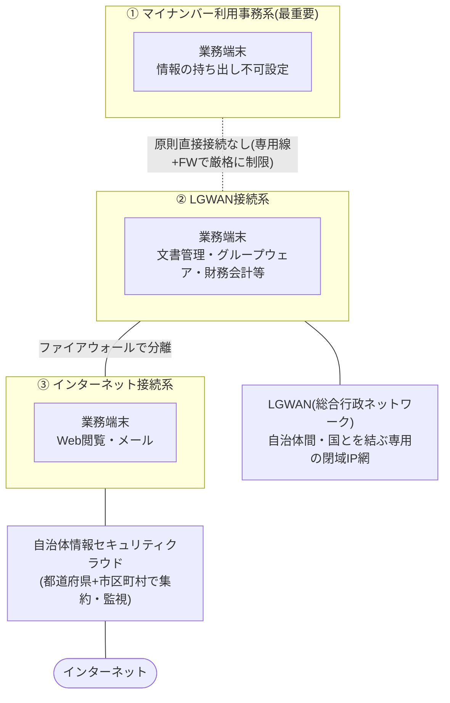
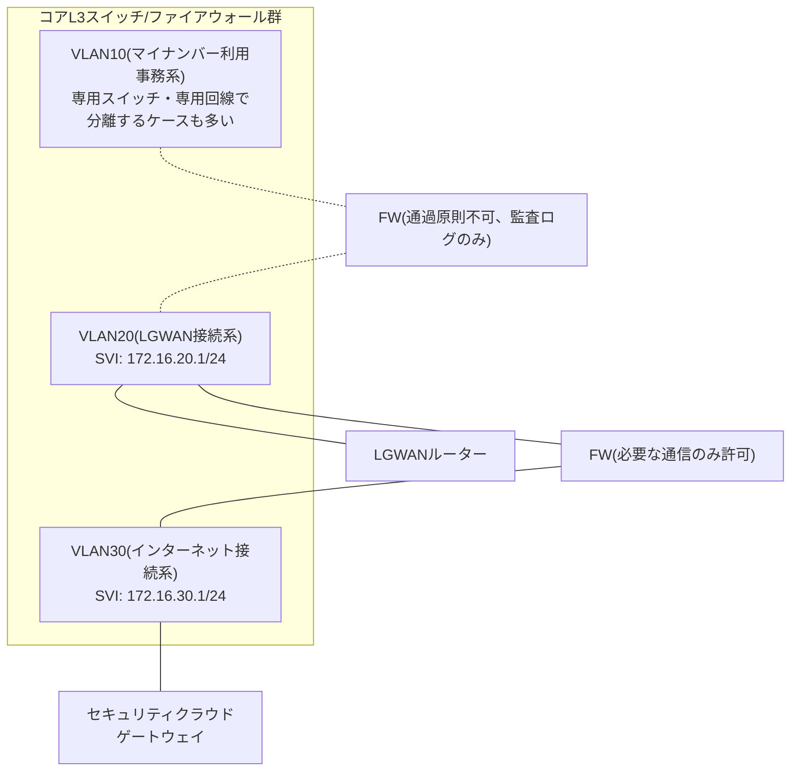

## はじめに

- **この記事で得られること**: 「LGWAN」「マイナンバー利用事務系」「インターネット接続系」という、地方公共団体(自治体)のネットワークで頻出する3つの区分が、なぜ分離されているのか、そしてそれぞれがVLAN・L3スイッチ・ファイアウォールといった実際のネットワーク機器でどう実装されるのかを体系的に理解できます。あわせて、都道府県単位で構築される **自治体情報セキュリティクラウド** の仕組み、LGWAN内で安全にセキュリティパッチを配信する **自治体情報セキュリティ向上プラットフォーム** の役割、そして三層分離モデルがなぜ今ゼロトラストの方向へ見直されつつあるのかまで扱います。
- **対象読者**: VLANやファイアウォールによるネットワークセグメント分割の基本は理解しているが、それが自治体・官公庁の現場で具体的にどう組み合わされているかをイメージできない方。あるいは自治体・官公庁向けのシステム構築に関わることになり、LGWANやマイナンバー利用事務系といった独特の用語に触れ始めた方を想定しています。
- **読むのにかかる想定時間**: 約25分

この記事は[『上位1%』シリーズ 全記事ガイド](/sitemap)の一部です。

## 前提知識

- **VLAN(Virtual LAN)** : 1台の物理スイッチの中に、複数の独立した論理的なブロードキャストドメインを作る技術です。同じVLAN番号のポート同士だけが同じセグメントに属します。
- **L3スイッチ/インターVLANルーティング**: VLANごとにIPアドレスを持つ仮想インターフェース(SVI)を割り当て、異なるVLAN間の通信をルーティングによって中継する仕組みです。
- **ファイアウォール(FW)** : 送信元/宛先IPアドレスやポート番号などの条件に基づき、通信を許可・拒否するルール(ACL)を適用する機器です。
- **IDS/IPS(侵入検知/防御システム)** : 通信内容をシグネチャ等と照合し、不正な通信を検知(IDS)、あるいは検知したうえで遮断(IPS)する仕組みです。

## 全体像をつかむ

### 一言で言うと

自治体のネットワークは、 **「情報の重要度に応じて論理的・物理的に分離された3つのセグメント」と「都道府県単位で集約された共同防御基盤」という2段構えで守られている** 、とまとめられます。この分離体制は「三層の対策」と呼ばれ、2015年の日本年金機構における個人情報流出事件を受けて総務省が地方公共団体へ要請した抜本的なセキュリティ強化策に端を発しています。

各系統の役割を一言で言うと、 **マイナンバー利用事務系は「絶対に外に漏らさない層」、LGWAN接続系は「自治体同士・国と閉じてやり取りする層」、インターネット接続系は「外の世界と接する層」** です。この3層構造そのものはVLANやファイアウォールという、汎用的なネットワーク機器の使い分けによって実現されています。

## 基礎から徹底解説

### なぜここまで厳格に分離するのか: 2015年日本年金機構事件という起点

2015年(平成27年)、日本年金機構が標的型攻撃メールを受け、約125万件の個人情報が外部に流出する事件が発生しました。この事件を受け、総務省は地方公共団体に対して「三層の対策」と呼ばれる抜本的なセキュリティ強化策を要請し、平成30年9月の「地方公共団体における情報セキュリティポリシーに関するガイドライン」改定でその内容が正式に反映されました。三層の対策は、次の3つの柱で構成されています。

1. **マイナンバー利用事務系では、端末からの情報の持ち出し不可設定等を講じ、住民情報の流出を徹底して防止する。**
2. **LGWAN接続系とインターネット接続系を分割し、LGWAN環境のセキュリティを確保する。**
3. **都道府県と市区町村が協力して自治体情報セキュリティクラウドを構築し、高度なセキュリティ対策を実施する。**

以降の節では、この3つの柱を実際のネットワーク構成に落とし込んで見ていきます。

### マイナンバー利用事務系: 住民情報を扱う最も厳格な層

**マイナンバー利用事務系** は、個人番号(マイナンバー)を利用する事務——税、社会保障、災害対策などの分野で住民の個人情報を直接取り扱う業務——を処理するためのネットワーク区分です。マイナンバーカードの発行・利用そのものを指す言葉ではなく、住民の個人番号と紐づいた情報を扱う「業務システムが動くネットワークの区分」を指す点に注意が必要です。

この系統では、端末からのデータ持ち出し(USBメモリ等の外部媒体へのコピー、印刷、画面キャプチャなど)を制限する設定が講じられ、他の系統や外部ネットワークとは原則として直接接続されません。三層の対策の中でも最も厳格な水準の対策が要求される層です。

### LGWAN接続系: 自治体間をつなぐ閉域網

**LGWAN(Local Government Wide Area Network、総合行政ネットワーク)** は、都道府県・市区町村・国の行政機関を相互に接続する、インターネットとは物理的・論理的に独立した専用のIP網です。自治体間の文書交換、電子申請の受け付け、グループウェアや財務会計システムといった内部事務処理は、このLGWANを介して行われます。

**LGWAN接続系** の端末は、このLGWANを経由して他の自治体・関係機関とやり取りしますが、αモデル(後述)を採用している場合は原則としてインターネットへ直接アクセスしません。LGWANは「インターネットの一部」でも「インターネット経由のVPN」でもなく、独立した専用線ベースの閉域網である、というのが正確な理解です。

### インターネット接続系とα/β/β'モデル

**インターネット接続系** は、Webサイトの閲覧やメールの送受信など、外部との通信を行う端末が置かれる層です。令和2年度のガイドライン改定により、業務端末をどの層に配置するかについて、次の3つのモデルが定義されました。

| モデル | 業務端末の配置 | 業務効率性・利便性 | 必要な対策のレベル |
|---|---|---|---|
| αモデル(従来モデル) | 主たる業務端末をLGWAN接続系に配置 | 低 | 低〜中 |
| βモデル | 主たる業務端末をインターネット接続系に配置(重要な情報資産の配置なし) | 中 | 中 |
| β'モデル | βモデルに加え、文書管理・財務会計等の業務システム(マイナンバー利用事務系を除く)もインターネット接続系に配置 | 高 | 高 |

βモデルを採用する場合は、EDR(端末での不審な挙動の検知・対応)等の技術的対策に加え、インシデント発生時の緊急時即応体制の整備といった組織的・人的対策の確実な実施が条件になります。β'モデルはこれに加え、情報資産単位でのアクセス制御、組織的なセキュリティ対策基準の遵守、継続的な検知・モニタリング体制の構築が条件です。つまり、 **利便性を高めるほど、自治体側に求められる技術的・組織的対策の水準も引き上げられる** という設計になっています。

### VLAN・L3スイッチ・ファイアウォールで実現する実際のセグメント構成

ここまでの3層は、あくまで「業務・情報の重要度に応じた論理区分」の話です。これを実際のネットワーク機器に落とし込むと、多くの自治体では概ね次のような構成が採られています。

VLANによる論理分離だけで3層すべてを1台の物理スイッチにまとめる構成も技術的には可能ですが、マイナンバー利用事務系については、L3スイッチのACL設定ミス1つが住民情報流出という重大インシデントに直結しかねないため、多くの自治体では **VLANによる論理分離に加えて、専用の物理スイッチ・専用回線を用いる二重の分離** を採用しています。一方、LGWAN接続系とインターネット接続系の境界は、VLANとファイアウォールによる論理的な分離が一般的です。

いずれの場合も、境界に置かれるファイアウォールでは「その通信が本当に必要か」を1つ1つのルールとして明示的に許可する **ホワイトリスト方式** が基本方針になります。特にマイナンバー利用事務系とそれ以外の系統との間は、原則として通信そのものを許可しない設定とし、やむを得ず必要な連携がある場合(例: 住民基本台帳システムとの一部連携)のみ、個別に許可ルールを設けるという運用が一般的です。

### 自治体情報セキュリティクラウド: 都道府県単位で集約する共同防御基盤

インターネット接続系は外部と直接通信するため、マルウェア感染やWebサーバーへの攻撃といった脅威に常時さらされます。これに対応するのが **自治体情報セキュリティクラウド** です。都道府県と管内の市区町村が協力してWebサーバーやメールサーバー等を集約し、監視・ログ分析・解析をはじめとする高度なセキュリティ対策を共同で実施する仕組みで、47都道府県すべてに構築されています。

主な機能要件は、次のように整理できます。

| 分類 | 主な機能 | 位置づけ |
|---|---|---|
| インターネット通信の監視 | Webサーバー・メールリレーサーバー・プロキシサーバー・外部DNSサーバーの監視 | 必須 |
| インシデントの予防(ゲートウェイ対策) | ファイアウォール、IDS/IPS、マルウェア対策、URLフィルタ | 必須 |
| メールセキュリティ対策 | アンチウイルス/スパム対策、振る舞い検知(添付ファイルを疑似環境で実行し異常動作を検知) | 必須 |
| Webサーバーセキュリティ対策 | WAF(Webアプリケーションへの不正な通信を検知・防御)、CDN(負荷分散) | 必須 |
| 高度な人材による監視 | ログ収集・分析、イベント監視、SOC(Security Operation Center)によるマネージドセキュリティサービス | 必須 |
| 対応と復旧 | 脆弱性管理、CSIRTと連携した不正通信の早期検知、バックアップ、ヘルプデスク | 必須 |
| オプション要件 | 通信の復号対応(暗号化通信の中身を検査)、メール/ファイルの無害化、EDR監視(βモデル採用自治体向け)、インターネット接続系VDI接続 | 自治体の判断 |

オプション要件の実施状況(令和6年時点)

47都道府県への調査では、オプション要件のうち「通信の復号対応」を94%の団体が、「メール/ファイル無害化」を72%の団体が実施しています。「通信の復号対応」は政府機関等の統一基準にも監視時のデータ復号の記載があることから、必須要件への格上げが検討されています。

自治体情報セキュリティクラウドの効果は、実績値として公表されています。ある県の令和5年度実績では、ファイアウォールによる遮断が月間15.1億セッション、IPSによる遮断が月間201万セッション、メール添付マルウェアの削除が月間6,988件、スパムメール判定が月間347万件に上ります。47都道府県すべてが「現行のセキュリティクラウドはサイバー攻撃に対して効果的である」と回答しており、日々の攻撃の99%以上をこの共同防御基盤の段階で遮断できているとされています。

### 自治体情報セキュリティ向上プラットフォーム: LGWAN内に安全にパッチを届ける仕組み

三層分離には、1つの構造的なジレンマがあります。マイナンバー利用事務系やLGWAN接続系の端末は、セキュリティ確保のためにインターネットへの直接アクセスを制限されていますが、その一方でOSやウイルス対策ソフトのセキュリティパッチ・パターンファイルの更新は、通常インターネット経由で配信されるものです。**分離したことで、かえって最新のセキュリティパッチが当たりにくくなる** という矛盾が生じてしまいます。

これを解決するのが、J-LIS(地方公共団体情報システム機構)が運営する **自治体情報セキュリティ向上プラットフォーム事業** です。インターネット側で取得したWindows Updateやウイルス対策ソフトのパターンファイルなどの更新プログラムを、このプラットフォームが安全に受け渡し、LGWAN経由でLGWAN接続系・マイナンバー利用事務系の端末に配信します。Microsoft 365のアクティベーション通信の中継にも対応しており、平成29年12月に実証運用が開始されました。「分離すること」と「最新の状態に保つこと」という一見相反する2つの要求を両立させるための、いわば **LGWANという閉域網に穴を開けずに橋を架ける** 仕組みだと捉えると理解しやすくなります。

## プロが見ている視点(上位1%の理解)

### なぜ三層分離だけでは終わらないのか: 令和2年度改定の背景

三層の対策は住民情報の流出防止に大きな効果を上げた一方、次のような課題も指摘されてきました。添付ファイル付きメールのやり取りが手間になる、テレワークが構造的に困難になる、SaaSのようなクラウドサービスがインターネット接続系に限定されがちで業務効率が上がらない、といった点です。これを受け、令和2年12月のガイドライン改定では「セキュリティの確保と効率性・利便性向上の両立」という観点から、前述のβ/β'モデルが導入されました。三層分離は、一度作ったら終わりの固定的な仕組みではなく、 **脅威の変化と利便性への要求のバランスを取りながら継続的に見直される、生きた設計** だと理解しておくことが重要です。

### ゼロトラストアーキテクチャとの接続点

デジタル庁が2022年6月30日に公表した「ゼロトラストアーキテクチャ適用方針」は、ネットワークの内外を問わず脅威が存在するという前提に立ち、暗黙の信頼範囲(トラスト・ゾーン)を極小化するという考え方を示しています。自治体情報セキュリティクラウドは、ネットワーク外部の脅威を検知・対処しているという点で、この方針が定める「リソースとアクセスを観測する」という要素の一部をすでに実現しているものとして位置づけられています。総務省の検討会報告書では、2030年頃を見据えた将来像として、国と地方のネットワーク基盤の共用化や、地方公共団体側でのゼロトラストアーキテクチャの本格導入に向けた検証・実証が進められており、 **現在の三層分離モデルは、将来的なゼロトラストモデルへの移行過程にある経過的な仕組み** という位置づけになりつつあります。

### 自治体情報セキュリティクラウドの構造的な課題

都道府県単位で複数の市区町村が共同利用する仕組みであるがゆえの課題も明らかになっています。

- **財政負担の増加**: 都道府県・市区町村の費用負担額が年々増加しており、多くの自治体が課題として挙げています。
- **共同利用に伴う構造的リスク**: 共同のデータセンターで障害が発生した場合の影響範囲が大きい、一部の利用団体が大量の通信を行うと他の利用団体の接続が不安定になりうる、当初設計からの拡張性に乏しく新機能の追加が難しい、といった点です。
- **通信の復号化に伴う副作用**: 暗号化通信を検査するために復号する処理が、オンライン会議のようなリアルタイム性が求められる通信や、有効期限の短いワンタイムパスワードのメール受信に遅延や不具合を引き起こすことがあります。
- **契約終了時期の集中**: 多くの都道府県で自治体情報セキュリティクラウドの契約が令和8年度末に集中して終了する見込みであり、2030年頃の将来像への移行が完了する前のタイミングで、次期契約への切り替えが必要になるという構造的な課題を抱えています。

### ガバメントクラウドとの関係

住民基本台帳・税・社会保障といった基幹系の「標準準拠システム」は、国が整備するガバメントクラウド上への移行が進められています。令和5年3月のガイドライン改定では、ガバメントクラウド及びこれと同等の情報セキュリティ水準を維持できるクラウドサービスについて、 **原則としてインターネット接続を禁止** としつつ、修正プログラムの適用・ソフトウェアのアクティベーション・管理コンソールへの接続という3つのケースに限り、例外的にインターネット接続を認める、という方針が示されました。これは、前述の「安全性を保ったまま最新の状態に保つ」という自治体情報セキュリティ向上プラットフォームと同じ発想が、ガバメントクラウドの領域にも適用されている例だと言えます。

## よくある誤解・つまずきポイント

- **誤解1: 「マイナンバー利用事務系」はマイナンバーカードの話だと思っている**
  マイナンバー利用事務系は、住民のマイナンバー(個人番号)と紐づいた情報を扱う税・社会保障などの内部事務処理が動く「ネットワーク区分の名称」です。マイナンバーカードの発行・電子証明書の利用そのものとは別の話です。
- **誤解2: LGWANはインターネットの一部、あるいはインターネット経由のVPNのようなものだと思っている**
  LGWANは、インターネットとは独立した専用の閉域IP網(総合行政ネットワーク)です。物理的に別回線で構築されており、インターネット上に暗号化トンネルを張るVPNとは仕組みが異なります。
- **誤解3: 自治体情報セキュリティクラウドを導入すれば、各自治体側は何も対策しなくてよい**
  βモデルを採用する自治体には、セキュリティクラウド側の対策に加えて、端末側のEDR導入や緊急時即応体制の整備が導入の条件として求められています。集約された共同防御基盤と、各自治体側の個別対策は、どちらか一方で完結するものではなく両輪です。
- **誤解4: 三層分離すれば構造的に絶対安全**
  Emotetのようなメール経由のマルウェアは、LGWAN接続系の端末にも届き得ます。三層分離は「攻撃が侵入した場合の拡散範囲とアクセス可能な情報の範囲を限定する」対策であり、侵入そのものを完全にゼロにする仕組みではありません。

## 障害・トラブルシューティングの視点

1. **正規のWebサイト・メールが誤って遮断される**: 自治体情報セキュリティクラウドのURLフィルタやスパム判定の誤検知が原因であることが多く、多くの自治体でヘルプデスクを通じた解除申請フローが用意されています。
2. **オンライン会議やワンタイムパスワードメールの遅延・失敗**: セキュリティクラウドの「通信の復号対応」(SSL/TLSインスペクション)処理が、リアルタイム性の高い通信や有効期限の短いメールに影響を与えていないかを疑います。
3. **特定の時間帯だけ接続が不安定になる**: 都道府県内の他自治体による大量通信が、共同利用基盤を通じて自団体の接続品質に影響している可能性があります。
4. **LGWAN接続系・マイナンバー利用事務系端末のセキュリティパッチが最新化されない**: インターネット経由の通常のWindows Update等は届かないため、自治体情報セキュリティ向上プラットフォーム経由の配信設定・接続状況を最優先で確認します。
5. **マイナンバー利用事務系から他系統への意図しない疎通**: L3スイッチ/ファイアウォールのACL設定ミスやVLAN割り当てミスが原因であることが多く、住民情報流出につながりかねない最重要インシデントとして、設定の棚卸しを最優先で行います。

### 予防策・恒久対策

- 3層それぞれの境界に設定されているACL/ファイアウォールルールを定期的に棚卸しし、意図しない通信経路が生まれていないかを確認する。
- セキュリティクラウドが提供する月次の運用実績レポートを定期的にレビューし、攻撃傾向や誤検知件数の変化を早期に把握する。
- ガバメントクラウド移行・ゼロトラストアーキテクチャ導入という将来像を踏まえ、セキュリティクラウドの契約更新のタイミングで、現行要件を漫然と踏襲せず将来像との整合性を意識した仕様検討を行う。

## まとめ

- 自治体ネットワークの「三層の対策」は、2015年の日本年金機構事件を受け、①マイナンバー利用事務系の情報持ち出し防止、②LGWAN接続系とインターネット接続系の分割、③都道府県単位でのセキュリティクラウド構築、という3本柱で構成されています。
- 業務端末をどの層に配置するかは、従来型のαモデルに加え、利便性と対策水準のバランスを取ったβ/β'モデルが選択肢として存在します。
- 3層の分離は、VLANによる論理分離とファイアウォールによるACL制御で実装されますが、マイナンバー利用事務系については専用の物理スイッチ・専用回線による二重の分離が併用されることが多いです。
- 自治体情報セキュリティクラウドは都道府県+市区町村の共同防御基盤としてIDS/IPS・WAF・SOC監視等を提供し、日々の攻撃の99%以上を遮断する実績がある一方、財政負担や共同利用に伴う構造的リスクという課題も抱えています。
- 三層分離モデルは固定的な仕組みではなく、ゼロトラストアーキテクチャへの移行を見据えた経過的な仕組みとして、継続的に見直され続けています。

**今日から意識すべきこと**
1. 自治体・官公庁向けのネットワーク構成に触れたら、まず「これはマイナンバー利用事務系・LGWAN接続系・インターネット接続系のどの層の話か」を意識してみましょう。
2. セグメント間の境界(FW/ACL)を見たら、「なぜこの通信だけが許可されているのか」を確認する習慣をつけましょう——ホワイトリスト方式の設計思想を理解する近道になります。

## 参考文献

- [地方公共団体情報セキュリティポリシーに関するガイドラインの概要及び直近の改定内容(総務省自治行政局、令和5年10月10日)](https://www.soumu.go.jp/main_content/000907086.pdf)
- [自治体情報セキュリティクラウドについて(総務省自治行政局、令和6年9月4日)](https://www.soumu.go.jp/main_content/000972052.pdf)
- [地方公共団体における情報セキュリティポリシーに関するガイドライン(総務省、令和5年3月28日改定)](https://www.soumu.go.jp/menu_news/s-news/01gyosei07_050328.html)
- [自治体情報セキュリティ向上プラットフォーム事業(地方公共団体情報システム機構 J-LIS)](https://www.j-lis.go.jp/spd/security/jithitaijyohosecuritykoujoupf/jyohou_security_pf.html)
- [ゼロトラストアーキテクチャ適用方針(デジタル庁、2022年6月30日)](https://www.digital.go.jp/assets/contents/node/basic_page/field_ref_resources/e2a06143-ed29-4f1d-9c31-0f06fca67afc/5efa5c3b/20220630_resources_standard_guidelines_guidelines_04.pdf)
