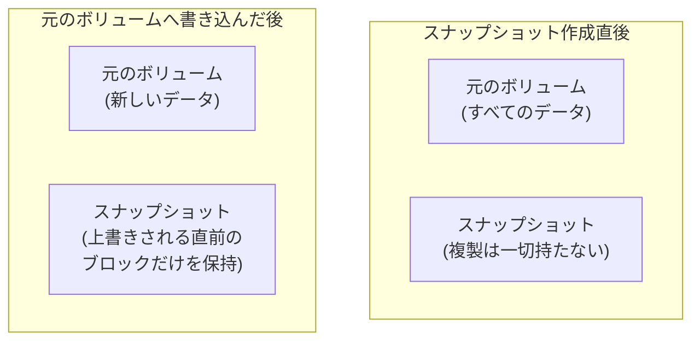

## はじめに

- **この記事で得られること**: [シンプロビジョニングの仕組み](/articles/thin-provisioning-guide)で学んだ、「実際にデータが書き込まれた分だけ、物理領域を割り当てる」という発想を前提に、**LVM(Logical Volume Manager)のスナップショットが、作成した瞬間には元のボリュームの複製を一切持たず、コピーオンライト(Copy-on-Write)という仕組みによって、変更された部分だけを退避していく**様子を、実際に手を動かして確認します。
- **対象読者**: [mdadmでRAID5を構築するハンズオン](/articles/mdadm-raid5-handson-guide)は経験したものの、「スナップショットから過去の状態に戻せる」という機能が、具体的にどういう仕組みで実現されているのかを説明できない方を想定しています。
- **読むのにかかる想定時間**: 約25分(ハンズオン実施込み)

この記事は[『上位1%』シリーズ 全記事ガイド](/sitemap)の一部、[ストレージ基礎シリーズ](/sitemap#シリーズ一覧)の11本目です。[ハンズオン準備マニュアル](/articles/handson-prep-guide)で作成したUbuntu Server環境が1台あれば実施できます。

## 前提知識

- **シンプロビジョニングの発想**: [シンプロビジョニングの仕組み](/articles/thin-provisioning-guide)で扱った、「見かけの容量」と「実際に消費している容量」を分離するという発想です。LVMスナップショットは、この発想を、さらに一歩進めた応用です。
- **mdadmの基本操作**: [mdadmでRAID1を構築するハンズオン](/articles/mdadm-raid-handson-guide)で扱った、ループバックデバイスの作成方法です。

## 全体像をつかむ

スナップショットを、「元のボリュームの、まるごとの複製」だと誤解してしまうと、この後の挙動がすべて説明できなくなります。実際のLVMスナップショットは、次のように動作します。



## ハンズオン手順

### Step 1: ループバックデバイスで、LVMの論理ボリュームを作成する

```bash
sudo apt install -y lvm2
sudo dd if=/dev/zero of=/disk-lvm.img bs=1M count=500
sudo losetup /dev/loop5 /disk-lvm.img
sudo pvcreate /dev/loop5
sudo vgcreate vg_test /dev/loop5
sudo lvcreate -L 300M -n lv_data vg_test
sudo mkfs.ext4 /dev/vg_test/lv_data
sudo mkdir -p /mnt/lvdata
sudo mount /dev/vg_test/lv_data /mnt/lvdata
echo "original data v1" | sudo tee /mnt/lvdata/file.txt
```

### Step 2: スナップショットを作成する

```bash
sudo lvcreate -L 100M -s -n lv_snap /dev/vg_test/lv_data
sudo lvs
```

**実行結果(該当部分):**

```
LV       VG      Attr       LSize   Pool Origin  Data%
lv_data  vg_test owi-aos--- 300.00m
lv_snap  vg_test swi-a-s--- 100.00m      lv_data  0.01
```

**ここで注目すべきは、`Data%`が、わずか`0.01`しかないことです。** スナップショットの割り当てサイズは100MBですが、**この時点では、スナップショット側は、実際にはほぼ何もデータを保持していません。** これは、[シンプロビジョニングで学んだ発想](/articles/thin-provisioning-guide)と同じ、「見かけの容量」と「実際の消費量」の分離です。

### Step 3: 元のボリュームにデータを書き込み、スナップショット側の消費量の変化を確認する

```bash
echo "modified data v2" | sudo tee /mnt/lvdata/file.txt
sudo lvs
```

**実行結果(該当部分):**

```
LV       VG      Attr       LSize   Pool Origin  Data%
lv_data  vg_test owi-aos--- 300.00m
lv_snap  vg_test swi-a-s--- 100.00m      lv_data  2.73
```

**`Data%`が、0.01から2.73へ増加しました。** 元のボリュームのデータを書き換えた瞬間、**上書きされる直前の、変更対象のブロックだけが、コピーオンライトによって、スナップショット側に退避されたため**です。元のボリューム全体が、スナップショット側に複製されたわけではありません。

<details>
<summary>コピーオンライトという名前の由来</summary>

**コピーオンライト(Copy-on-Write)という名前は、「書き込まれる(Write)時に、初めてコピーが行われる(Copy-on)」という、動作のタイミングそのものを表しています。** 元のボリュームへの書き込みが発生するたびに、LVMは、「これから上書きされようとしているブロックの、変更前の内容」だけを、スナップショット側へコピーしてから、実際の書き込みを行います。変更されなかったブロックについては、スナップショット作成後も、元のボリュームとスナップショットの両方から、同じ実体を参照し続けます。

</details>

### Step 4: スナップショットから、過去の状態を復元する

```bash
sudo umount /mnt/lvdata
sudo lvconvert --merge /dev/vg_test/lv_snap
sudo mount /dev/vg_test/lv_data /mnt/lvdata
cat /mnt/lvdata/file.txt
```

**実行結果:**

```
original data v1
```

**スナップショット作成時点の内容である、「original data v1」へ、正確に復元されました。** `lvconvert --merge`は、**スナップショット側に退避されていた、変更前のブロックの内容を、元のボリュームへ書き戻す**処理です。スナップショットが、「変更前のブロックだけ」を持っていたからこそ、この復元が、ボリューム全体を上書きするのではなく、変更された部分だけを戻す、効率的な処理として成立しています。

## プロが見ている視点(上位1%の理解)

### スナップショットは、「バックアップ」の代わりにはならない

このハンズオンで確認した通り、**LVMスナップショットは、元のボリュームとコピーオンライトによる差分関係で結びついた、依存関係のある存在**です。元のボリュームが物理的に故障すると、変更されなかった部分を参照し続けているスナップショットも、一緒に失われます。**これは、[RAIDが物理ディスクの故障には有効だが、誤操作によるデータ削除には無力だったのと同じ構造](/articles/mdadm-raid-handson-guide)で、「スナップショットがあるから安心」という考え方は、物理障害に対しては通用しません。** スナップショットは、「数分前・数時間前の状態へ、素早く戻すための仕組み」であり、物理的に独立した場所へデータを保存する、本来のバックアップとは、まったく別の目的を持つ機能として理解する必要があります。

## よくある誤解・つまずきポイント

- **誤解1: 「スナップショットを作成した瞬間、元のボリュームの複製が、まるごと作られる」**
  スナップショット作成直後は、ほぼ何もデータを保持しておらず、元のボリュームへの書き込みが発生するたびに、変更される直前のブロックだけが、コピーオンライトによって退避されていきます。
- **誤解2: 「スナップショットは、バックアップの代わりになる」**
  スナップショットは、元のボリュームと依存関係にあるため、元のボリュームが物理的に故障すると、スナップショットも一緒に失われます。物理的に独立した場所への保存が、本来のバックアップです。
- **誤解3: 「スナップショットからの復元は、ボリューム全体を上書きする、重い処理である」**
  スナップショットは変更前のブロックだけを持っているため、復元処理は、変更された部分だけを書き戻す、効率的な処理です。

## 障害・トラブルシューティングの視点

1. **スナップショットのData%が、100%近くまで上昇している**: 元のボリュームへの書き込みが多く、コピーオンライトによる退避データが、スナップショットの割り当て容量に近づいている状態です。割り当て容量の拡張か、スナップショットの削除を検討します。
2. **スナップショットの割り当て容量が枯渇した**: スナップショット自体が破損し、使用できなくなります。長期間保持するスナップショットには、十分な余裕を持った容量を割り当てる必要があります。
3. **元のボリュームの読み書き性能が、スナップショット作成後に低下している**: コピーオンライトの処理自体が、追加の書き込みオーバーヘッドを発生させるため、これは想定内の挙動です。

## まとめ

- LVMスナップショットは、作成した瞬間には、元のボリュームの複製を一切持ちません。
- 元のボリュームへの書き込みが発生するたびに、変更される直前のブロックだけが、コピーオンライトによって、スナップショット側に退避されます。
- スナップショットからの復元は、退避されていた変更前のブロックを、元のボリュームへ書き戻す、効率的な処理です。
- スナップショットは、元のボリュームとの依存関係があるため、物理障害に対する保護にはならず、本来のバックアップの代わりにはなりません。

**今日から意識すべきこと**
1. スナップショットを運用する際は、Data%(消費量)を監視し、割り当て容量の枯渇を事前に防ぎましょう。
2. スナップショットと、物理的に独立した場所へのバックアップを、常に別の目的の機能として区別しましょう。

## 参考文献

- [lvcreate(8) Manual Page](https://man7.org/linux/man-pages/man8/lvcreate.8.html)
- [LVM — Red Hat Documentation](https://access.redhat.com/documentation/)
