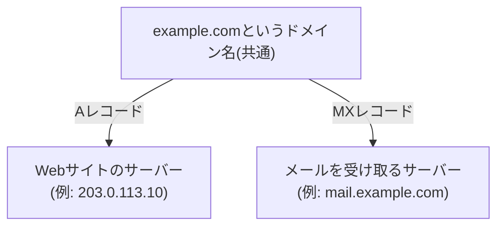
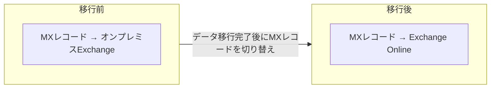

## はじめに

- **この記事で得られること**: メールアドレスの`@`以降にある<strong>「ドメイン」</strong>が、実際にはDNSのどの仕組みと結びついているのかを理解します。あわせて、**Exchangeサーバー**が具体的に何を担っているソフトウェアなのか、そしてオンプレミスのExchange ServerからM365(Exchange Online)へメールを移行するというのが、**具体的に何を切り替える作業なのか**を体系的に整理します。
- **対象読者**: M365へのメール移行に携わったことはあるものの、メールにおけるドメインの意味や、Exchangeサーバーの役割を具体的に説明できない方を想定しています。
- **読むのにかかる想定時間**: 約17分

この記事は[『上位1%』シリーズ 全記事ガイド](/sitemap)の一部、メール基盤をテーマにした新シリーズの1本目です。DNSの一般的な仕組み(特にMXレコード)については[DNSの仕組みを『上位1%』の視点で理解する](/articles/dns-guide)を前提にしています。

## 前提知識

- **MXレコード**: DNSにおいて、「そのドメイン宛のメールを受け取るメールサーバー」を指定するレコードです。詳しくは[DNSの仕組みを『上位1%』の視点で理解する](/articles/dns-guide)を参照してください。
- **SMTP**: メールをサーバー間で転送(リレー)するためのプロトコルです。

## 全体像をつかむ

### メールにおける「ドメイン」とは、MXレコードによって結びつけられている名前空間

メールアドレス`user@example.com`の`example.com`という部分は、Webサイトの`https://example.com`と**同じDNSゾーンの中に存在する、同じドメイン名**です。**この2つが同じ名前を共有していても、実際にどのサーバーへ通信が届くかは、それぞれ別々のDNSレコードによって決まります。** Webサイトへのアクセスは(多くの場合)Aレコードによって特定のIPアドレスへ、メールの配送は**MXレコード**によって、そのドメイン宛のメールを受け取る責任を持つメールサーバーのホスト名へ向かいます。

## 基礎から徹底解説

### MXレコードの仕組み:優先度による冗長化

MXレコードは、単に1つのメールサーバーを指定するだけでなく、**複数のメールサーバーを、優先度(数値が小さいほど優先)とともに指定できます。** 送信元のメールサーバーは、優先度の最も高い(数値が小さい)サーバーへまず配送を試み、応答がない場合に次の優先度のサーバーを試します。これにより、メールサーバーの冗長化が実現されています。

送信元認証の仕組み(SPF・DKIM・DMARC)

メールの世界には、「送信元のドメインを詐称したなりすましメール」への対策として、DNSの**TXTレコード**を利用したいくつかの仕組みがあります。**SPF**は「このドメインからのメールを送信してよいサーバーのIPアドレス一覧」を、**DKIM**は「メールにデジタル署名を付与し、その検証用の公開鍵」を、それぞれTXTレコードとして公開します。**DMARC**は、SPF・DKIMの検証結果に基づいて、認証に失敗したメールをどう扱うか(拒否する、隔離する、など)というポリシーを指定します。これらはいずれも、メールの配送そのもの(MXレコード)とは別の、送信元の正当性を検証するための仕組みです。

### Exchangeサーバーが担っている2つの役割

**Exchangeサーバー**(Microsoft Exchange Server)は、Microsoftが提供する、メール・カレンダー・連絡先を統合的に管理するサーバー製品です。その役割は、大きく2つに分けられます。

- **メールの転送(SMTPリレー)**: 他のメールサーバーとの間で、SMTPプロトコルによるメールの送受信・中継を行います。
- **メールボックスの保管**: 各ユーザーのメール・予定表・連絡先といったデータを、実際に保管する役割です。

**オンプレミスのExchange Serverは、Active Directoryと密接に連携しており、ADのユーザーアカウントに、Exchange上のメールボックスを紐づけて管理します。** [ADとDC、ドメインとフォレストの違いを『上位1%』の視点で理解する](/articles/ad-dc-fundamentals-guide)で扱ったAD DSのスキーマは、Exchange Serverを導入する際に、メールボックスに関する属性が追加される形で拡張されます。

### M365(Exchange Online)への移行とは、何を切り替える作業なのか

**M365(Microsoft 365)へのメール移行は、これまでオンプレミスのExchange Serverが担っていた「メールの転送」と「メールボックスの保管」という2つの機能を、Microsoftが運用するクラウド上のExchange Onlineという基盤へ移す作業**です。実務上、この移行には大きく次の要素が関わります。

1. **既存メールボックスのデータ移行**: 各ユーザーのメール・予定表・連絡先のデータを、オンプレミスのExchange ServerからExchange Onlineへコピーします。
2. **MXレコードの切り替え**: 移行が完了したタイミングで、そのドメイン宛のメールを受け取るサーバーを指すMXレコードを、オンプレミスのExchange ServerからExchange Online側のアドレスへ書き換えます。**この切り替え以降、新しく届くメールはExchange Online側で受け取るようになります。**
3. **ハイブリッド構成という選択肢**: 移行を段階的に進めたい場合、あるいは一部のメールボックスを何らかの理由(コンプライアンス要件など)でオンプレミスに残したい場合、<strong>オンプレミスのExchange ServerとExchange Onlineを一定期間共存させる「ハイブリッド構成」</strong>を選択できます。この構成では、オンプレミス側とクラウド側のメールボックスが、あたかも1つの組織のメールシステムであるかのように、メールの配送やカレンダーの空き時間確認などを相互に行えます。

## プロが見ている視点(上位1%の理解)

### MXレコード切り替え時のTTL管理

[DNSの仕組みを『上位1%』の視点で理解する](/articles/dns-guide)で扱った通り、DNSレコードには<strong>TTL(Time To Live)</strong>というキャッシュの有効期間が設定されています。**MXレコードを切り替える予定がある場合、事前にそのレコードのTTLを短く設定しておく**ことが実務上の定石です。TTLが長いままだと、切り替え後も一部の送信元がキャッシュされた古いMXレコード(オンプレミス側)を参照し続け、メールがオンプレミス側へ届き続けてしまう、という混乱が生じえます。

### ハイブリッド構成が必要になる典型的な理由

すべてのメールボックスを一度に移行できない、あるいはしたくない典型的な理由には、**大量のメールボックスを一度に移行する際の作業時間・帯域の制約**、**特定の業務要件・コンプライアンス要件により、一部のメールボックスをオンプレミスに残す必要がある**、といったものがあります。ハイブリッド構成は、こうした段階的な移行や、恒久的な共存構成を実現するための現実的な選択肢です。

## よくある誤解・つまずきポイント

- **誤解1: 「メールのドメインとWebサイトのドメインは、まったく別々のシステムによって管理されている」**
  両者は同じDNSゾーンの中に存在する、同じドメイン名です。Webサイトへのアクセスと、メールの配送は、それぞれ別のレコードタイプ(Aレコード・MXレコード)によって別々のサーバーへ振り分けられているだけです。
- **誤解2: 「M365への移行は、メールボックスのデータをコピーするだけの単純な作業である」**
  データ移行に加え、MXレコードの切り替えタイミング、必要であればハイブリッド構成の設計といった、複数の要素を組み合わせて計画する必要があります。
- **誤解3: 「Exchangeサーバーは、単にメールを送受信するだけのソフトウェアである」**
  Exchangeサーバーはメールの転送(SMTPリレー)だけでなく、メールボックス(メール・予定表・連絡先)の保管という役割も担っており、Active Directoryとも密接に連携しています。

## 障害・トラブルシューティングの視点

メール関連の障害は、**「配送(MXレコード・SMTP)の問題か、送信元認証(SPF/DKIM/DMARC)の問題か」を切り分ける**のが基本です。

1. **MXレコードを切り替えたのに、メールが旧サーバー(オンプレミス)へ届き続ける**: 送信元のDNSキャッシュに、切り替え前のTTLが残っている可能性があります。TTLが切れるまで待つか、影響範囲を確認します。
2. **メールが正常に送信できているように見えるが、宛先で受信できない**: SPF・DKIMの検証に失敗し、受信側で迷惑メールと判定・拒否されていないかを確認します。
3. **ハイブリッド構成で、メールが配送されない、あるいはループする**: オンプレミス・Exchange Online間のコネクタ設定(どちらが最終的な配送先かの判定ルール)を確認します。

### 予防策・恒久対策

- MXレコードの切り替えを予定している場合、事前にTTLを短く設定しておく。
- 大規模なメールボックス移行では、段階的な移行計画とハイブリッド構成の必要性を早期に検討する。
- SPF・DKIM・DMARCの設定を、メールサーバーの移行にあわせて必ず見直す。

## まとめ

- メールにおける「ドメイン」は、Webサイトと同じDNSゾーンの中の同じ名前であり、メールの配送先はMXレコードによって別途指定されます。
- Exchangeサーバーは、メールの転送(SMTPリレー)とメールボックスの保管という2つの役割を担い、Active Directoryと密接に連携します。
- M365への移行は、既存メールボックスのデータ移行とMXレコードの切り替えという要素を組み合わせた作業であり、段階的な移行が必要な場合はハイブリッド構成という選択肢があります。

**今日から意識すべきこと**
1. 「メールのドメイン」という言葉に出会ったら、それがMXレコードという特定のDNSレコードによって配送先が決まっていることを思い出しましょう。
2. MXレコードの切り替えを計画する際は、必ず事前にTTLを短く設定しておきましょう。

## 参考文献

- [Exchange Online Overview | Microsoft Learn](https://learn.microsoft.com/en-us/exchange/exchange-online)
- [How Exchange Hybrid works | Microsoft Learn](https://learn.microsoft.com/en-us/exchange/exchange-hybrid)
- [Sender Policy Framework (SPF) | RFC 7208](https://datatracker.ietf.org/doc/html/rfc7208)
- [DomainKeys Identified Mail (DKIM) Signatures | RFC 6376](https://datatracker.ietf.org/doc/html/rfc6376)
