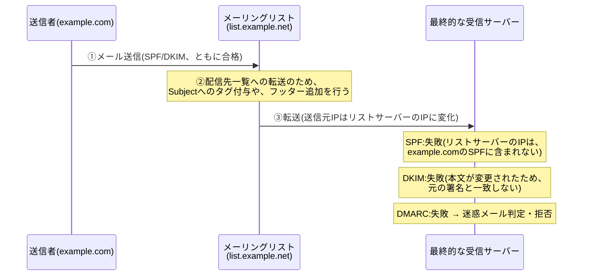
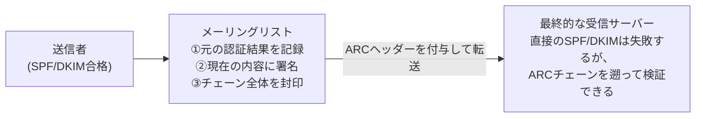

## はじめに

- **この記事で得られること**: [SPF・DKIM・DMARCの仕組み](/articles/mail-spf-dkim-dmarc-guide)で学んだ、送信元認証の仕組みには、「**メールがメーリングリストや転送設定を経由しただけで、正規の送信者からのメールであっても、SPFとDKIMの両方が失敗してしまう**」という、構造的な弱点があります。この問題を、中継した側(メーリングリストや転送サービス)自身が、自分が観測した認証結果に署名して次の宛先へ引き継ぐ、**ARC**(Authenticated Received Chain)という仕組みが、どのように補っているのかを体系的に理解します。
- **対象読者**: SPF・DKIM・DMARCは理解しているものの、「メーリングリスト経由のメールだけ、なぜかDMARCで弾かれる」という現象に遭遇し、原因を説明できない方を想定しています。
- **読むのにかかる想定時間**: 約18分

この記事は[『上位1%』シリーズ 全記事ガイド](/sitemap)の一部、[メール基盤シリーズ](/sitemap#シリーズ一覧)の4.1本目です。

## 前提知識

- [SPF・DKIM・DMARCの仕組み](/articles/mail-spf-dkim-dmarc-guide): SPFが送信元IPアドレスを、DKIMが本文とヘッダーの改ざんを、それぞれ検証する仕組みが前提になっています。

## 全体像をつかむ

メーリングリストや、個人の転送設定(`.forward`など)を経由すると、**正規の送信者が送った、まったく正当なメールであっても、SPFとDKIMの両方が、構造的に壊れてしまう**ことがあります。

## 基礎から徹底解説

### なぜ、転送がSPFとDKIMの両方を壊してしまうのか

**SPFが壊れる理由**: SPFは、[送信元IPアドレスが、そのドメインの持ち主が許可した範囲に含まれているか](/articles/mail-spf-dkim-dmarc-guide)を検証する仕組みです。メーリングリストを経由すると、**最終的な受信サーバーから見える送信元IPは、元の送信者のIPではなく、メーリングリストサーバー自身のIPに変わります。** このIPは、当然、元の送信者のドメインのSPFレコードには含まれていないため、SPFは失敗します。

**DKIMが壊れる理由**: DKIMは、[本文とヘッダーが、署名時点から改ざんされていないか](/articles/mail-spf-dkim-dmarc-guide)を検証する仕組みです。多くのメーリングリストは、**配信先一覧であることを示すフッターの追加や、`Subject`ヘッダーへのタグ付与**(`[リスト名]`など)を行いますが、これは**メールの内容そのものを変更する操作**であり、元のDKIM署名が対象としていた内容と一致しなくなるため、DKIM検証も失敗します。

**SPFとDKIMの両方が失敗すれば、[DMARCも当然失敗します](/articles/mail-spf-dkim-dmarc-guide)。** 結果として、正規の送信者が送った、何一つ悪意のないメールが、単に「メーリングリストを経由した」という理由だけで、最終的な受信者側で迷惑メール判定や拒否の対象になってしまいます。

### ARC:中継者が「自分が観測した認証結果」に署名して引き継ぐ

**ARC**(Authenticated Received Chain)は、この問題に対して、「**中継した側(メーリングリストや転送サービス)自身が、メールを受け取った時点で、元のSPF/DKIM/DMARCの検証結果がどうだったかを記録し、その記録に自分の署名を付けて、次の宛先へ引き継ぐ**」という発想で対処します。ARCは、主に3種類のヘッダーで構成されます。

| ヘッダー | 役割 |
|---|---|
| `ARC-Authentication-Results` | この中継者が受け取った時点で、SPF/DKIM/DMARCがどう判定されたかの記録 |
| `ARC-Message-Signature` | この中継者が転送する、現在のメール内容(改変後)に対する、DKIMと同様の署名 |
| `ARC-Seal` | それまでのARCチェーン全体(過去の中継者の記録も含む)に対する、封印の署名 |

**最終的な受信サーバーは、直接のSPF/DKIM検証こそ失敗するものの、メールに付与されたARCチェーンを遡ることで、「このメーリングリストが受け取った時点では、元の送信者のSPF/DKIMは、確かに合格していた」という事実を、検証可能な形で確認できます。**

ARCを使えば、転送されたメールは常に信頼されるようになるのか

**ここは誤解しやすい、重要な注意点です。ARCは、あくまで「中継者が観測した認証結果の記録」を、検証可能な形で運んでいるだけであり、最終的にその記録を信頼するかどうかの判断は、受信側のメールサーバー自身の方針に委ねられています。** ARCに対応していない受信サーバーは、ARCヘッダー自体を単に無視します。また、ARCに対応している受信サーバーであっても、「どの中継者のARC署名なら信頼するか」という判断自体は、受信側が個別に管理する必要があります。**ARCを導入したからといって、すべての転送メールが自動的に救済されるわけではない**、という点を押さえておく必要があります。

## プロが見ている視点(上位1%の理解)

### ARCは、まだ「実験的」な仕様であることを踏まえて導入を検討する

ARCを定義する[RFC 8617](https://datatracker.ietf.org/doc/html/rfc8617)は、**正式な標準ではなく、「Experimental」(実験的)という位置づけで公開されています。** とはいえ、Gmail・Microsoft 365・Yahooのような大手メールサービスは、すでにARCに対応しており、実務上の効果は確実に存在します。**上位1%のエンジニアは、「仕様としての位置づけ(実験的か、正式な標準か)」と、「実際に主要なプレイヤーがどの程度対応しているか(実務上の効果)」を、分けて評価します。** ARCは、仕様上はまだ発展途上でありながら、実務上はすでに一定の効果を持つ、という、やや珍しい位置づけの技術として理解しておく必要があります。

## よくある誤解・つまずきポイント

- **誤解1: 「ARCは、SPF・DKIM・DMARCを置き換える、新しい認証方式である」**
  ARCはSPF/DKIM/DMARCを置き換えるものではなく、「転送によってこれらが壊れてしまう」という特定の問題を補うための、補完的な仕組みです。
- **誤解2: 「自分のメーリングリストサーバーにARCを設定すれば、転送先でのDMARC失敗が、自動的にすべて解決する」**
  ARCの記録を実際に信頼するかどうかは、最終的な受信側のメールサーバーの方針次第です。受信側がARCに対応していなければ、効果がありません。
- **誤解3: 「メーリングリスト経由のメールがDMARCで弾かれるのは、メーリングリストソフトウェアの不具合である」**
  これはソフトウェアの不具合ではなく、SPF・DKIMという仕組み自体が、送信元IPの変化や本文の改変という、転送に伴う構造的な変化に対して、検出上「失敗」と判定してしまう、プロトコル設計上の必然的な結果です。

## 障害・トラブルシューティングの視点

1. **メーリングリスト経由のメールだけ、DMARCで拒否・迷惑メール判定される**: メーリングリストソフトウェアがARCに対応しているか、そして最終的な受信側がARCを信頼する設定になっているかを確認します。
2. **ARCヘッダーが付与されているのに、効果が出ない**: 受信側のメールサービスが、そもそもARCに対応していないか、あるいは、その中継者のARC署名を信頼する設定になっていない可能性があります。
3. **DMARCのレポートで、転送経由の失敗が多数報告される**: これは、ARCが必要とされている、典型的なシグナルです。メーリングリストソフトウェアのARC対応状況を確認しましょう。

## まとめ

- メーリングリストや転送設定を経由すると、送信元IPの変化と本文の改変によって、正規のメールであってもSPFとDKIMの両方が構造的に壊れ、最終的にDMARCで弾かれることがあります。
- ARCは、中継者自身が、受け取った時点での認証結果を記録し、署名して次の宛先へ引き継ぐことで、この問題を補う仕組みです。
- ARCの記録を実際に信頼するかどうかは、最終的な受信側のメールサーバーの方針次第であり、ARCを設定しただけで、すべての転送メールが自動的に救済されるわけではありません。
- ARCはまだ「実験的」な位置づけの仕様ですが、Gmailなどの大手メールサービスが対応しており、実務上の効果はすでに存在します。

**今日から意識すべきこと**
1. メーリングリスト経由のメールがDMARCで弾かれる事象に遭遇したら、まずARC対応の有無を確認しましょう。
2. 新しい認証技術を評価する際は、「仕様としての位置づけ」と「主要なプレイヤーの実際の対応状況」を、分けて評価しましょう。

## 参考文献

- [RFC 8617 - The Authenticated Received Chain (ARC) Protocol](https://datatracker.ietf.org/doc/html/rfc8617)
- [SPF・DKIM・DMARCの仕組みを『上位1%』の視点で理解する](/articles/mail-spf-dkim-dmarc-guide)
