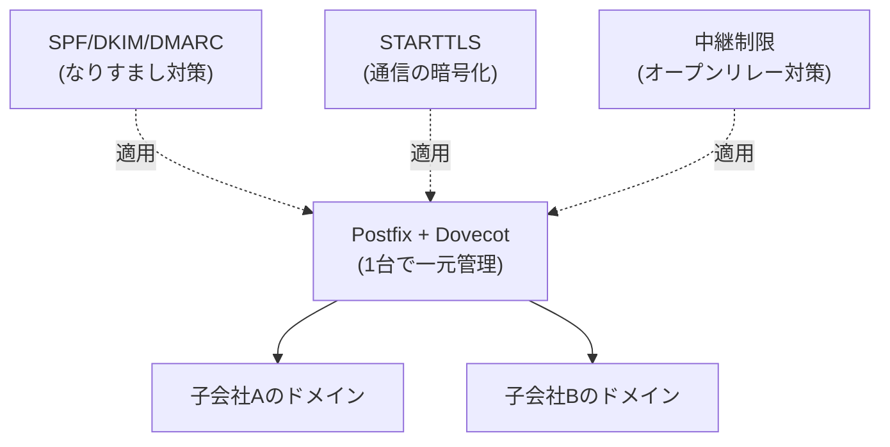

## はじめに

- **この記事で得られること**: ここまでのハンズオンで、1つずつ個別に習得してきた技術(Postfix/Dovecotの構築、複数ドメインを扱うバーチャルドメイン、SPF/DKIM/DMARCによるなりすまし対策、STARTTLSによる暗号化、オープンリレー対策、バウンス処理)を、**1つの架空企業のメール基盤へ、自分の力で統合する**、メール基盤学科の卒業制作です。これまでの記事が「手順をなぞって、1つの技術を確実に身につける」ことを目的としていたのに対し、この記事は**要件だけを提示し、どの技術を、どう組み合わせるかを、自分で設計する**という、実務そのものに近い形式を取ります。
- **対象読者**: メール基盤学科の3年生・4年生・大学院の内容を一通り終え、個々のハンズオンは実施できるが、それらを組み合わせて1つのメール基盤を設計した経験がない方を想定しています。
- **読むのにかかる想定時間**: 設計・構築・文書化を含めて、数日〜1週間程度を想定しています(1回のハンズオンとしては最も重量級です)。

この記事は[『上位1%』シリーズ 全記事ガイド](/sitemap)の一部です。[メール基盤学科の全カリキュラム](/university#メール基盤学科)の、卒業制作にあたる位置づけです。

## 前提知識

このハンズオンは、新しい技術を教えるものではありません。**以下の、すでに実施済みのハンズオンで習得した技術を、組み合わせて使います。**

- [PostfixとDovecotでメールサーバーを構築するハンズオン](/articles/mail-server-handson-guide)
- [SPF・DKIM・DMARCの仕組みを『上位1%』の視点で理解する](/articles/mail-spf-dkim-dmarc-guide)
- [SMTPにおけるSTARTTLSの仕組みを『上位1%』の視点で理解する](/articles/mail-tls-encryption-guide)
- [メールキューとバウンスの仕組みを『上位1%』の視点で理解する](/articles/mail-queue-bounce-guide)
- [PostfixにSPFチェックとDKIM署名を実装し、なりすましメールが拒否される様子を確認するハンズオン](/articles/mail-spf-dkim-dmarc-handson-guide)
- [Postfixで複数ドメインのメールを1台で中継するバーチャルドメインを構築するハンズオン](/articles/mail-virtual-domains-handson-guide)
- [オープンリレーを自分の手で再現し、正しい制限設定で防御するハンズオン](/articles/mail-open-relay-handson-guide)

## 課題設定:架空企業のメール基盤

**あなたは、架空の企業グループ「KoiKoi Holdings」のインフラエンジニアです。このグループは、複数の子会社(それぞれ異なるドメインを持つ)を抱えており、各社が個別にメールサービスを契約している状態を、1台のサーバーで一元管理する体制へ移行することになりました。あなたに与えられた課題は、次の要件をすべて満たす、メール基盤を、自分の手で構築することです。**

### 要件1: 複数のドメインのメールを、1台のサーバーで一元管理する

**子会社ごとに異なるドメインのメールを、個別のサーバーを用意することなく、1台のサーバーで受信・配送できる構成にしてください。**

### 要件2: なりすましメールを拒否できるようにする

**取引先を装った、なりすましメールの被害が業界内で増えています。自社ドメインを騙ったなりすましメールが、受信側で正しく拒否されるよう、送信側の設定を整備してください。**

### 要件3: メールの通信経路を暗号化する

**メールの内容が、通信経路上で平文のまま盗聴されるリスクに備え、暗号化を適用してください。ただし、暗号化に対応していない古いサーバーとの通信が、完全に拒否されてしまわないよう、互換性にも配慮してください。**

### 要件4: 第三者の踏み台にされるリスクを排除する

**このサーバーが、第三者から勝手に中継サーバーとして使われ、スパムメールの送信元として悪用されるリスクを、構造的に排除してください。**

### 要件5: 配送できなかったメールを適切に扱う

**メールが配送できなかった場合に、一時的な問題なのか、恒久的な問題なのかを区別し、それぞれに応じた適切な扱い(再試行、送信者への通知など)ができる体制を整えてください。**

### 要件6: 運用担当者が障害時に迷わないようにする

**メールが届かないという問い合わせがあった際に、どのログを、どういう手順で確認すれば、原因を迅速に特定できるかを、手順書としてまとめてください。**

## 成果物の要件:ポートフォリオとしてまとめる

**このハンズオンの最終的な成果物は、実際にメールが送受信できたという動作確認の記録だけではありません。** GitHubなどのリポジトリに、次の内容を含む形でまとめてください。

- **README.md**: このシナリオの概要、あなたが採用したメール基盤の全体像(mermaidなどの図を含む)
- **設計判断の記録**: 「なぜその設定・構成を選んだのか」という、判断の理由。特に、互換性とセキュリティのトレードオフが発生した箇所について
- **実施手順**: 実際に実行したPostfix/Dovecotの設定ファイルの記述や、検証コマンドの記録
- **振り返り**: 実施してみて分かった課題、実際の実務であれば追加で検討すべき点(マネージド型メールサービスへの移行、送信レピュテーションの監視など)

**この成果物こそが、転職活動やポートフォリオとして提示できる、具体的な実績になります。** 単に「SPF/DKIM/DMARCのハンズオンをやりました」と説明するよりも、「複数ドメインが混在する現実的な制約の中で、複数の技術を組み合わせて設計し、互換性とセキュリティのトレードオフを言語化できる」ことを示せる方が、はるかに説得力があります。

## プロが見ている視点(上位1%の理解)

### 「手順をなぞる力」と「要件から設計する力」は、まったく別のスキルである

これまでのハンズオンは、いずれも「Step 1、Step 2……」という、決められた手順をなぞる形式でした。**しかし、実際の実務で評価されるのは、手順書通りに作業を実行する力ではなく、与えられた要件(この記事でいう「要件1〜6」)から、どの技術を、どう組み合わせるべきかを、自分で設計する力です。** この2つは、似ているようでまったく別のスキルです。個々のハンズオンをすべて完了していても、それらを組み合わせて1つの一貫したメール基盤を設計した経験がなければ、実務での即戦力にはなりません。この卒業制作は、その橋渡しを行うための、意図的な設計になっています。

### なぜ「複数ドメインの一元管理」という設定なのか

このハンズオンが、単発の技術デモではなく、あえて「複数の子会社、複数のドメインを、1台で一元管理する」という、現実的なプロジェクトを模した設定にしているのには理由があります。**実務のメール基盤導入の多くは、単一ドメインの単発設定だけでは完結せず、複数のドメイン、なりすまし対策、暗号化、中継制限という、複数の要素を同時に満たす必要があります。** Postfixの基本構築だけを知っていても、その先にあるなりすまし対策・暗号化・中継制限までを見通せなければ、実際のプロジェクトでは通用しません。この卒業制作を通じて、個々の技術の知識を、**複数ドメインを同時に見通す設計力**へと昇華させることが、最終的な狙いです。

## よくある誤解・つまずきポイント

- **誤解1: 「このハンズオンは、決められた1つの正解の設定が存在する」**
  このハンズオンには、唯一の正解はありません。要件を満たす設計であれば、複数の妥当なアプローチが存在します。README.mdに、あなたが選んだ設計とその理由を記録することが重要です。
- **誤解2: 「成果物は、メールが送受信できたことの確認結果だけで十分である」**
  動作確認は重要ですが、それだけでは不十分です。設計判断の理由を言語化できることが、このハンズオンの本当の価値です。
- **誤解3: 「個々のハンズオンをすべて完了していれば、このハンズオンも簡単に終わる」**
  個々の技術を知っていることと、それらを1つの一貫した設計へ統合することの間には、大きな距離があります。多くの時間を要することを想定しておいてください。

## 障害・トラブルシューティングの視点

このハンズオンは、個々の技術的なトラブルシューティングよりも、**設計上の手戻り**が主な課題になります。

1. **要件を満たしているつもりが、後から矛盾に気づく**: 実装を始める前に、README.mdの設計部分だけを先に書き上げ、要件1〜6のすべてを満たせているかを、文章の段階で確認してください。
2. **個々のハンズオンの手順を忘れてしまっている**: 各要件に対応する前提記事のリンクを、遠慮なく読み返してください。この卒業制作は、暗記力ではなく設計力を試すものです。
3. **どこまで作り込めばよいか分からない**: 「転職活動で、初対面の面接官にこのREADME.mdを見せて、設計判断を説明できるか」を、完成度の目安にしてください。

## まとめ

- この卒業制作は、メール基盤学科でこれまで個別に習得した技術を、1つの架空企業のメール基盤へ統合する、総合演習です。
- 求められているのは、手順をなぞる力ではなく、要件から自分で設計する力です。
- 成果物は、動作確認の結果だけでなく、設計判断の理由を言語化した文書として、ポートフォリオにまとめてください。

**今日から意識すべきこと**
1. 個々のハンズオンを学ぶときも、「これは、将来どんな要件の中で使うことになるか」を意識する習慣をつけましょう。
2. 技術的な成果物だけでなく、互換性とセキュリティのトレードオフを言語化する習慣を、日々の業務でも意識しましょう。

## 参考文献

- [メール基盤学科の全カリキュラム](/university#メール基盤学科)
