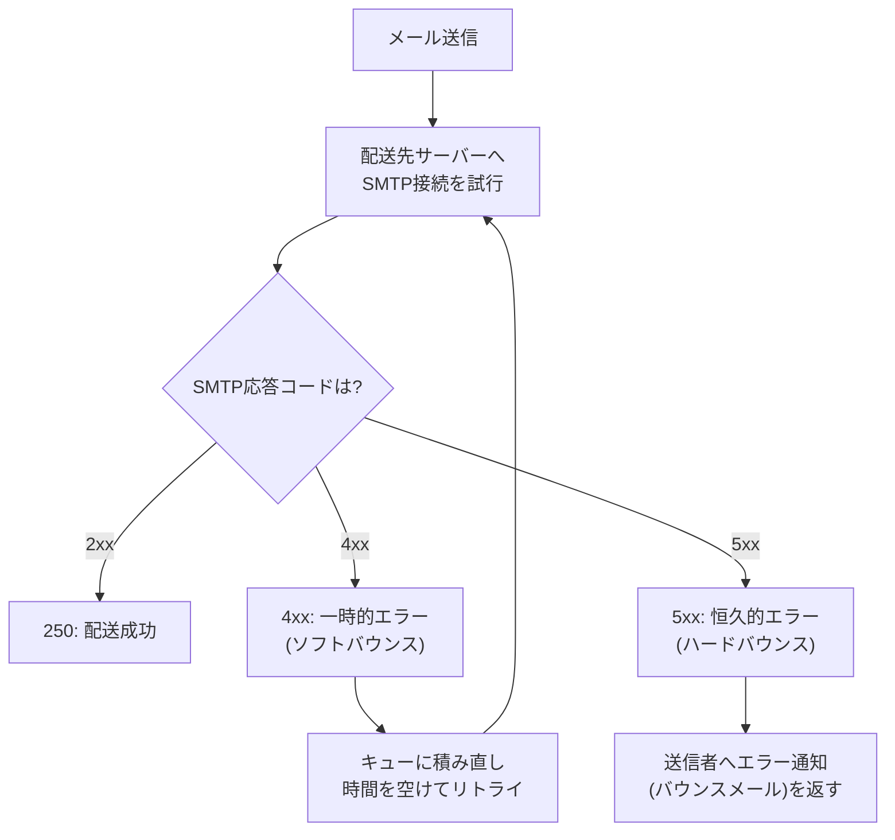

## はじめに

- **この記事で得られること**: [PostfixとDovecotでメールサーバーを構築するハンズオン](/articles/mail-server-handson-guide)で扱ったSMTPコマンドの先、**送信したメールが即座に届かなかった場合に、Postfixが内部でどう振る舞っているのか**を体系的に理解します。メールが一時的に**キュー**へ積まれる仕組みと、**ソフトバウンス**(一時的エラー)と**ハードバウンス**(恒久的エラー)の違いを扱います。
- **対象読者**: メールが「届かなかった」という結果は見たことがあるが、その裏側でPostfixがどのように再試行し、いつ諦めるのかを説明できない方を想定しています。
- **読むのにかかる想定時間**: 約15分

この記事は[『上位1%』シリーズ 全記事ガイド](/sitemap)の一部、[メール基盤シリーズ](/sitemap#シリーズ一覧)の5本目です。

## 前提知識

- **SMTPによるメール転送**: [メールサーバーの基礎](/articles/mail-server-fundamentals-guide)で扱った、MTA間のSMTPによる転送の仕組みを前提とします。

## 全体像をつかむ



## 基礎から徹底解説

### メールキュー:即座に届かなくても、すぐには諦めない仕組み

Postfixは、メールを受け付けると、まず**キュー**(`/var/spool/postfix/`配下)へ一時的に保存します。配送先のサーバーへ接続を試み、失敗した場合も、**メールをその場で破棄するのではなく、キューに残したまま、一定間隔を空けて再試行**します。`mailq`コマンドで、現在キューに滞留しているメールの一覧を確認できます。

```bash
mailq
```

### ソフトバウンスとハードバウンス:SMTP応答コードの先頭の数字が運命を分ける

配送先サーバーからの応答コードは、**先頭の数字によって、性質がまったく異なります。**

| 応答コード | 分類 | 意味 | Postfixの挙動 |
|---|---|---|---|
| **2xx** | 成功 | 配送が正常に完了した | キューから削除 |
| **4xx** | 一時的エラー(ソフトバウンス) | 相手のメールボックスが満杯、一時的な過負荷など | キューに残し、後で再試行 |
| **5xx** | 恒久的エラー(ハードバウンス) | 宛先アドレスが存在しない、ドメインが存在しないなど | 再試行せず、送信者へエラー通知(バウンスメール)を返す |

**4xx(ソフトバウンス)は「今はダメだが、後でなら成功するかもしれない」という一時的な状態、5xx(ハードバウンス)は「何度試しても成功しない」という恒久的な状態**、という違いを覚えておくと、応答コードを見ただけで、Postfixがその後どう動くかを予測できるようになります。

### 有効期限:いつまでもリトライし続けるわけではない

ソフトバウンスによるリトライにも、**`maximal_queue_lifetime`**(既定では5日)という上限があります。この期間を過ぎても配送に成功しなければ、Postfixは配送を諦め、送信者へバウンスメールを返します。

## プロが見ている視点(上位1%の理解)

### バウンスメールの送信者アドレスが、なぜ「何も書かれていない」のか

バウンスメールをよく観察すると、**送信者アドレス(`MAIL FROM`)が空(`<>`)になっている**ことに気づきます。これは、[SMTPと`MAIL FROM`コマンド](/articles/mail-server-handson-guide)で扱った、通常のメール送信とは異なる、意図的な設計です。**もしバウンスメール自体にも通常の送信者アドレスが設定されていたら、そのバウンスメール自体の配送が失敗した場合に、さらにバウンスメールのバウンスメールが発生し、これが無限に連鎖してしまう**リスクがあります。空の送信者アドレス(Null Sender、`<>`)を使うことで、**バウンスメールに対するバウンスメールの生成を、プロトコルレベルで意図的に禁止**しているのです。

### 大量送信者にとって、バウンス率がなぜ「評判」に直結するのか

Gmail・Outlookのような大手メールプロバイダーは、送信元のドメインやIPアドレスごとに、**ハードバウンスの発生率を、送信者の評判(レピュテーション)を判断する重要な指標として監視**しています。存在しないアドレスへ大量に送り続ける送信元は、リスト管理がずさんな、迷惑メール送信者である可能性が高いと判断され、**正規のメルマガ配信であっても、迷惑メールフォルダへ振り分けられたり、配送自体を拒否されたりするようになります。** 実務でメールマーケティングを担当する場合、ハードバウンスが発生したアドレスは、次回以降の配信リストから速やかに除外する運用が、評判を守るために不可欠です。

## よくある誤解・つまずきポイント

- **誤解1: 「配送に一度失敗したメールは、その時点で送信者にエラーが返される」**
  一時的エラー(ソフトバウンス、4xx)の場合、Postfixはすぐには諦めず、キューに残したまま再試行を続けます。
- **誤解2: 「バウンスメールにも、通常のメールと同じように送信者アドレスが設定されている」**
  バウンスメールの無限連鎖を防ぐため、送信者アドレスは意図的に空(Null Sender)に設定されます。
- **誤解3: 「バウンス率は、単なる統計情報であり、以降の配送には影響しない」**
  大手プロバイダーはバウンス率を送信元の評判の指標として監視しており、高いバウンス率は以降の配送に悪影響を及ぼします。

## 障害・トラブルシューティングの視点

1. **メールがなかなか届かない**: `mailq`でキューに滞留していないかを確認し、`postqueue -p`で詳細な状況を確認します。
2. **特定のアドレス宛のメールが、いつまで経っても届かない**: `mail.log`で応答コードを確認し、4xx(一時的エラー、まだリトライ中の可能性)か5xx(恒久的エラー、すでにバウンス済みの可能性)かを切り分けます。
3. **正規の配信メールが、迷惑メールフォルダに入るようになった**: 直近のハードバウンス率が上昇していないかを確認し、無効なアドレスをリストから除外します。

## まとめ

- Postfixは、配送に即座に失敗しても、メールをキューに残し、一定間隔で再試行します。
- SMTP応答コードの4xxはソフトバウンス(一時的エラー、リトライ対象)、5xxはハードバウンス(恒久的エラー、即座にバウンス)という違いがあります。
- バウンスメールの送信者アドレスは、無限連鎖を防ぐため、意図的に空(Null Sender)に設定されます。
- ハードバウンス率は、送信元の評判に直結する重要な指標であり、無効なアドレスの除外が実務上重要です。

**今日から意識すべきこと**
1. メール配送のトラブルに遭遇したら、応答コードが4xxか5xxかを、まず切り分けましょう。
2. メールマーケティングを担当する場合は、ハードバウンスが発生したアドレスを速やかにリストから除外しましょう。

## 参考文献

- [Postfix Queue Management](https://www.postfix.org/QSHAPE_README.html)
- [Simple Mail Transfer Protocol | RFC 5321](https://datatracker.ietf.org/doc/html/rfc5321)
