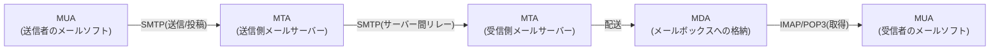
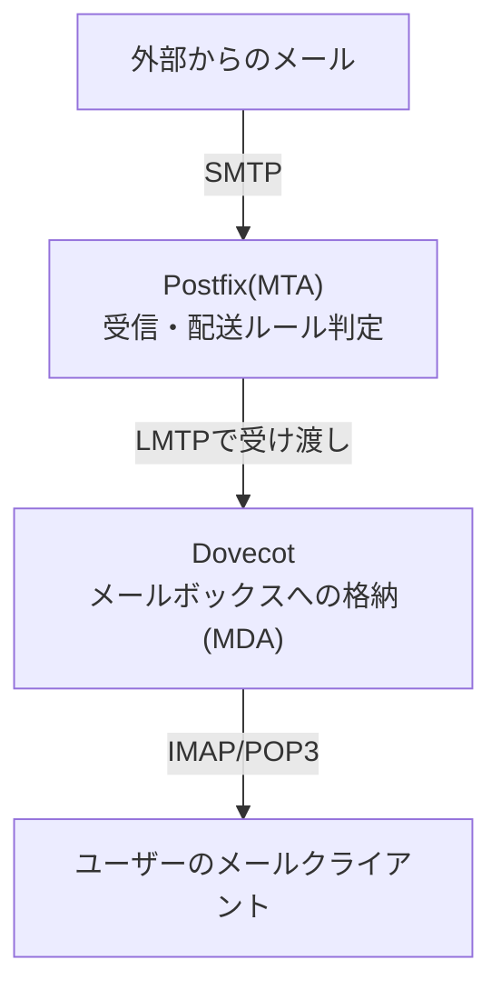

## はじめに

- **この記事で得られること**: メールシステムを構成する**MTA・MDA・MUA**という3つの役割分担、メールサーバー間の転送を担う**SMTP**とメールボックスからの取得を担う**IMAP/POP3**という2種類のプロトコルの違い、そして実際の構築でよく登場する**Postfix**(MTA)と**Dovecot**(IMAP/POP3サーバー)がそれぞれ何を担っているのかを体系的に理解します。
- **対象読者**: [M365へのメール移行を『上位1%』の視点で理解する](/articles/m365-email-fundamentals-guide)でExchange ServerとM365への移行については理解したものの、実際に手を動かしてメールサーバーを構築・移行した経験がなく、Postfix・Dovecotといった名前を聞いたことがある程度で、具体的に何をするソフトウェアなのか説明できない方を想定しています。
- **読むのにかかる想定時間**: 約17分

この記事は[『上位1%』シリーズ 全記事ガイド](/sitemap)の一部、[メール基盤シリーズ](/sitemap#シリーズ一覧)の2本目です。この後の[メールサーバー構築ハンズオン](/articles/mail-server-handson-guide)で、ここで扱う内容を実際に手を動かして構築します。

## 前提知識

- **SMTP・MXレコード**: メールがドメイン宛にどう配送されるかの基本は[M365へのメール移行を『上位1%』の視点で理解する](/articles/m365-email-fundamentals-guide)で扱っています。

## 全体像をつかむ

### メールシステムを構成する3つの役割:MTA・MDA・MUA

メールが送信者から受信者に届くまでには、実は**3つの異なる役割**が関わっています。

| 役割 | 正式名称 | やっていること | 代表的なソフトウェア |
|---|---|---|---|
| **MUA** | Mail User Agent | ユーザーが実際に操作する、メールの作成・閲覧ソフト | Outlook、Thunderbird、スマートフォンのメールアプリ |
| **MTA** | Mail Transfer Agent | メールサーバー間で、SMTPを使ってメールを転送(リレー)する | **Postfix**、Sendmail、Exchange(のSMTPリレー機能) |
| **MDA** | Mail Delivery Agent | 転送されてきたメールを、実際にユーザーのメールボックスへ格納する | **Dovecot**(のLMTP機能)、procmail |

[M365へのメール移行を『上位1%』の視点で理解する](/articles/m365-email-fundamentals-guide)で扱った**Exchangeサーバーは、このMTA(メールの転送)とMDA相当の機能(メールボックスの保管)を1つの製品の中に統合**しています。一方、Linux上でメールサーバーを構築する場合、これらの役割は**Postfix(MTA)とDovecot(MDA+メールボックスからの取得)という、それぞれ専門化された別々のソフトウェアの組み合わせ**として実現されるのが一般的です。

## 基礎から徹底解説

### SMTPが担うのは「転送」まで——「取得」は別のプロトコルの仕事

ここが最も誤解されやすいポイントです。**SMTP(Simple Mail Transfer Protocol)は、メールを送信者から受信側のメールサーバーまで「転送」するためのプロトコルであり、そこから先、ユーザーが自分のメールボックスの中身を「取得」する部分は、SMTPの守備範囲ではありません。** メールボックスの取得には、**IMAP**または**POP3**という、まったく別のプロトコルが使われます。

| プロトコル | 役割 | 特徴 |
|---|---|---|
| **SMTP** | メールの送信・サーバー間転送 | ポート25(サーバー間リレー)、587(認証付きの投稿) |
| **IMAP** | メールボックスの取得・同期 | サーバー上にメールを残したまま、複数端末で同じメールボックスを同期して閲覧できる。ポート143(平文)/993(暗号化)。 |
| **POP3** | メールボックスの取得 | 基本的にメールを端末側にダウンロードし、サーバー側から削除する(現在は「サーバーに残す」設定が主流)。複数端末での同期には不向き。ポート110(平文)/995(暗号化)。 |

**「メールが送れるのに受信箱に反映されない」といった障害の多くは、SMTP(転送)側の問題なのか、IMAP/POP3(取得)側の問題なのかを、まずこの役割分担で切り分けることから始まります。**

### PostfixとDovecotの役割分担、そして両者をつなぐ仕組み

Postfixは、外部から届いたメールをSMTPで受け取り、**あて先ユーザーのメールボックスへの受け渡し**を行いますが、**Postfix自身はIMAP/POP3を話しません。** メールボックスの管理とIMAP/POP3での取得を担当するのがDovecotです。この2つのソフトウェアは、**LMTP**(Local Mail Transfer Protocol)という、SMTPに似た軽量なプロトコルで内部的に連携するのが一般的な構成です。

**「Postfixが送受信、Dovecotが保管と取得」という役割分担を理解しておくと、障害発生時に「メールの転送(Postfixのログ)」と「メールボックスからの取得(Dovecotのログ)」のどちらを調査すべきかを、迷わず切り分けられるようになります。**

### メールボックスの保存形式:Maildirとmboxの違い

Dovecotがメールを実際にディスクへ保存する形式には、大きく2種類があります。

| 形式 | 仕組み | 特徴 |
|---|---|---|
| **mbox** | 1つのメールボックス=1つの巨大なテキストファイル | 古くからある形式。複数プロセスが同時に書き込む際のロック制御が必要で、ファイル破損のリスクがある。 |
| **Maildir** | 1つのメール=1つの独立したファイル | 現在の主流。ロック不要でファイル単位の追加・削除が完結するため、堅牢で並行アクセスに強い。 |

現在の構築では、**堅牢性の観点からMaildir形式が広く採用されています。**

### 認証の仕組み:SASLとDovecotの意外な役割

メールを送信する際、**「誰でも自由にこのサーバーを経由してメールを送信できる(オープンリレー)」状態は、スパムの踏み台にされる重大なセキュリティリスク**です。これを防ぐため、正規のユーザーだけがメール送信(投稿)できるよう、**SASL**(Simple Authentication and Security Layer)という認証の仕組みが使われます。

ここで実務上意外と見落とされがちなのが、**PostfixはSASL認証の機能を自分自身では持たず、Dovecotが提供する「Dovecot SASL」という認証機能を借りて使うのが一般的な構成である**という点です。つまり、**IMAP/POP3のユーザー認証を担っているDovecotのユーザーデータベースを、SMTP投稿時の認証にも再利用する**ことで、ユーザー名・パスワードの管理を一元化しています。

## プロが見ている視点(上位1%の理解)

### なぜOSSの世界では、Exchangeのように1つの製品に統合しないのか

Exchangeのように、MTA・メールボックス管理・グループウェア機能までを1つの製品に統合するアプローチには、**運用の単純さ**という利点があります。一方、Postfix+Dovecotのように**機能ごとに専門化されたソフトウェアを組み合わせるアプローチ**は、Unix系OSで伝統的に重視されてきた「1つのプログラムに1つの役割を持たせ、それらを組み合わせる」という設計思想の表れです。この構成では、**MTAだけを別の実装(Sendmailなど)に差し替えたり、メールボックスの保存先を柔軟に選んだりといった、部分的な入れ替えの自由度が高い**という利点があります。これは[フレームワークとは何か](/articles/software-framework-guide)で扱った「ライブラリの乗り換えが比較的容易である」という考え方にも通じる、疎結合な設計のメリットです。

### 送信元認証(SPF/DKIM/DMARC)は、Postfix/Dovecotのどちらの領域でもない

[M365へのメール移行を『上位1%』の視点で理解する](/articles/m365-email-fundamentals-guide)で扱ったSPF・DKIM・DMARCは、**PostfixにもDovecotにも属さない、DNS側で完結する仕組み**です。ただし、DKIM署名の付与自体は、Postfixに`OpenDKIM`のような外部モジュールを組み込むことで実現するのが一般的な構成です。「サーバーソフトウェアの役割」と「DNSによる送信元検証の仕組み」は、独立したレイヤーとして理解しておくことが重要です。

## よくある誤解・つまずきポイント

- **誤解1: 「SMTPさえ設定すれば、メールの送受信のすべてが完結する」**
  SMTPが担うのは転送までであり、ユーザーがメールボックスの中身を取得する部分にはIMAP/POP3という別のプロトコルが必要です。
- **誤解2: 「PostfixとDovecotは競合するソフトウェアであり、どちらか一方だけを選ぶ」**
  両者は競合ではなく、MTA(Postfix)とメールボックス管理・取得(Dovecot)という異なる役割を分担する、組み合わせて使うソフトウェアです。
- **誤解3: 「メール送信時のユーザー認証は、Postfix自身が独自に管理している」**
  一般的な構成では、PostfixはDovecotが提供するSASL認証機能を借りて使い、ユーザーデータベースをDovecot側に一元化します。

## 障害・トラブルシューティングの視点

メールサーバーの障害は、**「転送(Postfix/SMTP)の問題か、取得(Dovecot/IMAP)の問題か」を切り分ける**のが基本です。

1. **外部からメールが届かない**: Postfixのログ(`/var/log/mail.log`など)を確認し、SMTPでの受信自体が発生しているかを確認します。
2. **メールは届いているはずだが、メールクライアントに反映されない**: Dovecotのログを確認し、IMAP/POP3での認証・取得が正常に行われているかを確認します。
3. **メール送信ができない(認証エラー)**: SASL認証の設定(PostfixとDovecot SASLの連携設定)を確認します。

### 予防策・恒久対策

- PostfixとDovecot、それぞれのログの保存場所を事前に把握し、障害発生時にどちらから調査すべきかを迷わないようにする。
- メールボックスの保存形式は、堅牢性の観点からMaildir形式を採用する。
- SASL認証の設定を、Dovecot側のユーザーデータベースと整合させておく。

## まとめ

- メールシステムはMTA(転送)・MDA(格納)・MUA(閲覧)という3つの役割で構成され、ExchangeはこれらをMTAとMDA相当の機能として1つの製品に統合しています。
- SMTPはメールの転送までを担い、メールボックスからの取得にはIMAP/POP3という別のプロトコルが使われます。
- Postfix(MTA)とDovecot(MDA+IMAP/POP3)は、LMTPで連携する組み合わせて使うソフトウェアであり、SASL認証もDovecot側の機能を借りるのが一般的です。
- メールボックスの保存形式には、堅牢性で優れるMaildir形式が現在広く採用されています。

**今日から意識すべきこと**
1. メール関連のトラブルに遭遇したら、まず「転送(SMTP/Postfix)の問題か、取得(IMAP/POP3/Dovecot)の問題か」で切り分けましょう。
2. 「Postfix」「Dovecot」という名前を聞いたら、それぞれがMTAとメールボックス管理という異なる役割を担っていることを思い出しましょう。

## 参考文献

- [Postfix Documentation](https://www.postfix.org/documentation.html)
- [Dovecot Documentation](https://doc.dovecot.org/)
- [Simple Mail Transfer Protocol | RFC 5321](https://datatracker.ietf.org/doc/html/rfc5321)
- [Internet Message Access Protocol (IMAP) - Version 4rev2 | RFC 9051](https://datatracker.ietf.org/doc/html/rfc9051)
