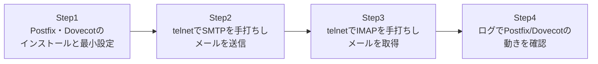

## はじめに

- **この記事で得られること**: [メールサーバーの基礎を『上位1%』の視点で理解する](/articles/mail-server-fundamentals-guide)で学んだMTA・MDA・SMTP・IMAPの知識を、**実際にPostfixとDovecotをインストール・設定し、telnetで生のプロトコルコマンドを手打ちしてメールを送受信する**ことで、自分の目で検証します。
- **対象読者**: メールサーバーの構築・移行に実際に携わったことがなく、まず1台の仮想マシン上で最小構成のメールサーバーを組んで動作を確認しておきたい方を想定しています。
- **読むのにかかる想定時間**: 約20分(ハンズオン実施込み)

この記事は[『上位1%』シリーズ 全記事ガイド](/sitemap)の一部、[メール基盤シリーズ](/sitemap#シリーズ一覧)の3本目です。[ハンズオン準備マニュアル](/articles/handson-prep-guide)で作成したUbuntu Server環境があれば、追加のVM構築なしに実施できます。

## 前提知識

- **MTA/MDA、SMTP/IMAP、Postfix/Dovecotの役割分担**: [メールサーバーの基礎を『上位1%』の視点で理解する](/articles/mail-server-fundamentals-guide)を先に読んでおいてください。

## 全体像をつかむ

このハンズオンで行うことは、次の4ステップです。



## ハンズオン手順

### Step 1: Postfix・Dovecotのインストールと最小構成

Ubuntu Server上で、PostfixとDovecot(IMAPサーバー)をインストールします。

```bash
sudo apt update
sudo apt install -y postfix dovecot-imapd
```

Postfixのインストール中に構成ウィザードが表示されたら、「**Internet Site**」を選択し、システムメール名(例: `mailtest.local`)を入力します。

次に、メールボックスの保存形式を**Maildir形式**(1メール=1ファイル)に設定します。

```bash
sudo postconf -e 'home_mailbox = Maildir/'
sudo systemctl restart postfix
```

Dovecot側でも、同じMaildir形式を参照するよう設定します。`/etc/dovecot/conf.d/10-mail.conf`を編集し、次の行を追加(または既存行を変更)します。

```
mail_location = maildir:~/Maildir
```

設定後、Dovecotを再起動します。

```bash
sudo systemctl restart dovecot
```

最後に、メールの送受信テスト用に2つのローカルユーザーを作成します。

```bash
sudo useradd -m alice
sudo useradd -m bob
sudo passwd bob   # bobには後でIMAPログインするためのパスワードを設定
```

### Step 2: telnetで生のSMTPコマンドを手打ちし、メールを送信する

[メールサーバーの基礎](/articles/mail-server-fundamentals-guide)で説明した通り、SMTPはテキストベースのプロトコルです。`mail`コマンドのような便利なツールを使わず、**あえてtelnetでポート25番に直接接続し、SMTPコマンドを1行ずつ手で入力**することで、その正体を体感します。

```bash
telnet localhost 25
```

接続後、次のコマンドを順番に入力します(`S:`はサーバーからの応答、それ以外はあなたが入力する行です)。

```
S: 220 mailtest.local ESMTP Postfix
HELO client.local
MAIL FROM:<alice@mailtest.local>
RCPT TO:<bob@mailtest.local>
DATA
Subject: Hello from telnet

This is a test message typed by hand over raw SMTP.
.
QUIT
```

`DATA`の後、本文の最後は単独の`.`(**ピリオドのみの行**)で終える必要があります。これがSMTPにおける「メール本文の終わり」を示す区切りです。`250 2.0.0 Ok: queued as ...`という応答が返れば、Postfixがメールを正常に受理したことを意味します。

### Step 3: Maildirにファイルとして保存されていることを確認する

[メールサーバーの基礎](/articles/mail-server-fundamentals-guide)で説明した通り、Maildir形式は**1つのメールが1つの独立したファイル**として保存されます。実際に確認してみましょう。

```bash
sudo ls -la /home/bob/Maildir/new/
```

たった今送信したメールが、1つのファイルとして存在しているはずです。**このディレクトリへファイルが1つ増えるという、極めてシンプルな仕組みでメールが「配送」されている**ことが、目で見て確認できます。

### Step 4: telnetで生のIMAPコマンドを手打ちし、メールを取得する

続けて、SMTPとは別のプロトコルであるIMAPで、たった今届いたメールを取得します。

```bash
telnet localhost 143
```

```
S: * OK [CAPABILITY ...] Dovecot ready.
a LOGIN bob (bobのパスワード)
a SELECT INBOX
a FETCH 1 BODY[]
a LOGOUT
```

**IMAPのコマンドには、`a`のような任意のタグ(識別子)を先頭に付ける**という、SMTPとは異なる作法があります。`FETCH 1 BODY[]`で、Step2で送信したメールの内容がそのまま返ってくれば、**SMTPで「配送」されたメールを、IMAPで「取得」する**という一連の流れが、自分の手で確認できたことになります。

### Step 5: ログでPostfixとDovecotそれぞれの動きを確認する

最後に、実務で最も重要な**ログの確認**を行います。

```bash
sudo tail -n 30 /var/log/mail.log
```

このログの中に、**Postfixのプロセス(`postfix/smtpd`など)によるメール受信の記録**と、**Dovecotのプロセス(`dovecot`など)によるIMAPログインの記録**が、別々の行として記録されていることを確認してください。[メールサーバーの基礎](/articles/mail-server-fundamentals-guide)で説明した「転送(Postfix)か取得(Dovecot)か」という切り分けが、実際のログ上でどう見えるかを体感できます。

<details>
<summary>ステップアップ:SASL認証付きの投稿(587番ポート)を試す</summary>

余力があれば、Dovecot SASLを使った認証付きメール投稿(ポート587)の設定にも挑戦してみてください。`/etc/dovecot/conf.d/10-master.conf`でPostfix向けのSASLソケットを有効化し、Postfix側の`smtpd_sasl_auth_enable`関連の設定と組み合わせることで、[メールサーバーの基礎](/articles/mail-server-fundamentals-guide)で説明した「PostfixがDovecot SASLを借りる」という連携を、実際に構成できます。

</details>

## プロが見ている視点(上位1%の理解)

### 「動いた」で終わらせず、コマンドの意味を1つずつ振り返る

このハンズオンの価値は、単に「メールが送受信できた」という結果ではなく、**`HELO`・`MAIL FROM`・`RCPT TO`・`DATA`というSMTPコマンド、`LOGIN`・`SELECT`・`FETCH`というIMAPコマンドが、それぞれ何を宣言・要求しているコマンドなのかを、1つずつ振り返る**ことにあります。実務でメールサーバーのトラブルに遭遇した際、`telnet`や`openssl s_client`でこれらのコマンドを手打ちして反応を確認する手法は、**メールクライアントというブラックボックスを介さずに、プロトコルレベルで問題を切り分ける**、実務上非常に有効な診断手法です。

## よくある誤解・つまずきポイント

- **誤解1: 「メールサーバーの動作確認には、必ず本物のメールクライアント(Outlookなど)が必要である」**
  `telnet`やそれに類するツールで生のSMTP/IMAPコマンドを手打ちするだけで、メールサーバーの基本動作を検証できます。
- **誤解2: 「`DATA`コマンドの後、本文はいつまでも自由に入力を続けられる」**
  本文の終わりは、単独の`.`(ピリオドのみの行)で明示的に示す必要があります。

## 障害・トラブルシューティングの視点

1. **`telnet localhost 25`で接続すらできない**: Postfixが起動しているか(`sudo systemctl status postfix`)、ファイアウォールでポート25番がブロックされていないかを確認します。
2. **SMTPでの送信は成功したように見えるが、Maildirにファイルが増えない**: `home_mailbox = Maildir/`の設定が反映されているか、`postconf home_mailbox`で確認します。
3. **IMAPでログインできない**: Dovecotが起動しているか、ユーザーのパスワードが正しく設定されているか(`sudo passwd bob`)を確認します。

### 予防策・恒久対策

- 新しいメールサーバー環境を構築した際は、本番のメールを流す前に、必ずこのハンズオンのような手動でのSMTP/IMAP疎通確認を行う。
- Postfix・Dovecotそれぞれのログの出力場所と、正常時のログパターンを事前に把握しておく。

## まとめ

- Postfix・Dovecotの最小構成は、パッケージのインストールとMaildir形式の設定だけで組み上げられます。
- telnetでSMTPコマンドを手打ちすることで、メールの「送信」がテキストベースのプロトコルで行われていることを直接確認できます。
- Maildir形式では、送信したメールが1つの独立したファイルとして保存されることが目で見て確認できます。
- telnetでIMAPコマンドを手打ちすることで、SMTPとは別のプロトコルで「取得」が行われていることを確認できます。

**今日から意識すべきこと**
1. メールサーバーのトラブルに遭遇したら、メールクライアントに頼らず、まず`telnet`や`openssl s_client`で生のプロトコルレベルの疎通を確認する習慣をつけましょう。
2. Postfix・Dovecotのログの出力場所を、構築時点で必ず確認しておきましょう。

## 参考文献

- [Postfix Documentation](https://www.postfix.org/documentation.html)
- [Dovecot Documentation](https://doc.dovecot.org/)
- [Simple Mail Transfer Protocol | RFC 5321](https://datatracker.ietf.org/doc/html/rfc5321)
