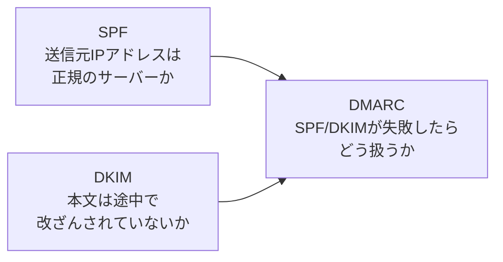

## はじめに

- **この記事で得られること**: [メールサーバーの基礎](/articles/mail-server-fundamentals-guide)で扱ったSMTPの仕組みを前提に、SMTPが抱える「送信者のドメインを偽装できてしまう」という構造的な弱点と、**SPF・DKIM・DMARC**という3つの仕組みが、それぞれ異なる役割分担でこの弱点を補っている仕組みを体系的に理解します。
- **対象読者**: SPF・DKIM・DMARCという言葉を聞いたことはあるが、3つがそれぞれ何を証明しているのか、なぜ1つではなく3つも必要なのかを説明できない方を想定しています。
- **読むのにかかる想定時間**: 約16分

この記事は[『上位1%』シリーズ 全記事ガイド](/sitemap)の一部、[メール基盤シリーズ](/sitemap#シリーズ一覧)の4本目です。

## 前提知識

- **MTA・SMTP・DNSレコード**: [メールサーバーの基礎](/articles/mail-server-fundamentals-guide)で扱った、SMTPによるメール転送の仕組みを前提とします。

## 全体像をつかむ

### SMTPには、そもそも「送信者を偽装できてしまう」という弱点がある

[メールサーバーの基礎](/articles/mail-server-fundamentals-guide)のハンズオンでも扱った通り、SMTPの`MAIL FROM`コマンドには、**送信者が名乗るアドレスを、事実上自由に書き込めます。** 受信側のサーバーは、このコマンドが本当にそのドメインの正規の送信元から来たものかどうかを、プロトコルレベルでは検証しません。この弱点が、送信者のドメインを詐称した、なりすましメール(フィッシング詐欺など)を成立させてしまう原因です。



## 基礎から徹底解説

### SPF:このドメインからのメールは、このIPアドレスから送られるはず、という宣言

**SPF**(Sender Policy Framework)は、**あるドメインからのメールが、正規にはどのIPアドレスから送信されるはずかを、DNSのTXTレコードとして宣言**する仕組みです。

```
example.com.  IN  TXT  "v=spf1 ip4:203.0.113.10 include:_spf.google.com -all"
```

受信側のメールサーバーは、届いたメールの`MAIL FROM`のドメイン(`example.com`)に対応するSPFレコードをDNSに問い合わせ、**実際の送信元IPアドレスが、この宣言に含まれているかどうかを検証**します。含まれていなければ、SPF検証は失敗(`fail`)と判定されます。

### DKIM:メール本文と一部のヘッダーに、電子署名を付与する

**DKIM**(DomainKeys Identified Mail)は、送信側のメールサーバーが、**メール本文と一部のヘッダーに対して、秘密鍵で電子署名を作成し、`DKIM-Signature`というヘッダーに付与**する仕組みです。受信側は、送信ドメインのDNSに公開されている公開鍵(DKIMレコード)を使って、この署名を検証します。**SPFが「経路(送信元IPアドレス)」を検証するのに対し、DKIMは「内容(本文・ヘッダー)が途中で改ざんされていないか」を検証する**という、まったく異なる観点を担っています。

### DMARC:SPF/DKIMが失敗したら、どう扱ってほしいかのポリシー

SPFとDKIMは、それぞれ独立した検証結果(合格・不合格)を返しますが、**その結果を受け取った受信側が、実際にどう扱うべきか(受信するか、迷惑メールフォルダへ入れるか、拒否するか)までは指定していません。** この「失敗した場合の扱い」を、送信側のドメイン所有者自身が宣言する仕組みが**DMARC**(Domain-based Message Authentication, Reporting, and Conformance)です。

```
_dmarc.example.com.  IN  TXT  "v=DMARC1; p=reject; rua=mailto:report@example.com"
```

`p=reject`は、「SPFとDKIMの両方(またはどちらか、アライメントの設定による)が失敗したメールは、受信を拒否してほしい」という、送信ドメイン所有者からの明示的な要求です。

## プロが見ている視点(上位1%の理解)

### 「アライメント」という、DMARCが持つもう1つの重要な検証軸

DMARCの核心は、単にSPF/DKIMの合否を見るだけではありません。**「アライメント(Alignment)」と呼ばれる、`From`ヘッダーのドメインと、SPF/DKIMが実際に検証したドメインが一致しているかどうか**という、もう1つの検証軸を持っています。たとえば、攻撃者が`attacker.com`という、自分が完全に管理する別ドメインで、そのドメイン自身のSPF/DKIMには正しく合格するメールを送りつつ、`From`ヘッダーの表示名だけを`example.com`に偽装した場合、**SPF/DKIM自体は合格してしまいますが、アライメントが一致しないため、DMARCとしては不合格と判定されます。** この仕組みを知らないと、「SPFもDKIMも合格しているはずなのに、なぜDMARCで弾かれるのか」という、一見矛盾した挙動に戸惑うことになります。

### SPF・DKIM・DMARCの導入は、なぜ「いきなりreject」ではなく段階的に行うべきか

DMARCの`p`タグには、`none`(何もしない、レポートのみ)・`quarantine`(迷惑メールフォルダへ)・`reject`(拒否)という3段階があります。**実務では、いきなり`p=reject`から始めるのではなく、`p=none`でまずレポート(`rua`で指定したアドレスへの集計レポート)を収集し、正規の送信元がすべてSPF/DKIMに合格していることを確認してから、段階的に`quarantine`、`reject`へと引き上げる**のが定石です。これを怠ると、自社が把握していなかった正規の送信元(マーケティングツールなど)からのメールまで、DMARCによって拒否されてしまうという事故につながります。

## よくある誤解・つまずきポイント

- **誤解1: 「SPFとDKIMのどちらか一方さえ設定すれば、なりすまし対策として十分である」**
  SPFは経路、DKIMは内容という、異なる観点を検証するものであり、どちらか一方では防げないなりすましのパターンが存在します。
- **誤解2: 「SPF/DKIMに合格すれば、DMARCも必ず合格する」**
  DMARCはアライメント(Fromヘッダーとの一致)も検証するため、SPF/DKIM自体が合格していても、アライメントが一致しなければDMARCは不合格になります。
- **誤解3: 「DMARCを導入するなら、最初からp=rejectにすべきである」**
  正規の送信元を把握しきれていない状態でいきなりrejectにすると、意図しないメールまで拒否してしまうリスクがあり、p=noneからの段階的な引き上げが定石です。

## 障害・トラブルシューティングの視点

1. **正規のメールが、なりすましとして拒否されてしまう**: SPFレコードに、実際の送信元IPアドレス(マーケティングツールなど、忘れられがちな送信元を含む)がすべて含まれているかを確認します。
2. **SPF/DKIMは合格しているはずなのに、DMARCで不合格になる**: `From`ヘッダーのドメインと、SPF/DKIMが実際に検証したドメインが一致しているか(アライメント)を確認します。
3. **DMARCのレポートが届かない**: DMARCレコードの`rua`タグに指定したメールアドレスが、正しく受信できる状態かを確認します。

## まとめ

- SPFは送信元IPアドレスを、DKIMは本文・ヘッダーの改ざんの有無を、それぞれ独立して検証します。
- DMARCは、SPF/DKIMの検証結果とアライメント(Fromヘッダーとの一致)を組み合わせ、失敗時の扱い方を送信ドメイン所有者が宣言する仕組みです。
- DMARCの導入は、p=noneでのレポート収集から始め、段階的にquarantine、rejectへ引き上げるのが定石です。

**今日から意識すべきこと**
1. SPF・DKIM・DMARCは、それぞれ異なる観点を検証する独立した仕組みとして区別しましょう。
2. DMARCを導入する際は、いきなりrejectにせず、p=noneでのレポート収集から始めましょう。

## 参考文献

- [Sender Policy Framework (SPF) | RFC 7208](https://datatracker.ietf.org/doc/html/rfc7208)
- [DomainKeys Identified Mail (DKIM) Signatures | RFC 6376](https://datatracker.ietf.org/doc/html/rfc6376)
- [Domain-based Message Authentication, Reporting, and Conformance (DMARC) | RFC 7489](https://datatracker.ietf.org/doc/html/rfc7489)
