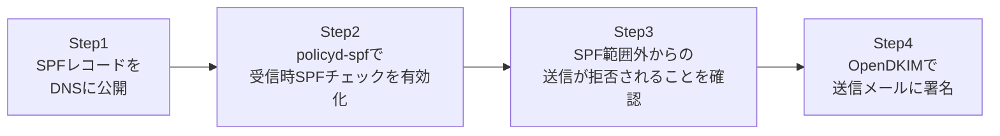

## はじめに

- **この記事で得られること**: [SPF・DKIM・DMARCの仕組み](/articles/mail-spf-dkim-dmarc-guide)で学んだ内容を、[PostfixとDovecotでメールサーバーを構築するハンズオン](/articles/mail-server-handson-guide)で作った`mailtest.local`環境に、実際に**SPFチェック**(policyd-spf)と**DKIM署名**(OpenDKIM)を組み込むことで検証します。SPFレコードに含まれない送信元からのメールが実際に拒否される様子と、送信メールに`DKIM-Signature`ヘッダーが自動的に付与される様子を、自分の目で確認します。
- **対象読者**: [PostfixとDovecotでメールサーバーを構築するハンズオン](/articles/mail-server-handson-guide)と[SPF・DKIM・DMARCの仕組み](/articles/mail-spf-dkim-dmarc-guide)をすでに終えた方を想定しています。
- **読むのにかかる想定時間**: 約45分

この記事は[『上位1%』シリーズ 全記事ガイド](/sitemap)の一部です。

## 前提知識

- **SPF・DKIM・DMARCの役割分担**: [SPF・DKIM・DMARCの仕組み](/articles/mail-spf-dkim-dmarc-guide)を前提とします。
- **Postfixでのメール送受信**: [PostfixとDovecotでメールサーバーを構築するハンズオン](/articles/mail-server-handson-guide)の環境を前提とします。
- **BINDでのゾーン管理**: [BINDでDNSサーバーを構築するハンズオン](/articles/dns-server-handson-guide)を前提とします。DNSレコードの追加・反映方法を再利用します。

## 全体像をつかむ



**このハンズオンでは、[BINDでDNSサーバーを構築するハンズオン](/articles/dns-server-handson-guide)で使った`lab.example.test`のBIND環境を、`mailtest.local`用のDNSサーバーとしても兼用します。**

## ハンズオン手順

### Step 1: SPFレコードをDNSに公開する

BINDサーバーのゾーンファイルに、`mailtest.local`のSPFレコードを追加します。

```
mailtest.local.   IN  TXT  "v=spf1 ip4:10.0.20.50 -all"
```

**`-all`は、宣言したIPアドレス以外からのメールを、明確に「不正」として扱ってほしいという、厳格な指定です。** シリアル番号を上げ、BINDを再起動します。

```bash
sudo named-checkzone mailtest.local /etc/bind/db.mailtest.local
sudo systemctl restart bind9
```

`dig`で、正しく公開されているかを確認します。

```bash
dig mailtest.local TXT
```

### Step 2: policyd-spfをインストールし、受信時のSPFチェックを有効化する

Postfixサーバー(メールサーバー本体)に、SPFチェック用のポリシーデーモンをインストールします。

```bash
sudo apt install -y postfix-policyd-spf-python
```

`/etc/postfix/master.cf`に、ポリシーサービスを追加します。

```
policyd-spf  unix  -       n       n       -       0       spawn
    user=policyd-spf argv=/usr/bin/policyd-spf
```

`/etc/postfix/main.cf`に、受信時のポリシーチェックとして、このサービスを組み込みます。

```
smtpd_recipient_restrictions =
    permit_mynetworks,
    permit_sasl_authenticated,
    check_policy_service unix:private/policyd-spf,
    reject_unauth_destination
```

```bash
sudo systemctl restart postfix
```

**この設定により、Postfixは、メールを受け取るたびに、`MAIL FROM`のドメインのSPFレコードをDNSへ問い合わせ、実際の接続元IPアドレスと照合するようになります。**

### Step 3: SPFの範囲外からの送信が、実際に拒否されることを確認する

まず、SPFレコードで許可した`10.0.20.50`から、telnetで正規の送信を試します。

```bash
telnet localhost 25
```

```
HELO client.local
MAIL FROM:<alice@mailtest.local>
RCPT TO:<bob@mailtest.local>
```

`250`が返り、正常に受理されるはずです。次に、`policyd-spf`のログを確認します。

```bash
sudo tail -n 5 /var/log/mail.log
```

`Sender-IP 10.0.20.50 Sender-Domain mailtest.local Recipient bob@mailtest.local ... Pass`のような、**SPFチェックに合格(Pass)した記録**が確認できます。

続いて、SPFレコードを、あえて別のIPアドレス(`10.0.20.99`)のみを許可する内容に書き換えます。

```
mailtest.local.   IN  TXT  "v=spf1 ip4:10.0.20.99 -all"
```

```bash
sudo systemctl restart bind9
```

同じ`10.0.20.50`から、再度同じ手順で送信を試みます。

```bash
telnet localhost 25
```

```
HELO client.local
MAIL FROM:<alice@mailtest.local>
RCPT TO:<bob@mailtest.local>
```

**今度は、`550 5.7.1 SPF Authentication Failed`のようなエラーが返り、Postfixがこの時点でメールの受け取り自体を拒否します。** SPFレコードから外れた瞬間に、`RCPT TO`の段階でメールがはじき返される様子を、自分の目で確認できました。

### Step 4: OpenDKIMをインストールし、送信メールに署名する

SPFレコードを元の`10.0.20.50`に戻してから、OpenDKIMをインストールします。

```
mailtest.local.   IN  TXT  "v=spf1 ip4:10.0.20.50 -all"
```

```bash
sudo apt install -y opendkim opendkim-tools
sudo mkdir -p /etc/opendkim/keys/mailtest.local
cd /etc/opendkim/keys/mailtest.local
sudo opendkim-genkey -s mail -d mailtest.local
sudo chown opendkim:opendkim mail.private
```

`mail.txt`の中身を確認します。

```bash
sudo cat mail.txt
```

このファイルに書かれている内容を、DNSのTXTレコードとして、`mail._domainkey.mailtest.local`という名前で公開します。

```
mail._domainkey.mailtest.local.   IN  TXT  "v=DKIM1; h=sha256; k=rsa; p=<mail.txtに書かれていた公開鍵の文字列>"
```

`/etc/opendkim.conf`と`/etc/postfix/main.cf`で、PostfixとOpenDKIMを、milter(メールフィルタ)として連携させます。

```
# /etc/opendkim.conf に追記
Domain                  mailtest.local
KeyFile                 /etc/opendkim/keys/mailtest.local/mail.private
Selector                mail
Socket                  inet:8891@localhost
```

```
# /etc/postfix/main.cf に追記
milter_default_action = accept
milter_protocol = 6
smtpd_milters = inet:localhost:8891
non_smtpd_milters = inet:localhost:8891
```

```bash
sudo systemctl restart opendkim postfix
```

telnetで再度メールを送信し、届いたメールの中身をMaildirから直接確認します。

```bash
sudo cat /home/bob/Maildir/new/*
```

**メールの先頭付近に、`DKIM-Signature:`から始まる、長い文字列を含むヘッダーが自動的に追加されている**はずです。OpenDKIMが、送信メールの本文と一部のヘッダーに対して、Step 4で生成した秘密鍵で署名を作成し、このヘッダーとして挿入したことが確認できます。

## プロが見ている視点(上位1%の理解)

### SPFの「reject」は、実は既定の挙動ではない

Step 3で確認した`550`という即座の拒否は、`policyd-spf`の設定次第で、実は挙動を変えられます。**SPFの仕様自体は、検証結果(Pass/Fail/SoftFail/Neutralなど)を返すだけであり、それをどう扱うか(拒否するか、ヘッダーに記録するだけに留めるか)は、受信側の運用方針次第です。** 実務では、いきなりSPF Failを即座に拒否するのではなく、まずはヘッダーへの記録(`Received-SPF`)だけに留め、正規の送信元をすべて洗い出してから、段階的に拒否へ移行するケースも多くあります。この考え方は、[DMARCの段階的な導入(p=noneから始める)](/articles/mail-spf-dkim-dmarc-guide)と、発想がまったく同じです。

### DKIM署名は「送信側」、SPFチェックは「受信側」の設定であるという非対称性

このハンズオンで構築したのは、**自ドメイン(`mailtest.local`)宛のメールを受信する際のSPFチェックと、自ドメインから送信するメールへのDKIM署名**です。**SPFとDKIMは、どちらも自分のドメインに関する設定でありながら、SPFは「他社から自社への通信」を検証する受信側の機能、DKIMは「自社から他社への通信」を保護する送信側の機能という、非対称な役割を持っています。** 自社ドメインになりすましたメールから自社を守るにはSPF/DMARCの受信側設定、自社が送信したメールが他社のなりすまし判定で弾かれないようにするにはDKIMの送信側設定という、2つの異なる目的があることを意識しておく必要があります。

## よくある誤解・つまずきポイント

- **誤解1: 「SPFチェックに失敗すると、必ずメールが即座に拒否される」**
  拒否するかどうかは受信側の設定次第であり、まずはヘッダーへの記録に留める運用も一般的です。
- **誤解2: 「DKIM署名は、受信側の設定で有効になる」**
  DKIM署名は送信側(自ドメインからメールを送る側)の設定であり、受信側は、送られてきた署名をDNSの公開鍵で検証するだけです。
- **誤解3: 「SPFレコードを公開しただけで、なりすまし対策は完了する」**
  SPFレコードを公開しても、受信側がそれをチェックする設定(policyd-spfなど)を組み込まない限り、実際の検証は行われません。

## 障害・トラブルシューティングの視点

1. **正規の送信元なのに、SPFチェックで拒否される**: SPFレコードに、そのIPアドレスが正しく含まれているかを`dig`で確認します。
2. **DKIM-Signatureヘッダーが付与されない**: `opendkim`が起動しているか、`smtpd_milters`の設定が正しいかを確認します。`sudo systemctl status opendkim`でエラーがないかも確認します。
3. **DKIM署名を検証したいが、方法が分からない**: `opendkim-testkey -d mailtest.local -s mail -vvv`で、DNSに公開した公開鍵と秘密鍵が正しく対応しているかを検証できます。

## まとめ

- policyd-spfを組み込むと、Postfixは受信時にSPFレコードを検証し、範囲外の送信元からのメールを拒否できます。
- SPFの拒否は既定の挙動ではなく、受信側の運用方針次第で、記録のみに留めることもできます。
- OpenDKIMを組み込むと、送信メールに自動的にDKIM-Signatureヘッダーが付与されます。
- SPFは受信側、DKIMは送信側という、非対称な役割分担を持っています。

**今日から意識すべきこと**
1. SPFの拒否設定を導入する際は、いきなり拒否にせず、まず記録から始めることを検討しましょう。
2. SPF(受信側の防御)とDKIM(送信側の防御)を、別の目的を持つ設定として区別しましょう。

## 参考文献

- [postfix-policyd-spf-python (GitHub)](https://github.com/sdgathman/pypolicyd-spf)
- [OpenDKIM Documentation](http://www.opendkim.org/docs.html)
