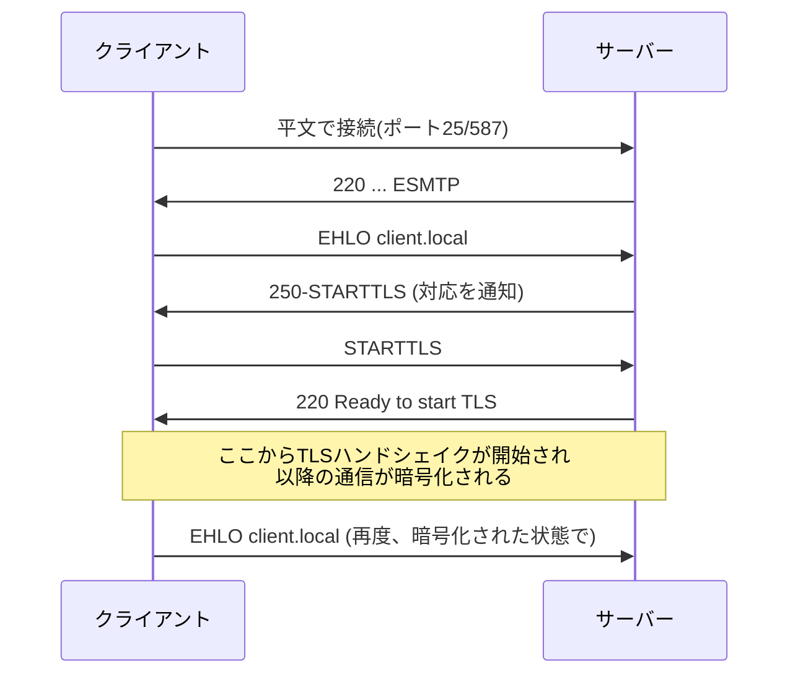

## はじめに

- **この記事で得られること**: [PostfixとDovecotでメールサーバーを構築するハンズオン](/articles/mail-server-handson-guide)でtelnetを使って観察した、**SMTPが平文でやり取りされる**という現実を前提に、この平文接続を暗号化された接続へ後から昇格させる**STARTTLS**という仕組みと、それでもなお残る「日和見暗号化」という弱点を体系的に理解します。
- **対象読者**: HTTPSのように、Webの世界では通信の暗号化が当たり前になっていることは知っているが、メールの世界でのTLSの扱われ方が、どう違うのかを説明できない方を想定しています。
- **読むのにかかる想定時間**: 約15分

この記事は[『上位1%』シリーズ 全記事ガイド](/sitemap)の一部、[メール基盤シリーズ](/sitemap#シリーズ一覧)の6本目です。

## 前提知識

- **平文でのSMTP通信**: [PostfixとDovecotでメールサーバーを構築するハンズオン](/articles/mail-server-handson-guide)で、telnetを使ってSMTPコマンドを直接手打ちした経験を前提とします。

## 全体像をつかむ

### なぜメールの世界では、暗号化が「後付け」になったのか

SMTPは、1980年代、**そもそも暗号化を前提とせずに設計されたプロトコル**です。HTTPSのように、最初から暗号化前提でプロトコル自体が設計し直されたWebの世界とは異なり、メールの世界は、**すでに広く普及していた平文のSMTPを、後方互換性を保ったまま、どう暗号化するか**という課題に直面しました。この課題への回答が**STARTTLS**です。

## 基礎から徹底解説

### STARTTLS:既存の平文接続を、暗号化された接続へ「昇格」させる

**STARTTLS**は、HTTPSのように最初から専用のポートで暗号化接続を始めるのではなく、**まず通常通り平文でSMTP接続を確立した後、`STARTTLS`コマンドを使って、その同じ接続を暗号化されたTLS接続へ昇格させる**という設計です。この「後から昇格する」という設計により、STARTTLSに対応していない古いサーバーとの互換性を保ったまま、対応しているサーバー同士では暗号化を行える、という段階的な移行が可能になりました。

### 日和見暗号化(Opportunistic TLS):暗号化できなければ、平文ででも送ってしまう

STARTTLSの最大の弱点は、**「相手がSTARTTLSに対応していなければ、平文のまま送信を続行する」という、既定の挙動**にあります。これを**日和見暗号化**(Opportunistic TLS)と呼びます。攻撃者が、通信経路の途中で`STARTTLS`という応答そのものを意図的に消し去ってしまえば(STRIPTLS攻撃)、送信側は「相手が対応していない」と誤認し、**暗号化を諦めて平文のまま送信を続けてしまいます。** HTTPSの世界における「httpsにリダイレクトされない限り、httpのまま通信し続けてしまう」という初期の課題と、構造的によく似た弱点です。

## プロが見ている視点(上位1%の理解)

### MTA-STS:日和見暗号化の弱点を、DNSとHTTPSで補強する

日和見暗号化の弱点に対する、比較的新しい対策が**MTA-STS**(SMTP MTA Strict Transport Security)です。送信元ドメインは、DNSのTXTレコードと、`https://mta-sts.<ドメイン>/.well-known/mta-sts.txt`というHTTPS経由のポリシーファイルの、**2つを組み合わせて**、「このドメイン宛のメールは、必ずTLSで、かつ有効な証明書を持つサーバーへのみ送信してほしい」と宣言します。**HTTPSという、すでに確立された暗号化・検証済みの経路を使ってポリシーを配布することで、DNS単体では防ぎきれない中間者攻撃への耐性を高めている**、という設計上の工夫が、MTA-STSの核心です。[SPF・DKIM・DMARCの仕組み](/articles/mail-spf-dkim-dmarc-guide)がDNSのTXTレコードだけで完結していたのに対し、MTA-STSがHTTPSも組み合わせている点が、大きな違いです。

### 証明書の検証を省略する設定が、なぜ実務でありがちなのか

Postfixの`smtp_tls_security_level`には、`may`(日和見暗号化)・`encrypt`(暗号化必須、証明書検証は省略可)・`verify`(証明書の検証まで必須)・`secure`(さらに厳格な検証)という段階があります。**実務では、社内システム間の連携などで、自己署名証明書を使ったサーバーとの通信のために、`encrypt`(検証省略)までしか設定しないケースがよく見られます。** これは、通信内容の盗聴は防げても、**中間者による、正規のサーバーへのなりすまし自体は防げていない**、という限定的な保護にとどまっている点を、意識しておく必要があります。

## よくある誤解・つまずきポイント

- **誤解1: 「STARTTLSを設定すれば、メールは常に暗号化されて送信される」**
  既定の日和見暗号化では、相手がSTARTTLSに対応していない場合、平文のまま送信が続行されます。
- **誤解2: 「STARTTLSは、HTTPSと同じように、最初から専用のポートで暗号化接続を開始する」**
  STARTTLSは、まず平文接続を確立してから、同じ接続を暗号化接続へ昇格させるという、異なる設計です。
- **誤解3: 「smtp_tls_security_level = encryptを設定すれば、なりすましメールサーバーとの通信も防げる」**
  encryptは盗聴は防ぎますが、証明書の検証を伴わないため、中間者によるなりすましそのものは防げません。

## 障害・トラブルシューティングの視点

1. **STARTTLSを設定したのに、通信が暗号化されていない**: 相手先のサーバーがSTARTTLSに対応しているか、経路の途中でSTARTTLS応答が消されていないか(STRIPTLS攻撃の可能性)を確認します。
2. **MTA-STSのポリシーを設定したのに、送信元が守ってくれない**: 送信元のメールサーバーがMTA-STSに対応しているかを確認します。対応していない送信元には、MTA-STSは効果を発揮しません。
3. **自己署名証明書のサーバーと通信できない**: `smtp_tls_security_level`が`verify`や`secure`になっている場合、自己署名証明書は検証に失敗します。信頼できる環境であれば`encrypt`への変更を検討します。

## まとめ

- SMTPは平文を前提に設計されたため、STARTTLSは既存の平文接続を暗号化接続へ後から昇格させる設計になっています。
- 日和見暗号化(Opportunistic TLS)は、相手が対応していなければ平文のまま送信を続行するという弱点を持ちます。
- MTA-STSは、DNSとHTTPSを組み合わせることで、日和見暗号化の弱点を補強する、比較的新しい仕組みです。
- 証明書の検証を省略する設定は、盗聴は防げても、なりすましそのものは防げないという限定的な保護です。

**今日から意識すべきこと**
1. STARTTLSを「常に暗号化される」ものと誤解せず、日和見暗号化の弱点を意識しましょう。
2. 重要なドメインを運用する場合は、MTA-STSの導入を検討しましょう。

## 参考文献

- [SMTP Service Extension for Secure SMTP over TLS | RFC 3207](https://datatracker.ietf.org/doc/html/rfc3207)
- [SMTP MTA Strict Transport Security (MTA-STS) | RFC 8461](https://datatracker.ietf.org/doc/html/rfc8461)
