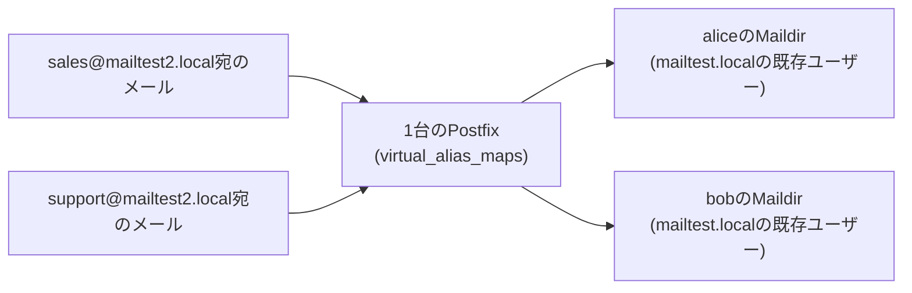

## はじめに

- **この記事で得られること**: [PostfixとDovecotでメールサーバーを構築するハンズオン](/articles/mail-server-handson-guide)で作った`mailtest.local`の環境に、もう1つの別ドメイン`mailtest2.local`を追加し、**1台のPostfixサーバーだけで、複数のドメイン宛のメールを受け付ける**、バーチャルエイリアスドメインという構成を実際に構築します。
- **対象読者**: [PostfixとDovecotでメールサーバーを構築するハンズオン](/articles/mail-server-handson-guide)をすでに終え、複数の顧客やブランドのメールを、1台のサーバーで集約して扱う必要が生じた方を想定しています。
- **読むのにかかる想定時間**: 約30分

この記事は[『上位1%』シリーズ 全記事ガイド](/sitemap)の一部です。

## 前提知識

- **Postfixでのメール受信**: [PostfixとDovecotでメールサーバーを構築するハンズオン](/articles/mail-server-handson-guide)の`alice`・`bob`という2人のUnixユーザーがいる環境を前提とします。

## 全体像をつかむ



## ハンズオン手順

### Step 1: 2つ目のドメインを、バーチャルドメインとして登録する

`/etc/postfix/main.cf`に、`mailtest2.local`をバーチャルエイリアスドメインとして追加します。

```
virtual_alias_domains = mailtest2.local
virtual_alias_maps = hash:/etc/postfix/virtual
```

**ここで重要なのは、`mailtest2.local`が`mydestination`(通常のドメイン)には一切追加されていない**という点です。`virtual_alias_domains`は、**実在するUnixユーザーやメールボックスを持たない、宛先の付け替え専用のドメイン**として扱われます。

### Step 2: 宛先の対応表(virtual_alias_maps)を作成する

`/etc/postfix/virtual`に、`mailtest2.local`宛のアドレスと、実際の配送先(既存のUnixユーザー)との対応関係を記述します。

```
sales@mailtest2.local      alice
support@mailtest2.local    bob
```

Postfixが参照できる形式にコンパイルします。

```bash
sudo postmap /etc/postfix/virtual
sudo systemctl restart postfix
```

### Step 3: telnetでメールを送信し、実際に配送されることを確認する

`sales@mailtest2.local`宛にメールを送信します。

```bash
telnet localhost 25
```

```
HELO client.local
MAIL FROM:<test@example.com>
RCPT TO:<sales@mailtest2.local>
DATA
Subject: Test to virtual domain

This is a test message to the virtual domain.
.
QUIT
```

`alice`のMaildirを確認します。

```bash
sudo ls -la /home/alice/Maildir/new/
```

**`sales@mailtest2.local`という、実在しないはずの宛先へ送ったメールが、実在するUnixユーザーである`alice`のメールボックスに、そのまま配送されているはずです。** `sales`というメールアドレスのために、`sales`という名前のUnixユーザーを新規に作成する必要は、一切ありませんでした。

## プロが見ている視点(上位1%の理解)

### 「ドメインの数だけサーバーを増やす」という発想からの解放

バーチャルエイリアスドメインが実務で持つ最大の価値は、**顧客ごと・ブランドごとに異なるドメインでメールを運用したいというニーズに対して、ドメインの数だけメールサーバーを用意する必要がなくなる**という点にあります。ホスティング事業者や、複数のブランドサイトを運営する組織では、数十から数百のドメインのメールを、少数のPostfixサーバーへ集約することが一般的です。`virtual_alias_maps`という、**単なるテキストベースの対応表**が、この集約を支えている実体です。

### バーチャルエイリアスとバーチャルメールボックスの違い

このハンズオンで扱った`virtual_alias_domains`は、あくまで**宛先を、既存のUnixユーザーへ付け替えるだけ**の仕組みです。これとは別に、Postfixには`virtual_mailbox_domains`という、**Unixユーザーとはまったく独立した、専用のメールボックス自体を持つ**、より本格的な仕組みも存在します。**バーチャルエイリアスは「既存のメールボックスへの配送先の追加」、バーチャルメールボックスは「Unixアカウントを一切作らずに、独立したメールボックスを大量に作る」という、目的の違う2つの仕組みである**、という理解が重要です。少人数の宛先集約であればバーチャルエイリアスで十分ですが、数千人規模のメールホスティングを行う場合は、バーチャルメールボックスの採用が定石です。

## よくある誤解・つまずきポイント

- **誤解1: 「バーチャルドメインを使うには、そのドメイン専用のUnixユーザーを作成する必要がある」**
  バーチャルエイリアスドメインでは、Unixユーザーを新規作成する必要はなく、既存のユーザーへ付け替えるだけで済みます。
- **誤解2: 「virtual_alias_domainsに追加したドメインは、mydestinationにも追加しなければならない」**
  両方に同じドメインを追加すると、Postfixは起動時にエラーを出します。バーチャルドメインは、mydestinationとは独立した、別の設定です。
- **誤解3: 「バーチャルエイリアスとバーチャルメールボックスは、同じ機能の別名にすぎない」**
  バーチャルエイリアスは既存のメールボックスへの付け替え、バーチャルメールボックスは独立したメールボックスの新規作成という、まったく異なる目的を持つ仕組みです。

## 障害・トラブルシューティングの視点

1. **バーチャルドメイン宛のメールが届かない**: `postmap`でコンパイルし直したか、`virtual_alias_maps`のパスが正しいかを確認します。
2. **Postfixの起動時にエラーが出る**: 同じドメインが`mydestination`と`virtual_alias_domains`の両方に含まれていないかを確認します。
3. **一部の宛先だけ配送されない**: `/etc/postfix/virtual`の対応表に、その宛先が正しく登録されているかを確認します。

## まとめ

- バーチャルエイリアスドメインは、実在するUnixユーザーを持たないドメイン宛のメールを、既存のユーザーへ付け替えて配送する仕組みです。
- `virtual_alias_maps`という対応表1つで、ドメインの数だけサーバーを増やす必要なく、複数ドメインのメールを1台で集約できます。
- バーチャルエイリアスとバーチャルメールボックスは、既存ユーザーへの付け替えか、独立したメールボックスの新規作成かという、目的の異なる仕組みです。

**今日から意識すべきこと**
1. 複数ドメインのメール運用を任されたら、ドメインごとにサーバーを増やす前に、バーチャルエイリアスドメインでの集約を検討しましょう。
2. 宛先の規模が大きくなる場合は、バーチャルエイリアスではなく、バーチャルメールボックスの採用を検討しましょう。

## 参考文献

- [Postfix Virtual Domain Hosting Howto](https://www.postfix.org/VIRTUAL_README.html)
