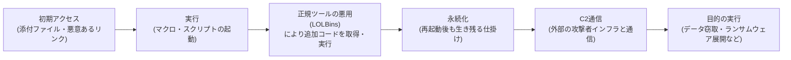

## はじめに

- **この記事で得られること**: [Microsoft Defenderの仕組み](/articles/windows-defender-guide)でシグネチャベース検知・ヒューリスティック検知の違いに触れましたが、そもそも「マルウェアに感染する」というのが、内部的にどんな一連の流れで進むのかには立ち入りませんでした。この記事では、怪しいメールの添付ファイルを開く・怪しいサイトにアクセスするといった1つの操作の裏側で、**初期アクセス→実行→永続化→外部との通信(C2)→目的の実行**という、いくつかの段階を踏んで進む一連の流れと、その各段階がなぜ「気づかないうちに」進んでしまうのかを体系的に理解します。
- **対象読者**: 「怪しいファイルを実行すると、データを抜き取るスクリプトが動く」という、やや単純化されたイメージを持っているものの、実際の感染がもっと段階的でサイレントに進むという実態を具体的に説明できない方を想定しています。
- **読むのにかかる想定時間**: 約18分

この記事は[『上位1%』シリーズ 全記事ガイド](/sitemap)の一部、[Windowsクライアント運用シリーズ](/sitemap#シリーズ一覧)の6本目です。[Microsoft Defenderの仕組み](/articles/windows-defender-guide)を先に読んでおくと、本記事の理解がスムーズです。

## 前提知識

- **シグネチャベース検知・ヒューリスティック検知**: [Microsoft Defenderの仕組み](/articles/windows-defender-guide)で扱った、既知のパターンと照合する方式と、不審な挙動から推測する方式の2つの検知アプローチです。

## 全体像をつかむ

### 一言で言うと

**実際のマルウェア感染は、「怪しいファイルを開いた瞬間に、派手なスクリプトが一気にデータを抜き取る」という単発の出来事ではなく、初期アクセス・実行・永続化・外部との通信・目的の実行という、複数の段階を踏んで進む一連のプロセスです。** そして、この一連の流れの多くの段階で、攻撃者は**新しい不正なプログラムを持ち込むのではなく、Windowsに最初から入っている正規のツールを悪用する**ことで、検知を困難にしています。

## 基礎から徹底解説

### 初期アクセスと実行:添付ファイルは「本体」ではなく「入り口」

怪しいメールの添付ファイル(Office文書など)を開いてしまった場合、その文書ファイル自体が完成されたマルウェアであることは、実はあまり多くありません。**多くの場合、その文書に埋め込まれたマクロや、リンク先からダウンロードされる小さなスクリプトが、次の段階を呼び出すための"入り口"として機能します。** この段階では、まだ本格的な不正プログラム(ペイロード)そのものは、その端末上に存在していないことも珍しくありません。

### なぜ「サイレント」に見えるのか:正規のツールを悪用する手口(LOLBins)

ここが、この記事でもっとも重要なポイントです。攻撃者は、独自に開発した怪しい実行ファイルをわざわざ持ち込むのではなく、**WindowsにあらかじめMicrosoft自身の署名付きで搭載されている、正規の実行ファイル(`PowerShell.exe`、`rundll32.exe`、`mshta.exe`、`certutil.exe`など)を悪用して、次の段階の処理を実行させる**ことがよくあります。この手口は、英語で**LOLBins**(Living Off the Land Binaries、「その土地にあるものだけで生き延びる」実行ファイル)と呼ばれています。

なぜLOLBinsは検知をすり抜けやすいのか

`PowerShell.exe`や`rundll32.exe`は、システム管理者が日常的に、正当な目的で使うツールでもあります。そのため、**シグネチャベース検知の対象にはそもそもなり得ません**(これらは既知の"悪いファイル"ではなく、Microsoft純正の正規ファイルそのものだからです)。また、Microsoftの署名がある正規のファイルであることから、多くのセキュリティ製品の**評判ベースの判定でも「信頼できるファイル」として扱われます。** 攻撃者は、この「正規のツールだからこそ疑われにくい」という性質を逆手に取り、これらのツールに対して、外部から追加のコードをダウンロードして実行させる、といった不正な引数・パラメータを与えることで、実質的にマルウェアと同じ処理を行わせます。

### ファイルレス化:ディスク上に「怪しいファイル」そのものが存在しない

LOLBinsによって取得された追加のコードは、**ディスク上のファイルとして保存されず、メモリ上にだけ展開されて実行される**ことがあります。これを**ファイルレス**(fileless)な攻撃と呼びます。シグネチャベース検知の多くは、ディスク上のファイルの中身をスキャンすることを前提にしているため、そもそも**スキャンすべき"ファイル"自体がディスク上に存在しない**ファイルレスな手口は、原理的に見逃されやすくなります。「怪しいファイルを開いたのに、後からディスクを調べても不審なファイルが見当たらない」という状況は、この性質から生まれます。

### 永続化:再起動後も生き残るための仕掛け

一度の実行だけで攻撃が完結しない場合、攻撃者は端末が再起動されても処理が再度実行されるよう、**永続化**の仕掛けを行います。代表的な手口には、レジストリの自動実行キーへの登録、タスクスケジューラへの不審なタスクの登録、WMI(Windows Management Instrumentation)のイベント購読機能を使った仕掛けなどがあります。これらの多くも、Windowsが標準で提供する正規の仕組みそのものであるため、単に「レジストリに何か登録されている」「タスクが1つ増えている」というだけでは、それが正規の設定なのか永続化の仕掛けなのかを、表面的には区別しにくいという厄介さがあります。

### C2通信:外部の攻撃者インフラとの継続的な通信

端末上に足がかりを築いた後、多くの攻撃は**C2**(Command and Control)と呼ばれる、攻撃者が管理する外部のサーバーと定期的に通信を行います。この通信の多くは、**通常のHTTPS通信に紛れ込む形で行われる**ため、通信内容そのものは暗号化されており、単に「外部のどこかへ暗号化された通信をしている」という事実だけからは、それが正当な業務通信なのか、C2通信なのかを見分けることが困難です。近年では、独自に構築した怪しいサーバーではなく、**正規のクラウドサービス(広く使われているファイル共有サービスなど)をC2の中継先として悪用する**手口も見られ、通信先のドメイン自体の評判に基づくブロックをすり抜けようとする動きもあります。

## プロが見ている視点(上位1%の理解)

### シグネチャベース検知だけでは不十分な理由が、ここでつながる

[Microsoft Defenderの仕組み](/articles/windows-defender-guide)で扱った、**ヒューリスティック検知・振る舞い監視・クラウド保護・Attack Surface Reduction(ASR)といった複数の防御層が組み合わさっている理由**が、ここまでの内容を踏まえると具体的に見えてきます。LOLBinsやファイルレスな手口は、**シグネチャベース検知が前提とする「既知の悪いファイルとの一致」という判定軸そのものをすり抜けるように設計されています。** だからこそ、「正規のツールが、通常とは異なる不審な挙動(見慣れない引数での実行、外部への不審な通信の発生など)をしていないか」を監視する、振る舞いベースの検知が重要になります。ASRルールが「Office文書からの子プロセス起動」のような特定の挙動パターン自体をあらかじめ禁止する予防的なアプローチを取っているのも、まさにこの初期アクセス・実行の段階を、事前に塞いでおくためです。

## よくある誤解・つまずきポイント

- **誤解1: 「マルウェアに感染すると、すぐに派手な症状(画面表示の異常、動作の急激な低下など)が現れる」**
  実際の攻撃の多くは、初期アクセスから目的の実行(データ窃取やランサムウェア展開など)までの間、できるだけ気づかれないよう、静かに複数の段階を進めることを狙って設計されています。
- **誤解2: 「セキュリティソフトが入っていれば、どんな手口でも確実に検知される」**
  LOLBinsやファイルレスな手口は、シグネチャベース検知の判定軸をすり抜けるように設計されており、振る舞い検知やクラウド保護といった、複数の防御層の組み合わせが必要になります。
- **誤解3: 「不審なファイルが見当たらなければ、感染していない証拠である」**
  ファイルレスな攻撃は、追加のコードをディスク上のファイルとして保存せず、メモリ上にのみ展開することがあるため、ディスク上に不審なファイルが見当たらないことは、感染していないことの証明にはなりません。

## 障害・トラブルシューティングの視点

マルウェア感染が疑われる場合、多くの実務では「**初期アクセス・実行・永続化・C2通信という段階のうち、どの段階の痕跡が確認できるか**」を切り分けることが出発点になります。

1. **見慣れないプロセスの引数・実行履歴が確認された**: `PowerShell.exe`や`rundll32.exe`のような正規ツールが、通常業務では使わないような不審な引数・パラメータで実行されていないか、実行ログを確認します。
2. **見慣れないスケジュールタスク・レジストリの自動実行キーが見つかった**: いつ・誰が・どの操作で登録したものかを追跡し、正規の運用によるものかを確認します。
3. **通常業務では発生しないはずの外部への通信が確認された**: 通信先のドメイン・IPアドレスの評判情報や、通信のタイミング・頻度のパターン(定期的なビーコンのような規則性がないか)を確認します。

### 予防策・恒久対策

- シグネチャベース検知だけに頼らず、振る舞い検知・クラウド保護・ASRルールといった複数の防御層を組み合わせて運用する。
- 業務上必要のない場合、`PowerShell.exe`のようなLOLBinsになりうる正規ツールの実行自体を、AppLockerやWDACのような仕組みで制限することを検討する。
- 端末のログ(PowerShellの実行ログ、プロセス生成ログなど)を、事後調査ができる期間保持しておく。

## まとめ

- 実際のマルウェア感染は単発の出来事ではなく、初期アクセス・実行・永続化・C2通信・目的の実行という、複数の段階を踏んで進む一連のプロセスです。
- 攻撃者は、独自の不正なプログラムを持ち込む代わりに、Windowsに標準搭載されている正規のツール(LOLBins)を悪用することで、シグネチャベース検知や評判ベースの判定をすり抜けようとします。
- 追加のコードがディスク上のファイルとして保存されず、メモリ上にのみ展開される「ファイルレス」な手口は、ディスクのファイルスキャンを前提とする検知手法をすり抜けやすくなります。
- C2通信の多くは通常のHTTPS通信に紛れ込むため、通信内容の暗号化と合わせて、外部からの見分けが困難になります。

**今日から意識すべきこと**
1. 「不審なファイルが見当たらない=安全」という思い込みを捨て、正規ツールの不審な実行履歴やログにも注意を向けましょう。
2. シグネチャベース検知だけでなく、振る舞い検知・クラウド保護・ASRといった複数の防御層を組み合わせる重要性を意識しましょう。

## 参考文献

- [Living Off the Land Binaries (LOLBins) Explained | DeepStrike](https://deepstrike.io/blog/what-is-living-off-the-land-binaries-lolbins)
- [Living off the Land and Fileless Malware | ReliaQuest](https://reliaquest.com/blog/living-off-the-land-fileless-malware/)
- [Attack surface reduction rules overview | Microsoft Learn](https://learn.microsoft.com/en-us/defender-endpoint/attack-surface-reduction)
