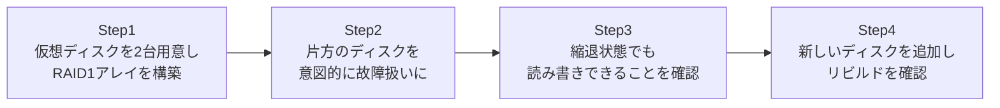

## はじめに

- **この記事で得られること**: [RAIDとWindowsのディスク管理の関係](/articles/disk-raid-fundamentals-guide)で学んだRAIDの基礎知識を、**Linuxの`mdadm`を使い、実際にRAID1(ミラーリング)アレイを構築し、ディスク障害からリビルドまでの一連の流れを自分の手で体験する**ことで検証します。
- **対象読者**: RAIDが「複数のディスクを冗長化する仕組み」であることは理解しているものの、実際に障害が発生したときに、アレイがどういう状態になり、どうやって復旧するのかを、具体的に見たことがない方を想定しています。
- **読むのにかかる想定時間**: 約25分(ハンズオン実施込み)

この記事は[『上位1%』シリーズ 全記事ガイド](/sitemap)の一部、[ストレージ基礎シリーズ](/sitemap#シリーズ一覧)の4本目です。[ハンズオン準備マニュアル](/articles/handson-prep-guide)で作成したUbuntu Server環境が1台あれば実施できます。

## 前提知識

- **RAIDの基本的な役割**: [RAIDとWindowsのディスク管理の関係](/articles/disk-raid-fundamentals-guide)で扱った、RAIDが複数のディスクをまとめて冗長化・高速化する仕組みであるという基礎です。本記事では、その中でも最も単純な、2台のディスクを完全に同一の内容に保つ**RAID1**(ミラーリング)を扱います。

## 全体像をつかむ

このハンズオンで行うことは、次の4ステップです。



## ハンズオン手順

### Step 1: 2台の仮想ディスクを用意し、RAID1アレイを構築する

実際の物理ディスクを用意する代わりに、ファイルをループバックデバイスとして扱い、仮想的な2台のディスクを用意します。

```bash
sudo apt install -y mdadm
sudo dd if=/dev/zero of=/disk1.img bs=1M count=100
sudo dd if=/dev/zero of=/disk2.img bs=1M count=100
sudo losetup /dev/loop1 /disk1.img
sudo losetup /dev/loop2 /disk2.img
```

2台の仮想ディスク(`/dev/loop1`・`/dev/loop2`)で、RAID1アレイを作成します。

```bash
sudo mdadm --create /dev/md0 --level=1 --raid-devices=2 /dev/loop1 /dev/loop2
```

アレイの状態を確認します。

```bash
sudo mdadm --detail /dev/md0
```

**実行結果(該当部分):**

```
State : clean
Active Devices : 2
Working Devices : 2
Failed Devices : 0
```

**`Active Devices: 2`**、つまり2台とも正常に稼働しているアレイが構築できました。ファイルシステムを作成し、マウントしてみます。

```bash
sudo mkfs.ext4 /dev/md0
sudo mkdir -p /mnt/raid1
sudo mount /dev/md0 /mnt/raid1
echo "important data" | sudo tee /mnt/raid1/data.txt
```

### Step 2: 片方のディスクを、意図的に故障扱いにする

実際にディスクが壊れるのを待つ代わりに、`mdadm`の機能で、片方のディスクを意図的に「故障」としてマークします。

```bash
sudo mdadm --manage /dev/md0 --fail /dev/loop2
sudo mdadm --detail /dev/md0
```

**実行結果(該当部分):**

```
State : clean, degraded
Active Devices : 1
Working Devices : 1
Failed Devices : 1
```

**アレイの状態が`clean`から`clean, degraded`(縮退)へ変化し、`Active Devices`が2から1へ減ったことが確認できました。**

### Step 3: 縮退状態でも、読み書きが継続できることを確認する

**ディスクが1台失われた縮退状態でも、サービスが止まらずに読み書きを継続できることを確認します。**

```bash
cat /mnt/raid1/data.txt
echo "still working after disk failure" | sudo tee -a /mnt/raid1/data.txt
cat /mnt/raid1/data.txt
```

**実行結果:**

```
important data
important data
still working after disk failure
```

**1台のディスクが故障扱いになった後も、残った1台のディスクだけで、読み書きが問題なく継続できている**ことが確認できました。これが、[RAID1の最大の価値](/articles/disk-raid-fundamentals-guide)である、冗長化の実際の効果です。ただし、この縮退状態は、**もう1台のディスクが同時に故障すれば、すべてのデータが失われる**という、危険な状態でもあります。縮退状態をいつまでも放置してはならない理由が、ここで実感できます。

### Step 4: 新しいディスクを追加し、リビルドを確認する

新しい仮想ディスクを用意し、アレイへ追加します。

```bash
sudo mdadm --manage /dev/md0 --remove /dev/loop2
sudo dd if=/dev/zero of=/disk3.img bs=1M count=100
sudo losetup /dev/loop3 /disk3.img
sudo mdadm --manage /dev/md0 --add /dev/loop3
```

リビルドの進行状況を確認します。

```bash
cat /proc/mdstat
```

**実行結果(該当部分):**

```
md0 : active raid1 loop3[2] loop1[0]
      recovery = 45.2% (...) finish=0.1min speed=...
```

**`recovery = 45.2%`という、リビルドが進行中であることを示す具体的な進捗が確認できました。** リビルドが完了すると、`mdadm --detail /dev/md0`で、再び`Active Devices: 2`、`State: clean`へ戻ったことを確認できます。

<details>
<summary>なぜリビルドには時間がかかるのか</summary>

リビルドとは、**残っている正常なディスクの全内容を、新しく追加されたディスクへ、頭から最後まですべてコピーする処理**です。差分だけをコピーするのではなく、ディスク全体を対象にするため、ディスクの容量が大きくなるほど、リビルドにかかる時間も長くなります。**そして、リビルド中は、残っている正常な1台のディスクに、通常の読み書き負荷に加えて、コピーのための負荷までが重なります。** この間にもう1台のディスクまで故障してしまうと、データが失われます。RAID1(ミラーリング)より多くのディスクを使うRAID5・RAID6といった構成では、この「リビルド中にもう1台故障するリスク」への対策として、RAID6のように同時に2台までの故障に耐えられる設計が選ばれることがあります。

</details>

## プロが見ている視点(上位1%の理解)

### 「RAIDを組んでいる」ことと、「障害に気づける」ことは、別の話である

このハンズオンでは、Step 2で**意図的に**ディスクを故障扱いにしたため、障害が発生したことに気づけました。しかし、実務の現場では、**RAIDアレイが縮退状態になっていることに誰も気づかず、長期間放置されてしまう**という事故が、繰り返し起きています。RAID1・RAID5のようなRAID構成は、1台の故障に対しては確かにサービスを継続させてくれますが、**その縮退状態を検知し、担当者に通知する仕組み(監視・アラート)がなければ、「冗長化されているはずなのに、実質的に無防備な状態」が、気づかれないまま続いてしまいます。** RAIDを構築したら、必ず定期的な状態確認か、自動アラートの仕組みをあわせて構築することが、このハンズオンから得られる最も重要な教訓です。

## よくある誤解・つまずきポイント

- **誤解1: 「RAID1を組んでいれば、ディスクが1台故障しても自動的に修復される」**
  故障したディスクを新しいディスクに交換し、リビルドを実行するまでは、縮退状態が続きます。自動的に元の状態へ戻るわけではありません。
- **誤解2: 「縮退状態でも、通常時と同じ性能で動作する」**
  縮退状態では、冗長性が失われているだけでなく、構成によっては性能も低下します。また、リビルド中は、残ったディスクへの負荷が一時的に増加します。
- **誤解3: 「RAIDを組んでいれば、バックアップは不要である」**
  RAIDはハードウェア障害への対策であり、誤削除・ランサムウェア・論理的なデータ破損には対応できません。RAIDとバックアップは、別々の目的を持つ、別々の対策です。

## 障害・トラブルシューティングの視点

1. **アレイの状態を確認する方法が分からない**: `cat /proc/mdstat`で簡易的な状態、`mdadm --detail /dev/mdX`で詳細な状態を確認できます。
2. **ディスクを交換したのに、アレイに追加されない**: `mdadm --manage /dev/mdX --add /dev/sdX`で、明示的にアレイへ追加する操作が必要です。自動的には追加されません。
3. **リビルドが異常に遅い**: `/proc/mdstat`の`speed`の値を確認します。他のディスクI/O負荷が高い場合、リビルドの速度は低下します。

## まとめ

- `mdadm`を使うと、Linux上でソフトウェアRAIDを構築・管理できます。
- ディスクが1台故障すると、アレイは「縮退(degraded)」状態になり、冗長性を失いながらもサービスは継続します。
- 新しいディスクを追加すると、正常なディスクの全内容をコピーする「リビルド」が実行され、完了すると元の冗長な状態に戻ります。
- RAIDは、縮退状態を検知する監視の仕組みとあわせて運用しなければ、実質的に無防備な状態が長期間放置されるリスクがあります。

**今日から意識すべきこと**
1. RAIDを構築したら、必ず状態監視・アラートの仕組みをあわせて構築する習慣をつけましょう。
2. 「RAIDがあるから安心」ではなく、「RAID」と「バックアップ」は別々の目的を持つ、別々の対策であることを意識しましょう。

## 参考文献

- [mdadm(8) Manual Page](https://man7.org/linux/man-pages/man8/mdadm.8.html)
- [Linux Software RAID | The Linux Documentation Project](https://tldp.org/HOWTO/Software-RAID-HOWTO.html)
