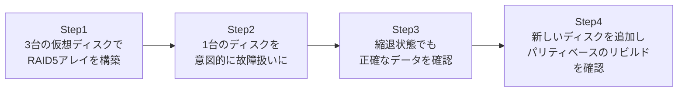

## はじめに

- **この記事で得られること**: [RAID5とRAID6のパリティ計算の仕組み](/articles/raid5-parity-guide)で学んだ、XORによる復元の仕組みを、**実際に3台の仮想ディスクでRAID5アレイを構築し、1台を故障させても、パリティから正確にデータが復元され続けることを確認する**ことで検証します。
- **対象読者**: [mdadmでRAID1を構築するハンズオン](/articles/mdadm-raid-handson-guide)は経験したものの、パリティ方式のRAID5が、ミラーリングとは具体的にどう異なる挙動をするのかを、自分の目で確認したことがない方を想定しています。
- **読むのにかかる想定時間**: 約25分(ハンズオン実施込み)

この記事は[『上位1%』シリーズ 全記事ガイド](/sitemap)の一部、[ストレージ基礎シリーズ](/sitemap#シリーズ一覧)の9本目です。[ハンズオン準備マニュアル](/articles/handson-prep-guide)で作成したUbuntu Server環境が1台あれば実施できます。

## 前提知識

- **RAID1のミラーリング**: [mdadmでRAID1を構築するハンズオン](/articles/mdadm-raid-handson-guide)で扱った、mdadmの基本的な操作方法です。
- **パリティの仕組み**: [RAID5とRAID6のパリティ計算の仕組み](/articles/raid5-parity-guide)で扱った、XOR演算による復元の原理です。

## 全体像をつかむ

このハンズオンで行うことは、次の4ステップです。



## ハンズオン手順

### Step 1: 3台の仮想ディスクで、RAID5アレイを構築する

[RAID1ハンズオン](/articles/mdadm-raid-handson-guide)と同様に、ファイルをループバックデバイスとして扱います。今回は、RAID5の最小構成である、3台の仮想ディスクを用意します。

```bash
sudo apt install -y mdadm
for i in 1 2 3; do
  sudo dd if=/dev/zero of=/disk$i.img bs=1M count=100
  sudo losetup /dev/loop$i /disk$i.img
done
```

3台の仮想ディスクで、RAID5アレイを作成します。

```bash
sudo mdadm --create /dev/md0 --level=5 --raid-devices=3 /dev/loop1 /dev/loop2 /dev/loop3
```

アレイの状態を確認します。

```bash
sudo mdadm --detail /dev/md0
```

**実行結果(該当部分):**

```
Raid Level : raid5
Array Size : 204800 (200.00 MiB)
Active Devices : 3
```

**3台のディスクで構成されているにもかかわらず、`Array Size`(アレイ全体の実使用可能容量)が、1台あたりの容量(約100MiB)の、約2台分(200MiB)にしかなっていない**ことが確認できます。これは、[座学で学んだとおり](/articles/raid5-parity-guide)、3台のうち、容量としては1台分が、パリティのために使われているためです。ファイルシステムを作成し、データを書き込みます。

```bash
sudo mkfs.ext4 /dev/md0
sudo mkdir -p /mnt/raid5
sudo mount /dev/md0 /mnt/raid5
echo "raid5 test data" | sudo tee /mnt/raid5/data.txt
```

### Step 2: 1台のディスクを、意図的に故障扱いにする

```bash
sudo mdadm --manage /dev/md0 --fail /dev/loop2
sudo mdadm --detail /dev/md0
```

**実行結果(該当部分):**

```
State : clean, degraded
Active Devices : 2
Failed Devices : 1
```

[RAID1ハンズオン](/articles/mdadm-raid-handson-guide)と同様に、アレイが縮退状態になりました。

### Step 3: 縮退状態でも、データが正確に読み取れることを確認する

```bash
cat /mnt/raid5/data.txt
echo "still working with 1 disk failed" | sudo tee -a /mnt/raid5/data.txt
cat /mnt/raid5/data.txt
```

**実行結果:**

```
raid5 test data
raid5 test data
still working with 1 disk failed
```

**1台のディスクが故障扱いになった後も、残った2台のディスクと、それらから計算できるパリティ関係を使って、データの読み書きが正確に継続できている**ことが確認できました。[座学で学んだXORの性質](/articles/raid5-parity-guide)により、失われた1台分のデータが、残りの情報から、その都度計算で復元されながら、読み取りが行われています。

<details>
<summary>RAID1との、縮退状態の挙動の違い</summary>

[RAID1ハンズオン](/articles/mdadm-raid-handson-guide)での縮退状態は、「もう1台の、完全な複製が残っている」という、単純な状態でした。**一方、RAID5の縮退状態は、残っている台数分のデータと、パリティの関係式から、失われたデータを、都度その場で計算して復元し続けている、という、より複雑な処理の上に成り立っています。** このため、RAID5の縮退状態での読み書きは、RAID1の縮退状態よりも、一般的に追加の計算コストがかかり、性能が低下する傾向があります。

</details>

### Step 4: 新しいディスクを追加し、パリティベースのリビルドを確認する

```bash
sudo mdadm --manage /dev/md0 --remove /dev/loop2
sudo dd if=/dev/zero of=/disk4.img bs=1M count=100
sudo losetup /dev/loop4 /disk4.img
sudo mdadm --manage /dev/md0 --add /dev/loop4
cat /proc/mdstat
```

**実行結果(該当部分):**

```
md0 : active raid5 loop4[3] loop3[2] loop1[0]
      recovery = 38.1% (...) finish=0.1min speed=...
```

**リビルドが進行中であることが確認できました。** リビルドが完了すると、`mdadm --detail /dev/md0`で、再び`Active Devices: 3`、`State: clean`へ戻ったことを確認できます。このリビルド処理の内部では、**残っている2台のデータから、失われた1台分のデータを、パリティの計算式を使って、新しいディスクへ再構築しています。** [RAID1のリビルド](/articles/mdadm-raid-handson-guide)が、単純にもう1台の内容をそのままコピーしていたのとは、根本的に異なる処理が行われています。

## プロが見ている視点(上位1%の理解)

### RAID5の「1台故障への耐性」は、常に「計算コスト」という代償と引き換えである

このハンズオンを通じて、RAID5が、RAID1と同じ「1台の故障に耐える」という結果を実現していても、**その内部で行われている処理は、まったく異なる**ことが確認できました。RAID1は「複製を読むだけ」、RAID5は「残りのデータとパリティから、毎回計算して復元する」という違いです。**同じ機能要件(1台の故障に耐える)を満たす複数の実装が存在する場合、その実装ごとに、具体的にどんな代償(計算コスト、性能への影響)を払っているのかを見極めることが、設計を評価する上で欠かせません。** [トークンバケットと固定ウィンドウ](/articles/rate-limiting-handson-guide)が、同じ「レートリミット」という目的を、異なる実装コストで実現していたのと、根底にある視点は同じです。

## よくある誤解・つまずきポイント

- **誤解1: 「RAID5の縮退状態は、RAID1の縮退状態と、内部的には同じ処理である」**
  RAID1の縮退状態は、単純に残った複製を読むだけですが、RAID5の縮退状態は、パリティからデータを都度計算で復元する、より複雑な処理です。
- **誤解2: 「RAID5のリビルドは、RAID1のリビルドと同じ、単純なコピー処理である」**
  RAID1のリビルドは、もう1台の内容をそのままコピーしますが、RAID5のリビルドは、残りのデータからパリティの計算式を使って、失われたデータを再構築する処理です。
- **誤解3: 「3台構成のRAID5アレイの実使用可能容量は、3台分の合計である」**
  3台構成のRAID5の実使用可能容量は、パリティ用に1台分の容量が使われるため、2台分(n台構成なら、n-1台分)になります。

## 障害・トラブルシューティングの視点

1. **RAID5の縮退状態で、性能が大きく低下している**: パリティからの都度計算という、RAID5の縮退状態特有の処理負荷が原因である可能性が高く、これは想定内の挙動です。
2. **RAID5のArray Sizeが、想定より小さい**: パリティ用に1台分の容量が使われているため、`(台数-1) x 1台あたりの容量`が、正しい実使用可能容量です。
3. **リビルド中に、さらに1台が故障した**: RAID5は1台の故障にしか耐えられないため、この場合データは失われます。[RAID6](/articles/raid5-parity-guide)であれば、2台目の故障にも耐えられます。

## まとめ

- RAID5は、3台以上のディスクで構成され、1台分の容量をパリティに使うことで、残りの台数分の実使用可能容量と、1台の故障への耐性を両立させます。
- RAID5の縮退状態での読み書きは、残ったデータとパリティから、都度計算でデータを復元する処理であり、RAID1の単純な複製読み取りとは、内部的にまったく異なります。
- RAID5のリビルドは、残りのデータからパリティの計算式を使って、失われたデータを再構築する処理です。
- 同じ機能要件を満たす異なる実装は、それぞれ異なる代償(計算コスト、性能への影響)を払っていることを、具体的に見極める必要があります。

**今日から意識すべきこと**
1. RAID方式を評価する際は、「何に耐えられるか」だけでなく、「その耐性を、どういう内部処理で実現しているか」を確認しましょう。
2. 縮退状態やリビルド中の性能低下に遭遇したら、それがRAID方式の仕組み上、想定内の挙動なのかを、まず確認しましょう。

## 参考文献

- [mdadm(8) Manual Page](https://man7.org/linux/man-pages/man8/mdadm.8.html)
- [Mathematics of RAID 6 | Wikipedia](https://en.wikipedia.org/wiki/Mathematics_of_RAID_6)
