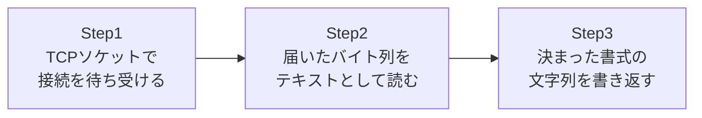

## はじめに

- **この記事で得られること**: IISやNginxのような本格的なWebサーバーソフトウェアを使わず、**TCPソケットを直接扱う最小限のコードだけでHTTPサーバーを自作**し、ブラウザから実際にアクセスするところまでを体験します。これにより、[IISとASP.NETの仕組みを『上位1%』の視点で理解する](/articles/iis-fundamentals-guide)で触れた「Webサイトの正体はHTTPを処理できるソフトウェアである」という感覚を、実際に手を動かして確認します。
- **対象読者**: 「Webサイト」という言葉を、なんとなく「HTML/CSSファイルの集まり」だとイメージしている方、IISやApacheが内部で何をしているのか、実感を持てていない方を想定しています。
- **読むのにかかる想定時間**: 約16分(ハンズオン実施込み)

この記事は[『上位1%』シリーズ 全記事ガイド](/sitemap)の一部、[Windows Server運用シリーズ](/sitemap#シリーズ一覧)の7本目です。[ハンズオン準備マニュアル](/articles/handson-prep-guide)で作成したLinux環境(または手元のPC)があれば、追加のソフトウェアインストールなしにPython 3だけで実施できます。

## 前提知識

- **TCPソケット**: プログラムがネットワーク越しに通信するための、OSが提供する「通信の出入り口」です。詳しくは[ネットワークスタックの仕組みを『上位1%』の視点で理解する](/articles/network-stack-guide)を参照してください。
- **HTTPの基本形式**: リクエスト・レスポンスとも「1行目(リクエストライン/ステータスライン)+ヘッダー行+空行+ボディ」というテキストベースの形式を取ります。詳しくは[RESTful APIとは何か?『上位1%』の視点で理解する](/articles/restful-api-guide)を参照してください。

## 全体像をつかむ

このハンズオンで作るものは、次の3ステップだけです。



**IIS・Nginx・Apacheが行っていることも、本質的にはこの3ステップの延長線上にあります。** 違いは、これらの本格的な実装が、大量の同時接続処理、HTTP仕様の細かな例外への対応、セキュリティ対策、パフォーマンス最適化を積み重ねている点です。

## ハンズオン手順

### Step 1: 最小限のHTTPサーバーを書く

任意のディレクトリに`mini_server.py`というファイルを作成し、次のコードを書きます。**Webフレームワークはおろか、Pythonに標準搭載されている`http.server`モジュールすら使わず、生のTCPソケットだけ**を使っている点がポイントです。

```python
import socket

HOST = "0.0.0.0"
PORT = 8080

server_socket = socket.socket(socket.AF_INET, socket.SOCK_STREAM)
server_socket.setsockopt(socket.SOL_SOCKET, socket.SO_REUSEADDR, 1)
server_socket.bind((HOST, PORT))
server_socket.listen(5)
print(f"Listening on {HOST}:{PORT} ...")

while True:
    conn, addr = server_socket.accept()
    request_bytes = conn.recv(4096)
    request_text = request_bytes.decode("utf-8", errors="replace")

    # リクエストの1行目(リクエストライン)だけを取り出す
    request_line = request_text.split("\r\n")[0]
    print(f"[{addr}] {request_line}")

    method, path, _ = request_line.split(" ")

    if path == "/hello":
        body = "<h1>Hello from my own HTTP server!</h1>"
    else:
        body = "<h1>It works.</h1><p>This page is served by code you wrote yourself.</p>"

    response = (
        "HTTP/1.1 200 OK\r\n"
        "Content-Type: text/html; charset=utf-8\r\n"
        f"Content-Length: {len(body.encode('utf-8'))}\r\n"
        "Connection: close\r\n"
        "\r\n"
        f"{body}"
    )
    conn.sendall(response.encode("utf-8"))
    conn.close()
```

`python3 mini_server.py`で実行すると、ターミナルに`Listening on 0.0.0.0:8080 ...`と表示されます。

### Step 2: ブラウザから実際にアクセスする

サーバーを実行しているマシンのIPアドレスに対して、ブラウザで`http://<そのマシンのIPアドレス>:8080/`を開きます。**「It works.」という文字列が、自分が書いたPythonコードから返ってきたページとして表示されます。** 続けて`http://<IPアドレス>:8080/hello`にアクセスすると、`path`の値によって異なるHTMLが返っていることが確認できます。

この`if path == "/hello":`という数行こそが、ASP.NETやExpressのようなフレームワークが「ルーティング」と呼んでいる機能の、最も原始的な姿です。フレームワークは、この分岐処理をURLパターンのマッチングや設定ファイルとして便利に扱えるようにしているだけで、**やっていること自体の本質は変わりません。**

### Step 3: 実際に流れているバイト列を確認する

`curl`の`-v`オプションを使うと、送受信されている生のHTTPメッセージをそのまま確認できます。

```bash
curl -v http://<IPアドレス>:8080/
```

出力の中の`> `で始まる行が送信したリクエスト、`< `で始まる行が受信したレスポンスです。**サーバー側のコードで組み立てた`HTTP/1.1 200 OK`や`Content-Type`の行が、そのままの文字列としてクライアント側に届いている**ことが確認できます。[Wiresharkの使い方](/articles/wireshark-guide)で扱ったパケットキャプチャツールを使えば、TCPペイロードの中身としてこれらの文字列がそのまま流れている様子も確認できます。

## プロが見ている視点(上位1%の理解)

### このミニサーバーに欠けているもの——なぜ実務ではIIS・Nginxを使うのか

この数十行のコードは、**「HTTPを処理できるソフトウェアであれば、それはWebサーバーになりうる」ということを体感するには十分**ですが、実務で使うには次のような要素が欠けています。

- **同時接続の処理**: このコードは`accept()`のあと1つのリクエストを処理し終えるまで、次の接続を受け付けられません。IISは、[IISとASP.NETの仕組みを『上位1%』の視点で理解する](/articles/iis-fundamentals-guide)で扱ったHTTP.sys・アプリケーションプール・ワーカープロセスという仕組みで、大量の同時接続を効率よくさばきます。
- **HTTP仕様への正確な準拠**: チャンク転送エンコーディング、キープアライブ、様々な文字コード、不正な形式のリクエストへの耐性など、HTTP仕様が定める細かな挙動に、このミニサーバーは一切対応していません。
- **セキュリティ**: 入力値の検証、パストラバーサル対策、TLS(HTTPS)対応などが何もありません。このコードをそのままインターネットに公開するのは危険です。

**「自分でも作れる」ということと、「実務では自作せず実績のある実装を使うべきである」ということは、まったく矛盾しません。** むしろ、原理を理解した上で「餅は餅屋」の判断ができることこそが、上位1%の理解です。

## よくある誤解・つまずきポイント

- **誤解1: 「Webサイトを作るには、必ずApacheやIIS、あるいはWebフレームワークが必要である」**
  最低限「TCPソケットでHTTPのテキスト形式を読み書きするコード」さえあれば、技術的にはWebサイトとして成立します。ApacheやIISは、それを実務レベルで安全・高速に行うための実装です。
- **誤解2: 「ルーティングは、Webフレームワークだけが持つ高度な機能である」**
  本質的には「パス文字列によって処理を分岐する」という単純な条件分岐です。フレームワークはこれを大規模なアプリケーションでも扱いやすい形に整えているだけです。

## 障害・トラブルシューティングの視点

1. **ブラウザからアクセスできない**: サーバーを実行しているマシンのファイアウォールで、8080番ポートへのインバウンド通信が許可されているかを確認します。
2. **`Address already in use`エラーが出る**: 同じポートで別のプロセスが既に待ち受けていないか(前回実行したサーバーが終了していないか)を確認します。`socket.SO_REUSEADDR`を設定していても、OSの種類によっては即座に再利用できない場合があります。

## まとめ

- Webサイトの正体は、TCPソケットでHTTPのテキスト形式を読み書きできるソフトウェアであり、HTML/CSSはそのレスポンスとして返されるコンテンツの一形態にすぎません。
- ルーティングのようなフレームワークの機能も、原理としては単純な条件分岐の延長線上にあります。
- 実務でIIS・Nginxのような実装を使うのは、同時接続処理・HTTP仕様への準拠・セキュリティといった、このミニサーバーには存在しない要素を積み重ねているためです。

**今日から意識すべきこと**
1. 「Webサイト」という言葉を見たら、その正体が「HTTPを処理できるソフトウェア」であることを思い出しましょう。
2. フレームワークの便利な機能に出会ったら、「これは原理としてはどんな単純な処理の延長なのか」を考える癖をつけましょう。

## 参考文献

- [Hypertext Transfer Protocol (HTTP/1.1): Message Syntax and Routing | RFC 7230](https://datatracker.ietf.org/doc/html/rfc7230)
- [socket — Low-level networking interface | Python Documentation](https://docs.python.org/3/library/socket.html)
