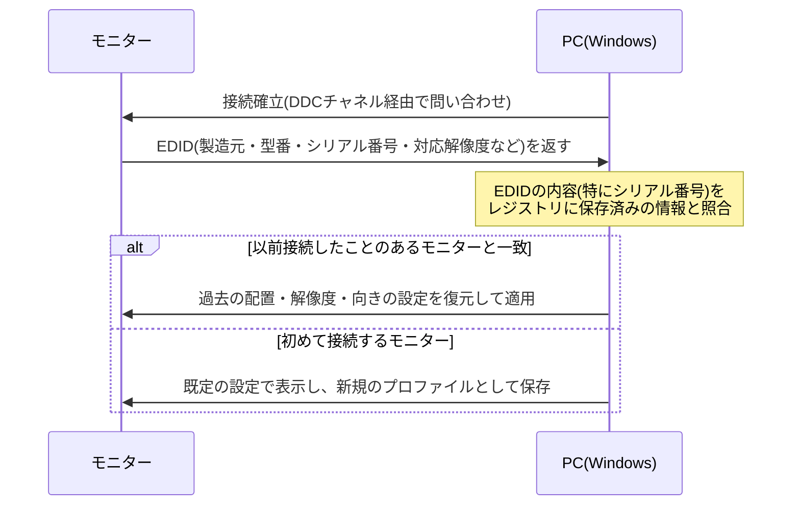

## はじめに

- **この記事で得られること**: モニターをHDMIケーブルで接続すると、以前の画面分割・配置の設定が自動的に記憶されている、という挙動の裏側にある仕組みを理解します。**EDID(Extended Display Identification Data)というモニター固有の識別情報が何を運んでいるのか、Windowsがそれをどう使って「以前接続したあのモニターだ」と識別しているのか**、そしてKVMスイッチのような機器を経由すると、この仕組みがうまく機能しなくなることがある理由までを体系的に理解します。
- **対象読者**: モニターの配置設定がケーブルを挿すだけで復元される挙動を日常的に体験しているものの、その裏側の仕組みを具体的に説明できない方を想定しています。
- **読むのにかかる想定時間**: 約13分

この記事は[『上位1%』シリーズ 全記事ガイド](/sitemap)の一部、[Windowsクライアント運用シリーズ](/sitemap#シリーズ一覧)の8本目です。

## 前提知識

- **解像度・リフレッシュレート**: モニターが表示できる画素数(解像度)と、1秒あたりの画面更新回数(リフレッシュレート)です。モニターごとに対応できる組み合わせが異なります。

## 全体像をつかむ

### 一言で言うと

**モニターは、接続された瞬間にPCへ向けて、自分自身の身元を証明する情報(EDID)を送り出しています。** Windowsは、この情報をもとに「これは以前接続したことのある、あのモニターだ」と識別し、そのモニターに対して過去に設定した配置・解像度・向きなどの設定を復元します。**ケーブルを挿すだけで設定が戻るように"見える"のは、実際には毎回このEDIDのやり取りと照合が行われているから**であり、魔法のように何もせずに復元されているわけではありません。

## 基礎から徹底解説

### EDIDが運んでいる情報

EDIDは、モニターの基板上にある小さな記憶チップに、製造時にあらかじめ書き込まれているデータです。この中には、**製造元名、製品(型番)情報、シリアル番号、対応している解像度・リフレッシュレートの一覧、物理的な画面サイズ、色特性(クロマティシティ)データ**などが含まれています。PCとモニターは、映像信号そのものとは別に、**DDC**(Display Data Channel)と呼ばれる専用の通信経路を使って、このEDIDのやり取りを行います。PC側は、この情報をもとに、そのモニターが実際にサポートしている解像度・リフレッシュレートの範囲を把握し、対応外の設定を送らないように調整しています。

### Windowsは、EDIDの何を基準に「同じモニター」だと判断しているのか

Windowsは、EDIDに含まれる情報の中でも、**特に製造元・型番・シリアル番号の組み合わせ**を基準に、接続されたモニターを識別します。この識別結果と、過去にそのモニターに対して行った配置・解像度・向きなどの設定は、レジストリ上に保存されています。**同じ型番のモニターを2台並べて使っている場合でも、シリアル番号が異なれば、Windowsからは明確に別々のモニターとして扱われます。** そのため、片方のモニターだけを別の同型番のモニターに交換した場合、シリアル番号が変わることで「初めて接続されたモニター」として扱われ、配置設定は復元されず、新規に設定し直す必要があります。

安価なケーブル・機器でEDIDのやり取りがうまくいかないことがある理由

EDIDのやり取りは、映像信号の伝送とは別に、DDCという専用の信号線を使って行われます。品質の低いケーブルや、映像を単純に中継するだけの一部の安価な変換アダプタでは、このDDC用の信号線が正しく結線されていない、あるいはノイズの影響を受けやすいことがあり、EDIDの読み取り自体に失敗することがあります。この場合、WindowsはそのモニターのEDIDを取得できず、汎用的な既定の解像度でしか表示できなくなったり、毎回「新しいモニター」として認識されてしまったりすることがあります。

## プロが見ている視点(上位1%の理解)

### KVMスイッチ経由の接続で、設定復元がうまく機能しなくなる理由

複数のPCを1台のモニターへ切り替えて接続する**KVMスイッチ**を使っている環境では、この仕組みがうまく機能しないことがあります。KVMスイッチは、**現在選択されているPC(ポート)にしか、モニターのEDID情報を正しく中継しない**ことが多いためです。選択されていない側のPCから見ると、モニターが接続されているのかどうかすら、正しく認識できない状態になることがあります。この結果、PCを起動するたびにモニターが認識されない、あるいは解像度が意図しない値になる、といった問題が起こりえます。**上位1%のエンジニアがこの症状に遭遇した場合、まずモニター側やケーブル側を疑う前に、KVMスイッチという中継機器がEDIDの伝達経路に割り込んでいないかを確認します。** 一部の高機能なKVMスイッチは、この問題に対応するため、EDIDの内容を機器自体にあらかじめ記憶させておき、接続元のPCがどちらであっても常に同じEDIDを返す「EDIDエミュレーション」という機能を備えています。

## よくある誤解・つまずきポイント

- **誤解1: 「モニターの配置設定は、ケーブルを挿すだけで何もせずに自動的に復元される」**
  実際には、接続のたびにモニターからEDIDが送られ、Windowsがその内容を過去の記録と照合するという、明確な仕組みに基づいて復元が行われています。
- **誤解2: 「同じ型番のモニターであれば、常に同じ設定として扱われる」**
  Windowsは型番だけでなくシリアル番号の組み合わせで個体を識別するため、同じ型番でもシリアル番号が異なれば別のモニターとして扱われ、設定は復元されません。
- **誤解3: 「モニターが認識されない・解像度がおかしい問題は、常にモニター本体の故障が原因である」**
  安価なケーブル・変換アダプタや、KVMスイッチのような中継機器が、EDIDの正しい伝達を妨げているケースも少なくありません。

## 障害・トラブルシューティングの視点

1. **モニターの配置設定が毎回復元されない**: そのモニターのシリアル番号が、接続のたびに変わっていないか(あるいは複数の同型番モニターを頻繁に入れ替えていないか)を確認します。
2. **KVMスイッチ経由の環境で、特定のPCからだけモニターが認識されない**: KVMスイッチがEDIDエミュレーション機能を持っているか、その機能が有効になっているかを確認します。
3. **解像度が意図しない低い値でしか表示できない**: ケーブル・変換アダプタの品質を疑い、可能であれば別のケーブルで問題が再現するかを確認します。

### 予防策・恒久対策

- 複数モニター環境を構築する際は、個々のモニターのシリアル番号を控えておくと、入れ替え時の切り分けが容易になる。
- KVMスイッチを導入する際は、EDIDエミュレーション機能の有無を選定基準に含める。

## まとめ

- モニターは接続された瞬間に、EDID(製造元・型番・シリアル番号・対応解像度などの識別情報)をPCへ送っています。
- WindowsはEDIDの中でも特に製造元・型番・シリアル番号の組み合わせを基準に、以前接続したモニターかどうかを識別し、レジストリに保存された配置・解像度・向きの設定を復元します。
- 同じ型番でもシリアル番号が異なれば別のモニターとして扱われ、設定は復元されません。
- KVMスイッチのような中継機器は、選択されていないPCへEDIDを正しく中継しないことがあり、モニターが認識されない・解像度がおかしいといった問題の原因になります。

**今日から意識すべきこと**
1. モニターの配置設定が復元されない場合は、モニター本体の故障を疑う前に、EDIDが正しく伝達されているか(ケーブル・変換アダプタ・KVMスイッチなど)を確認しましょう。
2. KVMスイッチを選定する際は、EDIDエミュレーション機能の有無を確認しましょう。

## 参考文献

- [Extended Display Identification Data | Wikipedia](https://en.wikipedia.org/wiki/Extended_Display_Identification_Data)
- [Video: EDID and DDC | Adder Support Wiki](https://support.adder.com/tiki/tiki-index.php?page=Video%3A+EDID+and+DDC)
