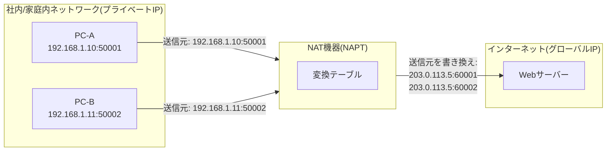
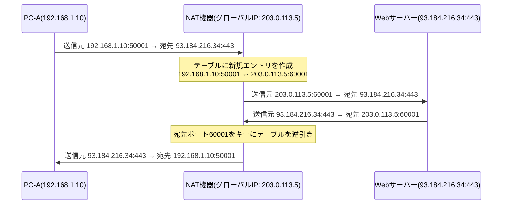
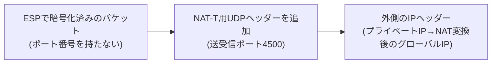
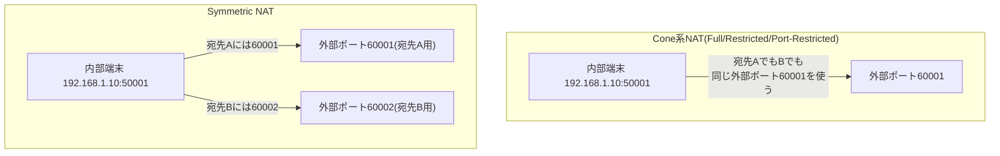

## はじめに

- **この記事で得られること**: 「NATはプライベートIPとグローバルIPを変換する」という理解の、その中身——NAT機器が内部で何を管理し、戻ってきたパケットをどの端末宛か具体的にどう判断しているのか、なぜ1つのグローバルIPで複数端末が同時に通信できるのか(NAPT)、NATの挙動によって通信の成立しやすさが変わる「NATのタイプ分類」、そしてIPsecのESPのようにポート番号を持たないプロトコルがNAT環境を越えるために使われるNAT-Tの仕組みまでを、体系的に理解できます。
- **対象読者**: インフラエンジニアとして「NATがIPアドレスを変換している」ことは知っているものの、変換テーブルの内部管理の仕組みや、VPN・VoIPなどで「NAT配下だと繋がりにくい」と言われる理由を具体的に説明できない方を想定しています。
- **読むのにかかる想定時間**: 約20分

この記事は[『上位1%』シリーズ 全記事ガイド](/sitemap)の一部です。

## 前提知識

- **プライベートIPアドレス/グローバルIPアドレス**: プライベートIPアドレス(RFC 1918で定義された`10.0.0.0/8`、`172.16.0.0/12`、`192.168.0.0/16`)は組織内のネットワークだけで通用する住所で、インターネット上では経路制御(ルーティング)の対象になりません。グローバルIPアドレスはインターネット上で一意に割り当てられ、経路制御の対象になる住所です。
- **TCP/UDPのポート番号**: 同じIPアドレスを持つ1台の端末上で、どのアプリケーション(どの通信セッション)宛のデータかを識別するための16ビットの番号です。
- **ルーティング**: パケットの宛先IPアドレスを見て、次にどの機器へ転送すべきかを判断する処理です。

## 全体像をつかむ

### 一言で言うと

**NAT(Network Address Translation)とは、パケットが通過する際にIPヘッダーの送信元(あるいは宛先)アドレスを別のアドレスに書き換える技術**です。最も広く使われている形態は、**ポート番号まで含めて書き換えることで複数端末が1つのグローバルIPを共有できるNAPT(Network Address Port Translation。PATとも呼ばれます)**であり、家庭用ルーターや企業のインターネット境界ルーターがほぼ標準で行っているのはこのNAPTです。

NATが必要になる根本的な理由は、**IPv4アドレスの絶対数が不足しており、すべての端末に直接グローバルIPを割り当てられないこと**にあります。NATは、組織内では自由に使えるプライベートIPアドレスの世界と、インターネット上で通用するグローバルIPアドレスの世界の「境界」で変換を行うことで、限られたグローバルIPアドレスを多数の端末で共有できるようにしています。

## 基礎から徹底解説

### NATの3つの方式：Static NAT・Dynamic NAT・NAPT

NATと一括りに呼ばれる技術には、実は変換の粒度が異なる3つの方式があります。

| 方式 | 変換の粒度 | 特徴 | 主な用途 |
|---|---|---|---|
| Static NAT(静的NAT) | プライベートIP1つに対し、グローバルIP1つを固定で対応させる | 変換ルールは管理者があらかじめ設定し、常に同じ組み合わせ | 社外に公開するサーバー(DMZ上のWebサーバーなど)を、常に同じグローバルIPで公開したい場合 |
| Dynamic NAT(動的NAT) | プライベートIPを、グローバルIPの「プール(集合)」からその都度1つ割り当てる | 同時に使えるグローバルIP数までしか同時通信できない(1対1の関係は保つ) | プール内のグローバルIP数が確保できる、比較的小規模な拠点 |
| NAPT(ポート変換、PAT) | プライベートIP+ポート番号の組を、グローバルIP(多くの場合1つ)+ポート番号の組に変換する | ポート番号という新しい識別軸を使うことで、1つのグローバルIPを多数の端末が同時共有できる | 家庭用ルーター、企業のインターネット境界(現在最も一般的な形態) |

Static NATとDynamic NATは、あくまで「あるプライベートIPは、ある瞬間には必ずどれか1つのグローバルIPに対応する」という1対1の関係を保ちます。この関係を崩し、**ポート番号という新しい情報を変換の材料に加えることで「多対1」を実現した**のがNAPTであり、現在NATという言葉が指すものの大半は、実質的にこのNAPTです。以降はこのNAPTの内部動作を中心に見ていきます。

### NAPTの変換テーブル：何をキーに管理しているのか

NAPT機器は、内部を流れるすべての通信セッションについて、**「プロトコル種別＋送信元IPアドレス＋送信元ポート番号＋宛先IPアドレス＋宛先ポート番号」という5つの組み合わせ(5-タプル)**を1つの通信セッションの識別子として扱い、これをキーにした変換テーブル(セッションテーブル、コネクショントラッキングテーブルとも呼ばれます)を動的に構築・管理しています。

具体的な変換テーブルのイメージは次のようになります。

| 内部IP:ポート | プロトコル | 変換後(外部から見えるIP:ポート) | 宛先IP:ポート |
|---|---|---|---|
| 192.168.1.10:50001 | TCP | 203.0.113.5:60001 | 93.184.216.34:443 |
| 192.168.1.11:50002 | TCP | 203.0.113.5:60002 | 93.184.216.34:443 |
| 192.168.1.10:51000 | UDP | 203.0.113.5:60003 | 198.51.100.20:53 |

このテーブルがあるからこそ、NAT機器は**戻ってきたパケットの宛先ポート番号(この例では60001や60002)を見るだけで、どの内部端末に転送すべきかを一意に判断**できます。逆に言えば、**外部ポート番号こそが、NAPT配下の複数端末を区別するための実質的な識別子**です。この性質は、後述する「ポート番号を持たないプロトコル」がNAT環境で問題を起こす理由の核心になります。

エントリは永続するわけではなく、一定時間(実装により数十秒〜数分)通信のないエントリはテーブルから自動的に削除されます。これにより、使われなくなったポート番号を新しい通信のために再利用できます。

### NATを越えられないプロトコルの問題：ESPを例に

NAPTの変換テーブルは、TCP/UDPのポート番号を前提に設計されています。しかし世の中には、**そもそもポート番号という概念を持たないプロトコル**が存在します。代表例が、IPsecで暗号化・完全性保証を行う**ESP(Encapsulating Security Payload、IPプロトコル番号50)**です。

ESPパケットがNAPT配下から送信されようとすると、次の2つの問題が起こります。

1. **多くの安価なNAT機器がそもそもIPプロトコル番号50のパススルーに対応しておらず、ESPパケットを単純に破棄してしまう**問題です。
2. パススルーに対応した機器であっても、**変換テーブルのキーに使えるポート番号がESPには存在しないため、複数の内部端末が同時にESP通信をしようとした場合にどちらの端末宛かを区別できない**問題です。

これを解決するために使われるのが、後述する**NAT-T(NAT Traversal)**です。同様の問題は、SIPを使うVoIP機器などポート番号をペイロードの中に埋め込んで使う一部のプロトコルでも形を変えて発生し、それぞれのプロトコルごとに異なる回避策(SIPであればSTUN/TURN/ICEなど)が使われています。本記事では、IPsec ESPを具体例に、NAT越えの仕組みの代表的なパターンとしてNAT-Tを掘り下げます。

### NAT-Tの内部動作

**NAT-T(NAT Traversal、RFC 3947/3948)**は、ESPのようにポート番号を持たないプロトコルを、NAPTのUDPポートベースの変換にうまく乗せるための仕組みです。

1. **NATの検出**: IKE(鍵交換プロトコル)のネゴシエーション初期段階で、双方が「送信元IPアドレス+ポート番号のハッシュ値(NAT-Dペイロード)」を計算して交換します。相手が計算したハッシュ値と、自分が実際に受信したパケットの送信元情報から計算したハッシュ値が一致しなければ、途中経路でNATによってアドレス・ポートが書き換えられたと判断できます。
2. **UDPへのカプセル化**: NATが検出されると、以後のやり取りはすべて**UDPポート4500**にフロート(切り替え)します。ESPパケットはUDPヘッダーでさらに包まれ(RFC 3948)、NAT機器は通常のUDPパケットとして送信元・宛先ポートに基づく変換ができるようになります。同じUDPポート4500の上を鍵交換メッセージとカプセル化されたESPパケットの両方が流れるため、受信側はこの2つを区別する必要があり、**Non-ESPマーカー**(鍵交換メッセージの場合はUDPペイロード先頭に4バイトの`0x00000000`を付与)によって瞬時に判別します。
3. **キープアライブ**: NAPTの変換テーブルは、無通信状態が一定時間続くとエントリを自動的に削除してしまいます(前述の「テーブルのエントリは永続しない」がまさにここで効いてきます)。ESP/鍵交換のやり取りが常時発生するとは限らないため、多くの実装は20〜30秒間隔でペイロード1バイトだけのキープアライブパケットを送り、変換テーブルのエントリが失効してセッションが切断されるのを防ぎます。

NAT-Tが有効になると、外側から見えるパケットは「UDPポート4500宛の、ごく普通のUDPパケット」になります。NAT機器からすれば、中身がESPかどうかを一切気にする必要がなく、既存のNAPTの仕組み(送信元・宛先ポート番号に基づく変換)がそのまま使えるようになる、というのがNAT-Tの本質です。**「ポート番号を持たないプロトコルに、後からポート番号の皮を被せて、NAPTの変換テーブルに乗せられる形にする」**——これがNAT-Tという名前の技術に共通する発想です。

**逆にNATが検出されなかった場合**は、この切り替えは起きません。鍵交換はそのままUDPポート500で継続し、ESPもUDPに包まれることなく**IPプロトコル番号50のパケットとして直接**送受信されます。UDPで包む分のヘッダーオーバーヘッドが発生せず、キープアライブも不要になるため、NAT-Tはあくまで「NAT配下でも通信できるようにするための迂回策」であり、NATがない環境ではむしろ使われない、という位置づけです。

## プロが見ている視点（上位1%の理解）

### NATの挙動によるタイプ分類：Cone NATとSymmetric NAT

同じ「NAPT」であっても、**外部ポートの割り当てルールと、受信を許可する相手の絞り込みルール**が実装によって異なり、これが「NAT配下だと特定の通信(P2P通信、一部のVPN、VoIPなど)が繋がりにくい」という現象の根本原因になっています。この挙動は大きく4種類に分類されます(元々はSTUN/RFC 3489で整理された分類です)。

| タイプ | 外部ポートの割り当て | 受信を許可する相手の条件 |
|---|---|---|
| Full Cone NAT | 内部の送信元IP:ポートごとに、常に同じ外部ポートを割り当てる | 誰から届いても、対応する内部端末に転送する |
| Restricted Cone NAT | 内部の送信元IP:ポートごとに、常に同じ外部ポートを割り当てる | 過去に内部端末から送信したことがある**IPアドレス**からの応答のみ許可 |
| Port-Restricted Cone NAT | 内部の送信元IP:ポートごとに、常に同じ外部ポートを割り当てる | 過去に内部端末から送信したことがある**IPアドレス+ポート番号**からの応答のみ許可 |
| Symmetric NAT | **宛先が変わるたびに**、異なる外部ポートを新規に割り当てる | 実際に送信した宛先IPアドレス+ポート番号からの応答のみ許可 |

この違いが実務上重要になるのは、**P2P通信やVoIP、一部のVPNクライアントが「NAT越しに、直接双方向の通信を成立させる(NATホールパンチング)」ために外部ポート番号を事前に知る必要がある**場面です。Cone系NATであれば「一度でも外向きに通信すれば、その外部ポートは(条件を満たす限り)他の相手からの着信にも使い回せる」ため、STUNサーバーなどを使って自分の外部ポートを調べ、それを相手に伝えることでホールパンチングが成立します。一方**Symmetric NATでは、宛先が変わるたびに外部ポートも変わってしまう**ため、STUNで調べた外部ポート番号は、実際に通信したい相手には使えず、ホールパンチングが成立しにくくなります。この場合、通信を中継してくれる代理サーバー(TURNサーバーなど)を経由する構成が必要になります。「同じNAT配下から複数端末が同時にVPN接続すると、後から接続した端末が既存のセッションを上書きすることがある」といった現象も、NAT機器がセッションをどの粒度(5-タプル全体か、送信元IPアドレスだけか)で管理しているかという、この節で扱った変換ルールの実装差に起因します。

## よくある誤解・つまずきポイント

- **誤解1: 「NATはセキュリティ機能である」**
  NATの本来の目的はIPアドレスの共有・節約であり、暗号化やアクセス制御を行うものではありません。結果として「外部から内部端末へ直接セッションを開始できない」という副次的な効果がファイアウォールのような働きをすることはありますが、これはNAPTの変換テーブルが「内部から出た通信の戻りしか自動的には通さない」という設計の副産物であり、明示的なアクセス制御ルールの代わりにはなりません。
- **誤解2: 「NATとファイアウォールは同じもの」**
  NATはアドレス変換、ファイアウォールはポリシーに基づく通信の許可・拒否という、目的の異なる別の機能です。多くの家庭用ルーター・UTM機器は両方を1台に統合しているため混同されがちですが、内部の処理としては明確に別の仕組みです。
- **誤解3: 「1つのグローバルIPの背後には無限に端末を置ける」**
  NAPTで使える外部ポート番号は理論上65536個(0〜65535)ですが、実際にはOS・ルーターの実装上の制約やウェルノウンポートの予約などにより、同時に張れるセッション数には現実的な上限があります。大規模な拠点でNAPTの変換テーブルが枯渇すると、新規の通信が確立できなくなる「ポート枯渇」が起こり得ます。

## 障害・トラブルシューティングの視点

NAT関連のトラブルは、**「変換テーブルのどの段階で問題が起きているか」**を切り分けるのが基本です。

1. **そもそもNAT機器を通過できない**: プロトコル自体(ESPなど、ポート番号を持たないプロトコル)がパススルーに対応していないケースです。IPプロトコル番号50が経路上のどこかで破棄されていないか、`tcpdump`やルーターのカウンタで確認します。
2. **セッションは張れるが片方向しか通らない**: Symmetric NATと相手側の想定(Cone系NATを前提にしたホールパンチング)が食い違っているケースです。NATタイプの判定にはSTUNクライアントツールが使えます。
3. **接続後しばらくして切断される**: NAPTの変換テーブルのエントリが、無通信時間の経過によって削除された可能性が高いです。キープアライブの間隔が、NAT機器側のタイムアウト時間より短く設定されているかを確認します。
4. **同じグローバルIPの配下から複数端末が同時接続すると片方が切れる**: NAT機器・対向サーバーの実装が、セッションを5-タプルではなく送信元IPアドレス単位で管理している可能性があります。

### 予防策・恒久対策

- ポート番号を持たないプロトコル(ESPなど)を使う構成では、NAT-Tのような専用の越え方が用意されているかを事前に確認する。
- キープアライブの間隔は、NAT機器の一般的なタイムアウト値(数十秒〜数分)よりも十分短く設定する。
- 大規模拠点でNAPTを使う場合は、同時セッション数と外部ポートの割り当て上限を事前に見積もっておく。

## まとめ

- NATには変換の粒度が異なるStatic NAT・Dynamic NAT・NAPTの3方式があり、現在主流なのはポート番号まで使って多対1の共有を実現するNAPTです。
- NAPT機器は「プロトコル種別+送信元IP:ポート+宛先IP:ポート」の5-タプルをキーに変換テーブルを動的に管理し、戻りパケットの外部ポート番号だけで内部端末を一意に判別しています。
- ESPのようにポート番号を持たないプロトコルはNAPTの変換テーブルに乗れないため、NAT-Tによって「UDPポート4500の中に包む」形でポートベースの変換に乗せられるようにしています。
- NATの挙動はFull Cone/Restricted Cone/Port-Restricted Cone/Symmetricの4種類に分類され、この違いがP2P通信やVPNの「NAT配下だと繋がりにくい」現象の根本原因になっています。

**今日から意識すべきこと**
1. 「NAT配下で通信が不安定」というトラブルに遭遇したら、変換テーブルのタイムアウトかNATタイプの違いかをまず切り分けましょう。
2. ポート番号を持たないプロトコルを扱う場面では、専用のNAT越えの仕組み(NAT-Tなど)が用意されているかを確認する習慣をつけましょう。

## 参考文献

- [IP Network Address Translator (NAT) Terminology and Considerations | RFC 2663](https://datatracker.ietf.org/doc/html/rfc2663)
- [Traditional IP Network Address Translator (Traditional NAT) | RFC 3022](https://datatracker.ietf.org/doc/html/rfc3022)
- [Address Allocation for Private Internets | RFC 1918](https://datatracker.ietf.org/doc/html/rfc1918)
- [STUN - Simple Traversal of UDP Through NAT | RFC 3489](https://datatracker.ietf.org/doc/html/rfc3489)
- [Negotiation of NAT-Traversal in the IKE | RFC 3947](https://datatracker.ietf.org/doc/html/rfc3947)
- [UDP Encapsulation of IPsec ESP Packets | RFC 3948](https://datatracker.ietf.org/doc/html/rfc3948)
