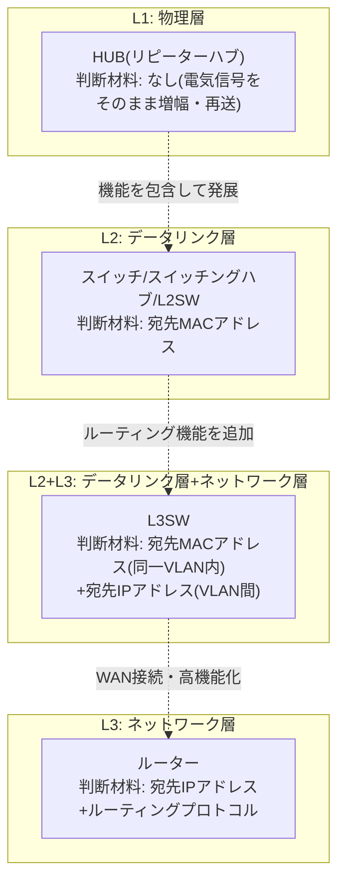
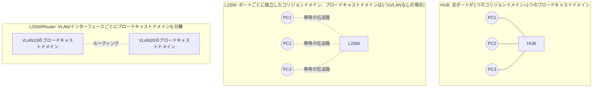
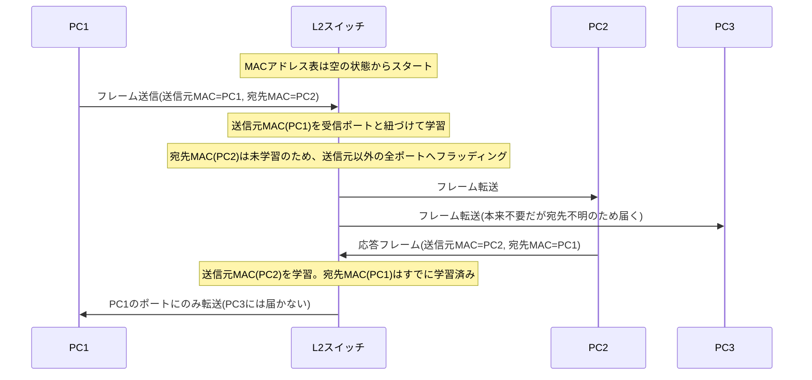
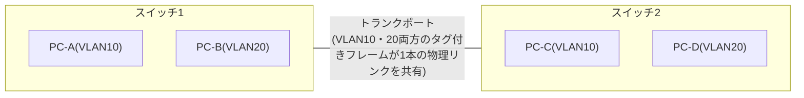
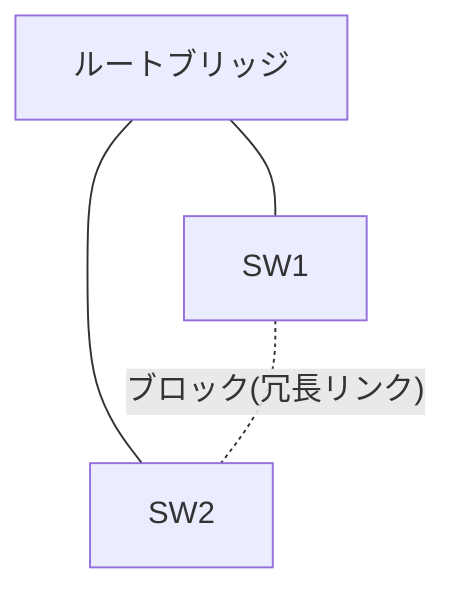
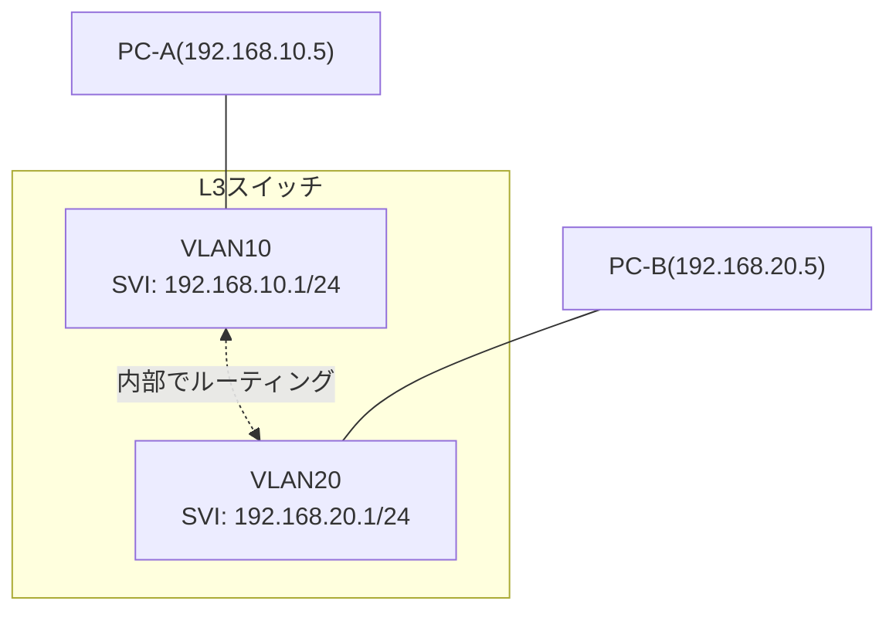

## はじめに

- **この記事で得られること**: 「HUB」「スイッチ」「スイッチングハブ」「L2SW」「L3SW」「ルーター」という、現場でなんとなく使い分けられている中継装置の名前の違いを、「OSIのどの層の、どの情報を根拠に転送しているか」という一貫した軸で整理できます。あわせて、コリジョンドメイン/ブロードキャストドメインの違い、VLANによるセグメント分割、スパニングツリーによるループ防止、L3スイッチとルーターのハードウェア的な違いまで、体系的に理解できます。
- **対象読者**: インフラエンジニアとして就業しており、「L2スイッチとL3スイッチとルーターの違いを聞かれると、なんとなくのイメージはあるが正確に説明できない」「昔の資料に出てくる『スイッチングハブ』という呼び方に混乱したことがある」という方を想定しています。
- **読むのにかかる想定時間**: 約30分

この記事は[『上位1%』シリーズ 全記事ガイド](/sitemap)の一部です。関連して、パケットがOS内部でどう処理されるかは[ネットワークスタックの仕組み](/articles/network-stack-guide)で扱っていますが、本記事は前提知識なしで単独でも読めます。

## 前提知識

- **MACアドレス/IPアドレス**: MACアドレスはNICに割り当てられた48ビットの物理アドレス、IPアドレスは論理的な住所です。詳しくは[ネットワークスタックの仕組み](/articles/network-stack-guide)で扱っています。
- **フレーム/パケット**: データリンク層で扱う単位を「フレーム」、ネットワーク層で扱う単位を「パケット」と呼びます。本記事でも文脈に応じてこの2つの言葉を使い分けます。
- **OSI参照モデル**: ネットワーク通信を役割ごとの層に分けて捉えるモデルです。本記事では特にL1(物理層)・L2(データリンク層)・L3(ネットワーク層)の3層が中心的なテーマになります。

## 全体像をつかむ

### 一言で言うと

HUB・スイッチ・L2SW・L3SW・ルーターはいずれも「複数の機器・ネットワークを接続する中継装置」ですが、その違いは **「OSIのどの層の情報を見て、何を判断材料に転送するか」** という一点に集約されます。

「HUBは何も考えずに電気信号を増幅して全ポートに垂れ流す」「スイッチはMACアドレス表を見て届けたいポートだけに転送する」「L3スイッチ・ルーターはさらにIPアドレスを見て、違うネットワーク宛のパケットを正しい経路に転送(ルーティング)する」——各機器が「賢く」なっていく方向は、常に「より上位の層の情報まで見るようになる」という一貫した進化の軸の上にあります。

### コリジョンドメインとブロードキャストドメイン

各機器の違いを理解するもう1つの軸が、**コリジョンドメイン**と**ブロードキャストドメイン**です。

- **コリジョンドメイン**: 同じタイミングで複数の機器が信号を送出すると、信号同士が衝突(コリジョン)してデータが破損してしまう範囲のことです。
- **ブロードキャストドメイン**: あるホストが送出したブロードキャスト(宛先を特定せず「同じセグメント内の全員へ」というフレーム)が届く範囲のことです。

この2つのドメインがそれぞれどこで分割されるかが、後述する各機器の特性をすべて決定づけています。

## 基礎から徹底解説

### HUB(リピーターハブ): L1の単純な信号中継装置

**リピーターハブ**は、あるポートで受信した電気信号を、宛先を一切判断せず、そのまま増幅して他の全ポートへ送り出すだけの装置です。フレームの中身(MACアドレスなど)を一切見ないため、OSI参照モデルのL1(物理層)でのみ動作します。

HUBの最大の制約は、**全ポートが1つのコリジョンドメインを共有する**ことです。ある瞬間に2台以上の機器が同時に信号を送出すると、HUB内でそれらの電気信号が衝突し、データが破損します。これを検知・回避するために使われるのが **CSMA/CD(Carrier Sense Multiple Access with Collision Detection)** という仕組みです。

1. **Carrier Sense(搬送波感知)** : 送信前に、回線が他の通信で使用中でないか(搬送波が流れていないか)を確認します。
2. **Multiple Access(多重アクセス)** : 空いていると判断すれば送信を開始します。複数の機器が同時に「空いている」と判断してしまう可能性があるため、これだけでは衝突を完全には防げません。
3. **Collision Detection(衝突検知)** : 送信中に他の信号との衝突を検知した場合、送信を即座に中断し、ランダムな時間待機してから再送を試みます。

CSMA/CDが機能する以上、HUB配下の通信は **半二重(half duplex)** ——送信と受信を同時には行えない——という制約を伴います。IEEE 802.3規格ではCSMA/CDによる半二重動作と、後述する全二重動作の両方が規定されていますが、HUB(リピーターハブ)は構造上、半二重でしか動作できません。

現在の一般的なオフィス・データセンターのLANでは、リピーターハブが新規に使われることはほぼありません。後述するスイッチが低コスト化・普及した結果、コリジョンそのものを構造的に排除できるスイッチに完全に置き換わったためです。今日HUBという言葉に遭遇するとしたら、それは次節で説明する「スイッチングハブ」の略称としてであることがほとんどです。

今でもリピーターハブ的な装置に出会う場面はあるか

厳密な意味でのリピーターハブ(L1中継のみ)は新品として市場からほぼ姿を消していますが、考え方自体は「ネットワークタップ(TAP)」という、通信内容をそのまま複製してモニタリング機器に流す装置に近い形で生き続けています。TAPはIDS/IPSやパケットキャプチャ用に、本線の通信に影響を与えず信号を分岐させる目的で使われ、「宛先を判断せずそのまま流す」という思想はリピーターハブと共通していますが、目的(モニタリング)も内部構造も現在のリピーターハブとは異なる専用機器です。

### スイッチ/スイッチングハブ/L2SW: なぜ同じものが3つの名前を持つのか

ここが最初に混乱しやすいポイントです。 **「スイッチ」「スイッチングハブ」「L2SW」は、実務上ほぼ同じものを指しています。** なぜ3つも呼び方があるのかは、日本のネットワーク機器市場における歴史的な経緯によるものです。

- 1990年代、家庭やオフィスに普及していたのは前節のリピーターハブ(単に「ハブ」と呼ばれていました)でした。
- その後、フレームの宛先MACアドレスを見て必要なポートにだけ転送する、より賢い装置が普及し始めます。物理的な見た目(複数のLANポートが並んだ箱で、星形配線の中心に置く)がリピーターハブと同じだったため、これを区別する目的で「 **スイッチングハブ(switching hub)** 」、略して「**SWハブ**」と呼ぶ慣習が日本の市場で定着しました。
- 一方、エンタープライズ向けの機器やネットワーク技術者の間では、より一般的に「 **スイッチ(switch)** 」「 **L2スイッチ(L2SW)** 」という呼び方が使われます。「スイッチングハブ」という呼称は日本の家庭用・コンシューマー向け市場での通称という側面が強く、海外の技術文書やベンダーのカタログでは"switch"という表記が一般的です。

つまり、**現在この3つの言葉が指している装置の内部動作(MACアドレス表に基づく転送)は同一**であり、違いは主に「呼ぶ人・呼ぶ文脈(家庭向け通称か、技術用語か)」にあります。ただし「スイッチ」という言葉は文脈によって次節のL3SWを含む広い意味で使われることもあるため、正確に伝えたい場面では「L2SW」「L3SW」と層を明示するのが実務上安全です。

#### MACアドレス表による転送の仕組み

L2スイッチは、受信したフレームの**宛先MACアドレス**を見て、どのポートに転送すべきかを判断します。この判断に使うのが **MACアドレス表(CAMテーブル: Content Addressable Memory)** です。

この**MACアドレス学習**の仕組みは次のように整理できます。

1. フレームを受信すると、**送信元MACアドレス**と受信したポート番号の組を、MACアドレス表に記録(学習)します。
2. **宛先MACアドレスがすでに学習済み**であれば、該当するポートにのみフレームを転送します(他のポートには送りません)。
3. **宛先MACアドレスが未学習**の場合、または宛先がブロードキャストアドレスの場合は、受信ポート以外の全ポートに転送します。これを**フラッディング**と呼びます。
4. 一定時間(一般的な実装では300秒前後)通信のなかったエントリはMACアドレス表から自動的に削除されます(**エージングタイマー**)。これは、機器の抜き差しやポートの付け替えでMACアドレスとポートの対応が変わった場合に、古い情報がいつまでも残り続けないようにするための仕組みです。

#### なぜスイッチはコリジョンを排除できるのか

L2スイッチが画期的だったのは、**各ポートを独立したコリジョンドメインにできる**ことです。HUBでは全ポートが1本の共有バスのように振る舞っていたのに対し、スイッチは各ポート宛のフレームを内部で個別に処理し、必要なポートにだけ転送します。これにより、各ポートに接続された機器同士は事実上「専用線で1対1接続されている」のと同じ状態になり、**送信と受信を同時に行える全二重(full duplex)通信**が可能になります。全二重通信では送受信が別の信号経路として扱われるため、そもそも「同時に送って衝突する」という状況自体が構造的に起こり得ません。

| 転送方式 | 動作 | 遅延 | エラーチェック |
|---|---|---|---|
| ストア・アンド・フォワード | フレーム全体を受信し終えてから、CRC(誤り検出符号)を検証し、正常なフレームのみ転送 | 大きい(フレーム長に比例) | あり(破損フレームを転送前に破棄できる) |
| カットスルー | 宛先MACアドレスを含む先頭部分だけを読み取り、CRC検証を待たずに即座に転送を開始 | 小さい | なし(破損フレームもそのまま転送されうる) |
| フラグメントフリー | 衝突が起きやすい先頭64バイト分だけ受信してから転送を開始する、両者の折衷方式 | 中間 | 部分的(初期の衝突由来の破損は防げる) |

現在主流のエンタープライズ向けスイッチの多くはストア・アンド・フォワード方式を採用しており、これはエラーフレームを早期に遮断できる信頼性と、現代のASIC処理速度であれば遅延の影響が実務上ほぼ無視できることのバランスによるものです。

#### VLANによるブロードキャストドメインの分割

L2スイッチだけでは、**ブロードキャストドメインは依然として1つ**のままです(コリジョンドメインはポートごとに分離されても、ブロードキャストフレームは全ポートに届きます)。これを論理的に分割する仕組みが **VLAN(Virtual LAN、IEEE 802.1Q)** です。

VLANは、1台の物理スイッチの中に、複数の独立した論理的なブロードキャストドメインを作る技術です。同じVLAN番号が割り当てられたポート同士だけが同じブロードキャストドメインに属し、異なるVLAN間のフレームは(後述するL3の機能なしには)互いに届きません。

スイッチ間を1本の物理リンクで接続しながら複数VLANのフレームを流すために使われるのが**トランクポート**です。トランクポートを通るフレームには、**802.1Qタグ**という4バイトの情報がイーサネットヘッダー内に挿入され、そのフレームがどのVLANに属するかが明示されます。

| フィールド | サイズ | 内容 |
|---|---|---|
| TPID(Tag Protocol Identifier) | 16ビット | 802.1Qタグ付きフレームであることを示す固定値`0x8100` |
| PCP(Priority Code Point) | 3ビット | QoS優先度(0〜7の8段階) |
| DEI(Drop Eligible Indicator) | 1ビット | 輻輳時に優先的に破棄してよいフレームかを示すフラグ |
| VID(VLAN Identifier) | 12ビット | VLAN番号(0〜4094が有効。理論上4094個のVLANを識別可能) |

一方、特定の1つのVLANにしか属さないポート(通常のPC・サーバーを接続するポート)は**アクセスポート**と呼ばれ、ここを通るフレームには802.1Qタグは付与されません(タグなしフレームとして扱われます)。トランクポート上で「どのVLANにも明示的に割り当てられていないタグなしフレーム」を受信した場合にどのVLANとして扱うかを決める設定が**ネイティブVLAN**で、トランクの両端でこの設定が食い違っていると、意図しないVLAN間でフレームが混線するトラブルの原因になります(後述の「よくある誤解・つまずきポイント」で扱います)。

VLANによるセグメント分割は、机上の理屈だけでなく実際の組織のネットワーク設計にそのまま応用されています。たとえば地方公共団体(自治体)のネットワークでは、住民情報の重要度に応じてマイナンバー利用事務系・LGWAN接続系・インターネット接続系という3つの区分がVLANとファイアウォールで実装されており、その具体的な構成は別記事「[自治体ネットワークの三層分離とセキュリティクラウドを『上位1%』の視点で理解する](/articles/local-gov-network-guide)」で深掘りしています。

#### ループとスパニングツリープロトコル(STP)

可用性を高める目的でスイッチ間を冗長化(複数の物理リンクで接続)すると、L2ネットワークには**ループ**が生まれます。IPルーティングにはTTL(Time To Live、パケットの寿命)がありますが、**イーサネットフレームにはTTLに相当する仕組みがありません**。そのため、ループが存在する状態でブロードキャストフレームが流れると、そのフレームは永久にループし続け、複製されながら増殖し、最終的にネットワーク帯域とスイッチのCPU/MACアドレス表を食いつぶす**ブロードキャストストーム**を引き起こします。

これを防ぐのが **STP(Spanning Tree Protocol、IEEE 802.1D)** です。STPは、冗長化されたリンクの中から論理的にループのない木構造(スパニングツリー)を自動的に構築し、ループを作る余分なリンクを**論理的にブロック**します。

STPの動作は次のように整理できます。

1. **ルートブリッジの選出**: 各スイッチが持つ**ブリッジID**(優先度+MACアドレスの組み合わせ)を比較し、最も小さい値を持つスイッチが「ルートブリッジ」として選出されます。すべてのスイッチは、このルートブリッジを起点とした最短経路を基準に木構造を構築します。
2. **ポート役割の決定**: 各スイッチは、ルートブリッジへの最短経路となるポート(ルートポート)、他のセグメントへの転送を担当するポート(指定ポート)、そしてどちらでもなくループを作ってしまうポート(非指定ポート、ブロック対象)を決定します。
3. **ポート状態の遷移**: ポートは`Blocking`→`Listening`→`Learning`→`Forwarding`という状態を順に遷移します。`Blocking`はBPDU(後述の制御フレーム)は受信するがデータフレームは転送しない状態、`Listening`はBPDUを処理してポートの役割を決定する段階、`Learning`はMACアドレス学習を開始するがまだデータフレームは転送しない段階、`Forwarding`になって初めてデータフレームの送受信を開始します。

各スイッチは **BPDU(Bridge Protocol Data Unit)** という制御フレームを定期的に交換し、トポロジーの状態を常に確認し合っています。IEEE 802.1D標準のデフォルトタイマーは、Hello Timer(BPDU送信間隔)が2秒、Forward Delay(`Listening`・`Learning`それぞれの滞在時間)が15秒、Max Age(受信したBPDUを保持する最大時間)が20秒です。ポートが`Blocking`から`Forwarding`に至るまでには、Forward Delayを2回(Listening→Learning)通過するため、**理論上30〜50秒程度のコンバージェンス(収束)時間**がかかります。

この収束の遅さは実運用上の大きな課題であり、これを改善したのが **RSTP(Rapid Spanning Tree Protocol、IEEE 802.1w)** です。RSTPはポート状態をよりシンプルな`Discarding`/`Learning`/`Forwarding`に整理し、隣接スイッチ同士が明示的にネゴシエーションを行うことで、条件が揃えば数秒以内での高速な収束を実現します。現在新規に構築されるネットワークでは、旧来のSTPではなくRSTP(あるいはVLANごとに個別のトポロジーを持てるMSTP)が使われるのが一般的です。

### L3SW: L2スイッチにルーティング機能を組み込んだ装置

**L3SW(レイヤー3スイッチ)** は、L2スイッチの機能(MACアドレス表による転送、VLAN、STP)に加えて、**IPアドレスに基づくルーティング機能**をハードウェアに組み込んだ装置です。最大の特徴は、VLANごとに **SVI(Switched Virtual Interface)** という仮想的なL3インターフェースを持てることです。

PC-AからPC-Bへの通信は、PC-Aのデフォルトゲートウェイに設定されたVLAN10のSVI(192.168.10.1)宛に送られ、L3スイッチが内部でVLAN20側へルーティングして届けます。これを **インターVLANルーティング(VLAN間ルーティング)** と呼びます。

L3スイッチが登場する以前、VLAN間ルーティングは「 **ルーターオンアスティック(router-on-a-stick)** 」と呼ばれる構成——L2スイッチと外部のルーターを1本のトランクリンクで接続し、ルーター側にVLANごとのサブインターフェースを作ってルーティングを行わせる方法——で実現していました。この構成では、VLAN間通信のたびにトラフィックがL2スイッチと外部ルーターの間の1本の物理リンクを往復する必要があり、そのリンクの帯域がボトルネックになりやすいという弱点がありました。L3スイッチはこのルーティング機能をスイッチ筐体の内部に組み込むことで、外部リンクを経由しない**ワイヤースピード(理論上の回線速度そのまま)でのルーティング**を実現しています。

#### なぜワイヤースピードでのルーティングが可能なのか: ASIC/TCAMによるハードウェア転送

L3スイッチがワイヤースピードを実現できる理由は、ルーティングの判断を汎用CPUのソフトウェア処理に頼らず、 **専用ハードウェア(ASIC)** が行っているためです。この仕組みを、業界で広く使われているCisco Express Forwarding(CEF)というアーキテクチャを例に整理します。

1. まずコントロールプレーン(制御プレーン)が、ルーティングプロトコル(スタティックルート、OSPFなど)によって学習した経路情報を **RIB(Routing Information Base、いわゆるルーティングテーブル)** として構築します。
2. これを高速な検索に最適化した形式に変換したものが **FIB(Forwarding Information Base)** です。FIBはRIBの内容を1対1で反映しつつ、最長プレフィックスマッチ(宛先IPアドレスに最も詳細に一致する経路)の検索が高速に行えるように再構成されたテーブルです。
3. 次ホップのMACアドレスなど、実際にフレームを送り出すために必要な情報は **隣接テーブル(Adjacency Table)** として別途保持されます。
4. FIBと隣接テーブル、さらにACL(アクセス制御リスト)やQoSの設定などが **TCAM(Ternary Content Addressable Memory)** というハードウェアメモリに書き込まれます。TCAMは、宛先アドレスなど複数のフィールドを1回のメモリアクセスで並列に照合できる特殊なメモリで、パケットが到着するたびにこのTCAMを1回参照するだけで、転送先ポート・書き換えるべきMACアドレス・適用すべきACLの判断までを同時に確定できます。

このように、**経路計算(コントロールプレーン)とパケットごとの転送処理(データプレーン)を明確に分離し、データプレーンを専用ハードウェアで並列処理する**ことで、CPUがパケット1つ1つを処理する従来型の「プロセススイッチング」と比べて桁違いの転送性能を実現しているのが、現代のL3スイッチ(および後述するルーター)に共通するアーキテクチャです。

L3スイッチは、この仕組みにより高密度・低コストでのVLAN間ルーティングを提供できる一方、次節で説明する通り、一般にWANインターフェースの多様性や、大規模なルーティングテーブルの収容能力、NAT/VPNといった機能面では、汎用ルーターに劣ります。

### ルーター: L3の汎用ゲートウェイ

**ルーター**もL3SWと同じくIPアドレスに基づくルーティングを行う装置ですが、主に次の点でL3スイッチと役割が異なります。

| 観点 | L3スイッチ | ルーター |
|---|---|---|
| 主な用途 | キャンパス/データセンター内でのVLAN間ルーティング(LAN側) | 異なるネットワーク間の接続(WAN側、インターネット境界) |
| インターフェースの種類 | 主にイーサネットポートを高密度に搭載 | イーサネットに加え、多様なWAN回線(広帯域イーサネット、モバイル回線、光回線などの終端)に対応 |
| ルーティングテーブルの規模 | TCAMの容量に制約され、インターネットのフルルート(90万経路超)を収容できない機種が多い | 大容量ルーティングテーブルの収容や、BGPフルルートの保持を前提に設計された機種がある |
| 追加機能 | ACL・QoS程度が中心 | NAT、ステートフルファイアウォール、VPN終端(IPsec/L2TPなど)、QoSの高度な制御など、機能が豊富 |
| コスト/ポート単価 | 比較的安価・高密度 | 機能の分だけ高価になりやすい |

つまり、 **「LANの中でVLAN同士を高速に結ぶ」ならL3スイッチ、「LANの外(WAN・インターネット)と繋ぐ、あるいはNAT・VPN・高度なファイアウォール機能が必要」ならルーター** 、という住み分けが実務上の基本的な判断軸になります。

なお、ルーターの内部処理も現在ではL3スイッチと同様にASIC/TCAMベースのハードウェア転送を採用する機種が主流ですが、家庭用ルーターや小規模拠点向けの機種では、複雑なNAT変換・パケットフィルタリング・VPN暗号化処理など、TCAMだけでは完結しない処理を汎用CPUで行う設計(あるいはハードウェア処理とソフトウェア処理を組み合わせた設計)も広く使われています。「ルーターは常にソフトウェア処理で低速、L3スイッチは常にハードウェア処理で高速」という単純な二分法は正確ではなく、 **「LAN内の単純な転送に特化するか、WAN境界の多機能な処理まで担うか」という設計思想の違い** として捉えるのが実態に即しています。

## プロが見ている視点(上位1%の理解)

### TCAMの限界と「パント(Punt)」

前節で説明したTCAMベースのハードウェア転送には、実は**すべてのパケットをTCAMだけで処理しきれるわけではない**という重要な制約があります。TCAMに書き込まれた経路・ACL・QoS設定に基づく通常の転送(**ファストパス**)で処理できないパケット——たとえばTTLが0になったパケット(ICMP Time Exceededの生成が必要)、IPヘッダーにオプションが付与された特殊なパケット、ACLでロギングが指定されているパケット、あるいはARP要求のように制御プレーン自体への到達が必要なパケット——は、ハードウェアのファストパスから外れ、**CPU(コントロールプレーン)に転送(パント、Punt)されて、ソフトウェアで処理**されます。

このパント処理は、通常のハードウェア転送と比べて桁違いに低速です。実務上の含意として、大量の宛先不到達ICMPを生成させるような攻撃的なトラフィックや、大量のACLロギングを発生させる設定は、意図せずCPUに大量のパントを発生させ、機器全体のCPU使用率を圧迫し、他の正常な通信の処理にまで影響を与えることがあります。「ハードウェアで転送しているから、どんなトラフィックパターンでも性能劣化しない」というのは誤解であり、パントを引き起こすトラフィックの種類とその負荷を把握しておくことが、上位1%のトラブルシューティングの土台になります。

### ブロードキャストドメイン設計とL2/L3境界の考え方

VLANによってブロードキャストドメインを細かく分割できるとはいえ、**1つのVLAN(ブロードキャストドメイン)を無制限に大きくしてよいわけではありません**。同一VLAN内のホスト数が増えるほど、ARPリクエストのようなブロードキャストトラフィックの絶対量が増加し、各ホストのCPU・ネットワーク帯域を消費します。また、STP/RSTPのトポロジー変更(リンク障害・機器の追加など)が発生すると、影響範囲はそのVLAN全体に及びます。

このため、大規模なネットワーク設計では「**L2はできるだけ小さく閉じ込め、L3(ルーティング)で早めに区切る**」という設計思想が広く採用されています。VLAN設計とIPアドレス設計(サブネット設計)を1対1で対応させ、フロアやラックといった物理的な単位ごとにVLAN/サブネットを分割し、それらをL3スイッチで相互接続する、というのが典型的なキャンパス/データセンターネットワークの構成です。VLAN番号自体も802.1Qタグの12ビットという制約から理論上4094個までしか使えないため、大規模なマルチテナント環境ではVXLANのようなVLAN ID空間を拡張する技術が使われることもありますが、これは本記事の範囲を超える発展的なテーマです。

### CAMテーブルオーバーフロー攻撃という視点

L2スイッチのMACアドレス学習は、**送信元MACアドレスを名乗ったもの勝ちで学習してしまう**という前提の上に成り立っています。この性質を悪用した攻撃が **CAMテーブルオーバーフロー攻撃(MACフラッディング攻撃)** です。攻撃者が大量の偽の送信元MACアドレスを持つフレームを送りつけると、MACアドレス表の容量上限に達し、以降の正規のフレームがすべて「宛先不明」としてフラッディングされる状態に陥ります。本来スイッチが宛先ポートを絞り込んで転送するはずのフレームが全ポートにばら撒かれるため、攻撃者は本来自分宛ではない通信内容を盗聴できてしまいます。

この対策として、実務では次のような機能が使われます。

- **ポートセキュリティ**: 1ポートあたりに学習可能なMACアドレス数の上限を設定し、超過した場合はポートを自動的に無効化するなどの措置を取る機能です。
- **DHCP snooping**: 信頼できるDHCPサーバー以外からの応答を遮断し、偽のDHCPサーバーによる不正なアドレス払い出しを防ぎます。
- **Dynamic ARP Inspection(DAI)** : DHCP snoopingで収集した正規のIP-MAC対応情報をもとに、ARP応答の内容が正当かを検証します。

これらはいずれも「L2の転送はMACアドレスという、本質的には自己申告の情報を信頼する仕組みの上に成り立っている」という前提を踏まえた、L2ドメインを守るための防御機構です。

## よくある誤解・つまずきポイント

- **誤解1: 「スイッチングハブは、リピーターハブの仲間(単なる高性能なハブ)」**
  内部動作としては、スイッチングハブはMACアドレス表に基づいて転送するL2スイッチそのものであり、電気信号を無条件に増幅・再送するだけのリピーターハブとは根本的に異なる装置です。「ハブ」という呼び方が共通しているのは、複数のケーブルを星形に集約する物理的な役割・見た目が共通しているという歴史的経緯によるものであり、内部動作が同じという意味ではありません。
- **誤解2: 「L3スイッチとルーターは完全に同じもの、あるいは完全に別物」**
  どちらも極端です。両者は同じ「IPアドレスに基づくルーティング」という機能を持ちますが、L3スイッチは主にLAN内での高密度・低コストなVLAN間ルーティングに、ルーターはWAN接続・NAT・VPN・大規模ルーティングテーブルの収容といった、より広い役割に最適化されています。「同じ機能を持つが、想定用途に応じて設計が最適化された、別のカテゴリの製品」と捉えるのが正確です。
- **誤解3: 「スイッチだから絶対にコリジョンは起きない」**
  現在の一般的な全二重リンクではコリジョンは構造的に発生しませんが、片方のポートが全二重、もう片方が半二重に設定されてしまう**デュプレックスミスマッチ**が起きると、半二重側は依然としてCSMA/CDの挙動を前提に動作するため、コリジョン(正確にはレイトコリジョン)が発生しえます。「スイッチ配下=無条件にコリジョンフリー」ではなく、「全二重通信が正しく成立している限りコリジョンフリー」というのが正確な理解です。
- **誤解4: 「VLANを分ければセキュリティ的に隔離は万全」**
  VLANはあくまでブロードキャストドメインを論理的に分割する仕組みであり、それ自体が暗号化やアクセス制御を提供するわけではありません。トランクポートの設定ミスや、後述するようなVLANホッピングと呼ばれる手法によってVLAN間の分離が意図せず破られるケースもあるため、本当にセキュリティ境界として使うのであれば、ACLやファイアウォールとの組み合わせが前提になります。

## 障害・トラブルシューティングの視点

機器の階層構造を踏まえると、障害の切り分けも「**どの層の情報に基づく転送が壊れているか**」という軸で整理できます。

1. **物理的な接続不良**: リンクアップしない、頻繁にリンクの断続が起きる場合、まずケーブル・SFPモジュール・ポート自体の物理障害を疑います。
2. **デュプレックスミスマッチ**: 片方のポートが全二重、もう片方が半二重で自動ネゴシエーションに失敗すると、通信は成立するもののスループットが極端に低下し、`show interfaces`相当のコマンドでレイトコリジョンやFCS(フレームチェックシーケンス)エラーの増加として現れます。
3. **ブロードキャストストーム**: 冗長リンクが存在するのにSTP/RSTPが無効になっている、あるいはBPDUを送受信できない設定(誤ったBPDUフィルタなど)になっていると、ループが形成されたまま検出されず、CPU使用率の急上昇・全ポートのトラフィック急増という形で現れます。`show spanning-tree`相当のコマンドでポートの状態(すべてForwardingになっていないか)を確認するのが定石です。
4. **VLAN/トランクの設定ミス**: 意図した端末同士が通信できない場合、アクセスポートのVLAN番号の設定ミス、トランクポートで許可されているVLANの不一致、ネイティブVLANの不一致(片方が正しくタグ付けされたフレームとして扱い、もう片方がタグなしフレームとして誤って別のVLANに割り当ててしまう状態)を疑います。`show vlan`・`show interfaces trunk`相当のコマンドで両端の設定を突き合わせて確認します。
5. **STPのトポロジー変更による一時的な通信断・性能劣化**: リンクの追加・削除やスイッチの再起動などでSTPのトポロジーが変わると、影響を受けるスイッチはMACアドレス表を強制的にフラッシュ(あるいはエージングタイマーを大幅に短縮)し、しばらくの間フラッディングが増加します。頻繁なトポロジー変更(不安定なリンクの断続など)が続くと、この影響が常態化し体感的な性能劣化として現れることがあります。
6. **CAMテーブル/ARPテーブルの異常**: 特定の端末だけ通信できない、あるいは想定外の端末に通信内容が届いてしまう場合、MACアドレス表の異常(前述のCAMオーバーフロー攻撃など)や、ARPテーブルの汚染(ARPスプーフィング)を疑い、`show mac address-table`相当のコマンドで学習内容を確認します。
7. **L3スイッチ/ルーターでの到達性の問題**: VLAN間、あるいは外部ネットワークとの通信が失敗する場合、SVI/インターフェースの状態、ルーティングテーブル(スタティックルート・動的ルーティングプロトコルの学習状況)、ACLによる意図しない遮断を、下位層(L2)の問題が解消していることを確認したうえで切り分けます。

### 予防策・恒久対策

- 冗長構成を組む場合は、STP/RSTPが正しく有効になっていること、想定通りのポートがブロックされていることを事前に確認しておく。
- ポート自動ネゴシエーションに依存せず、特に速度・デュプレックスの固定設定が必要な機器同士では、両端の設定を明示的に一致させる。
- トランクポート設定時は、許可VLANリストとネイティブVLANを両端で必ず突き合わせ、テンプレート化した設定投入手順を用意しておく。
- ポートセキュリティ・DHCP snooping・Dynamic ARP Inspectionといった機能を、特にアクセス系のエッジスイッチには標準で有効化しておく。

## まとめ

- HUB・スイッチ・L2SW・L3SW・ルーターの違いは、「OSIのどの層の情報を根拠に転送しているか」という一貫した軸で整理できます——HUBは電気信号をそのまま中継(L1)、L2スイッチはMACアドレス表に基づき転送(L2)、L3スイッチ・ルーターはIPアドレスに基づきルーティング(L3)も行います。
- 「スイッチ」「スイッチングハブ」「L2SW」は実務上ほぼ同じ装置を指す呼び方の違いであり、内部動作(MACアドレス学習とフラッディング)は共通しています。
- コリジョンドメインはスイッチのポートごとに分離されますが、ブロードキャストドメインはVLANによって初めて分割されます。ループが存在する冗長構成ではSTP/RSTPによるループ防止が不可欠です。
- L3スイッチとルーターはどちらもIPアドレスに基づくハードウェア転送(ASIC/TCAM)を行いますが、L3スイッチはLAN内のVLAN間ルーティングに、ルーターはWAN接続・NAT・VPN・大規模ルーティングテーブルの収容に最適化された、別カテゴリの製品です。

**今日から意識すべきこと**
1. 装置の名前(HUB/スイッチ/L3SW/ルーター)を聞いたら、まず「それがOSIのどの層の情報を見て転送しているか」を意識してみましょう。
2. ネットワーク障害の切り分けでは、「L2(MACアドレス表・VLAN・STP)の問題か、L3(ルーティング・ACL)の問題か」という層の切り分けを最初のステップにしましょう。

**深掘り記事**
- VLANによるセグメント分割を実務でどう組むか(自治体ネットワークの三層分離を例に): [自治体ネットワークの三層分離とセキュリティクラウドを『上位1%』の視点で理解する](/articles/local-gov-network-guide)

## 参考文献

- [IEEE Standard for Ethernet (802.3)](https://standards.ieee.org/ieee/802.3-REVam/3568/)
- [IEEE 802.1Q-2022 (Bridges and Bridged Networks / VLAN)](https://standards.ieee.org/ieee/802.1Q/10323/)
- [Understand Rapid Spanning Tree Protocol (802.1w) | Cisco](https://www.cisco.com/c/en/us/support/docs/lan-switching/spanning-tree-protocol/24062-146.html)
- [Understand Cisco Express Forwarding | Cisco](https://www.cisco.com/c/en/us/support/docs/routers/12000-series-routers/47321-ciscoef.html)
