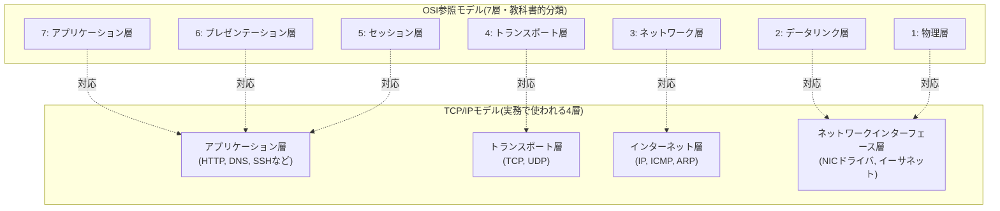
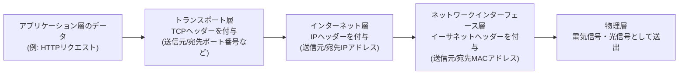
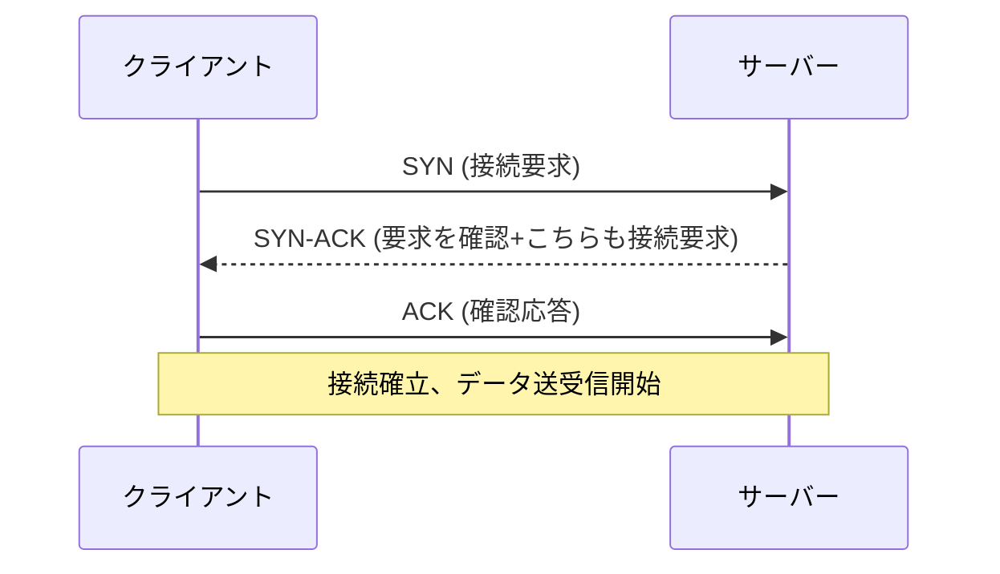

## はじめに

- **この記事で得られること**: 「ネットワークスタック」という言葉の中身——NICドライバ、IP、TCP/UDP、アプリケーションという各階層が何をしているのか、なぜ階層化されているのか、そしてOSがフリーズすると通信ができなくなるのはなぜかを、体系的に理解できます。
- **対象読者**: インフラエンジニアとして就業しており、「pingが通る/通らない」「ポートが開いている/閉じている」はなんとなく扱えるものの、その裏側の階層構造を説明できない方。[iDRACとは何か？その仕組みを『上位1%』の視点まで理解する](/articles/idrac-guide) で触れた「帯域外管理はOSのネットワークスタックを経由しない」という話を、より深く理解したい方を想定しています。
- **読むのにかかる想定時間**: 約20分

この記事は[『上位1%』シリーズ 全記事ガイド](/sitemap)の一部です。

前提記事では、「iDRACはOSのネットワークスタックを一切経由しない独立した通信経路を持つため、OSが完全に応答不能でも通信・操作が可能」と説明しました。この記事では、その「OSのネットワークスタック」自体が何層で構成され、何をしているのかを掘り下げます。

## 前提知識

- **パケット/フレーム**: ネットワーク上でやり取りされるデータのまとまりのことです。階層によって「フレーム」「パケット」「セグメント」など呼び方が変わりますが、本記事では総称して「パケット」と表記する箇所もあります。
- **階層（レイヤー）**: ネットワーク通信の仕組みを、役割ごとに積み重なった層として捉える考え方です。各層は自分の直下・直上の層としかやり取りしません。

## 全体像をつかむ

### 一言で言うと

ネットワークスタックとは、「**アプリケーションが送りたいデータを、電気信号として物理的に送り出せる形に段階的に変換し、受信側で逆の手順で元のデータに復元するための、階層化された変換・配送の仕組み**」です。

### OSI参照モデルとTCP/IPモデル

OSI参照モデルは7層に細かく分類する教科書的なモデル、TCP/IPモデルは実際のインターネット・LANの設計で使われる4層モデルです。実務では「NICドライバ→IP→TCP/UDP→アプリケーション」というTCP/IPモデルの4層で語られることがほとんどなので、本記事もこちらをベースに進めます。

## 基礎から徹底解説

### カプセル化：データが階層を降りていく様子

アプリケーションが「こんにちは」というデータを送りたいとき、そのデータはそのまま送られるのではなく、各層でそれぞれの層用の「ヘッダー」（宛先情報などの制御情報）を付け加えられながら、下の層へと渡されていきます。これを**カプセル化**と呼びます。

受信側では逆に、物理層から届いた信号を1層ずつ剥がしながら（**非カプセル化**）、最終的にアプリケーションが理解できる元のデータへと復元していきます。各層は「自分のヘッダーだけ」を読んで処理し、その中身（上位層のデータ）にはノータッチで次の層に渡す、という関心の分離がこの設計の肝です。

### ネットワークインターフェース層：NICドライバの役割

NIC（Network Interface Card）は、データを電気信号・光信号に変換して物理的に送受信するハードウェアです。**NICドライバ**は、OSとこのハードウェアの間を橋渡しするソフトウェアで、次のような役割を持ちます。

- OSから渡されたデータ（イーサネットフレーム）を、NICが理解できる形式に変換してハードウェアに渡す
- NICが受信したデータを、OSの上位層（IP層）に渡す
- 割り込み処理やDMA（Direct Memory Access）を使い、CPUの負荷を抑えながら効率的にデータを転送する

イーサネットフレームには送信元・宛先の**MACアドレス**（NICに割り当てられた48ビットの物理アドレス）が含まれており、同一LAN内での配送先を特定するために使われます。「宛先IPアドレスが分かっているのに、なぜ別途MACアドレスによる配送が必要なのか」「割り込み処理・DMAは具体的に何をしているのか」を突き詰めると、Linuxカーネルのネットワーク処理の最深部——ここを理解しているかどうかが、まさに「上位1%」の分かれ目になる領域です。ボリュームが大きく独立したテーマのため、別記事「[NICドライバとLinuxカーネルのネットワーク処理を『上位1%』の視点で理解する](/articles/nic-driver-internals-guide)」で徹底的に深掘りしています。なお「IPアドレスとMACアドレスがどう対応づくか」（ARP）は、この後すぐの節で扱います。

### インターネット層：IPアドレスとARP

**IP（Internet Protocol）**は、「宛先のIPアドレスにパケットを届ける」という配送の役割を担う層です。IPアドレスは論理的な住所であり、ネットワークをまたいだ配送（ルーティング）が可能です。

ここで疑問になるのが、「IPアドレス（論理アドレス）とMACアドレス（物理アドレス）はどう結びつくのか」という点です。これを解決するのが**ARP（Address Resolution Protocol）**です。同一LAN内で通信する際、送信元は「このIPアドレスを持っているのは誰？」とブロードキャストで問い合わせ（ARPリクエスト）、該当するホストが自分のMACアドレスを返信（ARPリプライ）することで、IPアドレスとMACアドレスの対応関係を解決します。この対応表はOS内に**ARPテーブル**としてキャッシュされます。

異なるネットワーク（サブネット）宛の通信は、直接ARPで解決せず、**デフォルトゲートウェイ（ルーター）**にまず送られ、そこから先はルーティングテーブルに基づいて次のホップへと転送されていきます。

### トランスポート層：TCPとUDPの違い

トランスポート層は、「**どのアプリケーション（プロセス）宛のデータか**」をポート番号で識別し、データの信頼性をどこまで保証するかという方式の違いを提供する層です。

| 特性 | TCP（Transmission Control Protocol） | UDP（User Datagram Protocol） |
|---|---|---|
| 接続 | コネクション型（事前に3ウェイハンドシェイクで接続を確立） | コネクションレス型（事前準備なしにいきなり送る） |
| 信頼性 | 到達確認（ACK）・再送制御あり。パケットの順序も保証 | 到達確認なし。届く保証も順序保証もない |
| 速度・オーバーヘッド | 信頼性保証の分、オーバーヘッドが大きい | オーバーヘッドが小さく高速 |
| 輻輳制御 | あり（ネットワークの混雑状況に応じて送信量を調整） | なし |
| 代表的な用途 | Webアクセス(HTTP)、SSH、メール、ファイル転送など、データの欠落が許されない用途 | 動画・音声のストリーミング、DNS問い合わせ、ゲームなど、多少の欠落より速度を優先する用途 |

**TCPの3ウェイハンドシェイク**

TCPは通信開始前にこの3回のやり取りで双方の準備ができていることを確認してから、実際のデータ送受信を始めます。この後もデータが正しく届いたかをACK（確認応答）で逐一確認し、届かなかったパケットは再送します。UDPにはこの仕組みが一切ないため、「速いが届く保証がない」という特性になります。

### アプリケーション層：ポートとソケット

アプリケーション層は、HTTP・DNS・SSHなど、具体的な用途に応じたプロトコルが動く層です。1台のコンピュータには複数のアプリケーションが同時にネットワーク通信を行いますが、これを区別するのが**ポート番号**（0〜65535）です。「IPアドレス + ポート番号」の組み合わせを**ソケット**と呼び、これがネットワーク通信の最小単位の宛先になります（例: `192.0.2.10:443`はそのサーバーのHTTPS用ソケット）。

### なぜOSがフリーズするとネットワークスタックごと機能しなくなるのか

ここまで見てきたNICドライバ・IP・TCP/UDP・アプリケーションという各層は、**すべてOSカーネルおよびOS上で動くソフトウェアが処理しています**。つまりこの「ネットワークスタック」自体が、OSというソフトウェアの一部として実装されているのです。OSがカーネルパニックやハングアップでフリーズすれば、この処理を行うソフトウェア自体が停止するため、通信処理も連鎖的に止まります。

これが、前提記事で説明した「iDRACはOSのネットワークスタックを一切経由しない独立した通信経路を持つ」という説明の核心です。iDRAC（BMC）は、ホストのOSが使っているNICドライバ・IPスタック・TCP/UDPスタックとは**別のハードウェア・別のソフトウェアスタック**（iDRAC専用の小さな組み込みシステムが、自分自身の独立したネットワークスタックを持っている）で通信しています。だからこそ、ホストのOSがどれだけ深刻にフリーズしていても、iDRACへの通信・操作だけは影響を受けずに成立するのです。

## プロが見ている視点（上位1%の理解）

### MTUとフラグメンテーション

イーサネットが1回に送れるデータサイズには上限（MTU: Maximum Transmission Unit、一般的には1500バイト）があります。送りたいデータがこれを超える場合、IP層でパケットを分割（フラグメンテーション）する必要があり、これは処理コストの増加や、環境によっては到達性の問題（一部の機器がフラグメントを正しく扱えない）を引き起こすことがあります。VPNやトンネリング技術（VXLANなど）を使う環境では、カプセル化によってヘッダーが増えた分、実効MTUがさらに小さくなる点に注意が必要です。

### 輻輳制御アルゴリズムの違い

TCPの輻輳制御には複数のアルゴリズムがあり(Reno、CUBIC、BBRなど)、Linuxのディストリビューションやカーネルバージョンによってデフォルトが異なります。高遅延・高帯域のネットワーク（大陸間通信など）では、アルゴリズムの選択がスループットに大きく影響するため、大規模システムの通信性能チューニングでは意識すべきポイントです。

### NICのオフロード機能とカーネルバイパス

現代のNICは、TCPのチェックサム計算やセグメンテーション処理（TSO: TCP Segmentation Offload）をCPUではなくNICハードウェア自身が肩代わりする「オフロード機能」を持ちます。さらに超高性能が要求される環境（金融取引システムなど）では、OSカーネルのネットワークスタックそのものを経由せず、ユーザー空間から直接NICを操作する**カーネルバイパス**（DPDKなど）という技術も使われます。これは「OSのネットワークスタックを経由する処理には、避けられないオーバーヘッドがある」という前提を踏まえた、極限までレイテンシを削る設計です。オフロード機能の内部動作・カーネルバイパスの仕組みとトレードオフは、[NICドライバとLinuxカーネルのネットワーク処理を『上位1%』の視点で理解する](/articles/nic-driver-internals-guide)でさらに深掘りしています。

## よくある誤解・つまずきポイント

- **誤解1: 「IPアドレスさえ合っていれば通信できる」**
  IPアドレスが正しくても、ARPで解決できない、ルーティングが正しく設定されていない、途中のファイアウォールで遮断されている、宛先ポートが閉じている、といった要因でどこかの層で通信が止まることがあります。「IPが合っている」ことは通信成立の必要条件の1つに過ぎません。
- **誤解2: 「TCPは信頼性が高いから、常にUDPより優れている」**
  信頼性の高さはオーバーヘッドとのトレードオフです。多少のデータ欠落より低遅延・高速性を優先する用途（リアルタイム動画・音声、DNS）ではUDPが適切な選択です。「優劣」ではなく「用途による使い分け」の問題です。
- **誤解3: 「pingが通れば、通信は正常だ」**
  `ping`はICMPというプロトコルを使った疎通確認であり、TCP/UDPの特定ポートでの通信可否までは保証しません。ICMPは通るがTCPの特定ポートは閉じている、というケースは実務で頻繁に発生します。

## 障害・トラブルシューティングの視点

ネットワーク障害の切り分けは、**下位層から上位層に向かって順番に確認する**のが定石です。

1. **物理層・ネットワークインターフェース層**: `ip a`でインターフェースが`UP`状態か、リンクが確立しているか（`ip link`のステータス）を確認します。ケーブル抜けやスイッチポートの不具合はこの層の問題です。
2. **インターネット層**: `ip route`でルーティングテーブルを確認し、`ping`で疎通確認をします。ARPで解決できていない場合は`ip neigh`で確認します。
3. **トランスポート層**: `ss -tunp`や`telnet <ホスト> <ポート>`（または`nc -zv <ホスト> <ポート>`）で該当ポートへの到達性を確認します。ファイアウォールでの遮断はこの層で症状が現れます。
4. **アプリケーション層**: ポートには到達できるがアプリケーションが期待通り応答しない場合、アプリケーション自体のログやエラーメッセージを確認します。

この「下から上へ」という切り分けの型を持っておくと、「pingは通るのにサイトが見れない」といった一見複雑な障害でも、どの層に問題があるかを機械的に絞り込めます。

### 予防策・恒久対策

- 監視ツールで各層それぞれの死活監視（インターフェースのリンク状態、ICMP疎通、TCPポートのヘルスチェック、アプリケーションレベルのヘルスチェック）を分けて実装する。
- ネットワーク変更（ルーティング・ファイアウォールルールの変更等）の際は、変更前後で各層の疎通確認を行う手順を運用に組み込む。
- MTU不整合が疑われる環境では、意図的に大きめのパケットを送ってフラグメンテーションの挙動を検証しておく。

## まとめ

- ネットワークスタックとは、アプリケーションのデータをNICドライバ・IP・TCP/UDP・アプリケーションという階層で段階的に変換・配送する仕組みであり、送信時はカプセル化、受信時は非カプセル化という処理が行われます。
- IPアドレス（論理アドレス）とMACアドレス（物理アドレス）の対応はARPで解決され、異なるネットワーク宛の通信はルーティングによって配送されます。
- TCPは信頼性重視、UDPは速度重視というトレードオフの上に成り立つ、異なる設計思想のプロトコルです。
- ネットワークスタックはOSソフトウェアの一部として実装されているため、OSがフリーズすると通信処理も連鎖的に停止します。iDRACのような帯域外管理は、これとは独立した別のスタックを持つことでこの制約を回避しています。

**今日から意識すべきこと**
1. ネットワーク障害に遭遇したら、「物理層→IP層→トランスポート層→アプリケーション層」の順に切り分ける型を意識してみましょう。
2. `ss -tunp`や`tcpdump`など、階層ごとの状態を可視化するコマンドに普段から慣れておきましょう。

なお、NICドライバが行っている割り込み処理・DMA・オフロード機能・カーネルバイパスについては、別記事「[NICドライバとLinuxカーネルのネットワーク処理を『上位1%』の視点で理解する](/articles/nic-driver-internals-guide)」でさらに深掘りしています。

## 参考文献

- [Internet Protocol | RFC 791](https://datatracker.ietf.org/doc/html/rfc791)
- [Transmission Control Protocol | RFC 9293](https://datatracker.ietf.org/doc/html/rfc9293)
- [User Datagram Protocol | RFC 768](https://datatracker.ietf.org/doc/html/rfc768)
- [Address Resolution Protocol (ARP) | RFC 826](https://datatracker.ietf.org/doc/html/rfc826)
- [tcpdump/libpcap public repository](https://www.tcpdump.org/)
- [iproute2 (ip, ss コマンド) | Linux man-pages](https://man7.org/linux/man-pages/man8/ip.8.html)
