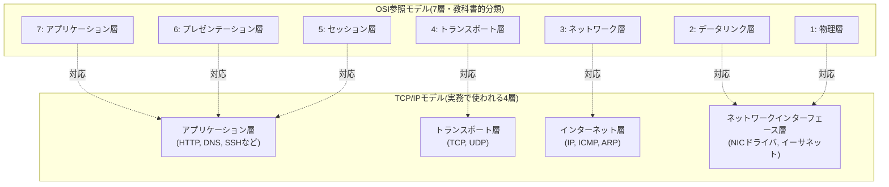
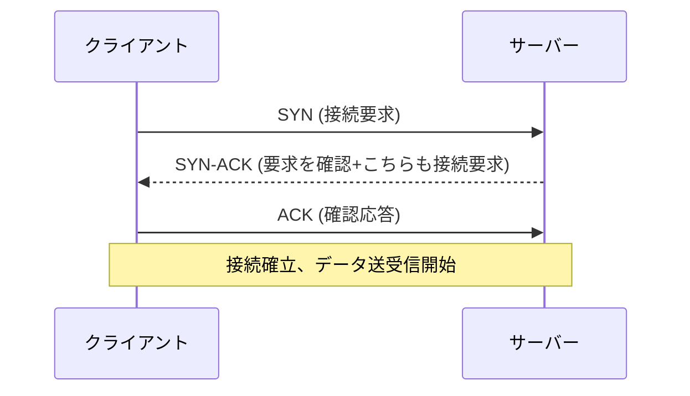
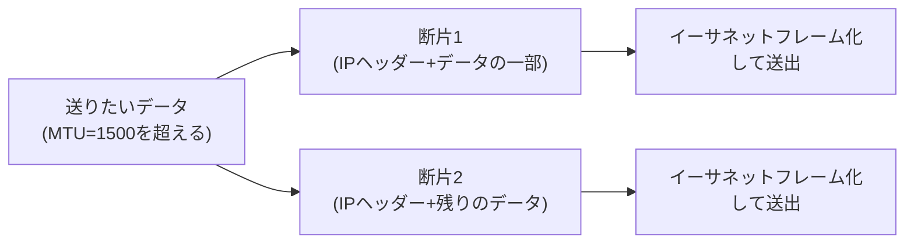

## はじめに

- **この記事で得られること**: 「ネットワークスタック」という言葉の中身——NICドライバ、IP、TCP/UDP、アプリケーションという各階層が何をしているのか、なぜ階層化されているのか、そしてOSがフリーズすると通信ができなくなるのはなぜかを、体系的に理解できます。
- **対象読者**: インフラエンジニアとして就業しており、「pingが通る/通らない」「ポートが開いている/閉じている」はなんとなく扱えるものの、その裏側の階層構造を説明できない方を想定しています。
- **読むのにかかる想定時間**: 約20分

この記事は[『上位1%』シリーズ 全記事ガイド](/sitemap)の一部です。

「OSがフリーズすると通信もできなくなる」というのは経験的に誰もが知っている現象ですが、これは通信処理そのものが「OSのネットワークスタック」というソフトウェアの階層構造として実装されているためです。この記事では、その「ネットワークスタック」自体が何層で構成され、各層が何をしているのかを掘り下げます。

## 前提知識

- **パケット/フレーム**: ネットワーク上でやり取りされるデータのまとまりのことです。階層によって「フレーム」「パケット」「セグメント」など呼び方が変わりますが、本記事では総称して「パケット」と表記する箇所もあります。
- **階層（レイヤー）**: ネットワーク通信の仕組みを、役割ごとに積み重なった層として捉える考え方です。各層は自分の直下・直上の層としかやり取りしません。

## 全体像をつかむ

### 一言で言うと

ネットワークスタックとは、「**アプリケーションが送りたいデータを、電気信号として物理的に送り出せる形に段階的に変換し、受信側で逆の手順で元のデータに復元するための、階層化された変換・配送の仕組み**」です。

### OSI参照モデルとTCP/IPモデル

OSI参照モデルは7層に細かく分類する教科書的なモデル、TCP/IPモデルは実際のインターネット・LANの設計で使われる4層モデルです。実務では「NICドライバ→IP→TCP/UDP→アプリケーション」というTCP/IPモデルの4層で語られることがほとんどなので、本記事もこちらをベースに進めます。

## 基礎から徹底解説

### カプセル化：データが階層を降りていく様子

アプリケーションが「こんにちは」というデータを送りたいとき、そのデータはそのまま送られるのではなく、各層でそれぞれの層用の「ヘッダー」（宛先情報などの制御情報）を付け加えられながら、下の層へと渡されていきます。これを**カプセル化**と呼びます。

受信側では逆に、物理層から届いた信号を1層ずつ剥がしながら（**非カプセル化**）、最終的にアプリケーションが理解できる元のデータへと復元していきます。各層は「自分のヘッダーだけ」を読んで処理し、その中身（上位層のデータ）にはノータッチで次の層に渡す、という関心の分離がこの設計の肝です。

### ネットワークインターフェース層：NICドライバの役割

NIC（Network Interface Card）は、データを電気信号・光信号に変換して物理的に送受信するハードウェアです。**NICドライバ**は、OSとこのハードウェアの間を橋渡しするソフトウェアで、次のような役割を持ちます。

- OSから渡されたデータ（イーサネットフレーム）を、NICが理解できる形式に変換してハードウェアに渡す
- NICが受信したデータを、OSの上位層（IP層）に渡す
- 割り込み処理やDMA（Direct Memory Access）を使い、CPUの負荷を抑えながら効率的にデータを転送する

イーサネットフレームには送信元・宛先の**MACアドレス**（NICに割り当てられた48ビットの物理アドレス）が含まれており、同一LAN内での配送先を特定するために使われます。「宛先IPアドレスが分かっているのに、なぜ別途MACアドレスによる配送が必要なのか」「割り込み処理・DMAは具体的に何をしているのか」を突き詰めると、Linuxカーネルのネットワーク処理の最深部——ここを理解しているかどうかが、まさに「上位1%」の分かれ目になる領域です。ボリュームが大きく独立したテーマのため、別記事「[NICドライバとLinuxカーネルのネットワーク処理を『上位1%』の視点で理解する](/articles/nic-driver-internals-guide)」で徹底的に深掘りしています。なお「IPアドレスとMACアドレスがどう対応づくか」（ARP）は、この後すぐの節で扱います。

### インターネット層：IPアドレスとARP

**IP（Internet Protocol）**は、「宛先のIPアドレスにパケットを届ける」という配送の役割を担う層です。IPアドレスは論理的な住所であり、ネットワークをまたいだ配送（ルーティング）が可能です。

ここで疑問になるのが、「IPアドレス（論理アドレス）とMACアドレス（物理アドレス）はどう結びつくのか」という点です。これを解決するのが**ARP（Address Resolution Protocol）**です。同一LAN内で通信する際、送信元は「このIPアドレスを持っているのは誰？」とブロードキャストで問い合わせ（ARPリクエスト）、該当するホストが自分のMACアドレスを返信（ARPリプライ）することで、IPアドレスとMACアドレスの対応関係を解決します。この対応表はOS内に**ARPテーブル**としてキャッシュされます。

異なるネットワーク（サブネット）宛の通信は、直接ARPで解決せず、**デフォルトゲートウェイ（ルーター）**にまず送られ、そこから先はルーティングテーブルに基づいて次のホップへと転送されていきます。

### トランスポート層：TCPとUDPの違い

トランスポート層は、「**どのアプリケーション（プロセス）宛のデータか**」を**ポート番号**（0〜65535の数字）で識別し、データの信頼性をどこまで保証するかという方式の違いを提供する層です。ポート番号は、この層が付け加えるTCP/UDPヘッダーの中に「送信元ポート番号」「宛先ポート番号」というフィールドとして実際に格納されています。IPヘッダーが「どのホスト宛か」を、TCP/UDPヘッダーが「そのホストの中の、どのアプリケーション宛か」を、それぞれ別のヘッダーで分担して指定している、と理解しておくと層ごとの役割分担が明確になります。

| 特性 | TCP（Transmission Control Protocol） | UDP（User Datagram Protocol） |
|---|---|---|
| 接続 | コネクション型（事前に3ウェイハンドシェイクで接続を確立） | コネクションレス型（事前準備なしにいきなり送る） |
| 信頼性 | 到達確認（ACK）・再送制御あり。パケットの順序も保証 | 到達確認なし。届く保証も順序保証もない |
| 速度・オーバーヘッド | 信頼性保証の分、オーバーヘッドが大きい | オーバーヘッドが小さく高速 |
| 輻輳制御 | あり（ネットワークの混雑状況に応じて送信量を調整） | なし |
| 代表的な用途 | Webアクセス(HTTP)、SSH、メール、ファイル転送など、データの欠落が許されない用途 | 動画・音声のストリーミング、DNS問い合わせ、ゲームなど、多少の欠落より速度を優先する用途 |

**TCPの3ウェイハンドシェイク**

TCPは通信開始前にこの3回のやり取りで双方の準備ができていることを確認してから、実際のデータ送受信を始めます。この後もデータが正しく届いたかをACK（確認応答）で逐一確認し、届かなかったパケットは再送します。UDPにはこの仕組みが一切ないため、「速いが届く保証がない」という特性になります。

### アプリケーション層：ソケットとプロトコルの住み分け

アプリケーション層は、HTTP・DNS・SSHなど、具体的な用途に応じたプロトコルが動く層です。ポート番号自体は前節で説明した通りトランスポート層（TCP/UDPヘッダー）が持つ情報ですが、「**IPアドレス + ポート番号**」の組み合わせは**ソケット**と呼ばれ、これがネットワーク通信の最小単位の宛先になります（例: `192.0.2.10:443`はそのサーバーのHTTPS用ソケット）。アプリケーション層のプロトコル（HTTP・DNS・SSHなど）は、この「どのソケット宛か」というトランスポート層までの配送が完了した後、実際に届いたデータの中身（リクエストの形式、応答の形式など）をどう解釈するかを定義する層だと理解すると、トランスポート層との役割分担が明確になります。

### なぜOSがフリーズするとネットワークスタックごと機能しなくなるのか

ここまで見てきたNICドライバ・IP・TCP/UDP・アプリケーションという各層は、**すべてOSカーネルおよびOS上で動くソフトウェアが処理しています**。つまりこの「ネットワークスタック」自体が、OSというソフトウェアの一部として実装されているのです。OSがカーネルパニックやハングアップでフリーズすれば、この処理を行うソフトウェア自体が停止するため、通信処理も連鎖的に止まります。

「カーネルパニック」「ハングアップ」とは具体的に何が起きている状態なのか

どちらも「OSが応答しなくなる」という結果は同じですが、内部で起きていることは異なります。

**カーネルパニック（Kernel Panic）**

OSの中核部分であるカーネルが、「これ以上安全に処理を続けられない」と自ら判断し、意図的に全処理を停止する状態です。Windowsでは「ブルースクリーン（BSOD）」、Linuxでは「Kernel Panic」と呼ばれる画面が表示されるのが典型的な挙動です。代表的な原因は次の通りです。

- **バグのあるデバイスドライバ**が、カーネル空間の不正なメモリ領域を読み書きしてしまう（NICドライバやストレージドライバは特にカーネル空間で動くため、バグの影響がOS全体に及びやすい領域です）
- **ハードウェア障害**（メモリのECC訂正不能エラー、CPUの内部エラーなど）をカーネルが検知し、データ破損が広がる前に緊急停止する
- **カーネル自身の内部データ構造の矛盾**（本来ありえないはずの状態）を検知し、それ以上の処理継続が危険と判断する

カーネルパニックは、いわば「壊れたまま動き続けて被害を広げるくらいなら、その場で止まる」という、OSの自己防衛的な停止です。

**ハングアップ（Hang up / フリーズ）**

カーネルパニックのように「明示的に停止を宣言する」のではなく、処理が実質的に先へ進めなくなり、外部からの応答が返ってこなくなる状態です。カーネルパニックと違って、キーボード入力の受付やディスプレイ表示自体は生きていることもあります。代表的な原因は次の通りです。

- **デッドロック**: 複数のカーネルスレッドが、互いに相手が確保しているロック（排他制御の鍵）の解放を待ち続け、永遠に処理が進まなくなる状態
- **無限ループ**: バグにより、本来終了するはずの処理ループが終了条件を満たせず回り続ける（特に重要なロックを保持したまま無限ループに陥ると、他の処理も連鎖的に止まります）
- **リソース枯渇**: メモリ不足（OOM）でシステム全体の処理が極端に遅くなる、大量のI/O待ちでディスク・ネットワークの処理待ち行列が詰まりきる、など

いずれのケースでも、ネットワークスタックの処理を行うカーネルのコードパス自体が実行され続けられない（パニックなら停止、ハングなら実質的に進まない）ため、結果として通信処理も止まる、という点は共通しています。

これは、DellのiDRACのような帯域外管理（BMC）が「OSがどれだけフリーズしていても通信・操作できる」理由の核心でもあります。iDRAC（BMC）は、ホストのOSが使っているNICドライバ・IPスタック・TCP/UDPスタックとは**別のハードウェア・別のソフトウェアスタック**（iDRAC専用の小さな組み込みシステムが、自分自身の独立したネットワークスタックを持っている）で通信しています。だからこそ、ホストのOSがどれだけ深刻にフリーズしていても、iDRACへの通信・操作だけは影響を受けずに成立するのです。

## プロが見ている視点（上位1%の理解）

### MTUとフラグメンテーション

**MTU（Maximum Transmission Unit）**とは、「イーサネットフレームに載せる前の、IPパケット（IPヘッダー＋その中身）の大きさの上限」のことです（一般的には1500バイト）。つまり「MACアドレスによるカプセル化（イーサネットヘッダーの付与）をする前の、データのサイズ上限」という理解で正確です。送りたいIPパケットがこのMTUを超える場合、IP層でパケットを複数に分割する必要があり、これを**フラグメンテーション（断片化）**と呼びます。

フラグメンテーションには次のようなコスト・リスクがあります。

- **処理コストの増加**: 送信側は分割、受信側は再組み立て（リアセンブリ）という追加処理が必要になります。
- **到達性の問題**: 断片の一部だけが経路上で失われると、受信側は残りの断片を待ち続けた末に再組み立てに失敗します（TCPであれば再送されますが、UDPでは失われたデータがそのまま失われます）。ファイアウォールの中には、断片化されたパケットの中身を検査しづらいという理由で、断片パケットそのものを遮断する設定になっているものもあります。

VPNやトンネリング技術（IPsec、VXLAN、GREなど）を使う環境では、元のパケットの外側にさらにトンネル用のヘッダーが被さるため、その分だけ「実際に運べる中身のデータサイズ（実効MTU）」が小さくなります。たとえば元のMTUが1500バイトの経路にVXLAN（50バイト程度のオーバーヘッド）でカプセル化すると、実効的に使えるのは1450バイト程度まで縮みます。この事情を知らずに送信元がMTU1500のままデータを送り出すと、トンネルの入り口でさらなる分割が必要になったり、後述するPMTUDの仕組みが機能しない環境ではパケットが黙って失われたりします。

実例で理解する: 「別VLANの複合機からファイルサーバーにスキャンできない」がMTU変更で直った理由

「別VLANにある複合機から、ファイルサーバーへのスキャン（スキャンtoファイル）だけがうまくいかず、複合機側のMTUを1500から下げることで解決した」という事象は、MTU関連のトラブルとして典型的なパターンの1つです。ここでは、最も可能性の高い原因である**「PMTUDブラックホール」**という現象を軸に、仕組みを詳しく見ていきます。

**Path MTU Discovery（PMTUD）とは何か**

送信元は、通信経路上のどこか1か所でも自分が想定するMTUより小さい区間があると、そこでパケットが詰まってしまいます。これを避けるため、IPには**Path MTU Discovery（経路上のMTUの最小値を事前に調べる仕組み）**があります。仕組みは次の通りです。

1. 送信元は、IPヘッダーに**DF（Don't Fragment）フラグ**を立てた状態でパケットを送ります（「このパケットは途中で分割しないでほしい」という意思表示です）。
2. 経路上のルーターが、自分の先の区間のMTUがそのパケットサイズより小さいと判断すると、DFフラグが立っているため分割はせず、代わりに**ICMP「Fragmentation Needed（断片化が必要）」というエラーメッセージ**を送信元に送り返します。このメッセージには「実際に通せる最大サイズ」の情報が含まれています。
3. 送信元はこのICMPメッセージを受け取ると、それ以降そのサイズ以下でパケットを送るようになります。

**「PMTUDブラックホール」が起きる理由**

問題は、このICMPメッセージが経路上のどこかで（セキュリティ上の理由でICMPを一律遮断しているファイアウォール、一部のVPN機器・古いルーターなど）遮断されてしまうケースです。この場合、送信元には「サイズが大きすぎる」というフィードバックが一切届かないまま、DFフラグ付きの大きなパケットは経路の途中で無言で破棄され続けます。これが**PMTUDブラックホール**と呼ばれる状態です。

複合機からファイルサーバーへのスキャンで症状が出やすいのは、次のような事情が重なるためです。

- 通常のping（ICMP Echo）や、ログイン画面の表示程度の小さなやり取りは問題なく通る（小さいパケットは分割の必要がなく、そもそもMTUの制約に引っかからないため）。
- 一方でスキャンデータの転送は、画像データという大きなペイロードをTCPで送る通信になるため、MTUいっぱいの大きなパケットが使われやすい。
- 別VLANをまたぐ経路の途中に、VLANタグ付与・トンネリング・VPN機器などでわずかに実効MTUが縮んでいる区間があると、そこでPMTUDによる通知が必要になるが、ICMPが途中で遮断されていると通知が届かず、大きなパケットだけが黙って失われる。

症状として「ログインはできる（小さい通信は成立する）のに、大きなデータの転送だけがタイムアウトする、あるいは途中で止まる」という形で現れるのが典型的です。

**なぜMTUを1500から下げると解決するのか**

複合機側のMTU設定を、たとえば1400バイトのように意図的に小さくすると、複合機はそもそも「1500バイトぎりぎりの大きなパケット」を作らなくなります。経路上の実効MTUが多少縮んでいたとしても、最初から余裕を持った小さいサイズでパケットを送り出すため、PMTUDによる通知（＝ICMPの往復）に頼る必要がなくなり、ICMP遮断によるブラックホールの影響を受けずに済む、というのが解決の理屈です。恒久対策としては、本来は経路上のICMPを適切に通す（PMTUDを機能させる）ことが望ましいのですが、経路上の機器を自由に触れない場合、末端側のMTUを下げて「そもそも大きなパケットを作らない」ようにする対処は、実務でも広く使われる現実的な回避策です。

なお、これはあくまで最も可能性の高い典型的な原因の1つであり、実際にはVLANタグ自体によるオーバーヘッド、ジャンボフレーム設定の不一致、経路上の特定機器のバグなど、他の原因のこともあります。切り分けの基本は、`ping -M do -s <サイズ>`（Linux、DFフラグを立てて任意サイズのICMPを送る）のようなコマンドで、どのサイズから疎通が失われるかを両端・可能であれば経路の途中からも確認し、実際の実効MTUを実測することです。

### 輻輳制御アルゴリズムの違い

TCPは、ネットワークの混雑（輻輳）状況に応じて送信量を調整する**輻輳制御**という仕組みを持ちます。素朴に考えると「相手が受け取れる速度で送ればよい」だけに思えますが、実際には送信元と受信先の間にある**経路上のネットワーク機器（スイッチ・ルーター）のキューが溢れていないか**まで考慮する必要があり、これを担っているのが輻輳制御アルゴリズムです。

- **CUBIC**（Linuxの長年のデフォルト）: パケットロス（＝輻輳の兆候とみなす）が発生するまで送信量を徐々に増やし、ロスを検知すると送信量を大きく落としてから、再び３次関数（cubic）的なカーブで増やしていく方式です。「ロスが起きて初めて混雑を知る」という受動的なアプローチのため、ロスがほぼ起きない高品質な回線では効率よく帯域を使い切れますが、ロスと輻輳が必ずしも一致しない環境（後述）では本来の実力を発揮しにくい弱点があります。
- **BBR（Bottleneck Bandwidth and RTT）**: Googleが開発したアルゴリズムで、パケットロスを待つのではなく、実測した**帯域（Bandwidth）と往復遅延（RTT）のモデル**から「今、経路上で滞留なく送れる最大速度」を直接推定して送信量を決めます。無線区間などパケットロスが輻輳と無関係に発生しやすい環境（Wi-Fi、モバイル回線）や、高遅延・高帯域の経路（大陸間通信、衛星回線）でCUBICより高いスループットを出しやすいとされています。

**「ロスが起きるまで増やし続ける」方式の限界**が特に顕在化するのが、高遅延・高帯域の経路です。RTTが長いと「送信量を増やしてから、その結果（ロスの有無）が返ってくるまで」のフィードバックにも時間がかかるため、CUBICのような手探り型のアルゴリズムは本来使えるはずの帯域まで到達するのに時間がかかります。BBRのようなモデルベースのアルゴリズムは、実測データから直接目標送信量を計算するため、この立ち上がりの遅さに強いという特性があります。

実務では、現在有効なアルゴリズムを`sysctl net.ipv4.tcp_congestion_control`で確認でき、`sysctl -w net.ipv4.tcp_congestion_control=bbr`のように変更できます（カーネルにそのアルゴリズムのモジュールが組み込まれている必要があります）。大陸間のバックボーン回線を使う大規模配信基盤や、CDN事業者などが積極的にBBRを採用しているのは、まさにこの「高遅延・高帯域環境でのスループット改善」が実務上のメリットとして直結するためです。

### NICのオフロード機能とカーネルバイパス

現代のNICは、TCPのチェックサム計算やセグメンテーション処理（TSO: TCP Segmentation Offload）をCPUではなくNICハードウェア自身が肩代わりする「オフロード機能」を持ちます。さらに超高性能が要求される環境（金融取引システムなど）では、OSカーネルのネットワークスタックそのものを経由せず、ユーザー空間から直接NICを操作する**カーネルバイパス**（DPDKなど）という技術も使われます。これは「OSのネットワークスタックを経由する処理には、避けられないオーバーヘッドがある」という前提を踏まえた、極限までレイテンシを削る設計です。オフロード機能の内部動作・カーネルバイパスの仕組みとトレードオフは、[NICドライバとLinuxカーネルのネットワーク処理を『上位1%』の視点で理解する](/articles/nic-driver-internals-guide)でさらに深掘りしています。

## よくある誤解・つまずきポイント

- **誤解1: 「IPアドレスさえ合っていれば通信できる」**
  IPアドレスが正しくても、ARPで解決できない、ルーティングが正しく設定されていない、途中のファイアウォールで遮断されている、宛先ポートが閉じている、といった要因でどこかの層で通信が止まることがあります。「IPが合っている」ことは通信成立の必要条件の1つに過ぎません。
- **誤解2: 「TCPは信頼性が高いから、常にUDPより優れている」**
  信頼性の高さはオーバーヘッドとのトレードオフです。多少のデータ欠落より低遅延・高速性を優先する用途（リアルタイム動画・音声、DNS）ではUDPが適切な選択です。「優劣」ではなく「用途による使い分け」の問題です。
- **誤解3: 「pingが通れば、通信は正常だ」**
  `ping`はICMPというプロトコルを使った疎通確認であり、TCP/UDPの特定ポートでの通信可否までは保証しません。ICMPは通るがTCPの特定ポートは閉じている、というケースは実務で頻繁に発生します。

## 障害・トラブルシューティングの視点

ネットワーク障害の切り分けは、**下位層から上位層に向かって順番に確認する**のが定石です。

1. **物理層・ネットワークインターフェース層**: `ip a`でインターフェースが`UP`状態か、リンクが確立しているか（`ip link`のステータス）を確認します。ケーブル抜けやスイッチポートの不具合はこの層の問題です。
2. **インターネット層**: `ip route`でルーティングテーブルを確認し、`ping`で疎通確認をします。ARPで解決できていない場合は`ip neigh`で確認します。
3. **トランスポート層**: `ss -tunp`や`telnet <ホスト> <ポート>`（または`nc -zv <ホスト> <ポート>`）で該当ポートへの到達性を確認します。ファイアウォールでの遮断はこの層で症状が現れます。
4. **アプリケーション層**: ポートには到達できるがアプリケーションが期待通り応答しない場合、アプリケーション自体のログやエラーメッセージを確認します。

この「下から上へ」という切り分けの型を持っておくと、「pingは通るのにサイトが見れない」といった一見複雑な障害でも、どの層に問題があるかを機械的に絞り込めます。

### 予防策・恒久対策

- 監視ツールで各層それぞれの死活監視（インターフェースのリンク状態、ICMP疎通、TCPポートのヘルスチェック、アプリケーションレベルのヘルスチェック）を分けて実装する。
- ネットワーク変更（ルーティング・ファイアウォールルールの変更等）の際は、変更前後で各層の疎通確認を行う手順を運用に組み込む。
- MTU不整合が疑われる環境では、意図的に大きめのパケットを送ってフラグメンテーションの挙動を検証しておく。

## まとめ

- ネットワークスタックとは、アプリケーションのデータをNICドライバ・IP・TCP/UDP・アプリケーションという階層で段階的に変換・配送する仕組みであり、送信時はカプセル化、受信時は非カプセル化という処理が行われます。
- IPアドレス（論理アドレス）とMACアドレス（物理アドレス）の対応はARPで解決され、異なるネットワーク宛の通信はルーティングによって配送されます。
- TCPは信頼性重視、UDPは速度重視というトレードオフの上に成り立つ、異なる設計思想のプロトコルです。
- ネットワークスタックはOSソフトウェアの一部として実装されているため、OSがフリーズすると通信処理も連鎖的に停止します。iDRACのような帯域外管理は、これとは独立した別のスタックを持つことでこの制約を回避しています。

**今日から意識すべきこと**
1. ネットワーク障害に遭遇したら、「物理層→IP層→トランスポート層→アプリケーション層」の順に切り分ける型を意識してみましょう。
2. `ss -tunp`や`tcpdump`など、階層ごとの状態を可視化するコマンドに普段から慣れておきましょう。

なお、NICドライバが行っている割り込み処理・DMA・オフロード機能・カーネルバイパスについては、別記事「[NICドライバとLinuxカーネルのネットワーク処理を『上位1%』の視点で理解する](/articles/nic-driver-internals-guide)」でさらに深掘りしています。

## 参考文献

- [Internet Protocol | RFC 791](https://datatracker.ietf.org/doc/html/rfc791)
- [Transmission Control Protocol | RFC 9293](https://datatracker.ietf.org/doc/html/rfc9293)
- [User Datagram Protocol | RFC 768](https://datatracker.ietf.org/doc/html/rfc768)
- [Address Resolution Protocol (ARP) | RFC 826](https://datatracker.ietf.org/doc/html/rfc826)
- [tcpdump/libpcap public repository](https://www.tcpdump.org/)
- [iproute2 (ip, ss コマンド) | Linux man-pages](https://man7.org/linux/man-pages/man8/ip.8.html)
