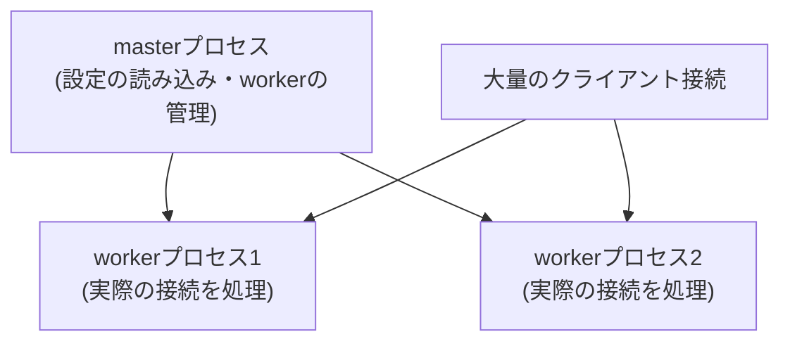

## はじめに

- **この記事で得られること**: [AWSでEC2インスタンスを起動し、Webサーバーを公開するハンズオン](/articles/aws-ec2-webserver-handson-guide)などで、`sudo apt install nginx`として何度も登場してきたNginxについて、それが実際には何をしているソフトウェアなのかを体系的に理解します。Apacheとの設計思想の違いであるイベント駆動アーキテクチャ、master/workerプロセスの役割分担、そして「Webサーバー」と「リバースプロキシ」という2つの顔を持つ設定ファイルの構造までを扱います。
- **対象読者**: `nginx`をインストールしてWebページを表示させたことはあるが、その裏側の仕組みや、なぜ多くの現場で標準的に選ばれているのかを説明できない方を想定しています。
- **読むのにかかる想定時間**: 約18分

この記事は[『上位1%』シリーズ 全記事ガイド](/sitemap)の一部、[Linux/OS基礎シリーズ](/sitemap#シリーズ一覧)の16本目です。

## 全体像をつかむ



## 基礎から徹底解説

### なぜNginxは、少ないリソースで大量の接続をさばけるのか

従来から広く使われてきたWebサーバーソフトウェアであるApacheは、既定の設定では、**接続してきたクライアント1つにつき、1つのプロセス(またはスレッド)を割り当てる**、という設計になっています。この方式は理解しやすい一方で、接続数が数千・数万という規模になると、プロセス(スレッド)の生成・切り替えにかかるオーバーヘッドが無視できなくなります。

これに対しNginxは、**イベント駆動**(non-blocking I/O)という、まったく異なるアーキテクチャを採用しています。少数の**workerプロセス**それぞれが、多数のクライアント接続を、1つのプロセスの中で効率的に切り替えながら処理します。「接続を待っている間」に別の接続の処理へ切り替えるという、効率的な立ち回りによって、Apacheの方式よりも少ないメモリ・CPUリソースで、はるかに多くの同時接続をさばけます。これが、Nginxが大規模なトラフィックを扱う現場で標準的に選ばれている、最大の理由です。

### master/workerプロセスという構成

Nginxを起動すると、実際には**masterプロセス**と、複数の**workerプロセス**が動作します。

- **masterプロセス**: 設定ファイルの読み込み、workerプロセスの起動・監視・再起動を担当します。実際のクライアント接続は処理しません。
- **workerプロセス**: 実際のクライアント接続を受け付け、リクエストを処理する、実務担当者です。

**設定ファイルを変更した後に必要な`nginx -s reload`は、masterプロセスに対して「設定を再読み込みし、新しい設定を持ったworkerプロセスに入れ替えてください」と指示するコマンドです。** 古いworkerプロセスは、処理中のリクエストを最後まで終えてから、静かに終了します。この仕組みにより、設定変更のたびにサービス全体を停止させることなく、無停止で設定を反映できます。

### 設定ファイルの構造:Webサーバーとリバースプロキシという二面性

Nginxの設定は、`http`ブロックの中に、`server`ブロック(1つの仮想ホストに相当)を複数記述する構造になっています。

```nginx
server {
    listen 80;
    server_name example.com;

    location / {
        root /var/www/html;
    }

    location /api/ {
        proxy_pass http://127.0.0.1:3000;
    }
}
```

**`location /`のように静的ファイルを直接返す設定と、`location /api/`のように別のサーバーへリクエストを転送する`proxy_pass`の設定が、同じ`server`ブロックの中に共存できる**ことに注目してください。これは、Nginxが「静的ファイルを配信するWebサーバー」と「リクエストを別のバックエンドへ転送するリバースプロキシ」という、2つの役割を1つのソフトウェアで同時にこなせることを意味しています。実務では、静的ファイル(HTML・CSS・画像)はNginxが直接高速に返し、動的な処理が必要なリクエストだけを、背後のアプリケーションサーバー(NodeやPythonのアプリケーションなど)へ`proxy_pass`で転送する、という構成が広く使われています。

## プロが見ている視点(上位1%の理解)

### sites-available/sites-enabledという、Debian系ディストリビューションの慣習

Ubuntu/Debian系にNginxをインストールすると、`/etc/nginx/sites-available/`(設定ファイルの置き場)と`/etc/nginx/sites-enabled/`(実際に有効化する設定への、シンボリックリンクの置き場)という、2つのディレクトリが用意されます。**これはNginx自体の機能ではなく、Debian系のパッケージが独自に採用している運用上の慣習です。** 複数のサイト設定を`sites-available`にすべて保管しつつ、`sites-enabled`に対象のシンボリックリンクを貼るかどうかだけで、そのサイトを有効化・無効化できます。設定ファイルそのものを削除せずに、一時的に無効化したい場合に便利な仕組みです。

## よくある誤解・つまずきポイント

- **誤解1: 「Nginxは、Apacheよりも単純に高性能なソフトウェアである」**
  性能の差はアーキテクチャの違い(イベント駆動 vs プロセス/スレッドモデル)によるものであり、単純な優劣ではなく、得意とするワークロードの違いです。
- **誤解2: 「Nginxは、静的ファイルを配信するWebサーバーとしてしか使えない」**
  `proxy_pass`を使えば、リバースプロキシとして、別のバックエンドへリクエストを転送する役割も同時に果たせます。
- **誤解3: 「設定ファイルを変更したら、必ずNginx自体を再起動(restart)する必要がある」**
  多くの場合、`nginx -s reload`による無停止の設定再読み込みで十分です。restartが必要になるのは、Nginx自体のバージョンアップなど、限られた場面です。

## 障害・トラブルシューティングの視点

1. **設定変更後、`nginx -s reload`がエラーになる**: 先に`nginx -t`を実行し、設定ファイルの構文エラーがないかを確認してください。
2. **`proxy_pass`で転送したはずのリクエストが失敗する**: 転送先のバックエンドサーバーが実際に起動しているか、ポート番号が一致しているかを確認してください。
3. **想定より多くのworkerプロセスが動いている(あるいは少ない)**: `worker_processes`の設定値を確認してください。`auto`を指定すると、CPUコア数に応じて自動的に決定されます。

## まとめ

- Nginxは、イベント駆動アーキテクチャにより、少ないリソースで大量の同時接続をさばけます。
- masterプロセスが設定管理とworkerプロセスの監視を、workerプロセスが実際のリクエスト処理を担当します。
- `nginx -s reload`により、サービスを止めずに設定変更を反映できます。
- Nginxは、静的ファイルを配信するWebサーバーと、`proxy_pass`によるリバースプロキシという、2つの役割を1つの設定の中で同時にこなせます。

**今日から意識すべきこと**
1. 設定ファイルを変更したら、`nginx -s reload`の前に必ず`nginx -t`で構文チェックする習慣をつけましょう。
2. `location`ブロックを見たら、それが静的ファイル配信なのか、`proxy_pass`によるリバースプロキシなのかを意識して読みましょう。

## 参考文献

- [Nginx: Beginner's Guide](https://nginx.org/en/docs/beginners_guide.html)
- [Nginx: Understanding nginx HTTP proxying, load balancing, buffering](https://docs.nginx.com/nginx/admin-guide/web-server/reverse-proxy/)
