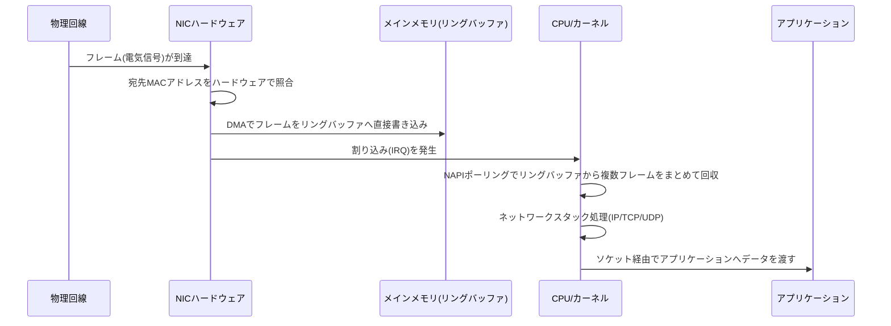

## はじめに

- **この記事で得られること**: 「NICドライバはOSとハードウェアの橋渡し役」という理解の、その中身——パケットが届いたときにCPUが実際に何をしているのか（割り込み処理）、CPUを介さずデータを転送する仕組み（DMA）、NIC自身が代行してくれる処理（オフロード機能）、そしてOSのネットワークスタックそのものを経由しない超高速化技術（カーネルバイパス）まで、Linuxネットワーキングの最深部を体系的に理解できます。
- **対象読者**: 「NICドライバ」「割り込み」「DMA」といった言葉には触れたことがあるものの、「結局CPUは何をしていて、何をしていないのか」を説明できない方。ネットワークの階層構造（IP・TCP/UDP・アプリケーション）そのものではなく、**それを一番下から支えるLinuxカーネル・NICハードウェア側の実装**にフォーカスしています。
- **読むのにかかる想定時間**: 約25分

この記事は[『上位1%』シリーズ 全記事ガイド](/sitemap)の一部です。

## 前提知識

- **IRQ（Interrupt Request / 割り込み）**: ハードウェアが「処理してほしいことがある」とCPUに通知する仕組みです。CPUは今実行中の処理を一時中断し、その通知に対応する処理（割り込みハンドラ）を実行します。
- **DMA（Direct Memory Access）**: CPUを介さず、周辺機器（NIC等）がメインメモリへ直接データを読み書きできる仕組みです。
- **カーネル空間 / ユーザー空間**: Linuxは、OS自身の中核処理（デバイス制御など）が動く特権的な領域（カーネル空間）と、一般のアプリケーションが動く領域（ユーザー空間）を分離しています。
- **IRQアフィニティ（割り込み親和性）**: ある割り込み（IRQ）を「どのCPUコアに処理させるか」という対応関係、およびそれを指定する設定のことです。デフォルトではOSやドライバが自動的に割り振りますが、特定のコアに固定する（ピン留めする）よう手動で指定することもできます。
- **NUMA（Non-Uniform Memory Access）**: 複数のCPUソケットを搭載するサーバーでは、それぞれのCPUソケットに「自分専用のメモリ」が物理的に近い場所に接続されています。自分のソケットに直結したメモリへのアクセスは高速ですが、隣のソケットにぶら下がっているメモリへアクセスする場合は、ソケット間の配線を経由する分だけ余分なレイテンシがかかります。この「メモリへの距離がソケットによって均一ではない」構成をNUMAと呼び、1つのCPUソケットとそれに直結したメモリの組を**NUMAノード**と呼びます。

## 全体像をつかむ

### 一言で言うと

NICドライバが担っているのは、「**パケットが届くたびにCPUを呼び出して処理させるのではなく、ハードウェア（NIC）とメモリ（DMA）にできる限りの作業を任せ、CPUには本当に必要な最小限のタイミングでだけ介入させる**」という、CPU負荷を極限まで抑えるための設計です。

### パケット受信の全体像

## 基礎から徹底解説

NICドライバの内部動作を理解するには、まず「NICが、届いたフレームをどうやって取捨選択しているのか」から見ていく必要があります。その鍵を握るのがMACアドレスです。

### なぜイーサネットフレーム（MACアドレス）が必要なのか、IPだけでは足りないのか

「宛先IPアドレスさえ分かっていれば、それだけで配送先を一意に絞り込めるはずなのに、なぜMACアドレス・イーサネットフレームという別の仕組みがさらに必要なのか」という疑問は、L2（データリンク層）とL3（インターネット層）の役割分担の核心を突いています。結論から言うと、両者は**担っている責任の範囲が根本的に違います**。

- **IPアドレスは「論理的な、端から端までの住所」**です。送信元ホストから最終的な宛先ホストまで、途中いくつルーターを経由しようと、パケットのIPヘッダーに書かれた宛先IPアドレス自体は変化しません。
- **MACアドレスは「物理的に、今まさに載っているこの1本の配線（LANセグメント）の中でだけ通用する住所」**です。パケットがルーターを1つ超えるたびに、イーサネットフレームのMACアドレス（送信元・宛先とも）は**その都度書き換えられます**。

これには実務上、決定的に重要な理由が2つあります。

**1. 同じ配線を複数のホストが共有しているから、物理的な宛先指定が別途必要**

LANというのは、スイッチやハブを介して複数のホストが同じ物理的な配線（電気的な信号が流れる媒体）を共有している状態です。IPアドレスは「論理的にどのホスト宛か」を示す情報であり、それ自体は電気信号を物理的にどのポート・どのケーブルへ送り出すかを直接指示するものではありません。「今この瞬間、この配線を流れている信号は、このLANセグメント内のどの物理的なNIC宛のものか」を末端のハードウェアレベルで判定するために、MACアドレスという物理層に紐づくアドレスが必要になります。スイッチは、自分に接続された各ポートの先にどのMACアドレスの機器がいるかを記憶した「MACアドレステーブル」を持っており、フレームの宛先MACアドレスだけを見て、該当するポートだけに転送します（IPアドレスも中身のペイロードも一切見ません）。

**2. スイッチ・NICがIP以外のプロトコルにも対応できる汎用性のため**

もしL2の仕組みがなく、配送がすべてIPアドレスの解釈に依存していたら、スイッチのような中継機器は「IPが分かる装置」でなければ動作できなくなります。実際にはLAN上にはARP（後述）のようにIPアドレスを一切使わないプロトコルも流れています。スイッチは中身のプロトコルが何であるかに関知せず、あくまで「宛先MACアドレス」というL2の情報だけで転送を判断できるからこそ、IPv4・IPv6・ARPなど、どんなL3プロトコルが上に乗っていても同じように扱える汎用的な中継装置でいられます。

**3. NICハードウェア自身が、割り込みを発生させる前にMACアドレスで足切りをしている**

後述する割り込み処理の観点からも、MACアドレスには重要な役割があります。NICハードウェアは、受信した全フレームについて律儀にCPUへ割り込みを送っているわけではありません。**自分宛（または broadcast/multicast）のMACアドレスを持つフレームかどうかを、NICチップ自身がハードウェアレベルで照合**し、関係のないフレーム（同じ配線上を流れている、他ホスト宛のフレーム）は、CPUに一切通知せず静かに破棄します。もしMACアドレスによるこの一次フィルタリングがなければ、スイッチではなく全ホストが常に受信し合う共有回線（ハブ環境）などでは、無関係なフレームのたびにいちいちCPUの手を止めて「これは自分宛か？」をソフトウェアで判定する羽目になり、CPU負荷が跳ね上がります。MACアドレスというハードウェアレベルで完結する軽量なフィルタ機構があるからこそ、CPUは「本当に自分宛の通信」にだけ集中できるのです。

なお、「そのIPアドレスは、実際にはどのMACアドレスに対応するのか」を解決する仕組み（ARP: Address Resolution Protocol）は、これとは別の話です。ARPは「同じLAN内で、あるIPアドレスを持っているホストのMACアドレスを問い合わせる」ためのプロトコルで、この記事では「なぜMACアドレスという仕組みそのものが必要なのか」というNICドライバ・ハードウェアの動作に焦点を当てているため、ARP自体の詳しい手順はスコープ外とします。

### 割り込み処理（IRQ）の詳細

NICがフレームを受信すると、CPUに対して**割り込み（IRQ）**を発生させます。ただし現代のLinuxカーネルは、この割り込みを次の2段階に分けて処理しています。

| 段階 | 呼び名 | やっていること |
|---|---|---|
| Top half | ハードウェア割り込みハンドラ | 割り込みが来たことをNICに確認応答し、必要最小限の処理だけを即座に行う（できるだけ短時間で終える） |
| Bottom half | NAPI（New API）によるポーリング処理 | 実際にパケットを読み出し、ネットワークスタックへ渡す本格的な処理を、ソフト割り込み（softirq）のコンテキストで行う |

なぜこの2段階に分けるかというと、割り込みハンドラの処理時間が長いと、その間ほかの割り込み（他のデバイスからの通知や、場合によっては同じNICからの次の通知）を受け付けられなくなり、システム全体の応答性が落ちるためです。そこでLinuxは、Top halfでは「とにかく確認応答だけ済ませて、詳しい処理は後回しにする」という設計を取り、Bottom half（NAPI）で改めてまとめて処理します。

さらにNAPIには**割り込み回数そのものを減らす**という重要な工夫があります。トラフィックが少ない間は、フレームが届くたびに毎回律儀に割り込みを発生させますが、トラフィックが多くなってくると、**一度割り込みを止めて、ポーリング（一定間隔でリングバッファを能動的に見に行く）モードに切り替えます**。高負荷時に「1パケットごとに割り込み」を続けると、割り込み処理のオーバーヘッドそのものがボトルネックになる（これを**割り込みストーム**と呼びます）ため、トラフィック量に応じて「割り込み駆動」と「ポーリング駆動」を動的に切り替えることで、高負荷時でも効率よく処理できるようにしています。

現代のマルチコアCPU環境では、NIC自体も複数の受信キュー（マルチキュー）を持ち、**RSS（Receive Side Scaling）**という仕組みで、パケットの送信元・宛先の組み合わせ（フローハッシュ）に応じて、異なるCPUコアへ割り込み処理を分散させます。1つのCPUコアだけがすべての割り込みを受け続けると、そのコアがボトルネックになるため、複数コアに割り込み処理を分散させることで、マルチコアの並列性をネットワーク処理でも活かせるようにしています。どのコアにどのキューの割り込みを割り当てるかは`irqbalance`というサービス、または手動で`/proc/irq/<IRQ番号>/smp_affinity`を設定することで制御できます。

### DMA（Direct Memory Access）の詳細

NICがフレームを受信してからCPUに割り込みを送るまでの間、実は**フレームの中身はすでにメインメモリ上に書き込まれています**。これを実現しているのがDMAです。

具体的には、NICドライバはあらかじめ「**リングバッファ（受信ディスクリプタリング）**」と呼ばれる、メインメモリ上の一定のアドレス範囲をNICに教えておきます。NICはフレームを受信すると、CPUに一切断ることなく、このリングバッファへ直接フレームのデータを書き込みます（これが「Direct」の意味です）。CPUはこの書き込み作業には一切関与しません。CPUが呼び出されるのは、あくまで「リングバッファに新しいデータが書き込まれ終わった後」であり、割り込みハンドラ・NAPIが行うのは、このリングバッファ上にすでに存在するデータを読みに行く（コピーする、あるいはゼロコピー技術を使えばポインタだけ渡す）作業です。

もしDMAがなければ、フレームの1バイトごとにCPUがNICのレジスタから読み出してメモリへ書き写す、という処理が必要になり、高速なネットワーク（10Gbps・100Gbpsなど）ではCPUがこの単純作業だけで手一杯になってしまいます。DMAによって「大量のデータそのものの転送」と「CPUによる制御・処理」を分離できることが、高速ネットワークが成立するための前提条件になっています。

### NICオフロード機能を深掘り

現代のNICは、DMA・割り込み制御だけでなく、本来CPU（カーネルのネットワークスタック）が行うはずだった計算処理の一部を、NICチップ自身のハードウェアで肩代わりする「オフロード機能」を多数持っています。

| オフロード機能 | 内容 |
|---|---|
| チェックサムオフロード | TCP/IP/UDPヘッダーのチェックサム（データ破損検知用の検算値）計算・検証を、CPUではなくNICチップが行う |
| TSO（TCP Segmentation Offload） | 本来カーネルがMTUサイズに分割してから送信するデータを、カーネルは大きな1つの塊のままNICに渡し、MTUサイズへの分割自体をNIC側で行わせる |
| GSO（Generic Segmentation Offload） | TSOと似た発想を、TCP以外のプロトコルも含め汎用的にソフトウェア側で実現する仕組み（NICが対応していない場合のソフトウェア的な代替） |
| GRO（Generic Receive Offload） | 受信した細切れの複数パケットを、カーネルに渡す前段階でまとめて大きな1つの塊に結合し、上位層の処理回数を減らす |
| VLANタグ処理オフロード | VLANタグの付与・除去をNIC側で行う |

これらの狙いは共通して「本来カーネルのCPUサイクルを消費していたはずの単純作業を、専用ハードウェアであるNICチップに肩代わりさせることで、CPUを高付加価値な処理（アプリケーションの実処理など）に集中させる」ことです。

なぜオフロード機能が原因で通信不具合が起きることが多いのか

オフロード機能はほとんどの場合パフォーマンスを改善しますが、実務のトラブルシューティングでは「まずオフロードを疑って無効化してみる」という手順が驚くほど頻繁に登場します。理由は、オフロード機能が**本来カーネルというソフトウェアが汎用的に正しく処理していた仕事を、個々のNICチップ・ドライバというハードウェア実装に肩代わりさせている**ため、その実装の作り込みが甘い場合に不具合が表面化しやすいためです。代表的なパターンは次の3つです。

**1. チェックサムオフロードと、経路の途中でパケットの中身が書き換えられる環境の組み合わせ**

チェックサムオフロードは「送信側はチェックサムを計算せずNICに渡し、実際の計算はNICが送出直前に行う」という前提で成り立っています。ところが、送信元と受信先の間に、パケットの中身を書き換えるソフトウェア的な機構（仮想スイッチ、ブリッジ、一部のロードバランサーなど）が挟まっていると、「チェックサムはNICが後で計算するはず」という前提を知らないその中間機構が、まだ計算されていない（あるいはダミー値が入った）チェックサムのままパケットを転送してしまうことがあります。受信側はチェックサムの検証に失敗したと判断してパケットを黙って破棄するため、「特定の経路を通る通信だけが原因不明に失敗する」という症状になります。

**2. VLANタグやトンネリング（VXLANなど）と、TSO/GSO/GROの相性問題**

TSO・GSO・GROは「イーサネットフレームの構造がこうなっているはず」という一定の前提（ヘッダーの位置・長さ）を元に、パケットの分割・結合をハードウェアあるいはドライバのロジックで行っています。VLANタグの付与や、VXLAN・GREのようなトンネリングでヘッダーが追加でカプセル化されると、NIC・ドライバの実装によっては、この「想定していたヘッダー構造」がずれてしまい、分割・結合の計算を誤ることがあります。結果として、パケットの中身が微妙に破損したり、特定のサイズのパケットだけがハングしたりする、再現条件の絞り込みが難しい不具合につながります。

**3. NIC・ドライバのファームウェア実装自体のバグ**

オフロード機能はNICチップのファームウェアやドライバのコードとして実装されているため、単純にそのコードにバグが含まれているケースも珍しくありません。特定のパケットサイズ・特定のプロトコルの組み合わせでのみ発現するエッジケースのバグは、カーネル本体の汎用的な実装（枯れていて広くテストされている）よりも、個々のベンダーのオフロード実装の方が作り込みの網羅性で劣ることが多く、結果的に不具合の温床になりやすい領域です。

「別VLANの複合機からファイルサーバーにうまくスキャンできない」といった原因不明のパケットロス系の不具合を調査する際、AIや検索結果がよく「オフロードを無効化してみてください」と案内するのは、こうした**ハードウェア実装依存の不具合が実際に頻発する**という経験則の積み重ねが背景にあります。オフロードを切ると、処理はすべて枯れたソフトウェア（カーネル）側の汎用実装に戻るため、ハードウェア実装固有のバグの影響を受けなくなる、というのが「無効化すると直る」ことの技術的な理由です。ただし、これは「原因を突き止めた」のではなく「ハードウェア実装依存の不具合を迂回した」だけである点には注意してください。恒久対策としては、ドライバ・ファームウェアの更新を優先し、更新後も再発する場合にのみ、当該機能を無効化したまま運用する判断をします。

### カーネルバイパスを深掘り

ここまでの割り込み・NAPI・DMA・オフロードは、すべて「**Linuxカーネルのネットワークスタックを経由する**」ことを前提にした高速化技術でした。一方で、金融取引システムのように、マイクロ秒未満のレイテンシすら問題になる極限の環境では、**カーネルのネットワークスタックを経由すること自体がボトルネックになる**という発想から生まれたのが**カーネルバイパス**技術です。代表例が**DPDK（Data Plane Development Kit）**や**AF_XDP**です。

カーネルバイパスの基本的な考え方は、「NICをカーネルの管理下から外し、ユーザー空間で動くアプリケーションが直接NICのレジスタ・リングバッファを操作する」というものです。これにより次のオーバーヘッドを丸ごと排除できます。

- カーネル空間とユーザー空間の間でのデータコピー（あるいはコンテキストスイッチ）
- 割り込みそのもの（DPDKは割り込みを使わず、CPUコアを1つ専有して**ひたすらポーリングし続ける**「ビジーポーリング」方式を取ります）
- 汎用的に作られているがゆえの、カーネルネットワークスタックの処理オーバーヘッド（あらゆるプロトコル・あらゆる設定に対応できる汎用性の代償）

ただし、これは無料の高速化ではありません。ビジーポーリングのためにCPUコアを常時1つ以上専有し続ける（そのコアは他の一般的なOSタスクには使えなくなる）というコストや、`iptables`によるフィルタリングやカーネルのルーティング機能など、カーネルが提供していた汎用的な機能を失う（必要ならアプリケーション自身で作り込む必要がある）という設計上のトレードオフを伴います。「カーネルのネットワークスタックを経由する処理には、避けられないオーバーヘッドがある」という前提を踏まえた上で、それでもなお削りたいレイテンシがある環境だけが選ぶ、割り切った設計だと理解しておくのが正確です。

## プロが見ている視点（上位1%の理解）

### IRQアフィニティとNUMAの意識

前述の通り、RSSによってNICの割り込みは複数のCPUコアに分散されますが、大規模・高トラフィックな環境ではさらに一歩踏み込んで、**そのコアがNICに物理的に近いCPUソケット（NUMAノード）に属しているか**まで意識してチューニングします。

具体的には、マルチソケットのサーバーでは、NICが挿さっているPCIeスロット自体が、どちらか一方のCPUソケットに物理的・電気的に近い位置に配線されています。もし「NICに近いソケットのコア」ではなく「NICから遠いソケットのコア」に割り込み処理（IRQアフィニティ）を割り当ててしまうと、受信したパケットのデータをCPUが処理する際、ソケットをまたいだメモリアクセスが発生しやすくなり、前述のNUMAの特性上、余分なレイテンシが積み重なります。逆に、NICに近いソケットのコア・そのソケットに直結したメモリだけで処理を完結させれば、ソケットをまたぐ通信が発生せず、レイテンシを最小化できます。

`irqbalance`のようなツールはOS標準である程度の分散を自動で行いますが、NUMA構成までは意識しないことも多いため、超高性能が求められる環境（高頻度取引システムなど）では、`/proc/irq/<IRQ番号>/smp_affinity`でIRQを明示的に特定コアへピン留めし、かつそのコアがNICに近いNUMAノードに属しているかを`lscpu`や`numactl --hardware`で確認したうえで手動チューニングを行います。

### SmartNIC / DPUという選択肢

オフロード機能をさらに一歩進め、NIC自体に汎用的なCPUコア・独立したLinux環境を搭載し、パケット処理・暗号化・仮想スイッチング（OVSのオフロードなど）をNIC上で完結させる「SmartNIC」「DPU（Data Processing Unit）」という製品カテゴリも普及が進んでいます。これは「ホストCPUのサイクルをネットワーク処理に一切使わせない」という、オフロードの発想を極限まで推し進めたものです。

## よくある誤解・つまずきポイント

- **誤解1: 「オフロード機能は常に有効にしておけば速い」**
  多くの場面では正しいですが、特定のNICドライバ・ファームウェアのバージョンでは、TSOやGROなど特定のオフロード機能に起因する通信不具合（パケット破損、特定条件でのハングなど）が報告されることもあります。原因不明の断続的な通信障害の切り分けでは、オフロードを一時的に無効化して切り分けるのは実務でよく使われる手順です。
- **誤解2: 「MACアドレスは、実質IPアドレスの下位互換のようなものだ」**
  IPアドレスとMACアドレスは代替関係ではなく、責任範囲が全く異なる別レイヤーの仕組みです。MACアドレスがなければ、同じ配線を共有する物理的な配送そのものが成立しません。
- **誤解3: 「カーネルバイパス（DPDK等）を導入すれば、あらゆる用途で通信が速くなる」**
  CPUコアの専有・汎用機能の喪失というコストを伴うため、マイクロ秒単位のレイテンシが問題になる特殊な用途以外では、むしろ運用の複雑化というデメリットの方が大きくなりがちです。

## 障害・トラブルシューティングの視点

### 特定のCPUコアだけ高負荷になっている場合

`mpstat -P ALL 1`で各コアの使用率を確認し、特定のコアだけ`%soft`（ソフト割り込み処理）が高い場合、そのコアに割り込みが偏っている可能性があります。`/proc/interrupts`で該当NICの割り込みがどのコアに偏っているかを確認し、`irqbalance`が稼働しているか、RSSのキュー数がCPUコア数に見合っているかを確認します。

### オフロード機能起因の通信不具合が疑われる場合

1. `ethtool -k`で有効なオフロード機能を確認します。
2. `ethtool -K <インターフェース> tso off gso off gro off`のように、疑わしいオフロード機能を一時的にすべて無効化します。
3. 症状が再現しなくなれば、オフロード機能（またはそのドライバ実装）が原因と切り分けられます。恒久対応としては、NIC・ドライバのファームウェア更新を優先し、更新が難しい場合にのみオフロード無効化を運用に組み込みます（無効化はパフォーマンスとのトレードオフです）。

### 予防策・恒久対策

- NICドライバ・ファームウェアは定期的に更新し、既知のオフロード関連の不具合を放置しない。
- 高トラフィックが見込まれる環境では、導入時にRSSのキュー数とCPUコア数・NUMA配置の整合性を確認しておく。

## まとめ

- NICドライバの本質は、「CPUを呼び出す回数とタイミングを、できる限り最小限に絞り込む」設計にあります。DMAがデータ転送そのものをCPU抜きで行い、割り込み処理（Top half/Bottom half・NAPI）がCPUを呼び出すタイミングを制御します。
- MACアドレス・イーサネットフレームは、IPアドレスとは責任範囲が異なる、物理的な配送のための仕組みです。同一配線を共有する環境での配送実現、プロトコル非依存な中継、NICハードウェアレベルでの高速フィルタリングという3つの理由から必要とされています。
- NICオフロード機能は、本来カーネルが担っていた単純作業をNICハードウェアに肩代わりさせる仕組みで、カーネルバイパスはその発想をさらに進め、カーネルのネットワークスタックそのものを経由しないことで極限までレイテンシを削る技術です。

**今日から意識すべきこと**
1. 原因不明のネットワーク性能問題に遭遇したら、`/proc/interrupts`と`mpstat`でCPUコアへの割り込みの偏りを確認する習慣をつけましょう。
2. `ethtool -k`/`-K`/`-S`は、オフロード機能の状態確認・切り分け・統計確認における基本ツールとして手に馴染ませておきましょう。

## 参考文献

- [Linux Kernel Documentation: NAPI](https://www.kernel.org/doc/html/latest/networking/napi.html)
- [ethtool(8) | Linux man-pages](https://man7.org/linux/man-pages/man8/ethtool.8.html)
- [Scaling in the Linux Networking Stack (RSS/RPS/RFS) | Linux Kernel Documentation](https://www.kernel.org/doc/html/latest/networking/scaling.html)
- [Data Plane Development Kit (DPDK) 公式サイト](https://www.dpdk.org/)
- [AF_XDP | Linux Kernel Documentation](https://www.kernel.org/doc/html/latest/networking/af_xdp.html)
- [irqbalance(1) | Linux man-pages](https://man7.org/linux/man-pages/man1/irqbalance.1.html)
