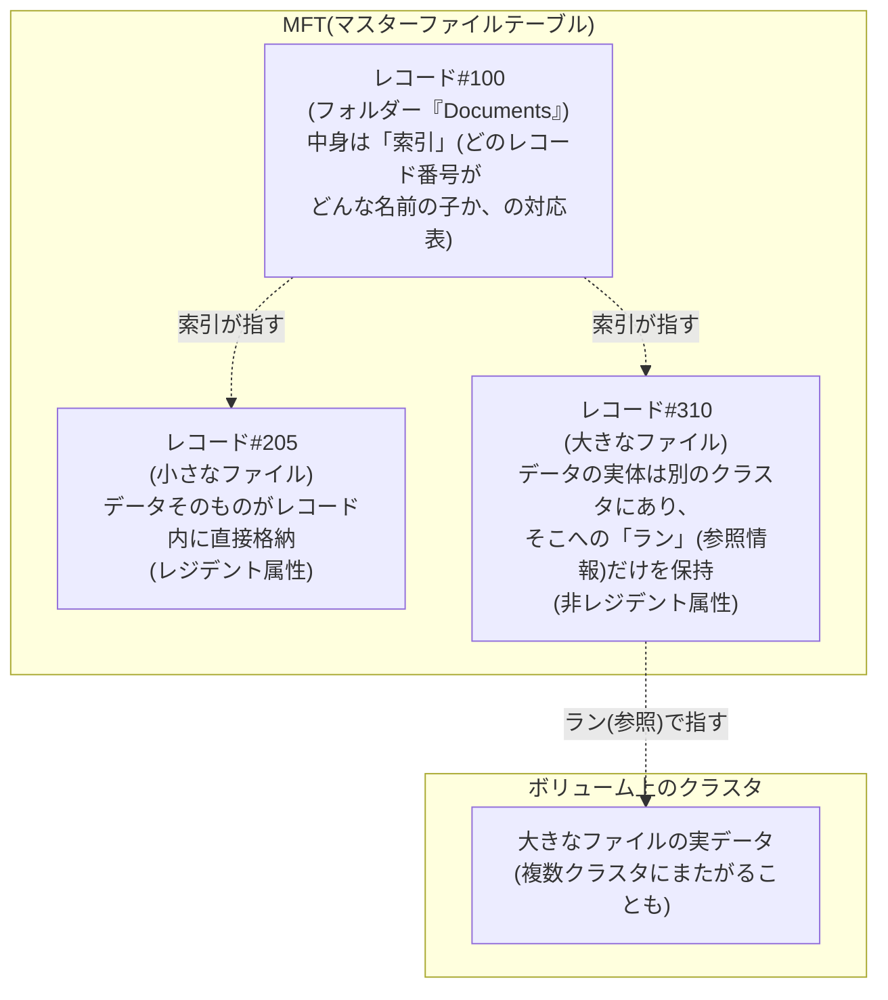

## はじめに

- **この記事で得られること**: [RAIDとWindowsのディスク管理の関係](/articles/disk-raid-fundamentals-guide)で、「フォーマットとはMFT(マスターファイルテーブル)などの管理用データ構造を新規に書き込む操作である」と触れましたが、その先には立ち入りませんでした。この記事では、MFTが具体的にどんなデータ構造で、なぜMFTさえあれば「ファイル」「フォルダー」という単位でデータを扱えるようになるのか、小さなファイルがMFTレコードの中に直接収まってしまう仕組み、そしてフォルダーの正体が実は索引(インデックス)に過ぎないという事実を、体系的に理解します。
- **対象読者**: フォーマット・ファイルシステムの概要は理解しているものの、フォルダーを開いたりファイルを読み込んだりするとき、OSの内部で実際に何が起きているのかを具体的に説明できない方を想定しています。
- **読むのにかかる想定時間**: 約17分

この記事は[『上位1%』シリーズ 全記事ガイド](/sitemap)の一部、[ストレージ基礎シリーズ](/sitemap#シリーズ一覧)の3本目です。[RAIDとWindowsのディスク管理の関係](/articles/disk-raid-fundamentals-guide)を先に読んでおくと、本記事の理解がスムーズです。

## 前提知識

- **MFT(マスターファイルテーブル)**: [RAIDとWindowsのディスク管理の関係](/articles/disk-raid-fundamentals-guide)で触れた、フォーマット時に作成される、NTFSボリューム上のすべてのファイル・フォルダーの情報を記録する中心的な管理データです。
- **クラスタ**: NTFSがディスク領域を管理する際の最小単位です。フォーマット時に、ボリューム全体がこの固定サイズの単位に区切られます。

## 全体像をつかむ

### 一言で言うと

**NTFSでは、「ファイル」も「フォルダー」も、実はどちらも同じ土俵の上にある、MFTの中の1つの"レコード"に過ぎません。** 違いは、そのレコードが自分のデータそのものを持っているか(ファイル)、それとも他のレコードへの案内(索引)を持っているか(フォルダー)、という点だけです。この「すべてはMFTの中のレコードである」という一点を押さえると、フォーマットという一見地味な操作が、なぜ「ファイル」「フォルダー」という便利な単位を成立させているのかが見えてきます。

## 基礎から徹底解説

### MFTレコードの構造:ヘッダーと「属性」の集まり

MFT上の1件のレコードは、レコード自体の基本情報を記録した**ヘッダー**と、そのファイル・フォルダーの様々な性質を表す複数の**属性**の集まりでできています。標準的なタイムスタンプなどを保持する属性、ファイル名を保持する属性、そして実際のデータ本体を保持する`$DATA`属性など、複数の属性が1つのレコードの中に順番に並んでおり、レコードの終端は特定の終端マーカーで示されます。1件のレコードのサイズは、既定では比較的小さい固定サイズに収まるよう設計されています。

### レジデント属性:小さなファイルは、実はMFTレコードの中に直接入っている

ここがこの記事でもっとも重要なポイントです。**`$DATA`属性(ファイルの中身)のサイズが、そのレコードの残り容量に収まるほど小さい場合、NTFSはそのデータをMFTレコードの中へ直接格納します。** これを**レジデント属性**と呼びます。つまり、数バイトから数百バイト程度の小さなファイルであれば、**「そのファイルを読む」という操作は、実質的に「該当するMFTレコード1件を読む」という操作と、ほぼ同じことになります。** メタデータ(いつ作られたか、名前は何かなど)と、データの中身そのものが、同じ1回の読み取りの中に収まってしまうのです。

一方、ファイルサイズがレコードに収まりきらないほど大きい場合、`$DATA`属性は**非レジデント属性**になります。この場合MFTレコードには、データそのものではなく、「ボリューム上のどのクラスタから、どれだけの長さ分がこのファイルのデータなのか」という対応表(**ラン、run**と呼ばれる開始クラスタと長さのペアの並び)だけが記録されます。ファイルがディスク上で複数の不連続な領域に分かれて配置される、いわゆる**フラグメンテーション**(断片化)は、この「ラン」の数が増えていく現象そのものを指しています。

なぜこの設計だと、小さなファイルが多い場合にNTFSは有利になりやすいのか

非レジデント属性のファイルを読む場合、OSはまず「MFTレコードを読んでランの情報を得る」→「そのランが指すクラスタを別途読みに行く」という、最低でも2段階のディスクアクセスが必要になります。レジデント属性であれば、この2段階が1段階(MFTレコード自体を読むだけ)で完結します。設定ファイルやログファイルのように小さなファイルが大量に存在する場面で、この設計上の違いが実際の体感速度に影響することがあります。

### フォルダーの正体:実は「索引(インデックス)」に過ぎない

多くの人は、フォルダーを「ファイルを物理的に格納する入れ物」のようにイメージしていますが、これは正確ではありません。**NTFSにおけるフォルダーとは、「自分の直下にあるファイル・サブフォルダーの名前と、それぞれに対応するMFTレコード番号」を記録した、B-tree(効率的な検索のためのツリー構造)による索引データを持つ、特殊なMFTレコードです。** ファイルの実体は、あくまでそれぞれ独立したMFTレコードとして存在しており、フォルダーのレコードは、そのレコードたちへの「道案内」の役割に徹しています。

この索引データは、小さいうちはフォルダー自身のMFTレコード内にレジデント属性として収まっていますが、フォルダー内のファイル数が増えて索引自体が大きくなると、フォルダーのMFTレコードから、別のクラスタ上に確保された索引専用の領域へと拡張されます。いずれの場合も、B-treeという構造のおかげで、フォルダー内に何千件のファイルがあっても、目的のファイル名を効率的に検索できるようになっています。

### エクスプローラーでファイルを開くまでの流れ

これまでの内容を踏まえると、「Cドライブの中の`Documents`フォルダーの中の`report.docx`を開く」という操作が、内部的には次のような流れで処理されていることが分かります。

1. ルートフォルダーのMFTレコード(索引)を読み、`Documents`という名前に対応するMFTレコード番号を調べる。
2. そのレコード番号のMFTレコード(`Documents`フォルダー自身の索引)を読み、`report.docx`という名前に対応するMFTレコード番号を調べる。
3. そのレコード番号のMFTレコードを読む。`$DATA`属性がレジデントであればそのままデータを取得し、非レジデントであれば記録されているランの情報に従って、該当するクラスタを実際に読みに行く。

「ファイルを開く」という一見単純な操作の裏側で、複数階層の索引をたどり、最終的にMFTレコードへたどり着くという、この一連の道のりが毎回実行されているのです。

## プロが見ている視点(上位1%の理解)

### MFT自体が壊れることの重大さ

MFTは、いわばボリューム全体の「目次」そのものです。もしMFTの一部が破損すると、そのレコードに対応するファイル・フォルダーの情報が丸ごと参照不能になるリスクがあります。`chkdsk`コマンドがファイルシステムの整合性チェック・修復を行う際、MFTの構造そのものの検証に重点を置いているのは、MFTがボリューム全体のデータへの入り口を担っているためです。また、NTFSは`$LogFile`と呼ばれる領域に、メタデータへの変更内容を事前に記録しておく仕組み(ジャーナリング)を持っており、不意の電源断などでメタデータの更新処理が中断しても、この記録をもとに整合性のある状態へ復旧できるようになっています。

## よくある誤解・つまずきポイント

- **誤解1: 「フォルダーは、ファイルを物理的に格納している入れ物である」**
  フォルダーの実体は、自分の直下にあるファイル・サブフォルダーの名前とMFTレコード番号を記録した索引(インデックス)に過ぎません。ファイルの実データは、あくまで各ファイル自身の独立したMFTレコードに存在しています。
- **誤解2: 「すべてのファイルは、ディスク上の連続した1つの領域に保存されている」**
  ファイルサイズがMFTレコードに収まらない場合、データは「ラン」という単位でボリューム上の複数のクラスタに分散して配置されることがあり、この分散が進んだ状態がフラグメンテーション(断片化)です。
- **誤解3: 「MFTは単なる目次であり、ファイルの中身そのものとは無関係である」**
  MFTレコードに収まる程度に小さいファイルであれば、そのデータの中身自体がMFTレコード内に直接(レジデント属性として)格納されています。MFTは目次であると同時に、小さなファイルにとっては本文そのものの置き場所でもあります。

## 障害・トラブルシューティングの視点

NTFSの内部構造に関連するトラブルは、多くの場合「MFT・索引・実データという複数の層のどこに問題が起きているのか」を切り分けることが出発点になります。

1. **特定のファイルだけ読み込みエラーが発生する**: そのファイルのMFTレコードが記録しているランの情報と、実際のクラスタの状態(不良セクタなど)に不整合がある可能性があります。
2. **フォルダー内のファイル数が多いディレクトリの表示が遅い**: フォルダー自身の索引データが大きくなり、レジデントで収まらずクラスタ上に拡張されている可能性があります。極端にファイル数が多いフラットな構成は、階層を分けて整理することが実務上の対策になります。
3. **ディスクの空き容量が急に減った・断片化が疑われる**: `chkdsk`や、必要に応じてデフラグツールで、ボリューム全体の整合性とランの分散状況を確認します。

### 予防策・恒久対策

- 1つのフォルダーに極端に大量のファイルを平置きせず、階層構造で整理する運用を心がける。
- 予期しないファイル破損に遭遇したら、`chkdsk`でまずMFT・索引レベルの整合性を確認する。
- 突然の電源断が起きやすい環境では、UPSの導入など、書き込み中断そのものを防ぐ対策を優先する。

## まとめ

- NTFSでは、ファイルもフォルダーも、実はどちらもMFT(マスターファイルテーブル)の中の1つのレコードに過ぎません。
- MFTレコードに収まるほど小さいファイルのデータは、レコード内に直接格納される「レジデント属性」として扱われ、読み取りが1段階で完結します。大きいファイルは「非レジデント属性」となり、実データはボリューム上のクラスタに分散し、「ラン」という対応表で参照されます。
- フォルダーの実体は、直下のファイル・サブフォルダーの名前とMFTレコード番号を記録したB-tree索引であり、ファイルを物理的に格納する入れ物ではありません。
- ファイルを開く操作は、複数階層の索引を順にたどってMFTレコードへ到達し、そこからデータを取得するという、内部的には何段階かの参照処理の積み重ねです。

**今日から意識すべきこと**
1. 「フォルダーはファイルの入れ物」ではなく「フォルダーは索引」という理解に切り替えましょう。
2. 極端にファイル数の多いフラットなフォルダー構成を避け、階層で整理する習慣をつけましょう。

## 参考文献

- [NTFS | Wikipedia](https://en.wikipedia.org/wiki/NTFS)
- [NTFS Master File Table (MFT) | NTFS.com](http://ntfs.com/ntfs-mft.htm)
- [NTFS - $I30 ($INDEX_ROOT, $INDEX_ALLOCATION, and $Bitmap) | artifacts.help](https://artefacts.help/windows_i30.html)
