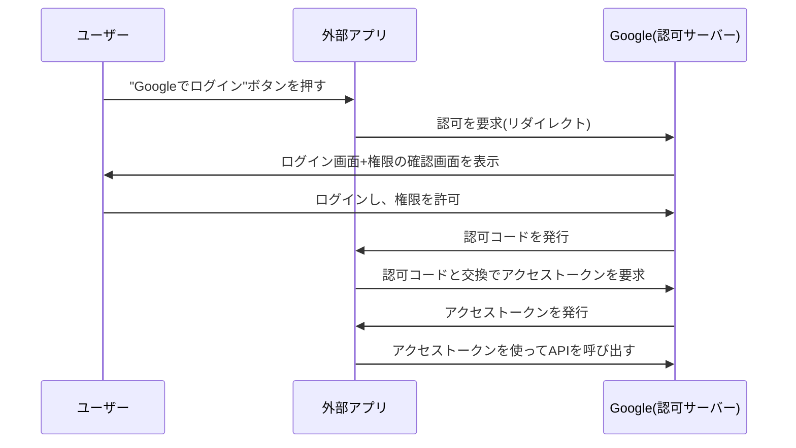

## はじめに

- **この記事で得られること**: [RESTful APIとは何か](/articles/restful-api-guide)で軽く触れた、ステートレスな認証の仕組み(トークン)を前提に、「Googleでログイン」のようなボタンの裏側で動いている**OAuth 2.0**が、具体的にどういうやり取りを経て、**パスワードを一切渡さずに、別のサービスへのアクセスを許可する**のかを体系的に理解します。
- **対象読者**: 「OAuth」という言葉を聞いたことはあり、外部サービスでログインするボタンを使った経験はあるものの、その裏側でどんなやり取りが行われているのか、認証(authentication)と認可(authorization)が何が違うのかを説明できない方を想定しています。
- **読むのにかかる想定時間**: 約20分

この記事は[『上位1%』シリーズ 全記事ガイド](/sitemap)の一部、[Web/APIシリーズ](/sitemap#シリーズ一覧)の4本目です。

## 前提知識

- **ステートレスな認証とトークン**: [RESTful APIとは何か](/articles/restful-api-guide)の「ステートレスな世界での認証」で扱った、リクエストごとにトークンを含めて送る認証方式です。OAuth 2.0は、このトークンを**安全に発行してもらうための、手前の手続き**を定めた仕組みです。

## 全体像をつかむ

### 「認証」と「認可」は、まったく別の概念である

OAuth 2.0を理解する上で、最初に区別すべきなのが、**認証**(Authentication)と**認可**(Authorization)です。

| 用語 | 意味 | 例 |
|---|---|---|
| **認証** | 「あなたは誰か」を確認すること | パスワードやSMSコードで、本人であることを確認する |
| **認可** | 「あなたに、何を許可するか」を決めること | 「このアプリに、あなたのGoogleカレンダーの読み取りだけを許可する」 |

**OAuth 2.0は、認証の仕組みではありません。認可の仕組みです。** 「Googleでログイン」というボタンの実態は、「このアプリに、あなたのGoogleアカウントの一部情報(名前・メールアドレスなど)を読み取る権限を認可する」という操作であり、「誰であるかを確認する」認証そのものは、裏側でGoogle自身が行っています。

## 基礎から徹底解説

### 認可コードフロー:なぜ「コード」と「トークン」の2段階に分かれているのか

上の図で示した流れは、OAuth 2.0の中でも最も広く使われている**認可コードフロー**(Authorization Code Flow)です。**アクセストークンを直接ブラウザ経由で渡さず、いったん「認可コード」という使い捨てのコードを経由させる**という、2段階の構成になっているのが特徴です。

この2段階になっている理由は、**ブラウザのリダイレクトという経路が、URLやブラウザ履歴に情報が残る、比較的ガードの低い経路である**ためです。もしアクセストークン(実際にAPIを呼び出せる、強い権限を持つ情報)を、このガードの低い経路で直接渡してしまうと、ブラウザの履歴や、途中のネットワーク機器のログに、トークンそのものが残ってしまうリスクがあります。**認可コードは、それ自体には何の権限もなく、「アプリのサーバー側」と「認可サーバー」との、より安全な直接通信(バックチャネル)を通じてアクセストークンに交換される、1回しか使えない引換券**です。この仕組みにより、強い権限を持つアクセストークンそのものが、ガードの低い経路を一切通らずに済みます。

「クライアントシークレット」が、認可コードの交換時に必要になる理由

認可コードをアクセストークンに交換する際、外部アプリは、**クライアントシークレット**という、事前に認可サーバーへ登録しておいた秘密の文字列も、あわせて提示する必要があります。**これは、「この認可コードを使おうとしているのは、本当に、ユーザーが認可した、あの正規のアプリ自身である」ということを証明するための、合言葉です。** 認可コードだけでは、それを盗んだ第三者が、別の(偽の)アプリから使い回せてしまう可能性がありますが、クライアントシークレットという、アプリのサーバー側だけが知っている秘密を組み合わせることで、この不正利用を防いでいます。

### アクセストークンとリフレッシュトークン:なぜ2種類に分かれているのか

OAuth 2.0では、最終的に発行されるトークンが、**アクセストークン**と**リフレッシュトークン**という、2種類に分かれています。

- **アクセストークン**: 実際にAPIを呼び出す際に使う、短い有効期限(数十分〜数時間程度)のトークンです。
- **リフレッシュトークン**: アクセストークンの有効期限が切れた際に、**ユーザーに再度ログインしてもらうことなく**、新しいアクセストークンを再発行してもらうために使う、より長い有効期限のトークンです。

**アクセストークンの有効期限を短くしているのは、万が一トークンが漏洩した場合の被害を、時間的に限定するためです。** しかし、有効期限が短いままだと、ユーザーは頻繁に再ログインを求められ、使い勝手が悪くなります。この両方の要求(セキュリティと使い勝手)を同時に満たすため、**「短命だが使い回しが効くアクセストークン」と、「長命だが、新しいアクセストークンの再発行専用でしかないリフレッシュトークン」という、役割を分けた**2段構えの設計になっています。

## プロが見ている視点(上位1%の理解)

### OAuth 2.0は「認証の手段」ではなく、認証はその上に別途乗せるもの(OpenID Connect)

実務で非常によく混同されるのが、「OAuth 2.0を使えば、ユーザー認証ができる」という理解です。**OAuth 2.0自体は、あくまで「何を許可するか」という認可の仕組みであり、「あなたは誰か」を標準化された形で伝える仕組みは、別途用意されています。** それが**OpenID Connect**(OIDC)です。OIDCは、OAuth 2.0の仕組みの上に、ユーザーの身元情報を含む`ID Token`という追加のトークンを乗せることで、認証の機能を実現しています。「Googleでログイン」が実際にログイン(認証)として機能しているのは、裏側でOAuth 2.0に加えてOIDCも使われているからであり、OAuth 2.0だけでは、厳密には「ログイン」は実現できません。

## よくある誤解・つまずきポイント

- **誤解1: 「OAuth 2.0は、ユーザー認証(ログイン)のための仕組みである」**
  OAuth 2.0は認可の仕組みです。認証機能は、OpenID Connect(OIDC)という、別の規格によって実現されています。
- **誤解2: 「アクセストークンを直接ブラウザ経由でやり取りすれば、手順が簡単になる」**
  アクセストークンを直接やり取りすると、ブラウザの履歴やログに情報が残るリスクがあります。認可コードという使い捨ての引換券を経由させることで、このリスクを避けています。
- **誤解3: 「リフレッシュトークンは、アクセストークンと同じように使って、APIを直接呼び出せる」**
  リフレッシュトークンは、新しいアクセストークンを再発行してもらうことにしか使えません。APIを直接呼び出すことはできません。

## 障害・トラブルシューティングの視点

1. **「このアプリは無効です」といったエラーが、認可コードの交換時に発生する**: クライアントシークレットの値が正しいか、登録したリダイレクトURLと実際のURLが完全に一致しているかを確認します。
2. **アクセストークンの有効期限が切れて、APIの呼び出しが突然失敗するようになった**: リフレッシュトークンを使った、アクセストークンの再発行処理が正しく実装されているかを確認します。
3. **ユーザーが、意図せず頻繁に再ログインを求められる**: リフレッシュトークン自体の有効期限が切れていないか、あるいはリフレッシュトークンの保存・再利用の実装に問題がないかを確認します。

## まとめ

- OAuth 2.0は、認証(あなたは誰か)ではなく、認可(あなたに何を許可するか)のための仕組みです。
- 認可コードフローは、強い権限を持つアクセストークンを、ガードの低いブラウザのリダイレクト経路に直接通さないよう、使い捨ての認可コードを経由させる、2段階の設計です。
- アクセストークン(短命)とリフレッシュトークン(長命・再発行専用)は、セキュリティと使い勝手の両方を満たすために、役割を分けて設計されています。
- ユーザー認証(ログイン)を実現するには、OAuth 2.0に加えて、OpenID Connect(OIDC)という別の規格が必要です。

**今日から意識すべきこと**
1. 「OAuth」という言葉を見たら、それが認証なのか認可なのかを、まず区別する習慣をつけましょう。
2. 外部サービスとの連携機能を実装する際は、アクセストークンとリフレッシュトークンを、それぞれの役割に応じて正しく扱っているかを確認しましょう。

## 参考文献

- [RFC 6749 - The OAuth 2.0 Authorization Framework](https://datatracker.ietf.org/doc/html/rfc6749)
- [OpenID Connect Core 1.0](https://openid.net/specs/openid-connect-core-1_0.html)
