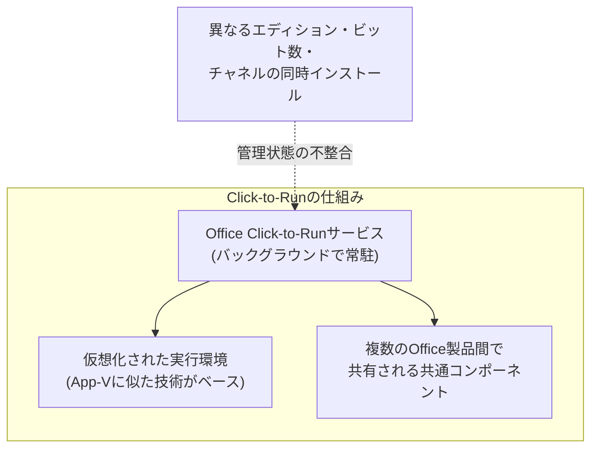

## はじめに

- **この記事で得られること**: 社内PCに誤って別のエディションのMicrosoft Officeをインストールしてしまい、コントロールパネルからの通常のアンインストール操作ではきれいに削除できず、最終的に端末交換に至ってしまう、という実務上のトラブルがあります。この記事では、**現在のOfficeが採用しているClick-to-Run(C2R)という配布方式の仕組み**、通常のアンインストールでは不十分になりがちな理由、そして**Intuneで配信管理している環境での競合の起き方**までを体系的に理解します。
- **対象読者**: 社内でIntuneなどを使ってOfficeを配信管理しているものの、Officeのインストール形式そのものの仕組みや、なぜ版の競合が起きるとアンインストールが困難になるのかを具体的に説明できない方を想定しています。
- **読むのにかかる想定時間**: 約16分

この記事は[『上位1%』シリーズ 全記事ガイド](/sitemap)の一部、[Windowsクライアント運用シリーズ](/sitemap#シリーズ一覧)の10本目です。

## 前提知識

- **MSIインストーラ**: Windowsの伝統的なインストール形式で、インストール対象のファイル・レジストリ変更内容を1つのパッケージにまとめたものです。かつてのOfficeは、この形式で配布されていました。

## 全体像をつかむ

### 一言で言うと

**現在のOfficeは、伝統的なMSIインストーラではなく、Click-to-Run(C2R)という、まったく異なる配布・実行方式を採用しています。** C2Rは、専用のバックグラウンドサービスがOffice本体の展開・更新・仮想化を管理する仕組みであり、**同じPC上に異なるエディション・異なるビット数(32bit/64bit)・異なる配布チャネルのOfficeが混在すると、この管理の仕組み自体が競合し、通常のアンインストール操作だけでは正常な状態に戻せなくなる**ことがあります。

## 基礎から徹底解説

### Click-to-Runとは何か

**Click-to-Run**は、Microsoftが現在のOffice製品(Microsoft 365 Apps、永続ライセンス版のOffice 2021/2024など)で採用している配布・実行方式です。従来のMSIインストーラが「すべてのファイルを一度にディスクへ展開してからインストール完了とする」方式だったのに対し、C2Rは**App-Vに似たアプリケーション仮想化技術をベースに、必要なコンポーネントをストリーミングしながら展開し、専用のバックグラウンドサービス(Office Click-to-Runサービス)がOffice全体の状態管理・自動更新を担う**、という設計になっています。

### なぜ異なるエディションの共存が問題を起こすのか

C2Rで配布されるOfficeには、**Microsoft 365 Apps for enterprise・Microsoft 365 Personal(旧Office 365 Home)・永続ライセンス版(Office 2021/2024)** といった複数のエディションがあり、さらに**32bit版と64bit版**という区分も存在します。これらは、内部的にはある程度共通のコンポーネントを共有する設計になっていますが、**異なるエディション・異なるビット数のOfficeを同一PC上に重ねてインストールしようとすると、この共有コンポーネントの管理状態(バージョン情報やライセンス情報の紐付けなど)に矛盾が生じることがあります。** この状態になると、コントロールパネルの「プログラムのアンインストール」から通常の削除操作を行っても、**Click-to-Runサービスが管理している内部的な状態情報までは完全にクリーンアップされず、中途半端に競合した設定が残り続ける**ことがあります。

32bit版と64bit版のOfficeは、そもそも同じPCに共存できない

Microsoft自身が公式に、**同一PC上に32bit版のOfficeと64bit版のOfficeを共存させることをサポートしていません。** どちらか一方をインストールした状態で、もう一方をインストールしようとすると、先にインストールされている方を完全に削除してからでないと、正常にインストールできない仕様になっています。[インストーラのx64とx86の違い](/articles/windows-install-media-guide)で扱った、通常のアプリケーションであればWoW64が吸収してくれるという話とは異なり、**Office自体の設計として、ビット数の異なるインストールの共存を意図的に禁止している**、という点を理解しておく必要があります。

### 通常のアンインストールで不十分な場合、何を使うべきか

Microsoftは、この種の**Click-to-Run版Officeの、通常のアンインストール操作では解決できない競合状態**を解消するための、専用の診断・修復ツールを提供しています。それが**Microsoft Support and Recovery Assistant**(SaRA)です。SaRAには、コマンドラインから実行できる`SaRAcmd.exe`という版があり、`OfficeScrubScenario`というシナリオを指定して実行することで、**通常のアンインストーラでは削除しきれない、Click-to-Run関連の共有コンポーネント・レジストリ・タスクスケジューラの登録などを含めて、強制的に完全削除**できます。「アンインストールしたのに、再インストールしてもうまく動かない」「複数のエディションが競合して、どちらも正常に起動しない」といった、通常の手段では手に負えない状態になった場合、まずこのツールでの完全削除を試みるのが定石です。

### Intuneで配信管理している環境での競合の起き方

組織でOfficeをIntuneから配信管理している場合、多くは「**Microsoft 365 Apps**」というアプリの種類として、内部的にOffice展開ツール(ODT: Office Deployment Tool)の構成ファイル(XML)を使って、**インストールするエディション・チャネル・言語などを一元的に指定**しています。この管理下にある端末に対して、利用者が(あるいは誤操作によって)**Intuneの管理対象とは異なるエディションのOfficeを手動でインストールしてしまう**と、Intune側が期待する構成と、実際に端末上に存在する構成が食い違った状態になります。この状態でIntune側が構成の再適用や更新を試みると、**手動でインストールされた版と、Intuneが管理しようとしている版とが競合し、どちらのアンインストール処理も中途半端にしか完了しない**、という厄介な状況に陥ることがあります。組織的にOfficeを配信管理している環境では、**ODTの構成ファイルに、インストール前に既存のOfficeをすべて削除する`Remove`要素を明示的に含めておく**ことが、この種の競合を予防する実務上の対策になります。

## プロが見ている視点(上位1%の理解)

### 端末交換という判断は、必ずしも最終手段ではなかった可能性がある

今回のような「アンインストールがうまくいかず、結局端末を交換した」という対応は、緊急対応としては合理的な判断ですが、上位1%のエンジニアであれば、**交換の前に、SaRAcmd.exeによる完全削除を1つの選択肢として検討します。** 端末交換は、データ移行やユーザーの作業中断といった追加コストを伴う一方、SaRAによる完全削除は、多くの場合数分から数十分程度で完了し、端末自体をそのまま使い続けられます。今後同様の状況に遭遇した際に選択肢を増やしておくという意味で、この専用ツールの存在を知っておく価値があります。

## よくある誤解・つまずきポイント

- **誤解1: 「Officeも、他の一般的なアプリケーションと同じように、コントロールパネルからアンインストールすれば完全に削除できる」**
  現在のOfficeはClick-to-Runという専用の配布・実行方式を採用しており、専用のバックグラウンドサービスが状態管理を行っているため、通常のアンインストール操作だけでは、共有コンポーネントの状態が完全にはクリーンアップされないことがあります。
- **誤解2: 「32bit版と64bit版のOfficeは、他の一般的なアプリケーション同様、同じPCに共存できる」**
  Microsoft自身が公式に、同一PC上での32bit版と64bit版Officeの共存をサポートしていません。
- **誤解3: 「Intuneで配信管理していれば、利用者が手動で別のOfficeをインストールすることはそもそも起こらない」**
  Intuneによる配信管理は、あくまで既定のインストール手段を提供する仕組みであり、利用者が別の経路(手動ダウンロードなど)でOfficeをインストールすること自体を技術的に完全に防げるとは限りません。予防には、ODTの構成ファイルでの明示的な事前削除設定などの追加対策が必要です。

## 障害・トラブルシューティングの視点

1. **Officeをアンインストールしたはずなのに、再インストールが正常に完了しない**: コントロールパネルからの通常のアンインストールでは不十分な可能性が高く、SaRAcmd.exeによる完全削除を試みます。
2. **複数のOfficeエディションが競合し、どちらも正常に起動しない**: 現在インストールされているすべてのOffice製品のエディション・ビット数を確認し、意図しない共存状態になっていないかを確認します。
3. **Intuneで配信管理しているはずのOfficeが、意図しないエディションになっている**: 端末上に、Intuneの管理対象外のOfficeが手動でインストールされていないかを確認し、必要であればODTの構成ファイルに`Remove`要素を追加します。

### 予防策・恒久対策

- 組織的にOfficeを配信管理する場合は、ODTの構成ファイルに、インストール前の既存Office削除設定を明示的に含めておく。
- Officeのアンインストールがうまくいかない場合の標準対応手順として、SaRAcmd.exeによる完全削除をチェックリストに含めておく。
- 利用者が手動でOfficeをインストールできないよう、可能であればアプリケーション実行制御(AppLockerなど)や、ソフトウェアセンター経由のインストールのみを許可する運用と組み合わせる。

## まとめ

- 現在のOfficeは、伝統的なMSIインストーラではなくClick-to-Run(C2R)という配布方式を採用しており、専用のバックグラウンドサービスが状態管理を行っています。
- 異なるエディション・異なるビット数のOfficeが同一PC上で競合すると、共有コンポーネントの管理状態に矛盾が生じ、通常のアンインストール操作だけでは完全にクリーンアップできないことがあります。
- この種の競合状態には、Microsoft Support and Recovery Assistant(SaRA)、特にコマンドライン版のSaRAcmd.exeによる完全削除が有効です。
- Intuneで配信管理している環境では、ODTの構成ファイルに既存Officeの事前削除設定を含めておくことが、この種の競合の予防策になります。

**今日から意識すべきこと**
1. Officeのアンインストール・再インストールがうまくいかない状況に遭遇したら、端末交換の前にSaRAcmd.exeによる完全削除を選択肢として検討しましょう。
2. 組織的にOfficeを配信管理する際は、ODTの構成ファイルに既存Officeの事前削除設定を含めることを検討しましょう。

これでWindowsクライアント運用シリーズ全10記事が完了です。通勤中や家事をしながら内容を振り返りたい場合は、耳だけで復習できる[【音声で聴く】Windowsクライアント運用シリーズ総復習](/articles/windows-client-audio-review-guide)もあわせてどうぞ。

## 参考文献

- [Use the Support and Recovery Assistant to uninstall Office | Microsoft Learn](https://learn.microsoft.com/en-us/microsoft-365/troubleshoot/administration/assistant-office-uninstall)
- [Overview of the Office Deployment Tool | Microsoft Learn](https://learn.microsoft.com/en-us/microsoft-365-apps/deploy/overview-office-deployment-tool)
