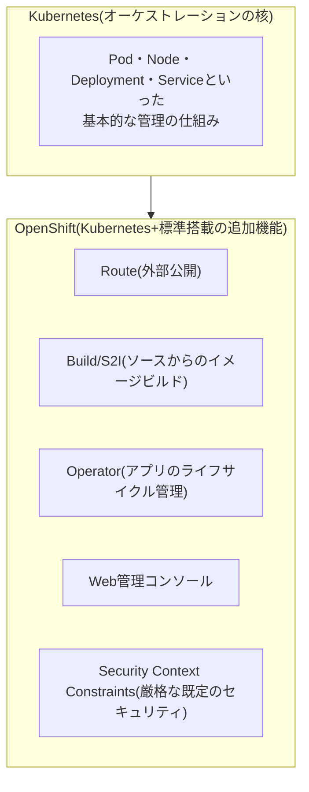

## はじめに

- **この記事で得られること**: 「OpenShiftという名前は聞いたことがあるが、Kubernetesとの関係がよく分からない」という状態から、**OpenShiftがKubernetesとどういう関係にあるのか**、そして**Kubernetes単体には含まれない、OpenShiftが標準で追加している機能**が何かを体系的に理解します。コンテナ・Kubernetesの基礎知識がまだ薄い方でも読み進められるよう、必要な前提から順に整理します。
- **対象読者**: OpenShiftという言葉を聞いたことはあるものの、コンテナ・Kubernetesを含めてほとんど触れたことがなく、まずは全体像を掴みたい方を想定しています。
- **読むのにかかる想定時間**: 約20分

この記事は[『上位1%』シリーズ 全記事ガイド](/sitemap)の一部、OpenShiftをテーマにした新シリーズの1本目です。実際に手を動かして試してみたい場合は、続けて[OpenShift Localでコンテナアプリケーションを動かす『上位1%』のハンズオン](/articles/openshift-handson-guide)へ進んでください。

## 前提知識

- **仮想マシンとコンテナの違い**: [Proxmox VEとは何か——KVM/QEMUによる仮想化の仕組みを『上位1%』の視点で理解する](/articles/proxmox-internals-guide)で扱った仮想マシンは、ハードウェアそのものをソフトウェアで再現し、その上でゲストOSをまるごと動かす技術です。**コンテナは、これとは異なるアプローチの仮想化**で、1台のホストマシン上で**OSのカーネル自体は1つだけ共有**しつつ、プロセス単位で実行環境(ファイルシステム、ネットワーク、プロセス空間など)を隔離する技術です。ゲストOS自体を起動する必要がないため、仮想マシンと比べて**起動が高速で、リソースのオーバーヘッドも小さい**という特徴があります。

## 全体像をつかむ

### OpenShiftはKubernetesの「競合」ではなく「派生」

**OpenShiftは、Red Hatが提供する、Kubernetesをベースにしたコンテナプラットフォームです。** Kubernetesそのものを置き換える競合製品ではなく、**Kubernetesという核(コア)の上に、実際の企業運用に必要な多くの機能を標準搭載して積み増した、いわば"完成車"**だと捉えると理解しやすくなります。

**Kubernetes単体は、コンテナをどう配置・管理するかという"核"の部分だけを提供するソフトウェアです。** 実際に企業でコンテナ基盤を運用するには、コンテナイメージを保管するレジストリ、ソースコードからイメージをビルドする仕組み、外部公開の方法、監視・ログ収集、セキュリティポリシーなど、数多くの周辺機能を**自分たちで個別に選定・統合する**必要があります。**OpenShiftは、これらの周辺機能をあらかじめ選定・統合し、標準搭載した状態で提供する**、というのが最も本質的な価値提案です。

## 基礎から徹底解説

### Kubernetesの基本概念のおさらい

OpenShiftを理解する前提として、Kubernetesの基本用語を簡単に整理します。

| 用語 | 意味 |
|---|---|
| **Pod** | Kubernetesが管理する最小の実行単位。1つ以上のコンテナのまとまりです。 |
| **Node** | Podが実際に実行される、物理または仮想のマシンです。 |
| **Cluster** | 複数のNodeの集合であり、Kubernetesが管理する全体です。 |
| **Deployment** | 「このPodを何台稼働させ続けたいか」という望ましい状態を宣言的に記述するリソースです。実際のPod数がその宣言と一致するよう、Kubernetesが自動的に調整し続けます。 |
| **Service** | 複数のPodへのアクセスを、1つの安定したアドレスとしてまとめる仕組みです。個々のPodは頻繁に入れ替わりますが、Serviceのアドレスは変わりません。 |

### OpenShiftが標準搭載している主な機能

Kubernetesの基本概念の上に、OpenShiftは次のような機能を標準で追加しています。

- **Project**: Kubernetesの**Namespace**(クラスタ内のリソースを論理的に分離する単位)に、既定のリソースクォータ(使用できるCPU・メモリの上限)やRBAC(誰が何を操作できるかという権限)のポリシーをあらかじめ組み込んだものです。
- **Route**: Kubernetesの**Ingress**(クラスタ外部からのアクセスをServiceへ振り分ける仕組み)に相当する、OpenShift独自の実装です。TLS終端(証明書によるHTTPS化)を標準でサポートしており、[IISとASP.NETの仕組みを『上位1%』の視点で理解する](/articles/iis-fundamentals-guide)で扱ったバインド設定に近い発想で、ホスト名ごとに異なるアプリケーションへ振り分けられます。
- **Build / BuildConfig(Source-to-Image、S2I)**: Gitリポジトリ上のソースコードを指定するだけで、そのアプリケーション向けのコンテナイメージを自動的にビルドする仕組みです。開発者は、コンテナイメージのビルド手順自体を意識せずに済みます。
- **Webコンソール**: クラスタの状態を確認し、アプリケーションのデプロイやスケールといった操作をGUIから行える、標準搭載の管理画面です。
- **Operator**: アプリケーション(特にデータベースなど、状態を持つ複雑なソフトウェア)のインストール・アップグレード・バックアップ・障害復旧といった、運用上の一連の作業を自動化する仕組みです。Kubernetes単体にも同じ概念(Operator Pattern)はありますが、OpenShiftは**OperatorHub**という、あらかじめ用意されたOperatorのカタログを標準搭載しています。
- **Security Context Constraints(SCC)**: Kubernetesの既定設定よりも厳格な、コンテナのセキュリティポリシーです。たとえば、既定ではコンテナをroot権限で実行させない、といった制約が組み込まれています。

## プロが見ている視点(上位1%の理解)

### なぜ企業がKubernetes単体ではなくOpenShiftを選ぶのか

Kubernetes単体を使う場合、前述の周辺機能(レジストリ、CI/CD、監視、セキュリティポリシーなど)を、それぞれ異なるオープンソースソフトウェアやクラウドサービスから個別に選定し、互換性を確認しながら組み合わせて構築する必要があります。これは高い自由度を持つ一方、**構築・維持のための専門知識と工数を要求します。** OpenShiftは、この組み合わせ作業をあらかじめ済ませ、**Red Hatによるサポート契約**とあわせて提供することで、**「自分たちでパーツを集めて組み立てる」のではなく「完成車を購入してすぐに使い始める」**という選択肢を企業に提供しています。

## よくある誤解・つまずきポイント

- **誤解1: 「OpenShiftはKubernetesの競合製品であり、どちらか一方を選ぶ必要がある」**
  OpenShiftはKubernetesをベースにした派生製品(ディストリビューション)であり、Kubernetesの基本概念(Pod、Deployment、Serviceなど)はそのまま引き継がれています。
- **誤解2: 「OpenShiftを使えば、Kubernetesの知識は一切不要になる」**
  OpenShift独自の機能(Route、Build、Operatorなど)を理解する前提として、Kubernetesの基本概念の理解は依然として重要です。
- **誤解3: 「コンテナは、仮想マシンをただ軽量化しただけのものである」**
  仮想マシンはハードウェアごとゲストOSを再現する技術、コンテナはOSカーネルを共有しつつプロセス単位で環境を隔離する、アプローチ自体が異なる技術です。

## 障害・トラブルシューティングの視点

この記事はOpenShiftの全体像を扱う概要編のため、実際の操作や障害対応の視点は、[OpenShift Localでコンテナアプリケーションを動かす『上位1%』のハンズオン](/articles/openshift-handson-guide)で具体的に扱います。

## まとめ

- OpenShiftは、Kubernetesの競合製品ではなく、Kubernetesという核の上に企業運用に必要な機能を標準搭載した派生製品(ディストリビューション)です。
- Kubernetesの基本概念(Pod・Node・Deployment・Service)は、OpenShiftでもそのまま引き継がれています。
- OpenShiftが標準で追加している主な機能には、Project・Route・Build(S2I)・Webコンソール・Operator・SCCがあります。
- 企業がOpenShiftを選ぶ理由は、Kubernetes単体では個別に組み合わせる必要がある周辺機能を、あらかじめ統合し、サポート契約とあわせて提供している点にあります。

**今日から意識すべきこと**
1. OpenShiftという言葉に出会ったら、それがKubernetesの競合ではなく派生であることを思い出しましょう。
2. OpenShift独自の機能に出会ったら、それがKubernetesのどの基本概念(Namespace、Ingressなど)に対応するのかを意識して整理しましょう。

## 参考文献

- [Red Hat OpenShift Documentation](https://docs.openshift.com/)
- [Kubernetes Documentation: Concepts](https://kubernetes.io/docs/concepts/)
- [Understanding builds | Red Hat OpenShift Documentation](https://docs.openshift.com/container-platform/latest/cicd/builds/understanding-image-builds.html)
