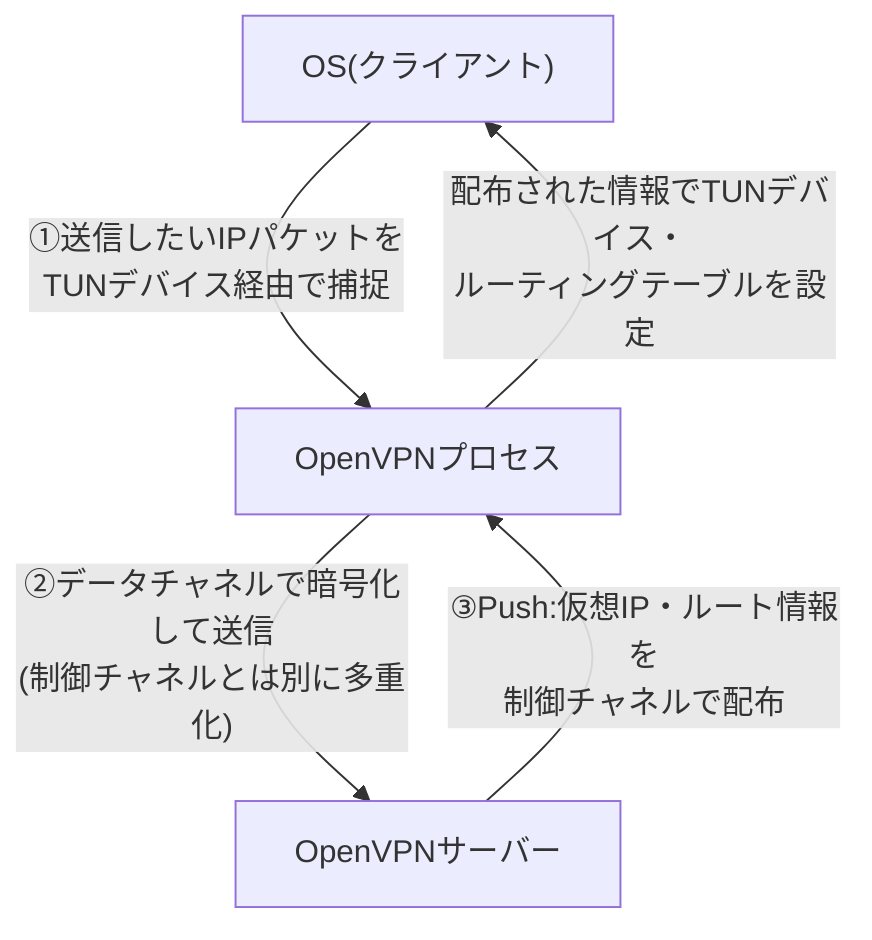
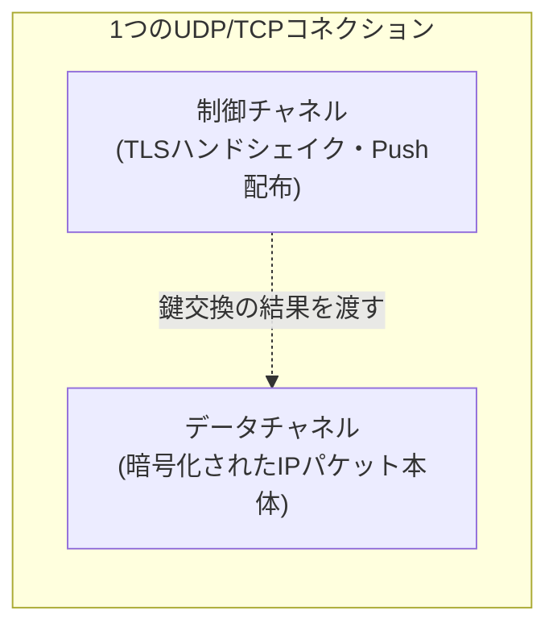
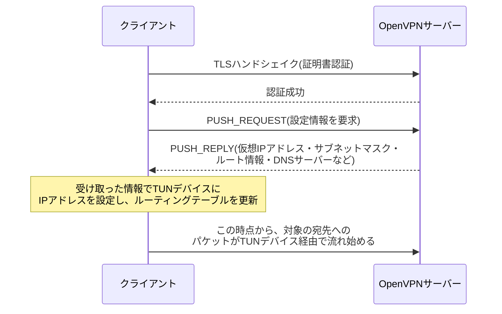

## はじめに

- **この記事で得られること**: 「OpenVPNはTLSでIPパケットを暗号化している」という理解の先にある、**なぜそれだけでVPN接続として成立するのか**という疑問に対し、制御チャネル(Control Channel)とデータチャネル(Data Channel)の役割分担、[TUNデバイス](/articles/linux-user-kernel-space-guide)によるIPパケットの捕捉、そしてPush機構による仮想IPアドレス・ルート情報の配布という3つの仕組みから、体系的に理解できます。
- **対象読者**: [L2TP/IPsecと現代的なVPNプロトコルを『上位1%』の視点で比較する](/articles/vpn-protocols-comparison-guide)でOpenVPNの概要(TLSの流用、TCP443へのフォールバック)を理解した上で、「TLSで暗号化する」ことと「VPN接続が成立する」ことの間にある具体的な処理を知りたい方を想定しています。
- **読むのにかかる想定時間**: 約17分

この記事は[『上位1%』シリーズ 全記事ガイド](/sitemap)の一部です。

## 前提知識

- **TLS(Transport Layer Security)** : 鍵交換・認証・暗号化を組み合わせた、Webのhttps通信などで広く使われるプロトコルです。詳しくは[PKIとデジタル証明書の仕組み](/articles/pki-guide)で扱っています。
- **TUN/TAPデバイス**: ユーザー空間のプログラムがカーネルのネットワークスタックとの間でIPパケットを直接読み書きできる、Linuxカーネルが提供する仮想的なネットワークインターフェースです。詳しくは[ユーザー空間とカーネル空間、TUN/TAPデバイスの仕組み](/articles/linux-user-kernel-space-guide)で扱っています。
- **ルーティングテーブル**: OSが「どの宛先のパケットを、どのネットワークインターフェース経由で送るか」を管理する対応表です。

## 全体像をつかむ

### 一言で言うと

**「TLSでIPパケットを暗号化する」ことと「VPN接続が成立する」ことの間には、実は3段階の仕組みが必要です。** (1)そもそも「トンネルに流し込むべきIPパケット」をOSからどうやって受け取るか(TUNデバイス)、(2)暗号化された1本のTLSコネクションの中で、鍵交換のような制御用のやり取りと実データをどう区別するか(制御チャネル/データチャネルの分離)、(3)接続後にクライアントが実際にそのトンネル宛にパケットを送るようになるためのIPアドレス・ルート情報をどう配るか(Push機構)——この3つが揃って初めて、単なる「暗号化されたTLS通信」が「VPN接続」になります。

## 基礎から徹底解説

### ①TUNデバイス:「トンネルに流すべきパケット」をどう受け取るか

OpenVPNは、まず**TUNデバイス**(仮想的なネットワークインターフェース)をOS上に作成します。OSのルーティングテーブルにこのTUNデバイスが1つのネットワークインターフェースとして登録されると、**「相手先VPNセグメント宛のパケットはこのTUNデバイス経由で送る」というルーティングルールが有効になり、アプリケーションが送信したパケットのうち、そのルールに合致するものだけがOpenVPNプロセスに渡ってきます。** OpenVPNプロセスはこれをそのまま暗号化して、実際の物理ネットワーク経由でVPNサーバーへ送信します(TUNデバイスがユーザー空間のプログラムにパケットを受け渡す詳しい仕組みは[ユーザー空間とカーネル空間、TUN/TAPデバイスの仕組み](/articles/linux-user-kernel-space-guide)で扱っています)。

この段階だけを見ると、「TLSで暗号化された通信」という点ではWebブラウザのHTTPS通信と何も変わりません。**違いは、TLSコネクションの中に流し込んでいるデータが、特定のアプリケーションが送りたいデータ(HTTPリクエストなど)ではなく、OSのルーティング判断によってTUNデバイス経由で渡された任意のIPパケットである**、という点だけです。

### ②制御チャネルとデータチャネルの分離

OpenVPNの内部は、役割の異なる2つの論理チャネルに分かれています。

- **制御チャネル(Control Channel)** : TLSハンドシェイク(鍵交換・証明書認証)や、後述のPush機構によるオプション配布など、接続の確立・維持に関わる制御メッセージをやり取りするチャネルです。
- **データチャネル(Data Channel)** : TUNデバイス経由で捕捉した実際のIPパケットを、制御チャネルの鍵交換で確立した鍵を使って暗号化し、やり取りするチャネルです。

補足: UDPモードでは制御チャネルに独自の信頼性レイヤーが必要になる

TLSハンドシェイクは、本来TCPのような**信頼性のある(パケットの到達順序・再送が保証される)** トランスポートの上で動くことを前提に設計されています。ところがOpenVPNは、パフォーマンス上の理由からUDPの上で動作することが標準的に推奨されています(詳しくは[L2TP/IPsecと現代的なVPNプロトコルの比較](/articles/vpn-protocols-comparison-guide)の「TCP over TCPのメルトダウン」の節で扱っています)。UDPには到達確認・再送・順序保証の仕組みがないため、**OpenVPNは制御チャネル専用に、独自の軽量な信頼性レイヤー(ACKパケットによる到達確認と再送)を実装しています。** この信頼性レイヤーが適用されるのは制御チャネルのメッセージ(TLSハンドシェイクの各段階)だけで、データチャネルを流れる実際のIPパケットには適用されません。IPパケット自体の再送は、トンネルの中を流れる利用者側の通信(TCPであれば利用者側のTCPスタック自身)が担うべきものであり、トンネル側で二重に再送処理をしてしまうと、まさに「TCP over TCPのメルトダウン」と同種の問題を招くためです。

制御チャネルとデータチャネルが分離されているからこそ、**接続確立後に一定時間ごとに鍵を再ネゴシエーションする(データチャネルの鍵をローテーションする)といった処理を、データチャネルの通信を止めることなく制御チャネル側だけで完結させる**ことができます。

### ③Push機構:「このトンネル宛に送ればよい」とクライアントに教える

TUNデバイスを作り、暗号化されたチャネルを確立しただけでは、クライアント側のOSは「どの宛先のパケットをそのTUNデバイス経由で送るべきか」をまだ知りません。ここで働くのが**Push機構**です。

サーバーは、TLSハンドシェイクによる認証が成功したクライアントに対し、制御チャネルを通じて**PUSH_REPLY**というメッセージを送ります。この中には、クライアントのTUNデバイスに割り当てる仮想IPアドレス、サブネットマスク、「どのネットワーク宛のパケットをこのトンネル経由で送るべきか」というルート情報(`redirect-gateway`のようなオプションで全トラフィックをトンネル経由にすることも、特定のサブネットだけをトンネル経由にすることも設定できます)、DNSサーバーのアドレスなどが含まれます。クライアント側のOpenVPNプロセスは、この情報を受け取ると、**自分のTUNデバイスにIPアドレスを設定し、OSのルーティングテーブルにルートを追加する**という操作を、まさにこのタイミングで初めて行います。

**この3段階が揃って初めて、「TLSで暗号化された通信」が「VPN接続」になります。** TUNデバイスがなければそもそも運ぶべきIPパケットが手に入らず、制御チャネルとデータチャネルの分離がなければ鍵交換と実データを安全に多重化できず、Push機構がなければクライアントは「何を、このトンネル経由で送ればよいか」を永遠に知ることができません。

## プロが見ている視点(上位1%の理解)

### 「トンネルに何を流すか」はサーバー側が事後的に決められる

Push機構の重要な帰結は、**「クライアントが何をVPN経由で送信するか」を、接続前の設定ファイルではなく、接続の都度サーバー側が動的に指示できる**ことです。全トラフィックをVPN経由にする(`redirect-gateway`)構成にすれば、社外にいる端末の全通信を一度VPN側で集約してから送信させる、いわゆる**フルトンネル**構成が実現できます。逆に、社内システム宛のサブネットだけをPushする構成では、それ以外の通信(一般的なインターネット閲覧など)はクライアントのローカル回線からそのまま出ていく**スプリットトンネル**構成になります。この切り替えが、クライアント側の設定ファイルを書き換えることなく、サーバー側のPush設定変更だけで実現できる点が、運用上の柔軟性の源になっています。

### なぜOpenVPNの実装はIPsecよりコード量が多くなりやすいのか

OpenVPNは、TLSハンドシェイク・独自の信頼性レイヤー・Push機構によるオプション配布・TUN/TAPデバイスの制御など、**本来TLS単体の仕様には含まれない機能を、アプリケーションのレイヤーで独自に実装している**という側面を持ちます。これは、L2TP/IPsecがIKE・L2TP・PPPという別々の規格の組み合わせで複雑さを抱えるのとは異なる種類の複雑さです。IPsecはOSのカーネルにネットワーク層の暗号化処理を統合しているのに対し、OpenVPNはユーザー空間のアプリケーションとして「VPNとして機能するために必要な一式」を自前で実装しているため、実装コード量がIPsec系実装より大きくなりやすい傾向があります。

## よくある誤解・つまずきポイント

- **誤解1: 「TLSで暗号化されている以上、OpenVPNは普通のHTTPS通信と技術的にまったく同じものだ」**
  暗号化の仕組み自体はTLSを流用していますが、TUNデバイスによるIPパケットの捕捉、制御チャネル/データチャネルの分離、Push機構によるルーティング情報の配布という、HTTPS通信には存在しない仕組みが追加されています。TLSは「素材」であり、それを使って「VPN」を組み立てる部分がOpenVPN独自の実装です。
- **誤解2: 「Push機構は、証明書認証などのセキュリティに関わる仕組みだ」**
  Push機構が担うのはIPアドレス・ルート・DNSといった接続設定情報の配布であり、認証そのものは制御チャネルのTLSハンドシェイク(証明書認証やPSK認証)が担っています。Push機構はあくまで認証成功後の設定配布の仕組みです。
- **誤解3: 「フルトンネルかスプリットトンネルかは、クライアント側で決める設定だ」**
  Push機構により、この切り替えは基本的にサーバー側の設定(何をPushするか)で制御されます。クライアント側の設定ファイルでサーバーからのPush内容の一部を無視する(`--pull-filter`など)ことは可能ですが、既定の挙動を決めるのはサーバー側です。

## 障害・トラブルシューティングの視点

OpenVPNの接続トラブルは、**「TLSハンドシェイクの段階か、Pushによる設定配布後の段階か」を切り分ける**ことが出発点になります。

1. **TLSハンドシェイク自体が失敗する**: 証明書の期限切れ・CA証明書の不一致、あるいはUDP/TCPのポートがファイアウォールで遮断されている、といった原因が典型的です。サーバー・クライアント双方のログで、ハンドシェイクのどの段階(証明書検証、鍵交換)で失敗しているかを確認します。
2. **ハンドシェイクは成功するが、トンネル経由の通信ができない**: PUSH_REPLYの内容(ルート情報)がクライアント側のルーティングテーブルに正しく反映されているかを確認します。OS側のルーティングテーブル表示コマンド(`route`や`ip route`)で、TUNデバイス宛のルートが実際に追加されているかを確認するのが有効です。
3. **一部の宛先にだけ到達できない**: サーバー側でPushしているルート情報の範囲(フルトンネルかスプリットトンネルか)を確認します。想定していた宛先がPushされるルートに含まれていない設定ミスが典型的な原因です。

### 予防策・恒久対策

- 証明書の有効期限は、CA証明書・サーバー証明書・クライアント証明書のそれぞれについて監視し、失効前に更新する運用フローを整備する。
- フルトンネル/スプリットトンネルの構成方針は、セキュリティ要件(社外での一般インターネット通信もVPN経由で監視したいか)と回線負荷のトレードオフを踏まえて事前に決定し、サーバー側のPush設定として一元管理する。
- UDPモードで接続が不安定な場合は、TCPフォールバック設定(`proto tcp`かつポート443)を事前に用意し、制限の厳しいネットワークからの接続性を確保しておく。

## まとめ

- 「TLSでIPパケットを暗号化する」ことと「VPN接続が成立する」ことの間には、TUNデバイスによるパケット捕捉、制御チャネル/データチャネルの分離、Push機構によるルーティング情報の配布という3段階の仕組みが必要です。
- 制御チャネルはTLSハンドシェイクとPush機構によるオプション配布を担い、データチャネルは実際のIPパケットの暗号化・転送を担います。UDPモードでは制御チャネル専用の独自の信頼性レイヤーが追加で実装されています。
- Push機構により、クライアントが実際にどの宛先をVPN経由で送信するか(フルトンネル/スプリットトンネル)を、接続の都度サーバー側が動的に決定できます。
- OpenVPNは、TLS単体の仕様にはない機能(TUN制御・独自信頼性レイヤー・Push機構)をアプリケーション層で自前実装しているため、IPsec系実装とは異なる種類の複雑さ・コード量を抱えています。

**今日から意識すべきこと**
1. OpenVPNの接続トラブルに遭遇したら、まずTLSハンドシェイクの段階かPush後の段階かを切り分け、それぞれの段階に応じたログ・設定を確認しましょう。
2. フルトンネル/スプリットトンネルの構成は、クライアント側ではなくサーバー側のPush設定が実際の挙動を決めていることを踏まえて設計しましょう。

## 参考文献

- [OpenVPN Community Resources](https://openvpn.net/community-resources/)
- [OpenVPN Protocol Overview | OpenVPN公式ドキュメント](https://openvpn.net/community-resources/openvpn-protocol/)
- [The Transport Layer Security (TLS) Protocol Version 1.3 | RFC 8446](https://datatracker.ietf.org/doc/html/rfc8446)
