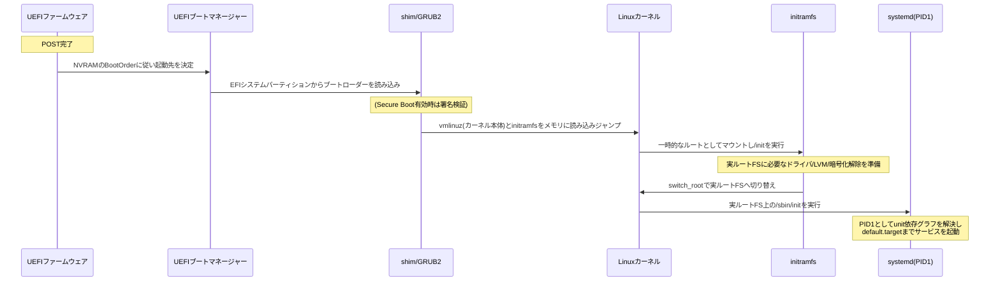

## はじめに

- **この記事で得られること**: サーバーの電源を入れてPOST（Power-On Self-Test）が完了した後、実際にOSが使える状態になるまでの間に何が起きているのかを、UEFIブートマネージャー→ブートローダー（GRUB2）→カーネル→initramfs→実ルートファイルシステム→systemd（PID1）という一連の受け渡しの仕組みから、Secure Boot・測定起動（Measured Boot）といったセキュリティ機構、実務でのトラブルシューティングの切り分け方まで体系的に理解できます。
- **対象読者**: インフラエンジニアとして就業しており、「サーバーの電源を入れればOSが起動する」ことは知っているものの、POST完了からログインプロンプトが出るまでの間に具体的に何が実行されているかは説明できないレベルの方。
- **読むのにかかる想定時間**: 約15〜20分

この記事は[『上位1%』シリーズ 全記事ガイド](/sitemap)の一部です。

サーバーのPSU（電源ユニット）がスタンバイ電源からメイン電源レールへ出力を切り替え、電力が安定するとPOSTが実行される——ここまでの電力供給の仕組みは、別記事「[サーバー電源の仕組みを『上位1%』の視点で理解する](/articles/idrac-power-guide)」で扱いました。この記事ではその続き、**POSTが完了した「その後」** に焦点を当てます。POST完了は、しばしば「OSが起動し始める合図」程度にしか意識されませんが、実際にはそこから、複数のプログラムが順番にバトンを渡し合う、何段階もの起動プロセスが続いています。

## 前提知識

- **ファームウェア（BIOS/UEFI）**: マザーボードに搭載された、OSより先に動作する基盤ソフトウェアです。近年のサーバー・PCではUEFI（Unified Extensible Firmware Interface）が主流です。
- **ブートローダー**: ファームウェアからOSカーネルへ制御を橋渡しするプログラムです。LinuxではGRUB2が広く使われています。
- **カーネル**: OSの中核をなすプログラムで、ハードウェアの制御・プロセス管理・メモリ管理などを担います。
- **ルートファイルシステム**: OSが実際に動作するために必要なファイル一式（`/`以下）が置かれているストレージ上の領域です。

## 全体像をつかむ

### 一言で言うと

POST後のOS起動プロセスとは、「**ファームウェア→ブートローダー→カーネル→initramfs→実ルートファイルシステム→PID1（systemd）という、いくつものプログラムが順番に『次にどのプログラムを、どこから読み込んで実行するか』を決めながらバトンを渡していく、段階的な引き継ぎの連鎖**」です。1つのプログラムがすべてを行うのではなく、各段階が「自分にできる最小限のことだけをして、次に渡す」ことを繰り返しながら、最終的に人間が使えるログインプロンプトやサービスが立ち上がった状態にたどり着きます。

### 起動プロセス全体の流れ

この記事では、特に「ブートローダーがなぜ必要なのか」「initramfsという一時的な環境がなぜ挟まっているのか」「systemdがPID1として何をしているのか」という、見落とされがちな中間段階に焦点を当てて掘り下げます。

## 基礎から徹底解説

### UEFIブートマネージャーが最初のプログラムを選ぶ仕組み

POSTが完了すると、ファームウェアの中の**UEFIブートマネージャー**という機能が動き出します。ブートマネージャーは、マザーボード上の不揮発性メモリ（NVRAM）に保存されている`BootOrder`という優先順位リストと、それに対応する`Boot0000`, `Boot0001`...といった個々のエントリ情報を読み取り、「どのディスクの、どのパーティションにある、どのプログラムを実行するか」を決定します。

この「どのプログラムを実行するか」の実体は、**EFIシステムパーティション（ESP）** と呼ばれる、FAT32でフォーマットされた小さな専用パーティション上に置かれた`.efi`拡張子の実行ファイルです。一般的なLinuxサーバーでは、ここに後述するGRUB2（または署名検証用のshim）の実行ファイルが配置されています。

レガシーBIOS/MBR方式ではどう違うのか

UEFIより古い方式（レガシーBIOS）では、ディスクの先頭512バイトにある**MBR（Master Boot Record）**の中の、さらに446バイトに収まる非常に小さなプログラム（ブートストラップコード）が最初に実行されます。この極小プログラムには複雑な処理を書くスペースがないため、実際には「ディスク上の別の場所にある、もう少し大きな第2段階のプログラム（GRUBのstage1.5やstage2など）を読み込んで実行する」という、さらなる橋渡しを行うだけの役割に徹しています。UEFIのブートマネージャーは、この「サイズの制約が厳しいMBRから、段階的に大きなプログラムへ橋渡ししていく」という不便さを解消し、ESP上に自由なサイズの`.efi`プログラムを置いて直接指定できるようにした、より柔軟な仕組みだと理解しておくとよいでしょう。

### ブートローダー（GRUB2）の役割とSecure Boot

ブートマネージャーから実行されたブートローダー（多くのLinuxディストリビューションではGRUB2）は、自身の設定ファイルを読み、ユーザーに起動するカーネルを選択させたうえで、**カーネル本体（`vmlinuz`）と、後述するinitramfsの2つをメモリ上に読み込み、カーネルの開始地点へジャンプします**。ここでブートローダーの役目は完了し、以降の制御はすべてカーネルに移ります。

**Secure Bootによる署名検証**

Secure Bootが有効な環境では、GRUB2が直接ブートマネージャーから呼ばれるのではなく、Microsoftの署名を持つ**shim**という小さな仲介プログラムがまず呼ばれます。shimは自身に埋め込まれたディストリビューションの証明書（または`MokList`という別のNVRAM変数に個別に登録された鍵、いわゆるMOK: Machine Owner Key）を使ってGRUB2の署名を検証し、検証に成功した場合のみGRUB2を実行します。GRUB2もまた、次に読み込むカーネルの署名を同様に検証します。ファームウェア自体が持つ`PK`（プラットフォームキー）・`KEK`（鍵交換キー）・`db`（許可リスト）・`dbx`（拒否リスト）というNVRAM上の鍵情報と、shimが個別に扱うMOKは別の仕組みである点に注意してください。この「ファームウェア→shim→GRUB2→カーネル」という各段階が次の段階の署名を検証し続ける連鎖により、**署名されていない（＝改ざんされた可能性がある）プログラムの実行を、途中の段階でブロックする**のがSecure Bootの目的です。

GRUB2を経由しない「もっと直接的な」起動方式もある

近年では、GRUB2のような汎用ブートローダーを経由せず、カーネルとinitramfsをあらかじめ1つの`.efi`実行ファイル（UKI: Unified Kernel Image）にまとめてしまい、UEFIブートマネージャーから直接起動する`systemd-boot`のような、より単純な構成も使われ始めています。ブートローダー側での設定ファイル解釈やモジュール読み込みといった可変要素が減る分、起動経路の検証・管理がシンプルになるという利点があります。GRUB2かsystemd-boot/UKIかはディストリビューションやインストール時の選択によって変わるため、自分の管理するサーバーがどちらの方式かを`bootctl status`（systemd-boot）や`/boot/efi`配下の内容で確認しておくとよいでしょう。

### なぜinitramfsという「一時的な環境」が必要なのか

カーネルは、`vmlinuz`から自分自身を展開して基本的な初期化を終えると、すぐに実ルートファイルシステム（`/`）を探しに行きたいところですが、ここで**「鶏と卵」問題**が発生します。

- 実ルートファイルシステムがNVMe/RAIDコントローラーの先にある、LVM（論理ボリュームマネージャー）で構成されている、あるいはLUKSで暗号化されている場合、それらを扱うためのドライバやツール（LVMを組み立てる、暗号化を解除するパスフレーズを尋ねる、など）が必要になります。
- しかし、そのドライバやツール自体が、まさにこれから読み込もうとしている実ルートファイルシステムの中に置かれている、という堂々巡りが起きてしまいます。

この問題を解決するのが**initramfs**です。initramfsは、カーネル本体と一緒にブートローダーによってあらかじめメモリ上に読み込まれる、小さなcpio形式の圧縮アーカイブで、実ルートを見つけるために最低限必要なドライバ・ツール・起動スクリプト一式が詰め込まれています。カーネルは起動直後、このinitramfsをメモリ上の一時的なルートファイルシステム（tmpfs）としてマウントし、その中の`/init`スクリプトを実行します。この`/init`が、実ルートファイルシステムのデバイスを（UUIDやLVM論理ボリューム名などを手がかりに）探し出し、必要なドライバを読み込み、暗号化されていれば復号したうえで、ようやく本来の実ルートファイルシステムをマウントします。

「pivot_root」ではなく「switch_root」が使われる理由

古い`initrd`（ブロックデバイス方式のRAMディスク）の時代には、`pivot_root`というシステムコールで「今のルートを退避しつつ新しいルートに切り替える」という手法が使われていました。しかし現在主流の`initramfs`はtmpfs上に直接展開されたルートファイルシステムであり、そもそも「退避する元の親マウント」が存在しないため`pivot_root`が使えません。そこで、dracutやinitramfs-toolsといった現代のinitramfs実装では、`/proc`・`/dev`・`/sys`・`/run`を新しいルートの下へ`mount --move`したうえで`chroot`し、新しいルート上の実際のinitプログラム（後述するsystemdなど）をexecする**`switch_root`**という専用のヘルパーコマンドが使われます。`switch_root`はこの切り替えの過程で、それまでinitramfsが使っていたメモリ上のファイルを破棄するため、退避ではなく「使い捨てて明け渡す」という発想になっている点が`pivot_root`との違いです。

### カーネル初期化からsystemd（PID1）へ

`switch_root`によって実ルートファイルシステムへの切り替えが完了すると、initramfsはその実ルート上にある`/sbin/init`を実行して自らの役目を終えます。現代の主要なLinuxディストリビューションでは、この`/sbin/init`は**systemd**へのシンボリックリンクになっており、これが**PID 1**（最初に起動されるプロセス、以降のすべてのプロセスの祖先）として動作を開始します。

systemdは、`/etc/systemd/system/`や`/usr/lib/systemd/system/`以下に配置された大量の**unit**ファイル（サービス・マウントポイント・ソケットなどの起動単位）を読み込み、それぞれのunitに書かれた`Before=`/`After=`（順序関係）や`Wants=`/`Requires=`（依存関係）から依存関係グラフを構築します。そのうえで、既定の到達目標である`default.target`（サーバー用途なら`multi-user.target`、GUI環境なら`graphical.target`が一般的）に到達するために必要なunitを、**依存関係が許す範囲で並列に**起動していきます。

| 起動方式 | 起動順序 | 代表例 |
|---|---|---|
| 旧来のSysV init | ランレベルごとに定義されたスクリプトを、番号順に**逐次**実行 | `/etc/init.d/`配下のスクリプト |
| systemd | unit間の依存関係グラフを解決し、依存のないunit同士は**並列**に起動 | `.service`, `.mount`, `.socket`などのunit |

この「並列起動できる」という点が、SysV init方式に比べてsystemdが起動時間を短縮できる大きな理由の1つです。

## プロが見ている視点（上位1%の理解）

### Secure Bootと測定起動（Measured Boot）は別物

前述のSecure Bootは「署名されていない、あるいは改ざんされたプログラムの**実行を止める**」仕組みですが、これとよく混同される、しかし目的が異なる仕組みに**測定起動（Measured Boot）**があります。

測定起動は、ファームウェア・ブートローダー・カーネルといった各段階が、次に実行するプログラムのハッシュ値を、実行する**前に**TPM（Trusted Platform Module）というセキュリティチップ内の**PCR（Platform Configuration Register）** という領域に記録（正確には既存の値と連結してハッシュし直す「extend」という操作）してから実行する、という仕組みです。PCRは上書きではなく積み上げ式に記録されるため、途中の記録を後から改ざんすることはできません。

重要なのは、測定起動は**実行を止めません**。署名されていないプログラムであっても、測定さえすれば普通に実行されます。測定起動が提供するのは「実際に何が実行されたかの、改ざん不可能な記録」であり、これを使って外部の検証者に「このサーバーは想定通りの構成で起動した」ことを証明する**リモート・アテステーション**や、ディスク暗号化キーを「想定通りの構成で起動した場合のみ」復号できるよう封印する（例:`clevis`や`systemd-cryptenroll`のTPM連携）といった用途に使われます。つまり、**Secure Bootは「入口で止める」仕組み、測定起動は「後から検証できるよう記録する」仕組み**であり、両方を組み合わせて初めて「起動時に何が実行されたかを保証しつつ、想定外のものはそもそも動かさない」という多層防御が成立します。

PCRにはどんな段階の測定値が記録されるのか

PCRの番号ごとにどの段階を記録するかは仕様・実装によって割り当てが決まっており、代表的なものとして、PCR0（ファームウェア自体の測定値）、PCR1（ファームウェアの設定情報）、PCR4（GRUB2やshimなど、チェインロードされるブートローダー本体の測定値）、PCR8・PCR9（GRUBが実行したコマンドや読み込んだカーネル・initramfsの測定値）などがあります。近年のsystemd-boot/UKI構成では、PCR11・12・13・15（それぞれカーネル本体、カーネルの起動コマンドライン、追加の設定拡張、システムの識別情報に対応）という、systemd独自の割り当て規約も使われています。BMC（iDRACなど）を搭載したサーバーでは、これらの測定値をOSの外側から収集・監査できる場合があり、OS自身が改ざんされていた場合でも起動時の記録だけは信頼できる、という帯域外管理ならではの価値につながっています。

### Windowsのブート処理との対比

Windowsも基本的な考え方はLinuxと同様に、複数の段階を経てOSにたどり着きます。

| 段階 | Linux | Windows |
|---|---|---|
| ブートマネージャーから最初に呼ばれるプログラム | shim（Secure Boot時）／GRUB2 | `bootmgfw.efi`（Windowsブートマネージャー） |
| OSローダー | GRUB2がカーネル本体を読み込み | `winload.efi`がカーネル（`ntoskrnl.exe`）・HAL・起動時必須ドライバを読み込み |
| 最初期のユーザーモードプロセス | initramfs内の`/init` | セッションマネージャー（`smss.exe`） |
| PID1に相当するプロセス | systemd | サービス制御マネージャー（`services.exe`）がサービス群の起動を統括 |

内部の名称や実装は異なりますが、「ファームウェア→ブートマネージャー→OSローダー→カーネル→初期プロセス→サービス群」という段階的な受け渡しの構造そのものは共通しています。

## よくある誤解・つまずきポイント

- **誤解1: 「POSTが完了すれば、OSはほぼ起動したようなもの」**
  POST完了は、ハードウェアの初期診断が終わり、ようやくブートマネージャーにバトンが渡る**入口**に立ったに過ぎません。ここから紹介した何段階もの受け渡しを経て、初めてOSが使える状態になります。
- **誤解2: 「initramfs（initrd）は簡易版のOSである」**
  initramfsは、実ルートファイルシステムにたどり着くためだけの、使い捨ての一時的な環境です。恒久的に使われる領域ではなく、`switch_root`が実行された時点でその内容は破棄されます。
- **誤解3: 「Secure Bootを有効にしていれば、起動時のマルウェアを検知できる」**
  Secure Bootが行うのは署名検証による「未署名・改ざんされたプログラムの実行阻止」であり、「何が実行されたかを記録して後から検証する」のは測定起動（Measured Boot）の役割です。両者は補完関係にあり、どちらか一方だけでは目的が異なります。

## 障害・トラブルシューティングの視点

起動トラブルは、**「どの段階で止まっているか」を最初に切り分けること**が最も重要です。同じ「起動しない」でも、原因の性質と対応がまったく異なります。

### GRUBレスキュープロンプト（`grub rescue>`）が出た場合

これは**ブートローダー自身が、自分の設定ファイルや必要なモジュールを見つけられていない**、カーネルが動き出す前の段階のトラブルです。ディスクのクローン・パーティション変更後にUUIDが変わってしまった、あるいはGRUBが必要とするファイルシステムドライバが読み込めていない、といった原因が典型的です。`ls`コマンドで認識されているデバイスを確認し、`set root=`・`set prefix=`・`insmod`などのコマンドを手動で入力して復旧を試みます。

### initramfsの緊急シェル（`(initramfs)`プロンプト）に落ちた場合

これは**カーネル自体は正常に起動しているが、initramfsが実ルートファイルシステムを特定・マウントできない**、カーネル起動後・実OS起動前の段階のトラブルです。実ルートのUUID指定が誤っている、LVMの論理ボリュームが組み立てられていない、暗号化解除のパスフレーズ入力に失敗した、といった原因が典型的です。`cat /proc/cmdline`でカーネルに渡されたルート指定を確認し、`ls /dev/disk/by-uuid/`で実際に認識されているデバイスと突き合わせ、必要に応じて`vgscan`/`vgchange -ay`（LVM）や`cryptsetup luksOpen`（暗号化）を手動で実行してから`exit`することで、起動を継続できる場合があります。

### カーネルパニックが発生した場合

これは**実ルートFSへの切り替え後、あるいはそれ以降にカーネル自体が復帰不能な致命的エラーに陥った**、より深刻な段階のトラブルです。直前に読み込まれたドライバや、渡されたカーネルパラメータに問題がないかを確認し、`kdump`が構成されていればクラッシュダンプを採取して原因を解析します。

### 起動が遅い場合の切り分け

起動プロセスが完了はするが遅い、という場合は`systemd-analyze blame`（どのunitに時間がかかっているか）や`systemd-analyze critical-chain`（起動時間のクリティカルパス）で、並列起動の中でもどこがボトルネックになっているかを特定できます。

## まとめ

- POST完了はゴールではなくスタート地点であり、そこから「ファームウェア→ブートマネージャー→ブートローダー→カーネル→initramfs→実ルートFS→systemd（PID1）」という何段階もの受け渡しが続きます。
- ブートローダーはカーネルとinitramfsをメモリに読み込んでジャンプするだけの役割であり、initramfsは実ルートFSにたどり着くための「鶏と卵」問題を解決する使い捨ての一時環境です。
- Secure Bootは未署名・改ざんされたプログラムの実行を止める仕組み、測定起動（Measured Boot）は何が実行されたかを改ざん不可能な形で記録する仕組みであり、両者は目的が異なります。
- 起動トラブルは「GRUBレスキュー（ブートローダー段階）」「initramfsの緊急シェル（カーネル起動後・実OS起動前）」「カーネルパニック（実OS起動後）」のどの段階かをまず切り分けることが第一歩です。

**今日から意識すべきこと**
1. 自分が管理しているサーバーがGRUB2とsystemd-boot(UKI)のどちらでブートしているかを`bootctl status`などで確認してみましょう。
2. 起動トラブルに遭遇したとき、まず「GRUBレスキュー」「initramfsの緊急シェル」「カーネルパニック」のどれに該当するかを見極める癖をつけましょう。

## 参考文献

- [UEFI Specification 2.10, Section 3: Boot Manager | UEFI Forum](https://uefi.org/specs/UEFI/2.10/03_Boot_Manager.html)
- [initramfs/More | Debian Wiki](https://wiki.debian.org/initramfs/More)
- [Secure Boot | Ubuntu Server Documentation](https://documentation.ubuntu.com/security/security-features/platform-protections/secure-boot/)
- [TPM2_PCR_MEASUREMENTS | systemd](https://systemd.io/TPM2_PCR_MEASUREMENTS/)
- [Fallback.efi and the fallback boot path | Rod Smith](https://www.rodsbooks.com/efi-bootloaders/fallback.html)
