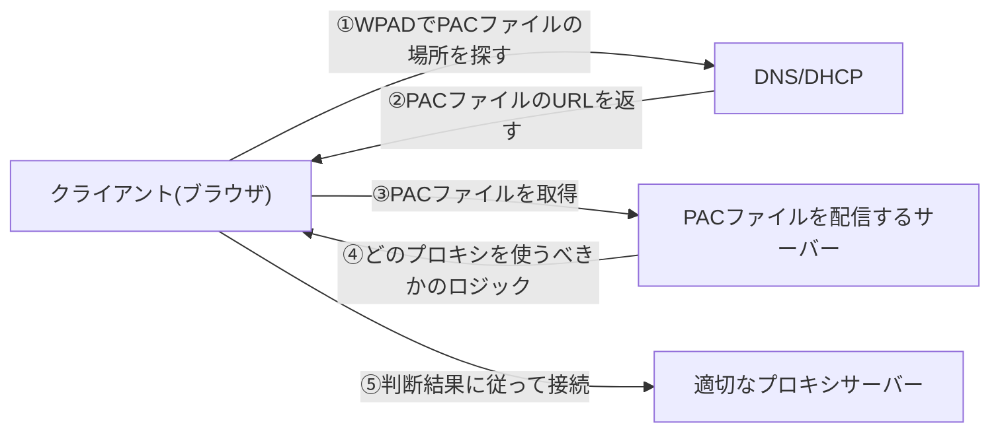

## はじめに

- **この記事で得られること**: [プロキシとファイアウォールの使い分け](/articles/proxy-firewall-guide)で扱った、明示的プロキシ(クライアント側でプロキシサーバーを指定する方式)を前提に、**社内の全端末に、プロキシの設定を手動で配布せずに済ませる**ための、**PAC**(Proxy Auto-Config)ファイルと**WPAD**(Web Proxy Auto-Discovery)という、2つの仕組みを体系的に理解します。
- **対象読者**: 会社のネットワーク設定で「プロキシの自動検出」という項目を見たことはあるものの、それが具体的に何を、どうやって検出しているのかを説明できない方を想定しています。
- **読むのにかかる想定時間**: 約16分

この記事は[『上位1%』シリーズ 全記事ガイド](/sitemap)の一部、[Webプロキシ/キャッシュ基礎シリーズ](/sitemap#シリーズ一覧)の4本目です。

## 前提知識

- **明示的プロキシ**: [プロキシとファイアウォールの使い分け](/articles/proxy-firewall-guide)で扱った、クライアント側に「このプロキシサーバーを使う」という設定を持たせる方式です。PACとWPADは、この設定を、手動ではなく自動で配布・検出するための仕組みです。

## 全体像をつかむ

明示的プロキシを使う場合、本来はクライアント(ブラウザ)に、「どのプロキシサーバーを使うか」を設定しておく必要があります。**これを、社内の何百台、何千台という端末すべてに、手作業で設定するのは現実的ではありません。** この問題を、**「どのプロキシを使うべきかを判断するロジック」を1つのファイル(PAC)にまとめる**ことと、**「そのファイルの場所を、端末側が自動的に見つけ出す」仕組み**(WPAD)という、2段階で解決します。



## 基礎から徹底解説

### PACファイル:JavaScriptで書かれた、たった1つの関数

PACファイルの実体は、`FindProxyForURL(url, host)`という、たった1つの関数を持つ、JavaScriptのテキストファイルです。ブラウザは、アクセスしようとしているURLごとに、この関数を呼び出し、**戻り値として得られる文字列に従って、使うべきプロキシを決定します。**

```javascript
function FindProxyForURL(url, host) {
  // 社内ドメインへのアクセスは、プロキシを経由せず直接アクセスする
  if (shExpMatch(host, "*.internal.example.test")) {
    return "DIRECT";
  }
  // それ以外は、社内プロキシサーバーを経由する
  return "PROXY proxy.example.test:8080";
}
```

**この仕組みの価値は、「URLやホスト名のパターンに応じて、プロキシを使い分ける」という、複雑な条件分岐を、プログラムのロジックとして自由に記述できる点にあります。** 単純な設定ファイルでは表現しづらい、「このドメインだけは直接アクセスする」「この時間帯だけ別のプロキシを使う」といった判断も、JavaScriptの条件分岐として、柔軟に書くことができます。

<details>
<summary>なぜ`DIRECT`という選択肢が、わざわざ用意されているのか</summary>

**社内ドメインやローカルネットワークへのアクセスまで、外部向けのプロキシサーバーを経由させてしまうと、無駄な遠回りが発生し、通信が遅くなります。** `DIRECT`は、「プロキシを一切使わず、直接接続する」ことを指示する、特別な戻り値です。社内向けの通信と、インターネット向けの通信を、同じPACファイルの中で、ロジックとして切り分けられることが、PACファイルの実務上の主要な使い道の1つです。

</details>

### WPAD:PACファイルの場所そのものを、自動的に見つける仕組み

PACファイルがあれば、プロキシの判断ロジックは1箇所にまとめられます。しかし、**「そのPACファイルが、どこにあるのか」を、クライアント側がまだ知らない**という問題が残ります。これを解決するのが、**WPAD**(Web Proxy Auto-Discovery Protocol)です。

WPADは、主に2つの方法で、PACファイルの場所(URL)を見つけます。

- **DHCP経由**: DHCPサーバーが、IPアドレスを配布する際に、オプション252という拡張フィールドで、PACファイルのURLを一緒に通知します。
- **DNS経由**: クライアントが、`http://wpad.<自社ドメイン>/wpad.dat`という、決まった命名規則のURLへ、まずアクセスを試みます。DNSが、このホスト名を正しく解決できれば、そのURLからPACファイルを取得します。

**この2つの方法のどちらが有効になっているかは、OSやブラウザの設定によって異なります。** 多くの環境では、DHCP経由の方法が優先され、それが失敗した場合に、DNS経由の方法へフォールバックする、という挙動になっています。

## プロが見ている視点(上位1%の理解)

### WPADという名前の仕組みが、歴史的に悪用の対象にもなってきた

WPADが「`wpad.<ドメイン名>`という、推測可能なホスト名に、自動的に問い合わせに行く」という設計は、**攻撃者が、その推測可能なホスト名を、先に(悪意を持って)登録してしまう**ことで、クライアントに、攻撃者が用意した偽のPACファイルを読み込ませ、通信を傍受される、というリスクの土台になります。これは、[GSLBの仕組み](/articles/load-balancing-gslb-guide)で扱った「推測可能なDNS名を悪用する」という発想とは別の文脈ですが、**「便利さのために自動化された仕組みは、その自動化の手順自体が、攻撃者にとっても同じように予測可能である」という、普遍的な緊張関係**を示す、典型的な例です。実務では、社内DNSで`wpad`という名前を明示的に(無害な値で)登録しておくなど、この推測可能性そのものを塞ぐ対策が取られます。

## よくある誤解・つまずきポイント

- **誤解1: 「PACファイルは、単純な設定値の一覧である」**
  PACファイルの実体は、JavaScriptで書かれた、実行可能なロジックです。単純な設定ファイルよりも、はるかに柔軟な条件分岐を表現できます。
- **誤解2: 「WPADは、1つの方法でしかPACファイルの場所を探さない」**
  WPADは、DHCP経由とDNS経由という、複数の方法を組み合わせて、PACファイルの場所を探します。
- **誤解3: 「PACファイルを設定すれば、WPADの設定は不要である」**
  PACファイルは「判断ロジック」、WPADは「そのファイルの場所を見つける仕組み」であり、別々の役割を持ちます。PACファイルのURLを、クライアントへ手動で配布する運用であれば、WPADなしでもPACファイル自体は機能します。

## 障害・トラブルシューティングの視点

1. **一部の端末だけ、プロキシの自動設定がうまくいかない**: その端末が、DHCP経由とDNS経由のどちらの方法でPACファイルを探しているかを確認します。
2. **PACファイルを更新したのに、古い判断ロジックのまま動いている**: ブラウザ側が、PACファイル自体をキャッシュしている可能性があります。
3. **PACファイルの`FindProxyForURL`関数が、意図しないプロキシを返す**: JavaScriptのロジック自体に、条件分岐の誤りがないかを確認します。`shExpMatch`のパターンマッチが、意図通りの範囲をカバーしているかを、個別のURLで検証してください。

## まとめ

- PACファイルは、`FindProxyForURL`という1つのJavaScript関数で、URLやホスト名に応じたプロキシの使い分けロジックを表現します。
- `DIRECT`という戻り値によって、プロキシを経由しない直接アクセスを指示できます。
- WPADは、DHCP経由・DNS経由という複数の方法で、PACファイルの場所そのものを自動的に見つける仕組みです。
- WPADの推測可能なホスト名は、歴史的に悪用の対象にもなってきたため、社内DNSでの明示的な対策が実務上重要です。

**今日から意識すべきこと**
1. プロキシの自動設定に関する問題に遭遇したら、「PACファイルのロジックの問題」か「WPADによる検出の問題」かを、まず切り分けましょう。
2. 社内のDNS設計を見直す際は、`wpad`という名前が、意図せず第三者に悪用されない状態になっているかを確認しましょう。

## 参考文献

- [Proxy Auto-Configuration (PAC) file | MDN Web Docs](https://developer.mozilla.org/en-US/docs/Web/HTTP/Proxy_servers_and_tunneling/Proxy_Auto-Configuration_PAC_file)
- [RFC Draft - Web Proxy Auto-Discovery Protocol (WPAD)](https://datatracker.ietf.org/doc/html/draft-ietf-wrec-wpad-01)
