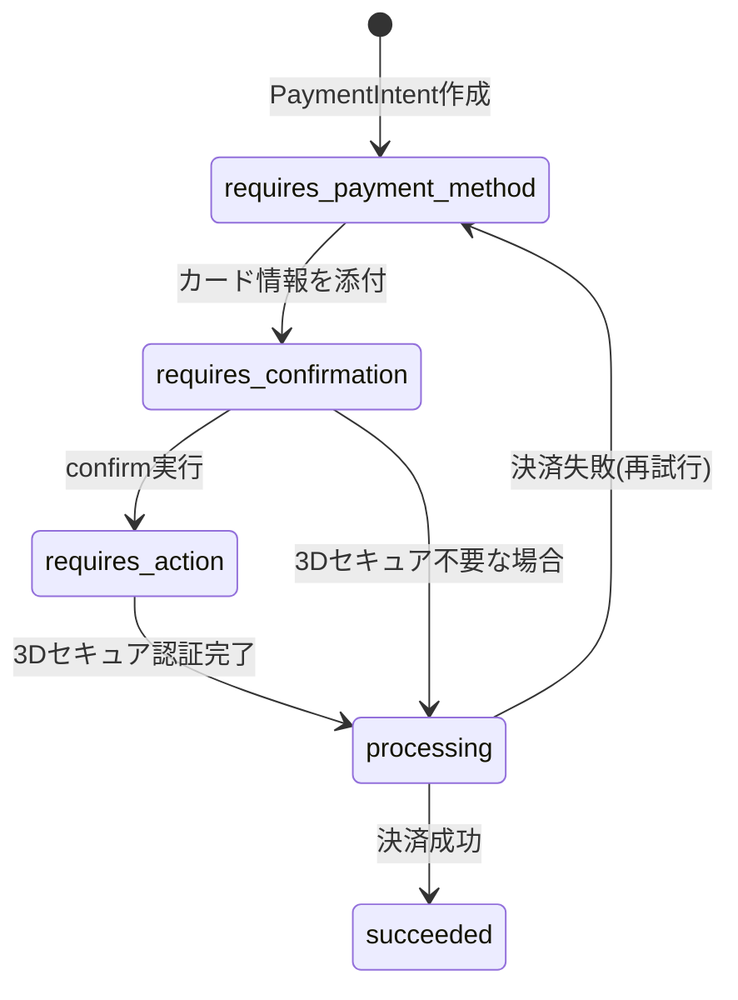
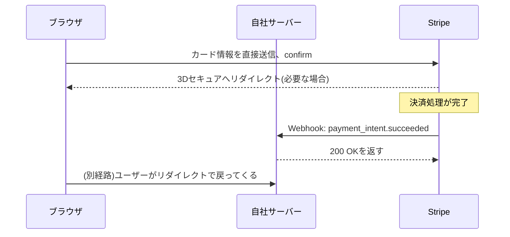

## はじめに

- **この記事で得られること**: [RESTful APIとは何かを『上位1%』の視点で理解する](/articles/restful-api-guide)で軽く触れた決済API(Stripe等)について、実際にどのような設計になっているのかを深掘りします。決済APIが単純な「1回のAPI呼び出しで完了」という形になっていない理由、決済の完了を正しく検知するための**Webhook**という仕組み、そしてカード番号という機微情報を自社サーバーに一切触れさせない設計(PCI DSS対応)までを、Stripeを具体例に体系的に理解します。
- **対象読者**: 決済機能をアプリに組み込んだことはあるが、なぜ「決済実行」の1回のAPI呼び出しだけで完結しないのか、なぜWebhookという別の仕組みが必要なのかを説明できない方を想定しています。
- **読むのにかかる想定時間**: 約20分

この記事は[『上位1%』シリーズ 全記事ガイド](/sitemap)の一部です。

## 前提知識

- [RESTful APIとは何かを『上位1%』の視点で理解する](/articles/restful-api-guide): 冪等性キー(Idempotency-Key)、ステートレスな認証の仕組みについて、この記事の前提になっています。

## 全体像をつかむ

### なぜ「1回のAPI呼び出しで決済完了」にならないのか

決済APIの設計で最初に驚くのが、**「カード情報を渡して、決済実行」という1回のAPI呼び出しだけでは完結しない**という点です。これは、決済処理そのものの複雑さに加えて、**3Dセキュア**(3D Secure、EUのSCA規制などで要求される追加認証)のように、途中でユーザーを発行銀行の認証画面へ一時的にリダイレクトさせる必要がある処理が挟まることがあるためです。この「複数のステップにまたがる、状態を持った処理」を表現するために、Stripeでは**PaymentIntent**というオブジェクトを中心にした設計を採用しています。



`PaymentIntent`は、作成された瞬間から`succeeded`(成功)になるまでの間、`requires_payment_method`→`requires_confirmation`→(必要なら)`requires_action`→`processing`→`succeeded`という状態を遷移していく、**1つの決済の一生を表すオブジェクト**です。

## 基礎から徹底解説

### Step 1: PaymentIntentを作成する

決済処理は、まずサーバー側で金額・通貨を指定して`PaymentIntent`を作成するところから始まります。

```bash
curl https://api.stripe.com/v1/payment_intents \
  -u sk_test_...: \
  -d amount=2000 \
  -d currency=jpy \
  -d "automatic_payment_methods[enabled]"=true
```

このリクエストは、実際にお金を動かすものではなく、**「これから2000円の決済を行う予定です」という意図(intent)を登録するだけの処理**です。レスポンスには、この決済を一意に識別する`client_secret`が含まれており、これをブラウザ側(フロントエンド)へ渡します。

### Step 2: カード情報の入力とconfirm

**ここが決済APIの設計で最も重要なポイントです。** カード番号そのものは、自社のサーバーを一切経由せず、**Stripeが提供するJavaScriptのUI部品(Stripe Elements)を通じて、ブラウザから直接Stripeのサーバーへ送信されます。** 自社サーバーがカード番号を受け取ったり、保存したり、ログに出力したりすることは一度もありません。ブラウザ側でカード情報の入力とconfirm処理が完了すると、`PaymentIntent`は`requires_confirmation`から次の状態へ進みます。

<details>
<summary>なぜこの設計が重要なのか(PCI DSS)</summary>

クレジットカード業界には、**PCI DSS**(Payment Card Industry Data Security Standard)という、カード情報を扱う事業者に課される厳格なセキュリティ基準があります。自社サーバーがカード番号を直接扱う(受け取る・保存する・通過させる)と、このPCI DSSの重い準拠義務(定期的な監査、通信経路の暗号化基準など)を自社が背負うことになります。**Stripe Elementsのようなツールを使い、カード番号がブラウザからStripeへ直接送られる設計にすることで、自社サーバーは一度もカード番号に触れないため、PCI DSS準拠の対象範囲(スコープ)を大幅に小さく保てます。** これは決済APIを使う最大の実務的メリットの1つです。

</details>

### Step 3: 3Dセキュア(SCA)が必要な場合

カード発行銀行がリスクが高いと判断した取引や、EU圏のカードなど規制上必須なケースでは、`PaymentIntent`は`requires_action`という状態になります。このとき、ユーザーは発行銀行が用意する認証画面(SMSでのワンタイムパスコード入力など)へ一時的にリダイレクトされ、本人確認が完了すると`processing`(処理中)の状態に進みます。**この追加ステップの有無を事前に確定させることができない(発行銀行側の判断による)ため、決済APIは「必ず認証が必要」とも「絶対に不要」とも決め打ちできない、状態遷移をともなう設計になっている**、という点を理解しておいてください。

### Step 4: 決済結果を正しく検知する:なぜWebhookが必要なのか

ここまでの流れで、フロントエンドは「決済が成功したらこの画面を表示する」というコードを書きたくなります。しかし、**フロントエンド側のリダイレクト完了を、決済成功の確定的な証拠として使ってはいけません。** 次のような場面を考えてみてください。

- ユーザーが3Dセキュアの認証を終えた直後、ブラウザを閉じてしまった(サイトへのリダイレクトが発生しなかった)
- 決済自体は成功したが、その結果を伝えるレスポンスがネットワーク不調でフロントエンドに届かなかった

このように、**「決済が実際に成功したかどうか」と「その結果がフロントエンドに伝わったかどうか」は、別々に失敗しうる、独立した事象です。** そこで決済APIでは、**Webhook**という仕組みを使い、決済の状態が変化するたびに、Stripe側から自社のサーバーへ直接HTTPリクエスト(通知)を送信させます。



**このWebhookこそが、決済結果の唯一信頼できる情報源(source of truth)です。** フロントエンドのリダイレクトは、あくまでユーザー体験のための表示更新であり、実際の注文確定処理(在庫を確保する、発送指示を出すなど)は、**必ずこのWebhookの受信をトリガーに行う**必要があります。

<details>
<summary>Webhookのなりすまし対策:署名検証</summary>

Webhookは、外部(Stripe)から自社サーバーへの、通常のHTTPリクエストとして届きます。ということは、**Webhookの受信エンドポイントのURLさえ知っていれば、悪意ある第三者が「決済が成功しました」という偽のリクエストを送りつけられてしまう**、という脆弱性が原理的に成立してしまいます。これを防ぐため、Stripeは各Webhookリクエストに、契約時にのみ共有される秘密鍵を使った**HMAC署名**をヘッダーに含めて送信します。受信側は、この署名を自分でも同じ秘密鍵を使って計算し直し、一致するかどうかを検証して初めて、そのリクエストを正当なものとして処理します。この署名検証を省略すると、Webhookエンドポイントは誰でも決済成功を偽装できる、実質的な脆弱性になってしまいます。

</details>

## プロが見ている視点(上位1%の理解)

### 冪等性キーが決済APIで特に重要な理由

[RESTful APIとは何かを『上位1%』の視点で理解する](/articles/restful-api-guide)で扱った冪等性キー(Idempotency-Key)は、決済APIにおいて特に重要です。`PaymentIntent`の作成リクエストがタイムアウトし、クライアントが「届いていないかもしれない」と判断してリトライした場合、冪等性キーがなければ、同じ内容の`PaymentIntent`(そして最悪の場合、二重の決済)が作られてしまう可能性があります。Stripeでは、リクエストヘッダーに`Idempotency-Key: <一意な文字列>`を含めることで、同じキーを持つリクエストが既に処理済みであれば、新規処理を行わず前回と同じ結果を返す、という安全な再試行を実現しています。

### テストモードとテストカード

決済APIは、本番環境とは別に**テストモード**を持っており、専用の**テストカード番号**(Stripeの場合`4242 4242 4242 4242`など)を使うことで、実際にお金を動かさずに、決済成功・失敗・3Dセキュア要求といった各シナリオを再現できます。実務で決済機能を開発する際は、本番相当の`sk_live_...`キーとテストモードの`sk_test_...`キーを絶対に混同しない(誤って本番キーをテスト環境の設定ファイルに書かない)運用が重要です。

## よくある誤解・つまずきポイント

- **誤解1: 「決済APIは、カード情報を渡して1回のAPI呼び出しをすれば完了する」**
  3Dセキュアなどの追加認証が挟まる可能性があるため、`PaymentIntent`という状態遷移を持つオブジェクトを介した、複数ステップの設計になっています。
- **誤解2: 「フロントエンドがリダイレクトで戻ってきたことをもって、決済成功とみなしてよい」**
  リダイレクトの到達は保証されないため、実際の注文確定処理は必ずWebhookの受信をトリガーに行う必要があります。
- **誤解3: 「Webhookは外部からのHTTPリクエストなので、届いた内容をそのまま信用してよい」**
  Webhookは署名を検証して初めて、正当なリクエストとして処理すべきです。

## 障害・トラブルシューティングの視点

1. **決済は成功しているはずなのに、注文確定処理が実行されない**: Webhookの受信エンドポイントが正しく設定されているか、署名検証で弾かれていないか、Stripeダッシュボードの「Webhookログ」で実際の送信結果(ステータスコード)を確認してください。
2. **同じ注文が二重に決済されてしまう**: `PaymentIntent`作成リクエストに冪等性キーが正しく設定されているかを確認してください。
3. **3Dセキュアの画面から戻ってこない、決済が完了しない**: ユーザーがリダイレクト後の画面を閉じてしまった可能性があります。この場合でも、決済自体がバックグラウンドで成功していれば、Webhookは正しく送信されるため、Webhookベースの処理をしていれば実務上の問題にはなりません。

## まとめ

- 決済APIは、3Dセキュアのような追加認証が挟まる可能性があるため、`PaymentIntent`という状態遷移を持つオブジェクトを中心にした、複数ステップの設計になっています。
- カード番号は自社サーバーを経由させず、Stripe Elementsのような部品を使ってブラウザから直接決済事業者へ送信することで、PCI DSSの準拠範囲を小さく保てます。
- フロントエンドのリダイレクト到達は保証されないため、実際の注文確定処理は、Webhookの受信を唯一信頼できるトリガーとして行う必要があります。
- Webhookは署名検証を行って初めて、正当なリクエストとして処理すべきです。

**今日から意識すべきこと**
1. 決済機能を実装する際は、「フロントエンドの見た目」と「実際の注文確定処理」を、必ず別のトリガー(前者は画面遷移、後者はWebhook)で分離しましょう。
2. Webhookエンドポイントを実装する際は、署名検証を絶対に省略しないようにしましょう。

## 参考文献

- [Stripe API Reference: PaymentIntents](https://stripe.com/docs/api/payment_intents)
- [Stripe: Webhooks](https://stripe.com/docs/webhooks)
- [Stripe: Strong Customer Authentication (SCA)](https://stripe.com/docs/strong-customer-authentication)
