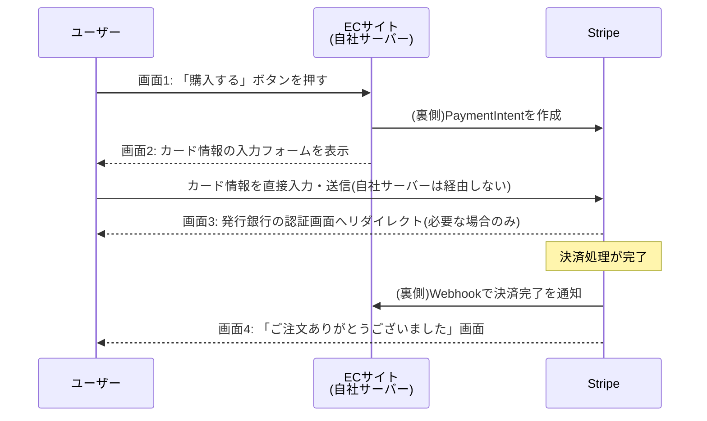
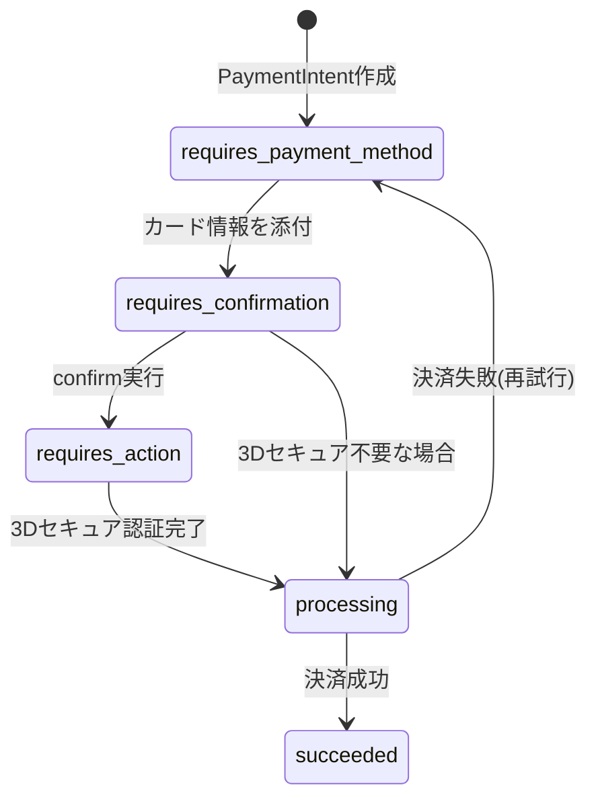
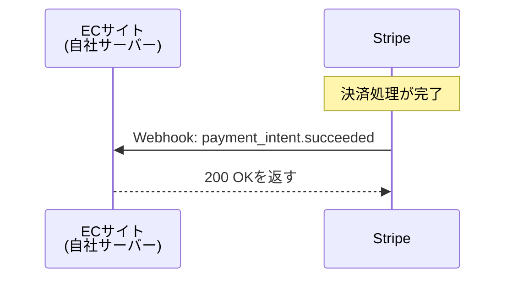

## はじめに

- **この記事の性質について**: この記事は、**ハンズオンではなく解説記事**です。実際にStripeのアカウントを作成したり、コードを書いたりする必要はありません。ECサイトで買い物をしたときにユーザーとして目にする決済画面が、裏側でどのような処理と対応しているのかを、順を追って読み解いていきます。
- **この記事で得られること**: [RESTful APIとは何かを『上位1%』の視点で理解する](/articles/restful-api-guide)で軽く触れた決済API(Stripe等)について、実際にどのような設計になっているのかを深掘りします。決済APIが単純な「1回のAPI呼び出しで完了」という形になっていない理由、決済の完了を正しく検知するための**Webhook**という仕組み、そしてカード番号という機微情報を自社サーバーに一切触れさせない設計(PCI DSS対応)までを、Stripeを具体例に体系的に理解します。
- **なぜこの記事がWeb/APIシリーズにとって重要なのか**: 決済機能は、多くのWebサービス開発者が、キャリアのどこかで一度は実装することになる、非常に一般的な機能です。そして決済APIは、[RESTful APIとは何かを『上位1%』の視点で理解する](/articles/restful-api-guide)で扱った冪等性・認証・Webhookといった概念が、「実際に間違えるとお金の二重請求や注文の取りこぼしという、具体的な実害につながる」形で、すべて同時に問われる、実務的にも学習効果的にも密度の高い題材です。
- **対象読者**: 決済機能をアプリに組み込んだことはあるが、なぜ「決済実行」の1回のAPI呼び出しだけで完結しないのか、なぜWebhookという別の仕組みが必要なのかを説明できない方、あるいはStripeのようなサービスを利用したことがなく、決済画面がどう動いているのか具体的にイメージできていない方を想定しています。
- **読むのにかかる想定時間**: 約25分

この記事は[『上位1%』シリーズ 全記事ガイド](/sitemap)の一部です。

## 前提知識

- [RESTful APIとは何かを『上位1%』の視点で理解する](/articles/restful-api-guide): 冪等性キー(Idempotency-Key)、ステートレスな認証の仕組みについて、この記事の前提になっています。
- **「自社サーバー」という言葉について**: この記事で繰り返し登場する「自社サーバー」とは、**ユーザーが商品を購入しているECサイトなど、決済機能を組み込む側の事業者(加盟店)が運用しているサーバー**を指します。Stripeのサーバーとは別物であり、この2つを混同しないことが、この記事全体を理解する鍵になります。

## 全体像をつかむ:ユーザーが実際に目にする4つの画面

決済APIの解説は、いきなりAPIやコードから入ると実感が湧きにくいため、まず**ユーザーが実際にECサイトで買い物をするときに目にする、4つの画面**を追いかけます。


```mermaid
sequenceDiagram
    participant User as ユーザー
    participant Site as ECサイト<br/>(自社サーバー)
    participant Stripe as Stripe

    User->>Site: 画面1: 「購入する」ボタンを押す
    Site->>Stripe: (裏側)PaymentIntentを作成
    Site-->>User: 画面2: カード情報の入力フォームを表示
    User->>Stripe: カード情報を直接入力・送信(自社サーバーは経由しない)
    Stripe-->>User: 画面3: 発行銀行の認証画面へリダイレクト(必要な場合のみ)
    Note over Stripe: 決済処理が完了
    Stripe->>Site: (裏側)Webhookで決済完了を通知
    Stripe-->>User: 画面4: 「ご注文ありがとうございました」画面
```

この4つの画面それぞれの裏側で、何が起きているのかを、この後1つずつ深掘りしていきます。

## 基礎から徹底解説

### 画面1: 「購入する」ボタンを押した瞬間、自社サーバーで起きていること

ユーザーが「購入する」ボタンを押すと、ユーザー自身は何も意識しませんが、裏側では**自社サーバー**が、Stripeに対してAPIリクエストを送り、これから行う決済の金額と通貨を登録します。

```bash
curl https://api.stripe.com/v1/payment_intents \
  -u sk_test_...: \
  -d amount=2000 \
  -d currency=jpy \
  -d "automatic_payment_methods[enabled]"=true
```

**このAPIリクエストを送っているのはユーザーのブラウザではなく、自社サーバー自身です。** ユーザーからは見えない、サーバー同士の通信です。このリクエストは、実際にお金を動かすものではなく、**「これから2000円の決済を行う予定です」という意図(intent)を登録するだけの処理**です。この意図を表すオブジェクトが、**PaymentIntent**です。


```mermaid
stateDiagram-v2
    [*] --> requires_payment_method: PaymentIntent作成
    requires_payment_method --> requires_confirmation: カード情報を添付
    requires_confirmation --> requires_action: confirm実行
    requires_action --> processing: 3Dセキュア認証完了
    requires_confirmation --> processing: 3Dセキュア不要な場合
    processing --> succeeded: 決済成功
    processing --> requires_payment_method: 決済失敗(再試行)
```

`PaymentIntent`は、作成された瞬間から`succeeded`(成功)になるまでの間、この図のように状態を遷移していく、**1つの決済の一生を表すオブジェクト**です。レスポンスには、この決済を一意に識別する`client_secret`が含まれており、これをユーザーのブラウザ(フロントエンド)へ渡すことで、画面2の準備が整います。

### 画面2: カード情報の入力フォームで、実際に起きていること

ユーザーの目には、ごく普通のカード情報入力フォームに見えます。しかし、**このフォームの入力欄は、自社サイトのHTML/JavaScriptが直接作っているものではありません。** Stripeが提供する**Stripe Elements**というJavaScriptの部品が、`<iframe>`として自社サイトのページの中に埋め込まれており、ユーザーが入力するカード番号は、この`iframe`の中、つまりStripe自身が管理する領域に直接入力されます。

**ユーザーがカード番号を入力してもコレを確定(confirm)すると、キー入力の内容は、自社サーバーはおろか、自社サイトのJavaScriptコードすら経由せず、ブラウザからStripeのサーバーへ直接送信されます。** 自社サーバーが受け取るのは、カード番号そのものではなく、その決済に使ってよいことを示す、トークン化された参照情報だけです。

<details>
<summary>なぜこの設計が重要なのか(PCI DSS)</summary>

クレジットカード業界には、**PCI DSS**(Payment Card Industry Data Security Standard)という、カード情報を扱う事業者に課される厳格なセキュリティ基準があります。自社サーバーがカード番号を直接扱う(受け取る・保存する・通過させる)と、このPCI DSSの重い準拠義務(定期的な監査、通信経路の暗号化基準など)を自社が背負うことになります。**Stripe Elementsのような部品を使い、カード番号が「自社のコードを一切経由せず」ブラウザからStripeへ直接送られる設計にすることで、自社サーバーはおろか自社のJavaScriptコードも一度もカード番号に触れないため、PCI DSS準拠の対象範囲(スコープ)を、最も軽い区分(SAQ A)まで小さく保てます。** これは決済APIを使う最大の実務的メリットの1つです。

</details>

ブラウザ側でカード情報の入力とconfirm処理が完了すると、`PaymentIntent`は`requires_confirmation`から次の状態へ進みます。

### 画面3: 発行銀行の認証画面(3Dセキュア/SCA)が表示される場合

カード発行銀行がリスクが高いと判断した取引や、EU圏のカードなど規制上必須なケースでは、ユーザーは一時的に、**カードを発行した銀行が用意する認証画面**(SMSでのワンタイムパスコード入力など)へリダイレクトされます。この間、`PaymentIntent`は`requires_action`という状態になっています。本人確認が完了すると、ユーザーは元のECサイトへ戻され、`PaymentIntent`は`processing`(処理中)の状態に進みます。

**この追加ステップが発生するかどうかは、発行銀行側の判断によるものであり、自社サーバー側では事前に確定できません。** そのため決済APIは、「必ず認証画面を挟む」とも「絶対に挟まない」とも決め打ちできない、状態遷移をともなう設計になっている、という点を理解しておいてください。

### 画面4: 「ご注文ありがとうございました」画面と、Webhookという仕組み

ユーザーは最終的に、注文完了を伝える画面を目にします。しかし、**この画面が表示されたことを、決済成功の確定的な証拠として使ってはいけません。**

まず、**Webhook**そのものが何なのかを理解しておきましょう。通常のAPI利用では、「クライアントが尋ね、サーバーが答える」という一方向の関係になります。**Webhookは、この関係が逆転する仕組みです。** 自社サーバーがStripeに「決済は完了しましたか」と繰り返し尋ね続ける(ポーリングする)のではなく、**Stripe側が、決済の状態が変化した「その瞬間」に、自発的に自社サーバーへHTTPリクエストを送りつけてくる**、という仕組みです。郵便受けを何度も確認しに行く代わりに、配達員が届いたその場で電話をかけてきてくれる、とイメージすると分かりやすいでしょう。

なぜこのWebhookが必要なのか、次のような場面を考えてみてください。

- ユーザーが3Dセキュアの認証を終えた直後、ブラウザを閉じてしまった(自社サイトへのリダイレクトが発生しなかった)
- 決済自体は成功したが、その結果を伝えるレスポンスがネットワーク不調でユーザーのブラウザに届かなかった

このように、**「決済が実際に成功したかどうか」と「その結果が画面4としてユーザーに表示されたかどうか」は、別々に失敗しうる、独立した事象です。** 画面4の表示は、あくまでユーザー体験のための演出であり、実際の注文確定処理(在庫を確保する、発送指示を出すなど)は、**必ずWebhookの受信をトリガーに行う**必要があります。


```mermaid
sequenceDiagram
    participant Site as ECサイト<br/>(自社サーバー)
    participant Stripe as Stripe

    Note over Stripe: 決済処理が完了
    Stripe->>Site: Webhook: payment_intent.succeeded
    Site-->>Stripe: 200 OKを返す
```

**このWebhookこそが、決済結果の唯一信頼できる情報源(source of truth)です。**

<details>
<summary>Webhookのなりすまし対策:署名検証</summary>

Webhookは、外部(Stripe)から自社サーバーへの、通常のHTTPリクエストとして届きます。ということは、**Webhookの受信エンドポイントのURLさえ知っていれば、悪意ある第三者が「決済が成功しました」という偽のリクエストを送りつけられてしまう**、という脆弱性が原理的に成立してしまいます。これを防ぐため、Stripeは各Webhookリクエストに、契約時にのみ共有される秘密鍵を使った**HMAC署名**をヘッダーに含めて送信します。受信側は、この署名を自分でも同じ秘密鍵を使って計算し直し、一致するかどうかを検証して初めて、そのリクエストを正当なものとして処理します。この署名検証を省略すると、Webhookエンドポイントは誰でも決済成功を偽装できる、実質的な脆弱性になってしまいます。

</details>

## プロが見ている視点(上位1%の理解)

### 冪等性キーが決済APIで特に重要な理由

[RESTful APIとは何かを『上位1%』の視点で理解する](/articles/restful-api-guide)で扱った冪等性キー(Idempotency-Key)は、決済APIにおいて特に重要です。`PaymentIntent`の作成リクエストがタイムアウトし、自社サーバーが「届いていないかもしれない」と判断してリトライした場合、冪等性キーがなければ、同じ内容の`PaymentIntent`(そして最悪の場合、二重の決済)が作られてしまう可能性があります。Stripeでは、リクエストヘッダーに`Idempotency-Key: <一意な文字列>`を含めることで、同じキーを持つリクエストが既に処理済みであれば、新規処理を行わず前回と同じ結果を返す、という安全な再試行を実現しています。

### テストモードとテストカード

決済APIは、本番環境とは別に**テストモード**を持っており、専用の**テストカード番号**(Stripeの場合`4242 4242 4242 4242`など)を使うことで、実際にお金を動かさずに、決済成功・失敗・3Dセキュア要求といった各シナリオを再現できます。実務で決済機能を開発する際は、本番相当の`sk_live_...`キーとテストモードの`sk_test_...`キーを絶対に混同しない(誤って本番キーをテスト環境の設定ファイルに書かない)運用が重要です。

## よくある誤解・つまずきポイント

- **誤解1: 「決済APIは、カード情報を渡して1回のAPI呼び出しをすれば完了する」**
  3Dセキュアなどの追加認証が挟まる可能性があるため、`PaymentIntent`という状態遷移を持つオブジェクトを介した、複数ステップの設計になっています。
- **誤解2: 「画面4(注文完了画面)が表示されたことをもって、決済成功とみなしてよい」**
  画面4の表示到達は保証されないため、実際の注文確定処理は必ずWebhookの受信をトリガーに行う必要があります。
- **誤解3: 「Webhookは外部からのHTTPリクエストなので、届いた内容をそのまま信用してよい」**
  Webhookは署名を検証して初めて、正当なリクエストとして処理すべきです。

## 障害・トラブルシューティングの視点

1. **決済は成功しているはずなのに、注文確定処理が実行されない**: Webhookの受信エンドポイントが正しく設定されているか、署名検証で弾かれていないか、Stripeダッシュボードの「Webhookログ」で実際の送信結果(ステータスコード)を確認してください。
2. **同じ注文が二重に決済されてしまう**: `PaymentIntent`作成リクエストに冪等性キーが正しく設定されているかを確認してください。
3. **3Dセキュアの画面から戻ってこない、決済が完了しない**: ユーザーがリダイレクト後の画面を閉じてしまった可能性があります。この場合でも、決済自体がバックグラウンドで成功していれば、Webhookは正しく送信されるため、Webhookベースの処理をしていれば実務上の問題にはなりません。

## まとめ

- 決済APIは、3Dセキュアのような追加認証が挟まる可能性があるため、`PaymentIntent`という状態遷移を持つオブジェクトを中心にした、複数ステップの設計になっています。
- カード番号は自社サーバーはおろか自社のJavaScriptコードも経由させず、Stripe Elementsのような部品を使ってブラウザから直接決済事業者へ送信することで、PCI DSSの準拠範囲を小さく保てます。
- Webhookとは、サーバー側が状態変化のタイミングで自発的に通知を送ってくる、通常のAPI利用とは逆方向の仕組みです。
- ユーザーに見える画面(フロントエンドのリダイレクト)の到達は保証されないため、実際の注文確定処理は、Webhookの受信を唯一信頼できるトリガーとして行う必要があります。

**今日から意識すべきこと**
1. 決済機能を実装する際は、「フロントエンドの見た目」と「実際の注文確定処理」を、必ず別のトリガー(前者は画面遷移、後者はWebhook)で分離しましょう。
2. Webhookエンドポイントを実装する際は、署名検証を絶対に省略しないようにしましょう。

## 参考文献

- [Stripe API Reference: PaymentIntents](https://stripe.com/docs/api/payment_intents)
- [Stripe: Webhooks](https://stripe.com/docs/webhooks)
- [Stripe: Strong Customer Authentication (SCA)](https://stripe.com/docs/strong-customer-authentication)
