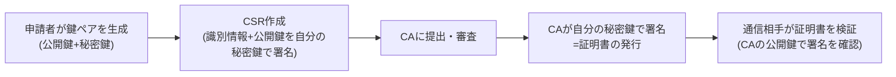
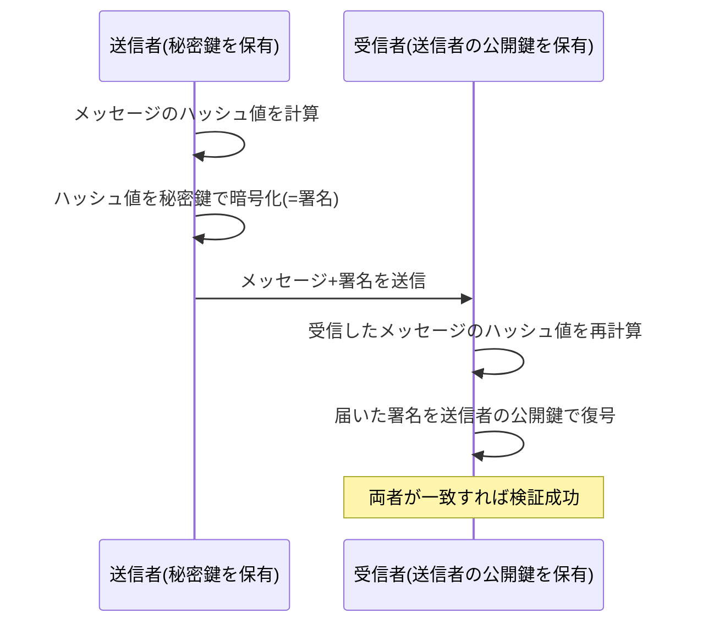
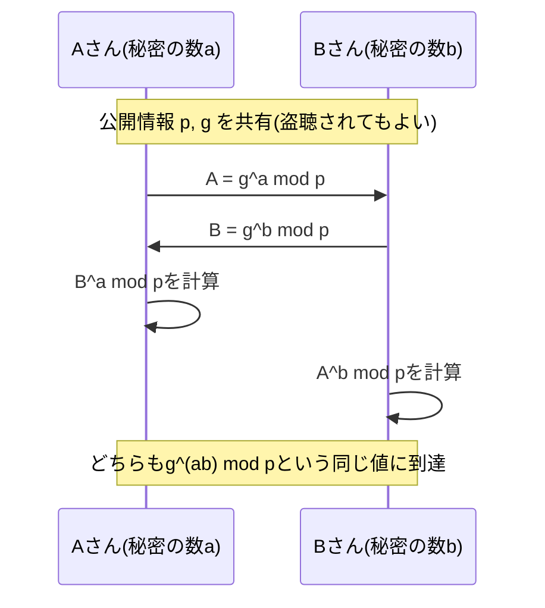
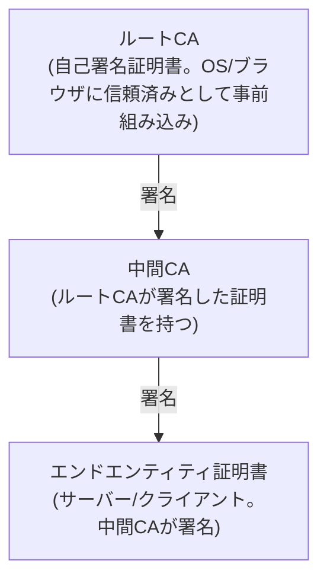

## はじめに

- **この記事で得られること**: 「証明書」という言葉の中身——公開鍵暗号がなぜ「鍵が2つ」で成立するのか、盗聴者に見られている経路上でDiffie-Hellman鍵交換がどうやって共通の秘密値を作り出すのか、デジタル署名がどういう手順で「本人が作った・改ざんされていない」を証明するのか、CSR（証明書署名要求）に何が入っているのか、CA（認証局）が証明書を発行するとはどういう処理なのか、そして証明書チェーンの検証が具体的に何を確認しているのかを、体系的に理解できます。
- **対象読者**: インフラエンジニアとして「証明書の期限切れ」のようなトラブル対応はしたことがあるものの、公開鍵暗号・デジタル署名・証明書チェーンの検証といった裏側の仕組みまでは説明できない方を想定しています。
- **読むのにかかる想定時間**: 約20分

この記事は[『上位1%』シリーズ 全記事ガイド](/sitemap)の一部です。

ブラウザのアドレスバーの鍵マーク、VPN接続時の証明書認証、SSHの公開鍵ログイン——「証明書」や「公開鍵」という言葉は様々な場面に登場しますが、その裏側の仕組みは共通しています。この記事では、これらの技術の土台になっているPKI（Public Key Infrastructure、公開鍵基盤）を、暗号の基礎から掘り下げます。

## 前提知識

- **ハッシュ関数**: 任意の長さのデータを入力すると、常に固定長の値（ハッシュ値）を出力する関数です。同じ入力からは常に同じ出力が得られる一方、入力が1ビットでも変わればハッシュ値はまったくの別物になり（衝突耐性を持つよう設計されており）、ハッシュ値から元の入力を逆算することもできません（一方向性）。SHA-256などが代表例です。
- **共通鍵暗号（対称鍵暗号）**: 暗号化と復号に同じ鍵を使う暗号方式です。AESなどが代表例で、公開鍵暗号（後述）に比べて計算コストが低いのが特徴です。

## 全体像をつかむ

### 一言で言うと

PKI（Public Key Infrastructure）とは、**「ある公開鍵の持ち主が、確かに名乗っている本人（あるいはそのサーバー）である」ということを、信頼できる第三者（CA）が証明書という形で保証する仕組み全体**です。

証明書自体は「公開鍵+識別情報+CAの署名」がセットになったデータであり、これを検証する側は「CAという信頼できる第三者が、この公開鍵とこの識別情報の組み合わせを保証している」ということを確認できます。

### 公開鍵暗号の非対称性

公開鍵暗号（RSA、ECDSAなど）は、数学的に対になった**公開鍵**と**秘密鍵**のペアを使います。公開鍵は誰に渡しても構いませんが、秘密鍵は持ち主だけが厳重に保管します。この鍵ペアには、目的の異なる2つの使い方があります。

| 用途 | 暗号化・生成する側 | 復号・検証する側 | 目的 |
|---|---|---|---|
| 暗号化（秘匿） | 受信者の**公開鍵**で暗号化 | 受信者本人が**秘密鍵**で復号 | 「その秘密鍵を持つ本人以外には読めない」ようにする |
| デジタル署名 | 送信者が自分の**秘密鍵**で署名 | 誰でも送信者の**公開鍵**で検証 | 「その秘密鍵を持つ本人が確かに作った」ことを証明する |

**「秘密鍵で暗号化して、公開鍵で復号する」という理解は誤り**——正確には、用途によって鍵の使われる向きが逆になります。証明書の仕組みで中心になるのは、このうち**デジタル署名**の使い方です。

## 基礎から徹底解説

### デジタル署名の仕組み

デジタル署名は、次の手順で「本人が作成したこと」と「改ざんされていないこと」の両方を同時に証明します。

1. 送信者は、送りたいデータ（メッセージ）のハッシュ値を計算します。
2. そのハッシュ値を、送信者自身の**秘密鍵**で暗号化します。これが「署名」です。
3. 送信者は、元のメッセージと、この署名をセットにして相手に送ります。
4. 受信者は、届いたメッセージから改めてハッシュ値を計算し直す一方、届いた署名を送信者の**公開鍵**で復号します。
5. 両者が一致すれば、「このメッセージは確かに秘密鍵の持ち主が署名したものであり（本人性）、署名後に1ビットも改ざんされていない（完全性）」ことが同時に証明されます。

メッセージ全体ではなくハッシュ値に対して署名するのは、公開鍵暗号の計算コストが高く、データ全体を暗号化するのは非効率なためです。固定長のハッシュ値にだけ署名することで、元のデータがどれだけ大きくても署名処理自体は一定のコストで済みます。

### 鍵交換：Diffie-Hellman(DH)の仕組み

冒頭の表で扱った「暗号化」「デジタル署名」は、どちらも当事者が最初から鍵ペアを持っていることが前提でした。これらとは別に、公開鍵暗号の考え方を使ったもう1つの重要な仕組みが**鍵交換（Key Exchange）**です。鍵交換とは、「盗聴者が通信内容をすべて見ていたとしても、当事者2人だけが知る共通の秘密の値を新たに作り出す」ための手順で、TLSやIKE（IPsecの鍵合意プロトコル）など、実務のほぼすべての暗号化プロトコルの出発点になっています。

最も基本的な方式が**Diffie-Hellman(DH)鍵交換**です。手順は次の通りです。

1. あらかじめ、大きな素数**p**と、その世界で計算の起点となる数**g**（原始根、generator）の2つを、双方が公開情報として共有します（盗聴されても問題ありません）。
2. 各当事者は、それぞれ他人に一切明かさない秘密の数（**a**、**b**）をランダムに選びます。
3. 自分の秘密の数を使って公開値を計算し、相手に送ります。
   - Aさん: `A = g^a mod p` を計算して送信
   - Bさん: `B = g^b mod p` を計算して送信
4. 受け取った相手の公開値に、自分だけが持つ秘密の数でべき乗する計算を行うと、双方が同じ値にたどり着きます。
   - Aさん: `B^a mod p = g^(ba) mod p`
   - Bさん: `A^b mod p = g^(ab) mod p`
   - `g^(ba) mod p` と `g^(ab) mod p` は指数法則上まったく同じ値になるため、**双方が独立に同一の共有秘密値**にたどり着きます。

盗聴者はp、g、A、Bのすべてを見ることができますが、そこから共有秘密値`g^(ab) mod p`を計算するには、`A = g^a mod p`からaを逆算する必要があります。これは**離散対数問題**と呼ばれ、pとgが十分大きければ現実的な時間では解けないことが安全性の根拠になっています（掛け算・べき乗は簡単でも、そこから元の指数を割り出す計算は非常に重い、という非対称性を利用しています）。

**DHが公開鍵暗号・デジタル署名と決定的に違う点**は、DHには「暗号化する・署名する」という概念自体が存在しないことです。DHが生み出すのは、あくまで「これから始まる通信を暗号化するための共通鍵の材料」であり、通信の相手が本当に名乗っている本人かどうかは一切保証しません（この身元の保証を担うのが、まさにこの記事で扱っているデジタル署名・証明書の役割です）。実際のプロトコル（IKE、TLSなど）では、DHで共有鍵を作ると同時に、デジタル署名（または事前共有鍵）で相手の身元を確認する、という2つの仕組みを組み合わせて初めて「安全な相手と、安全な鍵を共有する」ことが成立します。

楕円曲線DH(ECDH)と、Perfect Forward Secrecy(PFS)

実務では、上記の素朴な(mod pの掛け算・べき乗による)DHではなく、より効率的な**楕円曲線DH(ECDH)**が広く使われています。数学的な土台は楕円曲線上の演算に置き換わりますが、「双方が公開値を交換し、自分の秘密の数と組み合わせて同じ値に到達する」という基本構造は変わりません。

また、DHで使う秘密の数(a, b)を**毎回の通信のたびに使い捨てにする**運用を**Ephemeral DH(DHE、楕円曲線ならECDHE)**と呼びます。長期間使う署名用の秘密鍵とは別に、その場限りの鍵をDHで作ることで、万が一将来その長期鍵が漏洩しても、過去に記録・盗聴された通信をあとから復号することができなくなります。この性質を**Perfect Forward Secrecy(PFS、前方秘匿性)**と呼び、IKEのフェーズ2(Quick Mode)で新たなDH鍵交換を追加で行う運用(PFSの有効化)は、この性質を得るためのものです。

### CSR（Certificate Signing Request）の中身と作成

証明書を取得したい申請者（サーバーやクライアント）は、まず次の手順を踏みます。

1. 自分の公開鍵・秘密鍵のペアを生成します。
2. 「自分の識別情報（ドメイン名やユーザー名などの識別子）」と「自分の公開鍵」をセットにした**CSR（Certificate Signing Request）**を作成します。
3. このCSR全体を、申請者自身の**秘密鍵で署名**します。

この3番目の自己署名が重要です。CAは受け取ったCSRの署名を、CSRに含まれる公開鍵で検証することで、「このCSRを提出してきた申請者が、確かにこの公開鍵に対応する秘密鍵を保有している」ことを確認できます（Proof of Possession、鍵の所持証明）。もしこの検証がなければ、他人の公開鍵を勝手に使ったCSRを提出できてしまい、なりすましのリスクが生まれます。

### CAによる証明書発行と証明書チェーン

CAは、CSRの署名検証に加えて、申請者の身元確認（ドメインの所有権確認など、検証レベルによって厳格さが異なります）を行った上で、CSRの内容（識別情報+公開鍵）に**CA自身の秘密鍵で署名**し、証明書として発行します。この時点で証明書は「このCAが、この識別情報とこの公開鍵の組み合わせを保証する」という意味を持つデータになります。

CAは通常、1階層のフラットな構造ではなく、次のような階層構造を取ります。

**なぜ中間CAを挟むのか**: ルートCAの秘密鍵は、漏洩すればそのルートを信頼するすべての証明書の信頼性が崩壊する、極めて重要な鍵です。そのためルートCAの秘密鍵は普段完全にオフラインで厳重保管し、日常的な証明書発行業務は中間CAが代行します。万が一中間CAの鍵が漏洩しても、その中間CAだけを失効させればよく、ルートCA自体への被害を避けられます。

### 証明書チェーンの検証手順

通信相手から証明書を受け取った検証者は、次の手順でその正当性を確認します。

1. 受け取った証明書（エンドエンティティ証明書）と、それに続く中間証明書のチェーンをたどります。
2. 各証明書の署名を、1つ上の階層の証明書に含まれる**公開鍵**で検証します（エンドエンティティ証明書の署名は中間CAの公開鍵で、中間CA証明書の署名はルートCAの公開鍵で検証、というように順にたどります）。
3. 最終的にたどり着いたルートCA証明書が、検証者自身の**信頼ストア**（OSやブラウザにあらかじめ組み込まれた、信頼するルートCA証明書の集合）に含まれているかを確認します。
4. 各証明書の有効期限が切れていないか、失効していないか（後述）を確認します。
5. 通信相手として期待するホスト名・識別情報が、証明書内のCN（Common Name）やSAN（Subject Alternative Name）と一致するかを確認します。

このどれか1つでも失敗すると、証明書の検証はエラーになります。

## プロが見ている視点（上位1%の理解）

### なぜTLSは公開鍵暗号と共通鍵暗号を両方使うのか

公開鍵暗号は計算コストが共通鍵暗号よりかなり高いため、実際の大量データの暗号化には向きません。そこで実務上のプロトコル（TLS、そしてIKE/IPsecも含めて）は、次のような**ハイブリッド方式**を取ります。

1. 通信の最初に、公開鍵暗号（や、それを使った鍵交換アルゴリズム）を使って、安全に共通鍵を合意する。
2. 以降の実データのやり取りは、計算コストの低い共通鍵暗号（AESなど）で行う。

「最初の鍵合わせだけ高コストな公開鍵暗号を使い、残りは軽量な共通鍵暗号に切り替える」という設計は、公開鍵暗号の安全性と共通鍵暗号の速度、両方の利点を活かすための定石です。

### 証明書の失効確認：CRLとOCSPの違い

証明書は有効期限内であっても、秘密鍵の漏洩や記載内容の誤りなどの理由で、CAが**失効**させることがあります。この失効情報を確認する方法には2種類あります。

- **CRL（Certificate Revocation List）**: CAが定期的に発行する「失効した証明書の一覧（シリアル番号のリスト）」を検証者がダウンロードし、その中に該当する証明書が含まれていないかを確認する方式です。リストが大きくなると配布・ダウンロードのコストが増えます。
- **OCSP（Online Certificate Status Protocol）**: 個々の証明書について、CAの応答サーバーに「この証明書は有効か」をその都度問い合わせる方式です。リストを丸ごと持つ必要はありませんが、通信のたびにOCSPサーバーへの問い合わせが発生し、そのサーバーが応答できない場合の扱い（安全側に倒すか、通信を許可するか）が運用上の論点になります。この問い合わせの往復を省くため、**OCSP Stapling**（サーバー側があらかじめ取得したOCSPの応答を証明書と一緒に提示し、検証者が個別に問い合わせずに済ませる方式）も広く使われています。

### RSAとECDSA（楕円曲線暗号）の違い

証明書の公開鍵暗号方式には、古くからのRSAに加えて、近年はECDSA（楕円曲線デジタル署名アルゴリズム）が広く使われています。ECDSAは、RSAと同程度の安全性を、より短い鍵長で実現できる点が実務上のメリットです（鍵長が短いほど、証明書のデータサイズや署名・検証の計算コストが下がります）。どちらも「公開鍵で検証、秘密鍵で署名」という基本構造は共通しており、数学的な計算方式（大きな数の素因数分解の困難さに依存するRSAか、楕円曲線上の離散対数問題の困難さに依存するECDSAか）が異なるだけです。

なぜ大きな鍵長が必要なのか（RSAを例に）

RSAの安全性は「巨大な数の素因数分解が現実的な時間では解けない」という数学的な困難さに支えられています。公開鍵は「2つの大きな素数の積」から作られており、この積から元の2つの素数を割り出せれば秘密鍵を復元できてしまいますが、鍵長（積のビット数）が大きいほど、現実的などんなコンピューターを使っても素因数分解に天文学的な時間がかかるようになります。逆に言えば、コンピューターの計算能力が向上するほど、同じ安全性を保つために必要な鍵長は伸びていきます。現在推奨されるRSAの鍵長が2048ビット以上とされているのは、この計算能力とのバランスに基づいています。

## よくある誤解・つまずきポイント

- **誤解1: 「証明書があれば通信は自動的に暗号化される」**
  証明書そのものは「身元の保証」の道具であり、それ自体が暗号化を行うわけではありません。証明書に含まれる公開鍵は、通信の最初に安全な共通鍵を交換するために使われ、実際のデータ暗号化はその共通鍵（共通鍵暗号）が担います。また、証明書を使わない認証方式（事前共有鍵など）で暗号化だけを行う構成も存在します。
- **誤解2: 「自己署名証明書は暗号強度が低い」**
  暗号アルゴリズム自体の強度（鍵長や暗号方式）は、CAの署名の有無とは無関係です。自己署名証明書の本質的な問題は、「第三者が身元を保証していない証明書」であるという**信頼**の観点の話であり、暗号強度の問題ではありません。社内CAで発行した証明書も、クライアント側の信頼ストアにそのCAを追加していなければ「信頼されていない証明書」として扱われます。
- **誤解3: 「秘密鍵で暗号化、公開鍵で復号する」**
  前述の通り、これは用途によって向きが逆になります。秘匿目的の暗号化では「公開鍵で暗号化→秘密鍵で復号」、署名目的では「秘密鍵で署名→公開鍵で検証」です。この2つを混同すると、証明書認証の仕組みそのものが理解しにくくなります。

## 障害・トラブルシューティングの視点

証明書関連のエラーは、**検証手順のどのステップで失敗しているか**を切り分けるのが基本です。

1. **有効期限切れ**: 証明書のNotBefore/NotAfterの範囲外になっている、最も単純なケースです。
2. **証明書チェーンが不完全**: サーバー側が中間証明書を提示し忘れている（エンドエンティティ証明書だけを送っている）ケースです。ブラウザなど一部のクライアントはOS側にキャッシュされた中間証明書で補完できることがありますが、多くのクライアント（特にAPIクライアントやモバイルアプリ）は補完せずエラーになります。
3. **ホスト名不一致**: 接続先のホスト名と、証明書のCN/SANが一致していないケースです。
4. **信頼されていないルートCA**: 自己署名証明書や社内CAの証明書が、クライアント側の信頼ストアに登録されていないケースです。
5. **失効**: CRL/OCSPで失効済みと判定されるケースです。
6. **クライアント側の時刻ズレ**: NTPの同期不整合などでクライアントの時計が大きくずれていると、有効期限内の証明書でも「有効期限外」と誤判定されることがあります。地味ですが実務で意外と多い原因です。

調査には、`openssl s_client -connect <ホスト>:443 -showcerts`で実際に提示されている証明書チェーンを確認したり、`openssl x509 -in <証明書ファイル> -text -noout`で証明書の中身（有効期限、CN/SAN、発行者など）を確認するのが定石です。

### 予防策・恒久対策

- 証明書の自動更新（ACMEプロトコルを使うLet's Encryptなど）を導入し、有効期限切れそのものを起きにくくする。
- 証明書の有効期限を監視し、期限切れの一定期間前にアラートが上がる仕組みを運用に組み込む。
- サーバーには必ず中間証明書を含めたフルチェーンをデプロイする。
- クライアント・サーバー双方でNTPによる時刻同期を徹底する。

## まとめ

- PKIとは、公開鍵とその持ち主の身元を、CAという信頼できる第三者の署名によって結びつける仕組み全体です。
- Diffie-Hellman鍵交換は、盗聴されている経路上でも当事者2人だけが同じ共有秘密値を独立に導出できる仕組みで、身元の保証はせず「安全な鍵の材料を作る」ことだけを担います。
- デジタル署名は「秘密鍵で作り、公開鍵で検証する」という向きで成立し、本人性と完全性を同時に証明します。
- CSRは申請者が自分の秘密鍵で自己署名することで、公開鍵の所持証明（Proof of Possession）を兼ねています。
- 証明書チェーンの検証は、署名の連鎖をルートCAまでたどり、信頼ストア・有効期限・失効・ホスト名一致のすべてを確認して初めて成立します。

**今日から意識すべきこと**
1. 証明書エラーに遭遇したら、「期限切れ／チェーン不備／ホスト名不一致／失効／信頼ストア未登録」のどれかをまず切り分けましょう。
2. `openssl s_client`や`openssl x509`で、実際に提示されている証明書の中身を自分の目で確認する習慣をつけましょう。

## 参考文献

- [Internet X.509 Public Key Infrastructure Certificate and CRL Profile | RFC 5280](https://datatracker.ietf.org/doc/html/rfc5280)
- [PKCS #10: Certification Request Syntax Specification | RFC 2986](https://datatracker.ietf.org/doc/html/rfc2986)
- [X.509 Internet PKI Online Certificate Status Protocol (OCSP) | RFC 6960](https://datatracker.ietf.org/doc/html/rfc6960)
- [The Transport Layer Security (TLS) Protocol Version 1.3 | RFC 8446](https://datatracker.ietf.org/doc/html/rfc8446)
- [Automatic Certificate Management Environment (ACME) | RFC 8555](https://datatracker.ietf.org/doc/html/rfc8555)
