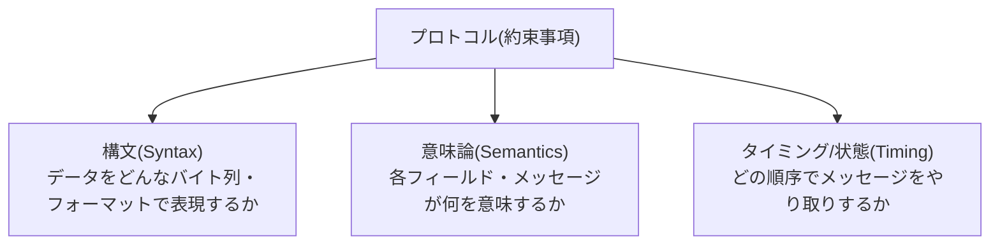

## はじめに

- **この記事で得られること**: 「プロトコルとは、通信の目的やサービスの機能ごとにやり取りするためのデータ形式を統一するための約束事項である」という理解を出発点に、**その約束事項が具体的にどんな要素で構成されているのか**を体系的に分解します。あわせて、テキストベースのプロトコルとバイナリのプロトコルの違い、**なぜ独自のプロトコルを自作できるのか**、そして暗号化されていない独自プロトコルがどのように解析されうるのかまでを理解します。
- **対象読者**: HTTP・DNS・SMBといった個々のプロトコルの使い方は知っているものの、「プロトコル」という概念そのものが何を指しているのか、プロトコルごとの設計上の違いがどこから生まれているのかを体系的に説明できない方を想定しています。
- **読むのにかかる想定時間**: 約19分

この記事は[『上位1%』シリーズ 全記事ガイド](/sitemap)の一部、プロトコル基礎をテーマにした新シリーズの1本目です。プロトコルの階層構造(カプセル化)については[ネットワークスタックの仕組みを『上位1%』の視点で理解する](/articles/network-stack-guide)を前提にしています。

## 前提知識

- **カプセル化**: あるプロトコルのデータ全体を、別のプロトコルの「ペイロード(データ部分)」として包み込む仕組みです。詳しくは[ネットワークスタックの仕組みを『上位1%』の視点で理解する](/articles/network-stack-guide)を参照してください。

## 全体像をつかむ

### プロトコルを構成する3つの要素

**プロトコルという「約束事項」は、実務的には次の3つの要素に分解できます。**

この3要素がすべて、通信する両者の間で完全に一致していて初めて、通信は成立します。**逆に言えば、この3要素さえ両者で一致していれば、それがどんな見た目のデータであっても、また誰が定めたものであっても、「プロトコル」として機能します。** これが、後述する「独自のプロトコルを自作できるのか」という疑問への、最も本質的な答えになります。

## 基礎から徹底解説

### 構文(Syntax):データをどう並べるか

**構文**は、通信するデータを、実際にどのようなバイト列として表現するかを定めた規則です。構文の設計には、大きく2つの方向性があります。

| 種類 | 特徴 | 代表例 |
|---|---|---|
| **テキストベース** | 人間がそのまま目で見て読める、文字列としてデータを表現する方式 | HTTP(リクエスト行・ヘッダーが改行区切りの文字列)、SMTP、FTPの制御チャネル |
| **バイナリ** | 各フィールドの位置・長さがあらかじめ固定的に決められた、機械処理に最適化されたバイト列 | SMB(CIFS)、TLSのレコード層、IP・TCP・UDPのヘッダー自体 |

**テキストベースのプロトコルは、Wiresharkのようなツールがなくても内容を目視で確認・デバッグしやすく、後から新しいヘッダーフィールドを追加するといった拡張も容易**です。一方**バイナリのプロトコルは、同じ情報をより少ないバイト数で表現でき、パース(解析)処理も高速に行える**という利点があります。プロトコルを設計する際、この「人間にとっての扱いやすさ」と「機械にとっての効率」のどちらを優先するかは、そのプロトコルの用途によって決まる、明確な設計判断です。

構文の中でも、可変長データの表現方法にはさらに種類がある

固定長のフィールドだけで構成できないデータ(たとえばHTTPのURLのように、長さが毎回変わる文字列)を扱う場合、プロトコルの構文には主に2つの方式があります。**区切り文字方式**は、特定の文字(HTTPであれば改行`CRLF`)が来るまでを1つのデータとして扱う方式です。**長さ prefix方式**は、データの本体の前に、その長さを示す数値フィールドを置く方式です(多くのバイナリプロトコルで採用されています)。区切り文字方式はテキストベースのプロトコルと相性が良く、長さprefix方式はバイナリのプロトコルと相性が良い、という対応関係があります。

### 意味論(Semantics):フィールドが何を意味するか

**意味論**は、構文によって切り出された個々のフィールド・メッセージが、具体的に何を意味するかを定めた規則です。たとえば、HTTPのステータスコード`200`という数値それ自体には、本来何の意味もありません。**「200という数値は成功を意味する」という取り決め(意味論)を、通信する両者があらかじめ共有して初めて**、この数値はメッセージとして機能します。

### タイミング/状態(Timing):どの順序でやり取りするか

**タイミング(状態)**は、どのメッセージを、どのタイミング・順序でやり取りしてよいかを定めた規則です。これは、プロトコルを**有限状態機械(ステートマシン)**として捉える見方につながります。

- **ステートレスなプロトコル**: 個々のメッセージが独立しており、過去のやり取りの状態を覚えている必要がないプロトコルです(DNSの1回の問い合わせと応答など)。
- **ステートフル(コネクション型)なプロトコル**: 「まず接続を確立してから、データをやり取りし、最後に切断する」といった、状態遷移のルールを持つプロトコルです。TCPの3ウェイハンドシェイクと、そのコネクションの状態機械としての実体は、[TCP/UDPの「セッション」とポート番号の関係を『上位1%』の視点で理解する](/articles/tcp-udp-session-port-guide)で詳しく扱っています。

### なぜプロトコルには「階層」があるのか

[ネットワークスタックの仕組みを『上位1%』の視点で理解する](/articles/network-stack-guide)で扱った階層構造(カプセル化)は、**物理法則のような絶対的な必然ではなく、複雑さを分割統治するための設計上の選択**です。各階層のプロトコルは、自分自身のヘッダー部分だけを解釈し、その先の中身(ペイロード)は「よく分からないが、次の階層に渡せば正しく処理してくれるはず」という前提で、そのまま受け渡します。この**責任範囲の分割**により、個々のプロトコルの設計・実装がシンプルに保たれています。

すべてのプロトコルが、綺麗にトランスポート層の上に乗るわけではない

[TCP/UDPの「セッション」とポート番号の関係を『上位1%』の視点で理解する](/articles/tcp-udp-session-port-guide)で扱った通り、ICMP・ESP・AH・GREといったプロトコルは、TCP/UDPのようにポート番号を持つトランスポート層のプロトコルの**上に乗るのではなく、IPの直下に、IPとほぼ同格の存在として位置づけられています。** すべての通信が「アプリケーション層→トランスポート層→ネットワーク層」というきれいな階層に収まるわけではない、という点は、プロトコル全体を理解する上で重要な前提です。次の記事では、この代表例であるICMPを深掘りします。

## プロが見ている視点(上位1%の理解)

### なぜ独自のプロトコルを自作できるのか

前述の「プロトコルとは、構文・意味論・タイミングという3要素が両者の間で一致していれば成立する約束事項である」という理解に立ち返ると、**この答えは明確です。IETFのような標準化団体による承認は、プロトコルとして機能するための必須条件ではありません。** RFCとして公開・標準化されたプロトコルは、あくまで**「世界中の誰とでも相互運用できるようにするための、公開された共通の約束事項」**であるに過ぎず、通信する両者(たとえば、ある企業の社内システムのクライアントとサーバー)が独自に取り決めた、非公開の構文・意味論・タイミングのルールも、その両者の間で一致してさえいれば、技術的には正当な「プロトコル」として機能します。**実際、多くの企業の内部システムでは、公開されていない独自のバイナリ形式で通信するプロトコルが使われています。**

### 暗号化されていない独自プロトコルは、どのように解析されるのか

独自のプロトコルであっても、**暗号化されていなければ**、Wiresharkのようなパケットキャプチャツールで、そのバイト列自体は誰でも観測できます。構文・意味論が非公開であっても、次のようなアプローチで**リバースエンジニアリング(解析)**が試みられます。

- **既知の操作と紐づけて差分を観察する**: 特定の操作(ログイン、特定のボタンをクリックする、など)を行った直前・直後のバイト列を比較し、どの部分が変化したかから、そのフィールドの意味を推測します。
- **繰り返し現れるパターンを手がかりにする**: 固定長のヘッダーらしき構造や、特定のマジックナンバー(そのプロトコルであることを示す固定の識別バイト列)を手がかりに、構文の区切りを推測します。

**独自のプロトコルは、公開されていないという意味での「秘匿性」は持ちますが、暗号化されていない限り、内容そのものを読み取られない、あるいは解析されないことを保証するものではありません。** 通信内容を第三者から読み取れないようにしたい場合は、独自プロトコルであるかどうかとは別に、TLSなどの暗号化を別途組み込む必要があります。

## よくある誤解・つまずきポイント

- **誤解1: 「プロトコルといえば、必ずTCPかUDPの上に乗っているものだ」**
  ICMP・ESP・AH・GREのように、トランスポート層を経由せず、IPの直下で動作するプロトコルも数多く存在します。
- **誤解2: 「プロトコルとして機能するには、IETFなどによる公式な標準化が必須である」**
  標準化は、世界中との相互運用性を確保するための手段の1つに過ぎません。通信する両者の間で構文・意味論・タイミングが一致してさえいれば、非公開の独自プロトコルも技術的には正当に機能します。
- **誤解3: 「独自のプロトコルであれば、内容を他者に読み取られる心配はない」**
  独自プロトコルの構文・意味論が非公開であることと、通信内容が暗号化されていることは、まったく別の話です。暗号化されていなければ、リバースエンジニアリングによって内容が解析されるリスクがあります。

## 障害・トラブルシューティングの視点

プロトコルへの理解不足に起因する障害調査の停滞は、**「今、どの階層のどのプロトコルのヘッダーを見ているのか」を常に意識する**ことで防げます。

1. **パケットキャプチャを見ても、何が起きているか判断できない**: [Wiresharkの使い方](/articles/wireshark-guide)で扱った表示フィルタを使い、まず着目したい階層のプロトコル(IP、TCP、特定のアプリケーション層プロトコルなど)だけに絞り込み、その階層の構文・意味論を1つずつ確認します。
2. **未知の独自プロトコルの通信を調査する必要がある**: 既知の操作の前後でキャプチャを取得し、差分を比較することで、構文・意味論の推測を試みます。

### 予防策・恒久対策

- 新しいプロトコルやその実装に触れる際は、まず構文・意味論・タイミングという3要素に分解して理解する習慣をつける。
- 独自プロトコルを社内システムで採用する場合、その仕様を(社外秘であっても)文書化しておき、後任者が解析に頼らずに済むようにする。

## まとめ

- プロトコルは、構文(データの表現形式)・意味論(各フィールドの意味)・タイミング(やり取りの順序・状態遷移)という3つの要素で構成される、通信する両者の間の約束事項です。
- 構文にはテキストベースとバイナリという2つの方向性があり、それぞれ人間にとっての扱いやすさと機械にとっての効率という異なる利点を持ちます。
- プロトコルの階層構造は絶対的な必然ではなく、複雑さを分割統治するための設計上の選択であり、ICMP・ESP・AHのように階層に綺麗に収まらないプロトコルも存在します。
- プロトコルは、構文・意味論・タイミングが通信する両者の間で一致してさえいれば成立するため、公式な標準化を経ない独自のプロトコルも技術的に正当に機能しますが、暗号化とは別の話であることに注意が必要です。

**今日から意識すべきこと**
1. 新しいプロトコルに出会ったら、構文・意味論・タイミングという3要素に分解して理解する習慣をつけましょう。
2. 「プロトコル」という言葉を、TCP/UDPの上に乗るものだけに限定せず、より広い約束事項として捉え直しましょう。

## 参考文献

- [Requirements for Internet Hosts -- Communication Layers | RFC 1122](https://datatracker.ietf.org/doc/html/rfc1122)
- [The Internet Standards Process | RFC 2026](https://datatracker.ietf.org/doc/html/rfc2026)
- [Hypertext Transfer Protocol (HTTP/1.1): Message Syntax and Routing | RFC 7230](https://datatracker.ietf.org/doc/html/rfc7230)
