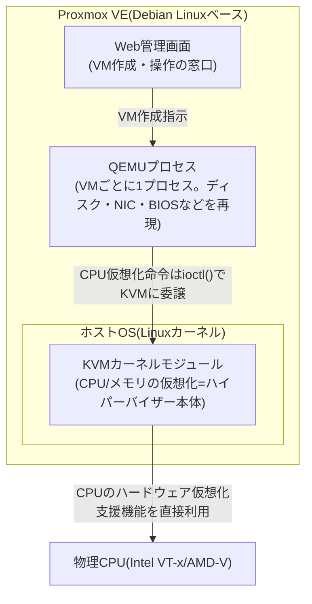
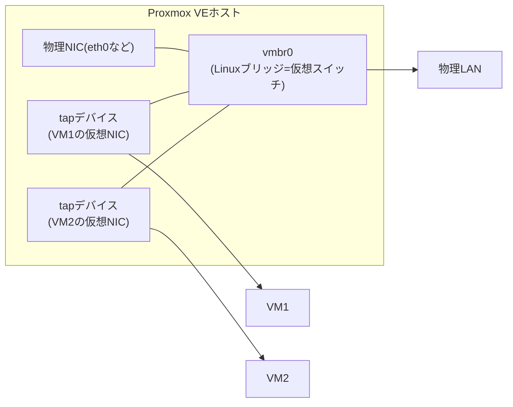

## はじめに

- **この記事で得られること**: Proxmox VEの管理画面からVMを作成するとき、裏側で何が起きているのか——KVMとQEMUという2つの異なる役割を持つコンポーネントがどう連携しているのか、VMがどうやってネットワークにつながるのか(仮想ブリッジ)、VMのディスクがどう保存されスナップショットがどう成立するのかを、体系的に理解できます。
- **対象読者**: Proxmox VEの管理画面からVMを作成する操作はできるものの、「仮想化」が実際には何によって実現されているのか、KVMとQEMUという2つの用語の役割の違いを説明できない、これからProxmoxを使ったハンズオンに取り組むインフラエンジニアを想定しています。
- **読むのにかかる想定時間**: 約16分

この記事は[『上位1%』シリーズ 全記事ガイド](/sitemap)の一部です。Proxmox VEを初めて使う方向けの操作マニュアルは別記事([ハンズオン準備:Proxmox VEでのVM作成からOSインストールまで](/articles/handson-prep-guide))で扱っています。この記事は「Proxmoxの仕組み・裏側」に特化した内部動作編です。

## 前提知識

- **カーネル空間・ユーザー空間**: OSの特権的な中核処理と、一般アプリケーションの処理領域の分離です。詳しくは[ユーザー空間とカーネル空間の仕組み](/articles/linux-user-kernel-space-guide)で扱っています。
- **デーモン**: バックグラウンドで常駐し続けるプロセスです。詳しくは[デーモン(daemon)とは何か](/articles/linux-daemon-guide)で扱っています。

## 全体像をつかむ

### 一言で言うと

**Proxmox VEは、Debian Linux上にWebベースの管理機能を載せた「仮想化プラットフォーム」であり、実際にVMを動かしている実体は、Linuxカーネルをハイパーバイザーに変える`KVM`と、CPU以外のすべての仮想的なハードウェアをソフトウェアで再現する`QEMU`という、2つの別々のコンポーネントです。** Proxmox自体は仮想化エンジンを新たに実装しているのではなく、Linuxがすでに持っているこの仮想化の仕組みに、使いやすい管理画面(Web UI)とクラスタ管理機能を被せたものです。

## 基礎から徹底解説

### KVM:Linuxカーネル自身をハイパーバイザーに変えるモジュール

**KVM(Kernel-based Virtual Machine)** は、Linuxカーネルにロードするカーネルモジュールで、これをロードすると**Linuxカーネル自体が、ゲストOS(VM)を実行できるハイパーバイザーとして機能するようになります**。KVMは`/dev/kvm`という特殊デバイスファイルを公開し、ユーザー空間のプログラムがこのデバイスに対して`ioctl()`システムコールを発行することで、「CPUの実行モードを仮想化モードに切り替える」「ゲストOSの命令を実行する」といった、CPUハードウェアの仮想化支援機能(Intel VT-x、AMD-V)を直接呼び出せるようになります。

この設計上、KVMを使った仮想化は分類上「**Type 1(ベアメタル型)ハイパーバイザー**」に位置づけられます。「Proxmox VEはDebian Linuxの上で動いている」と聞くと、まるでホストOSの上でさらにVM実行専用のソフトを動かすType 2型(VMware WorkstationやVirtualBoxのような構成)に見えるかもしれませんが、**Linuxカーネル自体がKVMによってハイパーバイザーの役割を兼ねている**ため、実質的にはハードウェアを直接制御するType 1型として扱われます。

### QEMU:CPU以外のすべての「ハードウェア」をソフトウェアで再現する

KVMが担当するのはCPUとメモリの仮想化(命令の実行そのもの)だけです。VMが実際に必要とする、ディスクコントローラ・ネットワークカード・グラフィックカード・BIOS/UEFIファームウェアといった**その他すべての仮想的なハードウェア**を再現しているのが**QEMU**です。

Proxmox VEでVMを1台起動すると、ホスト側では**そのVM専用の`qemu-system-x86_64`プロセスが1つ起動**します。このQEMUプロセスが、ゲストOSから見た「マザーボード」「ディスク」「NIC」のすべてを、ソフトウェア的にエミュレートしています。CPU命令の実行部分だけは、QEMUが自前で(遅い)ソフトウェアエミュレーションをする代わりに、`/dev/kvm`経由でKVM(≒物理CPU)に処理を委譲することで、ネイティブに近い速度を実現しています。**「QEMU/KVM」という組み合わせ表記をよく見かけるのは、この「ハードウェア全般の再現はQEMU、CPU実行の高速化はKVM」という明確な役割分担があるためです。**

補足: KVMなしでもQEMUだけで動くのか

動きます。QEMUは本来、KVMのような高速化支援なしでもCPU命令をソフトウェアだけで完全にエミュレートできる、独立した仮想化ソフトウェアです(この動作モードをTCG: Tiny Code Generatorと呼びます)。ただしCPU命令を1つずつソフトウェアで解釈・変換しながら実行するため、大幅に低速になります。KVMが使えない環境(仮想化支援機能を無効化したCPU、ネストされた仮想化が使えない環境など)でのフォールバックとして、あるいは異なるCPUアーキテクチャ(例: x86ホスト上でARM向けバイナリを実行する)のエミュレーションにQEMU単体のTCGモードが使われることがあります。

### 仮想ブリッジ(vmbr):VMを物理LANの一員にする仕組み

Proxmox VEのデフォルトのネットワーク構成では、**Linuxブリッジ**(ソフトウェア的な仮想スイッチ)を使って、VMを物理LANと同じセグメントに参加させます。管理画面でよく見る`vmbr0`が、この仮想ブリッジです。

各VMの仮想NICは、ホスト側では[ユーザー空間とカーネル空間の仕組み](/articles/linux-user-kernel-space-guide)で説明したTUN/TAPデバイスのうち**TAPデバイス**(Ethernetフレームをそのまま扱う仮想インターフェース)として現れ、これが`vmbr0`という仮想スイッチに接続されます。物理NICもこの同じ`vmbr0`に接続されているため、**VMは物理LANに直結しているのと同じように、DHCPでIPアドレスを取得したり、LAN内の他の機器と直接通信したりできます**。これが、L2TP/IPsecハンズオンで「ブリッジに直結する構成ならVMが家庭内LANから直接IPアドレスを取得する」と説明した挙動の裏側です。

### ストレージ方式とスナップショット:何がVMの「ディスク」の実体なのか

VMの仮想ディスクは、Proxmox VEが対応する複数のストレージ方式のいずれかに、ファイルまたはブロックデバイスとして保存されます。

| ストレージ方式 | 実体 | スナップショットの効率 |
|---|---|---|
| ディレクトリ(local) | `qcow2`や`raw`形式のイメージファイル | qcow2はソフトウェア的な差分保存が可能(比較的低速) |
| LVM-thin | シンプロビジョニングされた論理ボリューム | コピーオンライトによる高速スナップショットに対応 |
| ZFS | ZFSのデータセット | コピーオンライトによる高速スナップショットに対応、圧縮・チェックサムも標準装備 |

スナップショットが高速に取得できるのは、多くの方式が**コピーオンライト(Copy-on-Write)**という仕組みを使っているためです。スナップショット取得時点でディスクの全内容をまるごと複製するのではなく、「スナップショット以降に変更されたブロックだけ」を新しい場所に書き込み、元のブロックは変更されるまでそのまま参照し続けます。これにより、数百GBのディスクでも数秒でスナップショットを取得できます。

## プロが見ている視点(上位1%の理解)

### 「仮想化」と「コンテナ」は、Proxmox VE上では別のカーネルを使うかどうかで区別される

Proxmox VEは、ここまで説明したKVMベースのVM(フルの仮想化、ゲストOSごとに独立したカーネルが動く)に加えて、**LXC(Linux Containers)**というOSレベルの仮想化機構も提供しています。LXCコンテナは、ホストのLinuxカーネルを複数のコンテナで共有しながら、`namespaces`(プロセス・ネットワーク・ファイルシステムなどの名前空間を分離)と`cgroups`(CPU・メモリなどのリソースを制限)というLinuxカーネルの機能を使って、あたかも別々のOSであるかのように見せかけます。**VMはハードウェアレベルの完全な分離(ゲストごとに独立カーネル)を提供する分オーバーヘッドが大きく、コンテナはカーネルを共有する分軽量だが分離の強度はVMに劣る**、というトレードオフを理解しておくと、ハンズオンの検証内容に応じてVMとLXCのどちらを選ぶべきかを適切に判断できます(L2TP/IPsecハンズオンのようにカーネルのネットワークスタックやIPsec/XFRMの挙動を検証したい場合は、ホストと分離された独立カーネルを持つVMの方が適しています)。

### QEMUのプロセス分離が、VMをホストから守るセキュリティ境界にもなっている

各VMが独立した`qemu-system-x86_64`プロセスとして動作するという設計は、パフォーマンス上の都合だけでなく、**セキュリティ上の分離境界**としても機能します。あるVM内でゲストOSがクラッシュしたり、ゲストOS内のプロセスに脆弱性があっても、影響は基本的にそのQEMUプロセス1つに閉じ込められ、ホストや他のVMには直接影響しません(ただし、QEMU自体やKVMのハイパーバイザー層に脆弱性がある場合、この境界を越える「VMエスケープ」が理論上・実際に発生した事例もあり、ハイパーバイザー自体のアップデートを怠らないことが重要です)。

## よくある誤解・つまずきポイント

- **誤解1: 「Proxmox VEは独自の仮想化エンジンを持つ専用OSだ」**
  Proxmox VEの実体はDebian Linuxであり、仮想化の中核はLinuxに標準で組み込まれているKVM/QEMUです。Proxmox独自の部分は、Web管理画面・クラスタ管理・バックアップ機能などの「使いやすくする層」です。
- **誤解2: 「KVMとQEMUは同じものの別名だ」**
  KVMはCPU/メモリの仮想化を担うカーネルモジュール、QEMUはそれ以外のハードウェア全般をソフトウェアで再現するユーザー空間のプログラムという、明確に異なる役割を持つ別々のソフトウェアです。
- **誤解3: 「VMのスナップショットは、取得のたびにディスク使用量が丸ごと増える」**
  コピーオンライト方式のスナップショットは、変更されたブロックだけを追加で保存するため、スナップショット取得直後のディスク使用量の増加はごくわずかです(その後、元のVMの中身が変化し続けるほど、差分データが蓄積していきます)。

## 障害・トラブルシューティングの視点

1. **VMの起動が異常に遅い、または動作が重い**: `/dev/kvm`が実際に使えているか(ホストのCPUで仮想化支援機能=Intel VT-x/AMD-Vが有効か、BIOS/UEFI設定で無効化されていないか)を確認します。KVMが使えずQEMUのソフトウェアエミュレーション(TCG)にフォールバックしていると、体感できるレベルで動作が重くなります。
2. **VMがネットワークにつながらない**: VMの仮想NICが正しい`vmbr`に接続されているか、そのブリッジに物理NICが正しく紐づいているかをProxmoxのネットワーク設定で確認します。
3. **ディスク容量が想定より早く枯渇する**: スナップショットを取得したまま長期間放置していないか確認します。元のVMのデータが変化し続けるほど、コピーオンライトの差分データが蓄積し、想定以上のディスク容量を消費することがあります。

### 予防策・恒久対策

- 検証用VMでも定期的にスナップショットを整理し、不要になったものは削除する運用をルール化しておく。
- ホストのBIOS/UEFI設定で仮想化支援機能(VT-x/AMD-V)が有効になっていることを、新しい物理サーバー導入時のチェックリストに含める。
- 本番相当の検証を行う場合は、コンテナ(LXC)で十分か、フルの仮想化(KVMベースのVM)が必要かを、検証したい内容(カーネルレベルの挙動を見たいかどうか)に応じて事前に判断する。

## まとめ

- Proxmox VEはDebian Linux上にWeb管理画面とクラスタ機能を載せたプラットフォームで、仮想化の中核はLinux標準のKVM(CPU/メモリの仮想化)とQEMU(その他ハードウェアの再現)という2つの別コンポーネントです。
- KVMを使うことで、Linuxカーネル自体がハイパーバイザーとして機能し、Type 1型の仮想化に分類されます。
- VMのネットワーク接続はLinuxブリッジ(vmbr)によって実現され、TAPデバイスとして表現された仮想NICがこのブリッジ経由で物理LANと同じセグメントに参加します。
- VMのディスクはストレージ方式によってqcow2ファイルやZFS/LVM-thinのボリュームとして保存され、多くはコピーオンライトによって高速なスナップショットを実現しています。

**今日から意識すべきこと**
1. VMの動作が重いと感じたら、まず`/dev/kvm`が実際に使えているか(仮想化支援機能が有効か)を疑う習慣をつけましょう。
2. スナップショットは「軽い操作」ではなく「差分データが蓄積し続ける操作」であることを意識し、定期的に整理しましょう。

## 参考文献

- [Proxmox VE Administration Guide](https://pve.proxmox.com/pve-docs/)
- [KVM — Linux kernel documentation](https://www.kernel.org/doc/html/latest/virt/kvm/index.html)
- [QEMU Documentation](https://www.qemu.org/docs/master/)
