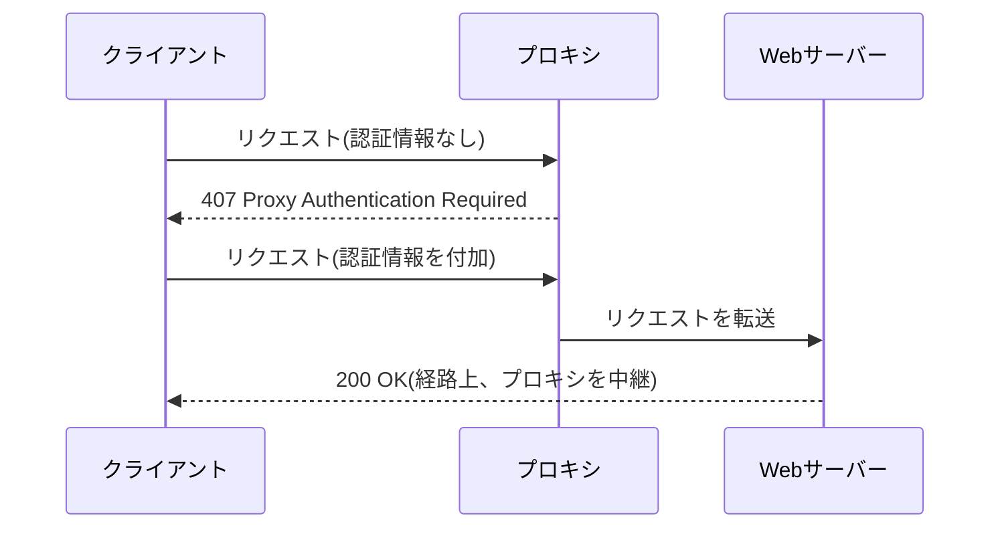

## はじめに

- **この記事で得られること**: [プロキシとファイアウォールの使い分け](/articles/proxy-firewall-guide)で扱った明示的プロキシを前提に、「誰がこのプロキシを使ってよいか」を判定する、**Basic・NTLM・Kerberosという3つのプロキシ認証方式**の違いを体系的に理解します。あわせて、認証の失敗を示す**407 Proxy Authentication Required**という、401とは別のステータスコードが、なぜわざわざ用意されているのかも扱います。
- **対象読者**: 社内プロキシの認証方式として、NTLMやKerberosという言葉を見たことはあるものの、それぞれが具体的にどう違うのかを説明できない方を想定しています。
- **読むのにかかる想定時間**: 約18分

この記事は[『上位1%』シリーズ 全記事ガイド](/sitemap)の一部、[Webプロキシ/キャッシュ基礎シリーズ](/sitemap#シリーズ一覧)の5本目です。

## 前提知識

- **明示的プロキシ**: [プロキシとファイアウォールの使い分け](/articles/proxy-firewall-guide)で扱った、クライアント側でプロキシサーバーを指定する方式です。本記事は、このプロキシに対して「誰が使ってよいか」を判定する仕組みを扱います。

## 全体像をつかむ

### なぜ、401ではなく407というステータスコードが存在するのか

Webサーバー自体への認証が必要な場合、サーバーは**401 Unauthorized**を返します。しかし、クライアントとWebサーバーの間に**プロキシ**が挟まっている場合、認証を要求しているのが「最終的な宛先のWebサーバー」なのか、「経路の途中にあるプロキシ自身」なのかを、クライアントが区別できる必要があります。**この区別のために、プロキシ自身が認証を要求する場合は、401とは別の、407 Proxy Authentication Requiredというステータスコードが使われます。**

## 基礎から徹底解説

### Basic認証:最も単純だが、暗号化されない

**Basic認証**は、ユーザー名とパスワードを、コロンで連結し、Base64でエンコードしただけの文字列を、`Proxy-Authorization`ヘッダーに含めて送信する、最も単純な方式です。**Base64は暗号化ではなく、単なる符号化であるため、通信経路が暗号化されていなければ、ユーザー名とパスワードは、実質的に平文のまま送信されているのと同じです。** HTTPSでプロキシへの接続自体が暗号化されている場合に限り、安全に使用できます。

### NTLM認証:チャレンジ・レスポンス方式と、TCP接続単位での認証維持

**NTLM認証**は、パスワードそのものを送信せず、プロキシが送った**チャレンジ**(ランダムな値)に対して、クライアントがパスワードから導出した値で応答する**チャレンジ・レスポンス方式**を採用しています。これにより、パスワードそのものがネットワーク上を流れることを避けられます。

**NTLM認証の大きな特徴は、認証が「HTTPリクエスト単位」ではなく、「TCP接続単位」で維持される点です。** 1回のTCP接続の中で、最初のリクエストで認証のやり取り(チャレンジ・レスポンス)が完了すれば、同じTCP接続を使い続ける限り、その後のリクエストでは、認証のやり取りを繰り返す必要がありません。

この「接続単位」の認証が、実務でどんな問題を引き起こすか

**この仕組みは、クライアントとプロキシの間に、さらに別のロードバランサーが挟まっており、そのロードバランサーが、リクエストごとに異なるプロキシサーバーへ振り分けてしまう構成だと、正しく機能しません。** [ロードバランシングのアルゴリズム](/articles/load-balancing-algorithms-guide)で扱った、通常の負荷分散の発想(どのリクエストも、どのサーバーで処理されても構わない)が、NTLM認証の「接続単位での状態維持」という前提と、真正面から衝突してしまうのです。この問題への対処として、同じクライアントからの接続を、常に同じバックエンドプロキシへ固定する、**セッション永続化**(スティッキーセッション)の仕組みが必要になります。これは、[セッション永続化](/articles/load-balancing-algorithms-guide)が「バックエンド側がセッション情報をメモリに持つ場合」に必要になるのと、構造としてよく似ています。

### Kerberos認証:パスワードそのものを、ネットワーク上に一切流さない

**Kerberos認証**は、Active Directory環境でよく使われる、チケットベースの認証方式です。クライアントは、事前に認証サーバー(KDC)からチケットを取得しておき、プロキシへのアクセス時には、**パスワードそのものではなく、このチケットを提示します。** Kerberosの大きな特徴は、**パスワードから導出された値さえも、チャレンジ・レスポンスの往復の中でネットワーク上に流すことがない**という点です。

| 認証方式 | パスワードの扱い | 認証の単位 |
|---|---|---|
| **Basic** | Base64エンコードされるだけで、実質平文 | リクエスト単位 |
| **NTLM** | パスワードから導出した値のみ(チャレンジ・レスポンス) | TCP接続単位 |
| **Kerberos** | チケットのみ(パスワード自体も、その導出値も流れない) | チケットの有効期限単位 |

## プロが見ている視点(上位1%の理解)

### 認証方式の選択は、「どこまでネットワーク上に情報を出したくないか」という設計判断である

Basic・NTLM・Kerberosという3つの方式の違いは、**「パスワードという機密情報を、ネットワーク上にどこまで出すことを許容するか」という、段階的な設計判断**として理解すると、整理がつきます。Basicは実質的に平文、NTLMはパスワードから導出された値、Kerberosはパスワードに関する情報を一切出さない、という、明確な段階が存在します。**これは、[決済APIにおける、カード番号を加盟店サーバーに一切触れさせない設計](/articles/payment-api-guide)と、根底にある発想が同じです。** 機密情報そのものを、できるだけ早い段階で、別の(より安全な)表現(トークン、チケット、ハッシュ値)に置き換えてしまう、という考え方が、分野をまたいで繰り返し登場します。

## よくある誤解・つまずきポイント

- **誤解1: 「Base64エンコードは、暗号化の一種である」**
  Base64は単なる符号化であり、暗号化ではありません。誰でも簡単に元の文字列へ戻せます。Basic認証がHTTPS経由でのみ安全に使えるのは、このためです。
- **誤解2: 「NTLM認証は、リクエストごとに毎回認証をやり直す」**
  NTLM認証は、TCP接続単位で状態を維持します。同じ接続を使い続ける限り、最初の1回だけ認証のやり取りが発生します。
- **誤解3: 「どの認証方式を選んでも、セキュリティ上の違いはない」**
  パスワードそのものがどこまでネットワーク上に現れるかという点で、3つの方式には明確な違いがあります。

## 障害・トラブルシューティングの視点

1. **407エラーが返ってくるが、正しい認証情報を送っているはずなのに認証が通らない**: 使用している認証方式(Basic/NTLM/Kerberos)が、クライアントとプロキシの双方で一致しているかを確認します。
2. **NTLM認証を使った環境で、ロードバランサーの背後にあるプロキシで、認証エラーが頻発する**: ロードバランサーが、同じクライアントの接続を、常に同じバックエンドプロキシへ固定する設定(セッション永続化)になっているかを確認します。
3. **Kerberos認証が、社外からのアクセスだけ失敗する**: Kerberosは、KDC(通常はドメインコントローラー)への到達性が前提となるため、社外のクライアントが、そもそもKDCへアクセスできているかを確認します。

## まとめ

- 407 Proxy Authentication Requiredは、認証を要求しているのが最終的なWebサーバーではなく、経路上のプロキシ自身であることを示す、401とは別のステータスコードです。
- Basic認証は、Base64でエンコードするだけの最も単純な方式で、HTTPS経由でなければ実質平文です。
- NTLM認証は、チャレンジ・レスポンス方式を採用し、TCP接続単位で認証状態を維持するため、ロードバランサー構成との相性に注意が必要です。
- Kerberos認証は、チケットベースの方式で、パスワードに関する情報を一切ネットワーク上に流しません。

**今日から意識すべきこと**
1. プロキシ認証のトラブルに遭遇したら、まず407と401のどちらが返っているかを確認し、どの層で認証が要求されているかを切り分けましょう。
2. NTLM認証を使う環境を設計する際は、ロードバランサーがある場合、セッション永続化の設定を忘れないようにしましょう。

## 参考文献

- [RFC 7235 - HTTP/1.1 Authentication, Section 3.2 (407 Proxy Authentication Required)](https://datatracker.ietf.org/doc/html/rfc7235#section-3.2)
- [Microsoft NTLM | Microsoft Learn](https://learn.microsoft.com/en-us/windows-server/security/kerberos/ntlm-overview)
