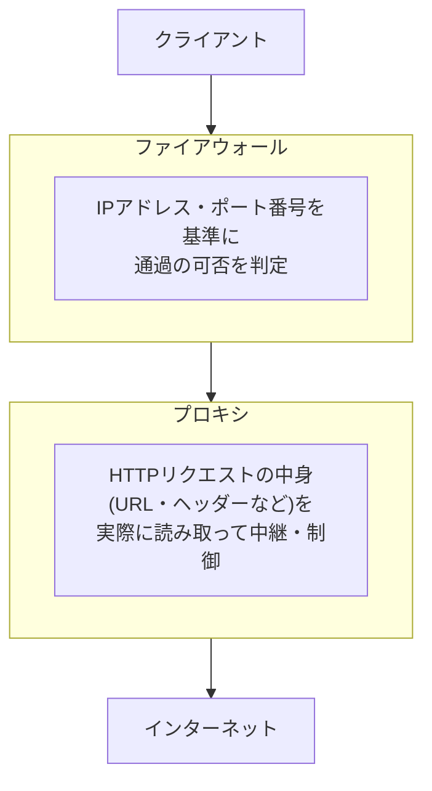

## はじめに

- **この記事で得られること**: 「プロキシとファイアウォールは、どちらも通信をコントロールする仕組みらしいが、何がどう違うのか」という疑問に、それぞれが**通信のどの階層(レイヤー)を、どういう単位で制御しているのか**という視点から答えます。あわせて、**明示的プロキシと透過型プロキシの違い**、近年よく耳にする<strong>クラウドプロキシ(SWG、Secure Web Gateway)</strong>が何を指しているのか、そして[ZTNA(ゼロトラストネットワークアクセス)とは何かを『上位1%』の視点で理解する](/articles/ztna-guide)で扱ったゼロトラストとの関係までを整理します。
- **対象読者**: プロキシやファイアウォールの設定・運用に携わっているものの、両者の役割の違いや、クラウドプロキシという用語が具体的に何を指しているのかを説明できない方を想定しています。
- **読むのにかかる想定時間**: 約18分

この記事は[『上位1%』シリーズ 全記事ガイド](/sitemap)の一部、Webプロキシ/キャッシュ基礎をテーマにした新シリーズの1本目です。

## 前提知識

- **OSI参照モデルの階層**: 通信を、物理層からアプリケーション層まで複数の階層に分けて捉える考え方です。ファイアウォールとプロキシは、主に制御対象とする階層が異なります。

## 全体像をつかむ

### プロキシとファイアウォールは、制御している階層と単位が異なる

**ファイアウォールは、主にIPアドレス・ポート番号(場合によってはプロトコルの種類)を基準に、通信を「通す/通さない」で制御する仕組みです。プロキシは、通信の中身(特にHTTPのようなアプリケーション層のプロトコル)を実際に理解し、その内容に基づいて中継・加工・制御を行う仕組みです。**

## 基礎から徹底解説

### ファイアウォールが制御しているもの

ファイアウォールは、基本的に<strong>「このIPアドレス・ポート番号への通信を許可する/拒否する」という、比較的単純な基準</strong>で通信を制御します。通信の中身(たとえばHTTPリクエストのURLが何であるか)までは、基本的なファイアウォールの機能だけでは判断しません。

### プロキシが制御しているもの

プロキシは、クライアントとインターネットの間に立ち、**HTTPなどのアプリケーション層のプロトコルの内容自体を解釈**します。これにより、ファイアウォールでは判断できない、次のような制御が可能になります。

- **URL単位でのアクセス制御**: 同じWebサーバー(同じIPアドレス)であっても、特定のURLパスへのアクセスだけを許可・拒否する。
- **コンテンツの検査**: リクエスト・レスポンスの内容自体を検査し、マルウェアの含まれるファイルのダウンロードを検知・遮断する。
- **キャッシュ**: 一度取得したコンテンツを保存し、同じコンテンツへの再アクセスを高速化する(この役割については[HTTPSの普及とプロキシキャッシュの関係を『上位1%』の視点で理解する](/articles/http-caching-cdn-guide)で詳しく扱います)。

### 明示的プロキシと透過型プロキシの違い

プロキシには、クライアントがそのプロキシを使うことを**明示的に認識しているかどうか**によって、2つの方式があります。

| 方式 | 動作 |
|---|---|
| **明示的プロキシ(Explicit Proxy)** | クライアント(ブラウザなど)の設定に、プロキシサーバーのアドレスを明示的に指定する方式です。クライアントは「自分がプロキシを経由している」ことを認識した上で通信します。 |
| **透過型プロキシ(Transparent Proxy)** | クライアント側には何の設定変更も行わず、ネットワーク機器(ルーターなど)が通信を自動的にプロキシへ転送する方式です。クライアントはプロキシの存在を意識しません。 |

透過型プロキシは、多数のクライアント端末に個別の設定変更を行う必要がないという運用上の利点がありますが、HTTPS通信の内容を検査したい場合には、後述するSSLインスペクションのための証明書配布など、別の技術的な対応が必要になります。

### クラウドプロキシ(SWG:Secure Web Gateway)とは何か

**クラウドプロキシ**は、従来オンプレミスに設置していたプロキシサーバーの機能を、**クラウド上のサービスとして提供する**形態を指します。この文脈でよく使われる用語が<strong>SWG(Secure Web Gateway)</strong>であり、プロキシとしての中継機能に加え、マルウェア検査・URLフィルタリング・データ漏洩防止(DLP)といった機能を統合的に提供することが一般的です。

**クラウドプロキシが重要になった背景には、従業員がオフィス以外の場所(自宅、外出先)から直接インターネットへアクセスする機会が増えたことがあります。** 従来型のオンプレミスプロキシは、社内ネットワークを経由する通信を前提に設計されていましたが、クラウドプロキシは、**従業員のデバイスがどこにいても、まずクラウド上のプロキシを経由させる**ことで、場所を問わず一貫したセキュリティポリシーを適用できるようにします。

## プロが見ている視点(上位1%の理解)

### プロキシが通信の中身まで検査できるなら、なぜファイアウォールも必要なのか

「プロキシのほうが通信の中身まで詳しく検査できるなら、単純なIPアドレス・ポート単位でしか判断しないファイアウォールは不要ではないか」という疑問は自然なものです。しかし実務では、**両者は代替関係ではなく補完関係にある**という理由が、少なくとも4つあります。

1. **プロキシが理解できるプロトコルは限られている**: プロキシは基本的に、HTTP/HTTPSのような**自分が対応しているアプリケーション層プロトコルしか中継・検査できません。** 一方、実際の組織のネットワークには、DNS・メール(SMTP)・データベース接続・SSH・RDP・SMBファイル共有・VPNなど、Webプロキシがそもそも関知しない通信が大量に存在します。ファイアウォールは、プロトコルの種類を問わず、これらすべての通信に対して「通す/通さない」を判断できる、**プロトコルに依存しない汎用的な制御レイヤー**です。
2. **プロキシは、経路上に置かれた通信しか見えない**: プロキシが効果を発揮するのは、**クライアントの通信が実際にそのプロキシを経由するよう設定・強制されている場合だけ**です。社内のサーバー同士の通信(east-west通信)や、そもそもプロキシ設定の対象外になっている通信は、プロキシの目が届きません。ファイアウォールは、[自治体ネットワークの三層分離とセキュリティクラウドを『上位1%』の視点で理解する](/articles/local-gov-network-guide)で扱ったような**ネットワークセグメント同士の境界**に配置され、プロキシが関与しない通信経路もまとめてカバーします。
3. **処理コストの分業**: ファイアウォールによるIPアドレス・ポート単位の判定は、パケットヘッダーだけを見る軽量な処理であり、大量の通信を低遅延で処理できます。一方プロキシによるアプリケーション層の中身の検査は、相対的に処理コストの高い作業です。**すべての通信を無差別にプロキシへ通そうとすると現実的な性能が確保できないため、まずファイアウォールで大まかに絞り込み、その上でプロキシが必要な範囲だけを深く検査する、という役割分担が合理的**です。
4. **多層防御(Defense in Depth)としての意味**: [サーバー構築・運用時の現実的なセキュリティ対策を『上位1%』の視点で理解する](/articles/practical-server-security-measures-guide)で扱った通り、単一の対策に依存する構成は、その対策が突破・迂回された場合に無防備になります。プロキシの設定不備や、プロキシを経由しない抜け道(何らかの理由でプロキシを迂回する通信)が発生した場合でも、**ファイアウォールという別レイヤーの制御が残っていれば、被害の拡大を抑えられます。**

**つまり、ファイアウォールは「あらゆる通信に対する、軽量で汎用的な第一関門」、プロキシは「特定のプロトコルに対する、重量級で専門的な深掘り検査」という、階層も役割もまったく異なる存在**であり、どちらか一方で他方を代替することはできません。

### クラウドプロキシとゼロトラストの関係

[ZTNA(ゼロトラストネットワークアクセス)とは何かを『上位1%』の視点で理解する](/articles/ztna-guide)で扱ったように、ゼロトラストは「ネットワークの内側にいること自体を信頼の根拠にしない」という設計思想です。**クラウドプロキシ(SWG)は、このゼロトラストの考え方を、インターネットへの"アウトバウンド"通信の側面で実現する要素の1つ**として位置づけられます。ZTNAが主に「社内アプリケーションへのアクセス(インバウンド寄りの発想)」を扱うのに対し、SWGは「従業員がインターネット上のリソースへアクセスする際の保護(アウトバウンド寄りの発想)」を担い、この両方を統合したより広い概念が、[SD-WANとエッジルーター選定を『上位1%』の視点で理解する](/articles/sdwan-edge-router-guide)で触れた<strong>SASE(Secure Access Service Edge)</strong>です。

### SSLインスペクションという技術的な壁

現在の通信の多くがHTTPS(暗号化された通信)であるため、プロキシが通信の中身を検査したい場合、<strong>SSLインスペクション(通信を一度復号し、検査した上で再暗号化する)</strong>という技術が必要になります。これは、プロキシがクライアントとサーバーの間に立ち、それぞれと個別にTLSのセッションを確立する仕組みであり、実現のためにはクライアント側に、プロキシが使用する証明書を信頼させる設定(証明書のインストール)が必要になります。この仕組みの技術的な詳細は、[PKIとデジタル証明書の仕組みを『上位1%』の視点で理解する](/articles/pki-guide)で扱った証明書チェーンの検証の応用として理解できます。

## よくある誤解・つまずきポイント

- **誤解1: 「プロキシとファイアウォールは、どちらか一方だけを導入すれば十分である」**
  両者は制御している階層・単位が異なるため、多くの実務環境では両方を組み合わせて、それぞれの得意な領域を担わせる構成が一般的です。
- **誤解2: 「透過型プロキシは、クライアント側で何も設定しなくても、HTTPSの中身まで自動的に検査できる」**
  HTTPSの内容を検査するには、透過型・明示的いずれの方式でも、SSLインスペコンションのための証明書配布などの追加設定が必要です。
- **誤解3: 「クラウドプロキシは、単にプロキシサーバーをクラウド上に移設しただけのものである」**
  クラウドプロキシ(SWG)は、単純な中継機能に加え、マルウェア検査・URLフィルタリング・DLPなどを統合的に提供する、より広い機能セットを指すことが一般的です。

## 障害・トラブルシューティングの視点

プロキシ・ファイアウォール関連の問題は、**「通信が拒否されている層がどちらか」を切り分ける**のが基本です。

1. **特定のWebサイトだけアクセスできない**: ファイアウォールのIPアドレス・ポート単位の制御ではなく、プロキシのURLフィルタリングルールに引っかかっていないかを確認します。
2. **HTTPSサイトへのアクセスで証明書エラーが発生する**: SSLインスペクションを行っているプロキシの証明書が、クライアント側で正しく信頼された状態になっているかを確認します。
3. **社外(自宅など)からのアクセスだけセキュリティポリシーが適用されない**: クラウドプロキシ経由の通信になっているか、クライアント側の設定(プロキシ設定やエージェントの導入状況)を確認します。

### 予防策・恒久対策

- ファイアウォールとプロキシ、それぞれが担うべき制御の範囲を明確に設計し、役割の重複や漏れを防ぐ。
- SSLインスペクションを行う場合、証明書の配布・更新を組織的に管理する仕組みを整備する。
- 社外からのアクセスが多い環境では、クラウドプロキシの導入を検討し、場所を問わず一貫したポリシーを適用できるようにする。

## まとめ

- ファイアウォールはIPアドレス・ポート番号を基準に通信の通過を制御し、プロキシはHTTPなどのアプリケーション層の内容自体を理解して中継・制御します。
- プロキシが対応できるプロトコルは限られ、経路上に置かれた通信しか見えないため、あらゆるプロトコル・経路をカバーするファイアウォールとは代替関係ではなく補完関係にあります。処理コストの分業と多層防御の観点からも、両方が必要です。
- プロキシには、クライアントが明示的に設定する明示的プロキシと、ネットワーク機器が自動的に転送する透過型プロキシの2方式があります。
- クラウドプロキシ(SWG)は、従来オンプレミスにあったプロキシ機能をクラウド上のサービスとして提供し、場所を問わず一貫したセキュリティポリシーを適用できるようにする仕組みです。
- クラウドプロキシ(SWG)はゼロトラストの考え方をアウトバウンド通信の側面で実現する要素であり、ZTNAと統合したより広い概念がSASEです。

**今日から意識すべきこと**
1. プロキシとファイアウォールという用語に出会ったら、それぞれが制御している通信の階層・単位の違いを意識しましょう。
2. HTTPSの内容を検査する必要がある場合は、SSLインスペクションのための証明書配布という追加作業が必要になることを踏まえて設計しましょう。

## 参考文献

- [What Is a Proxy Firewall? | Fortinet](https://www.fortinet.com/resources/cyberglossary/proxy-firewall)
- [What Is a Secure Web Gateway (SWG)? | Gartner](https://www.gartner.com/en/information-technology/glossary/secure-web-gateway-swg)
- [Hypertext Transfer Protocol (HTTP/1.1): Caching | RFC 7234](https://datatracker.ietf.org/doc/html/rfc7234)
