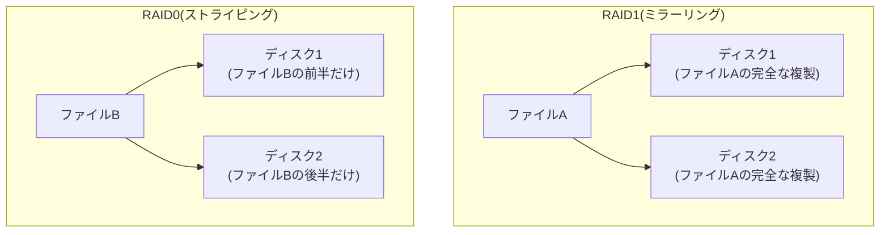

## はじめに

- **この記事で得られること**: [mdadmでLinuxソフトウェアRAID1を構築するハンズオン](/articles/mdadm-raid-handson-guide)で扱った、ミラーリングによる冗長化とは**まったく正反対の設計思想**を持つ、**RAID0**(ストライピング)の仕組みを体系的に理解します。「RAIDだから、何らかの形で安全になっているはずだ」という思い込みを訂正し、**ディスクの台数が増えるほど、アレイ全体としての故障確率が、むしろ上がってしまう**という、直感に反する仕組みまでを扱います。
- **対象読者**: RAID1・RAID5の冗長化の仕組みは理解しているものの、「RAID0には冗長性が一切ない」ということの、具体的な意味と理由を説明できない方を想定しています。
- **読むのにかかる想定時間**: 約16分

この記事は[『上位1%』シリーズ 全記事ガイド](/sitemap)の一部、[ストレージ基礎シリーズ](/sitemap#シリーズ一覧)の4.1本目です。

## 前提知識

- [RAIDとWindowsのディスク管理の関係](/articles/disk-raid-fundamentals-guide): RAIDが複数の物理ディスクを1つの論理ディスクとしてまとめる仕組みであるという理解が前提になっています。
- [mdadmでLinuxソフトウェアRAID1を構築するハンズオン](/articles/mdadm-raid-handson-guide): ミラーリングによる冗長化の基本が前提になっています。

## 全体像をつかむ

RAID1は、**同じデータを複数のディスクへ複製する**ことで、1台が故障しても残りのディスクでデータを守る、冗長化のための仕組みでした。**RAID0は、これとは正反対の発想**を持っています。**1つのファイルを、複数のディスクへ分割(ストライプ)して分散させ、並行して読み書きすることで、速度を高める**ことだけを目的としており、冗長性については、一切考慮していません。

## 基礎から徹底解説

### RAID0では、1台のディスク故障が、全データの損失を意味する

**RAID0では、1つのファイルの内容そのものが、複数のディスクへ分割されて書き込まれています。** つまり、**どのディスク1台にも、ファイルの完全な内容は、そもそも存在しません。** このため、アレイを構成するディスクのうち、**たとえ1台だけが故障しても、そのアレイ上にあるすべてのファイルが、復元不可能な形で失われます。** [RAID1でディスクが1台故障した場合、残った1台が、依然として完全な複製を持っていた](/articles/mdadm-raid-handson-guide)のとは、まったく対照的な挙動です。

なぜ、1台だけの故障で、他のディスクに保存されていた分まで失われるのか

**ファイルシステムは、ファイルの内容を、ストライプという単位に分割し、ディスク1、ディスク2、ディスク1、ディスク2……という順序で、交互に書き込んでいます。** そのため、ディスク2が故障すると、ディスク1には、ファイルの前半・中間・後半のうち、**虫食いのように、一部分だけが残っている**状態になります。虫食い状態のデータは、通常、実用的な意味では一切復元できません。これが、「1台の故障が、アレイ全体のデータ損失を意味する」ことの、具体的な正体です。

### ディスクの台数が増えるほど、アレイ全体の故障確率が上がってしまう、直感に反する仕組み

**「RAIDを組んでいるのだから、ディスクを増やすほど安全になるはずだ」という直感は、RAID0には当てはまりません。** RAID0では、**アレイを構成するディスクのうち、どれか1台でも故障すれば、アレイ全体がデータを失います。** 個々のディスクの故障確率を、たとえばそれぞれ独立に5%とすると、**ディスクの台数が増えるほど、「少なくとも1台が故障する」確率は、むしろ上昇していきます。** 2台構成のRAID0の方が、4台構成のRAID0よりも、アレイ全体としては故障しにくい、という計算になります。**「台数を増やして性能を上げる」という選択自体が、同時に「アレイ全体の故障確率を上げる」という代償を伴っている**ことを、具体的な数字のイメージとして持っておく必要があります。

## プロが見ている視点(上位1%の理解)

### RAID0は、「データが失われても構わない」という前提と、常にセットで使う

RAID0が実務で使われる場面は、**「速度を最優先し、そのデータが失われても、業務上致命的ではない」という前提がある場合に限られます。** 例えば、動画編集の作業用の一時領域(素材本体は別の場所に保管されている)や、再生成可能なキャッシュデータの格納先などが典型例です。**[シンプロビジョニングの仕組み](/articles/thin-provisioning-guide)や[RAID5のパリティ](/articles/raid5-parity-guide)が、容量効率と冗長性のバランスを取る設計だったのに対し、RAID0は、冗長性を完全に手放し、速度と容量効率だけを追求する、両極端の選択**です。**速度と冗長性の両方が必要な場合は、RAID0とRAID1を組み合わせたRAID10(1+0)のような、より複雑な構成を検討する必要があります。** 上位1%のエンジニアは、RAID方式を選ぶ際、「速度」「容量効率」「冗長性」という3つの軸のうち、どれを優先し、どれを明確に手放すのかを、常に意識して設計します。

## よくある誤解・つまずきポイント

- **誤解1: 「RAIDという名前がついている以上、何らかの形で冗長化されているはずだ」**
  RAID0には、冗長性が一切ありません。RAIDという名前は、あくまで「複数の物理ディスクを1つの論理ディスクとして扱う」という技術全般を指しており、個々のRAID方式が冗長性を持つかどうかは、方式ごとに完全に異なります。
- **誤解2: 「RAID0でディスクが1台故障しても、残りのディスクに保存されていたファイルだけは読み取れる」**
  RAID0では、1つのファイルの内容そのものが複数のディスクへ分割されているため、1台の故障は、アレイ上のすべてのファイルの損失を意味します。
- **誤解3: 「ディスクの台数を増やせば、RAID0でも、より安全になる」**
  RAID0では、ディスクの台数が増えるほど、アレイ全体としての故障確率が、むしろ上昇します。

## 障害・トラブルシューティングの視点

1. **RAID0アレイで、1台のディスクが故障した**: 残りのディスクに保存されていたデータも、実用的には復元不可能であるとみなし、バックアップからの復旧を直ちに検討します。
2. **RAID0を採用すべきか、判断に迷う**: そのボリュームに保存されるデータが、「失われても業務上致命的ではないか」を、採用前に必ず確認します。
3. **速度と冗長性の両方が必要になった**: RAID0単体ではなく、RAID10のような、複数のRAID方式を組み合わせた構成を検討します。

## まとめ

- RAID0は、1つのファイルを複数のディスクへストライプ状に分散して書き込むことで、速度を高める仕組みであり、冗長性は一切持ちません。
- RAID0では、アレイを構成するディスクのうち1台が故障するだけで、アレイ上のすべてのファイルが、実用的には復元不可能な形で失われます。
- RAID0では、ディスクの台数が増えるほど、アレイ全体としての故障確率が、むしろ上昇するという、直感に反する性質があります。
- RAID0は、「速度を最優先し、データが失われても業務上致命的ではない」という前提とセットで使うべき方式です。

**今日から意識すべきこと**
1. RAID方式を選ぶ際は、「速度」「容量効率」「冗長性」のうち、どれを優先し、どれを手放すのかを、常に明確にしましょう。
2. 「RAID」という名前だけで、安全性を判断しないようにしましょう。方式ごとに、冗長性の有無は完全に異なります。

## 参考文献

- [RAID (redundant array of independent disks) | Wikipedia](https://en.wikipedia.org/wiki/RAID)
- [RAID5とRAID6のパリティ計算の仕組みを『上位1%』の視点で理解する](/articles/raid5-parity-guide)
