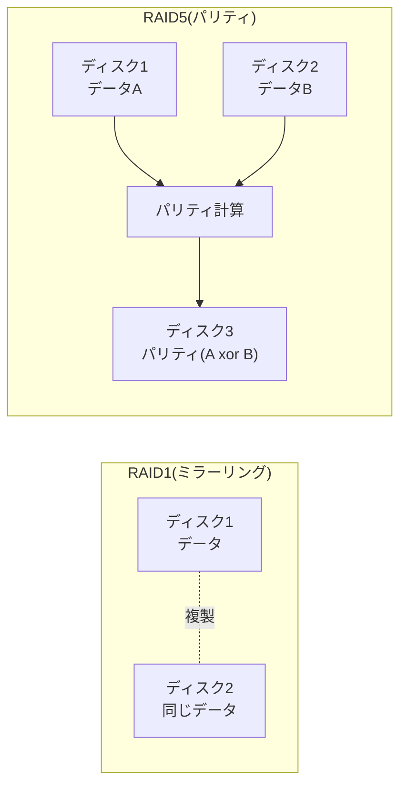

## はじめに

- **この記事で得られること**: [mdadmでRAID1を構築するハンズオン](/articles/mdadm-raid-handson-guide)で扱った、ディスクを完全に複製する方式とは異なる、**RAID5・RAID6が採用する「パリティ」という仕組みが、具体的にどんな計算(XOR)で導き出され、ディスク故障時にどうやってデータを復元しているのか**を体系的に理解します。
- **対象読者**: RAID5が「ディスク1台分の故障に耐えられる」ことは知っているものの、その仕組みの中核である「パリティ」が、具体的にどういう計算によって成立しているのかを説明できない方を想定しています。
- **読むのにかかる想定時間**: 約18分

この記事は[『上位1%』シリーズ 全記事ガイド](/sitemap)の一部、[ストレージ基礎シリーズ](/sitemap#シリーズ一覧)の6本目です。

## 前提知識

- **RAID1のミラーリング**: [mdadmでRAID1を構築するハンズオン](/articles/mdadm-raid-handson-guide)で扱った、2台のディスクを完全に同一の内容に保つ方式です。本記事では、これとは異なる発想を持つ、RAID5・RAID6を扱います。

## 全体像をつかむ

RAID1は、同じデータを2台のディスクに、**そのまま複製**することで冗長性を確保します。これは確実な方法ですが、**ディスク容量の半分が、複製のためだけに使われてしまう**という、効率上のデメリットがあります。RAID5は、この効率の問題を、**「データそのものをもう1つ複製する」代わりに、「元のデータから、復元に必要な、より小さな値(パリティ)を計算して、別のディスクに保存しておく」という、まったく異なる発想**で解決します。

## 基礎から徹底解説

### パリティとは何か:XOR演算による、復元可能な「要約値」

RAID5のパリティは、**XOR**(排他的論理和)という演算を使って計算されます。XORは、2つの値を比較し、「異なっていれば1、同じであれば0」を返す、単純な演算です。

| データA | データB | パリティ(A xor B) |
|---|---|---|
| 1 | 0 | 1 |
| 1 | 1 | 0 |
| 0 | 0 | 0 |

**XOR演算の最も重要な性質は、「パリティとどちらか一方のデータが分かれば、残りのデータを逆算できる」という点です。** 上の表で、`A xor B = パリティ`であることは、同時に`B xor パリティ = A`、`A xor パリティ = B`という関係も、常に成り立つことを意味します。**これが、RAID5が「1台のディスク故障から復元できる」という性質の、数学的な正体です。** データAを保持するディスクが故障しても、残っているデータBとパリティから、`B xor パリティ`を計算すれば、失われたデータAを正確に復元できます。

実際には、3台以上のディスクで、パリティはどう分散されているのか

実務のRAID5は、通常3台以上のディスクで構成されます。**パリティは、1台の専用ディスクに固定して保存されるのではなく、ストライプ(データの分割単位)ごとに、持ち回りで、異なるディスクへ分散配置されます。** これは、もしパリティだけを1台の専用ディスクに固定してしまうと、書き込みが発生するたびに、常にそのディスクだけへ、パリティの再計算・書き込みが集中してしまい、そのディスクがボトルネックになってしまうためです。パリティを分散させることで、書き込み負荷を、構成するすべてのディスクに均等に分散できます。

### RAID6:2台同時の故障にも耐えられる、2種類のパリティ

RAID5は、1台のディスク故障には耐えられますが、**[mdadmのリビルドハンズオン](/articles/mdadm-raid-handson-guide)で扱ったとおり、リビルド中にもう1台が故障すると、データが失われます。** RAID6は、この「リビルド中の二重故障」のリスクに対応するため、**単純なXORによるパリティを1種類ではなく、異なる計算方法による、2種類のパリティを保持します。** 2種類の独立したパリティがあることで、2台のディスクが同時に故障しても、残ったデータと、2種類のパリティから、失われた2台分のデータを復元できます。

| RAID方式 | 耐えられる同時故障台数 | 使用するディスク容量の効率 |
|---|---|---|
| **RAID1** | 1台(ミラー先) | 低い(容量の半分が複製用) |
| **RAID5** | 1台 | 高い(パリティ用は1台分だけ) |
| **RAID6** | 2台 | RAID5よりやや低い(パリティ用が2台分) |

## プロが見ている視点(上位1%の理解)

### パリティという仕組みは、「情報を減らして保存し、後で計算で取り戻す」という、圧縮とは異なる発想

RAID5のパリティは、一見、データを圧縮しているように見えますが、**その本質は、「元のデータの完全なコピーを持つ代わりに、元のデータを復元するのに必要十分な、より小さい情報(差分情報)だけを持っておく」という、効率化の発想です。** これは、[Webhookの冪等性キーによる重複排除](/articles/webhook-signature-handson-guide)が、送られてきたデータそのものではなく、「それが処理済みかどうか」という、必要最小限の情報だけを保持して判断していたことと、根底の発想が似ています。**「完全な実体を持つ」ことと、「元の実体を再構成するための、必要最小限の情報を持つ」ことは、しばしば等価でありながら、後者の方がはるかに効率的である**、という視点は、RAIDに限らず、分散システム全般で繰り返し登場します。

## よくある誤解・つまずきポイント

- **誤解1: 「パリティは、元のデータの一部を、そのままコピーしたものである」**
  パリティは、元のデータそのものではなく、XORなどの計算によって導き出された、復元用の値です。パリティだけを見ても、元のデータの内容は分かりません。
- **誤解2: 「RAID5は、RAID1より常に安全である」**
  RAID5は、ディスク容量の効率は高いものの、リビルド中の二重故障には耐えられません。この点では、同時に2台の故障に耐えられるRAID6や、構成によってはRAID1の方が安全な場合もあります。
- **誤解3: 「RAID6は、RAID5のパリティを単純に2倍保存しているだけである」**
  RAID6は、同じ計算方法のパリティを2つ持つのではなく、異なる計算方法による、2種類の独立したパリティを保持しています。

## 障害・トラブルシューティングの視点

1. **RAID5アレイで1台が故障し、縮退状態になった**: [mdadmハンズオン](/articles/mdadm-raid-handson-guide)で扱った手順と同様に、新しいディスクを追加し、パリティを使ったリビルドが完了するまでの間、もう1台の故障が起きないよう、迅速な対応が必要です。
2. **RAID6でリビルド中に、さらに1台が故障した**: RAID6は2台までの同時故障に耐えられるため、3台目の故障が発生するまでは、データは失われません。残りのディスクで、引き続きリビルドが可能です。
3. **パリティの計算に時間がかかり、書き込み性能が低下している**: パリティ方式のRAIDは、書き込みのたびにパリティの再計算が発生するため、原理的に、ミラーリング方式より書き込み性能が低くなる傾向があります。

## まとめ

- RAID5は、データそのものを複製する代わりに、XOR演算で計算した「パリティ」を別のディスクに保存することで、ディスク容量の効率を高めながら、1台の故障に耐えられるようにします。
- XOR演算の性質上、パリティと残りのデータが分かれば、失われたデータを正確に復元できます。
- RAID6は、2種類の独立したパリティを持つことで、2台の同時故障にも耐えられますが、ディスク容量の効率はRAID5よりやや下がります。
- パリティという仕組みは、「完全な複製を持つ」のではなく、「復元に必要十分な、より小さい情報を持つ」という、効率化の発想に基づいています。

**今日から意識すべきこと**
1. RAID方式を選ぶ際は、「何台の同時故障に耐えたいか」と「ディスク容量の効率」のトレードオフを、意識的に比較しましょう。
2. 「パリティ」という言葉を見たら、それが元データのコピーではなく、計算によって導き出された復元用の値であることを思い出しましょう。

## 参考文献

- [RAID (redundant array of independent disks) | Linux Software RAID HOWTO](https://tldp.org/HOWTO/Software-RAID-HOWTO.html)
- [Mathematics of RAID 6 | Wikipedia](https://en.wikipedia.org/wiki/Mathematics_of_RAID_6)
