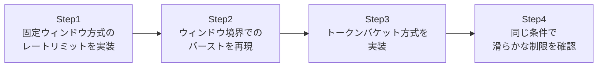

## はじめに

- **この記事で得られること**: [RESTful APIとは何か](/articles/restful-api-guide)で軽く触れたレートリミットという概念を、**実際に2種類のアルゴリズム(固定ウィンドウ方式とトークンバケット方式)を自分で実装し、挙動の違いを比較する**ことで、より深く理解します。
- **対象読者**: レートリミットが「一定時間内のリクエスト数を制限する仕組み」であることは理解しているものの、実装方式によって挙動に差があることを知らず、具体的な欠陥を見たことがない方を想定しています。
- **読むのにかかる想定時間**: 約22分(ハンズオン実施込み)

この記事は[『上位1%』シリーズ 全記事ガイド](/sitemap)の一部、[Web/APIシリーズ](/sitemap#シリーズ一覧)の8本目です。[ハンズオン準備マニュアル](/articles/handson-prep-guide)で作成したUbuntu Server環境が1台あれば実施できます。

## 前提知識

- **レートリミットの基本的な役割**: [RESTful APIとは何か](/articles/restful-api-guide)で軽く触れた、同じクライアントからの過剰なリクエストを制限する仕組みです。本記事では、この制限を実現する、具体的なアルゴリズムの違いを扱います。

## 全体像をつかむ

このハンズオンで行うことは、次の4ステップです。



## ハンズオン手順

### Step 1: 固定ウィンドウ方式のレートリミットを実装する

**固定ウィンドウ方式**は、「1分間に10リクエストまで」というように、時刻を一定間隔(ウィンドウ)に区切り、各ウィンドウ内のリクエスト数を数える、最も単純な方式です。`fixed_window.py`として保存します。

```python
import time
from http.server import BaseHTTPRequestHandler, HTTPServer

LIMIT = 10
WINDOW_SECONDS = 2
window_start = [time.time()]
request_count = [0]

class Handler(BaseHTTPRequestHandler):
    def do_GET(self):
        now = time.time()
        if now - window_start[0] >= WINDOW_SECONDS:
            window_start[0] = now
            request_count[0] = 0

        request_count[0] += 1
        if request_count[0] > LIMIT:
            self.send_response(429)
            self.end_headers()
            self.wfile.write(b'{"error": "rate limit exceeded"}')
            return

        self.send_response(200)
        self.end_headers()
        self.wfile.write(f'{{"count": {request_count[0]}}}'.encode())

HTTPServer(('0.0.0.0', 8000), Handler).serve_forever()
```

```bash
python3 fixed_window.py &
```

### Step 2: ウィンドウ境界でのバーストを再現する

ウィンドウの長さを2秒に設定したので、**最初のウィンドウの終わり際に10リクエストを送り、ウィンドウが切り替わった直後に、もう10リクエストを送ってみます。**

```bash
for i in {1..10}; do curl -s -o /dev/null -w "%{http_code}\n" http://localhost:8000/; done
sleep 1.9
for i in {1..10}; do curl -s -o /dev/null -w "%{http_code}\n" http://localhost:8000/; done
```

**実行結果:**

```
200
200
200
200
200
200
200
200
200
200
200
200
200
200
200
200
200
200
200
200
```

**1分間に10リクエストまで、という設定であるにもかかわらず、わずか2秒弱の間に、合計20リクエストすべてが通ってしまいました。** これが、固定ウィンドウ方式が抱える**境界バースト**という欠陥です。1つ目のウィンドウの終わり際に10リクエスト、ウィンドウが切り替わった瞬間にまた10リクエストを送ると、カウンターがリセットされるタイミングを悪用され、実質的な制限値の約2倍のリクエストが、短時間に通ってしまいます。

### Step 3: トークンバケット方式を実装する

**トークンバケット方式**は、「バケツ」に一定の速度でトークンが補充され、リクエストが来るたびにトークンを1つ消費する、という発想のアルゴリズムです。トークンが残っていなければ、リクエストは拒否されます。`token_bucket.py`として保存します。

```python
import time
from http.server import BaseHTTPRequestHandler, HTTPServer

CAPACITY = 10
REFILL_RATE = 5  # 1秒あたり5トークン補充
tokens = [CAPACITY]
last_refill = [time.time()]

class Handler(BaseHTTPRequestHandler):
    def do_GET(self):
        now = time.time()
        elapsed = now - last_refill[0]
        tokens[0] = min(CAPACITY, tokens[0] + elapsed * REFILL_RATE)
        last_refill[0] = now

        if tokens[0] < 1:
            self.send_response(429)
            self.end_headers()
            self.wfile.write(b'{"error": "rate limit exceeded"}')
            return

        tokens[0] -= 1
        self.send_response(200)
        self.end_headers()
        self.wfile.write(f'{{"tokens_left": {tokens[0]:.1f}}}'.encode())

HTTPServer(('0.0.0.0', 8001), Handler).serve_forever()
```

```bash
python3 token_bucket.py &
```

**この実装の核心は、`elapsed * REFILL_RATE`という計算です。** 固定ウィンドウ方式のように、一定時間ごとにカウンターをリセットするのではなく、**リクエストが来るたびに「前回からどれだけ時間が経過したか」を計算し、その時間に応じたトークンを、連続的に補充し続けます。**

### Step 4: 同じ条件で、滑らかな制限を確認する

Step 2と同じ条件(最初に10リクエスト、少し待って、再び10リクエスト)を、トークンバケット方式のエンドポイントに対して試します。

```bash
for i in {1..10}; do curl -s -o /dev/null -w "%{http_code}\n" http://localhost:8001/; done
sleep 1.9
for i in {1..10}; do curl -s -o /dev/null -w "%{http_code}\n" http://localhost:8001/; done
```

**実行結果(2回目の10リクエスト、該当部分):**

```
200
200
200
200
200
200
200
200
200
429
```

**1回目の10リクエストで、バケツに入っていた10個のトークンをすべて消費しました。約1.9秒の待機中に、1秒あたり5トークンの補充速度で、おおよそ9.5個(実際には上限の10個でキャップ)が補充されましたが、2回目の10リクエストのうち、最後の1リクエストが429エラーで拒否されました。** 固定ウィンドウ方式では20リクエストすべてが通ってしまったのに対し、トークンバケット方式では、補充された分のトークンしか消費できないため、**実質的な制限値に近い、より滑らかな制限が機能している**ことが確認できました。

## プロが見ている視点(上位1%の理解)

### アルゴリズムの選択は、「何を正確に守りたいか」という要件そのものである

固定ウィンドウ方式は、実装が非常に簡単である一方、このハンズオンで確認した境界バーストという欠陥を抱えています。**しかし、これは固定ウィンドウ方式が「劣っている」という単純な話ではありません。** 実装の単純さそのものに価値がある場面(大まかな制限で十分な社内ツールなど)では、固定ウィンドウ方式で十分な場合もあります。一方、公開APIのように、悪意のあるクライアントが、この境界バーストを意図的に悪用してくる可能性がある場面では、トークンバケットのような、より厳密なアルゴリズムが必要になります。**「レートリミットを実装した」という事実だけでなく、「そのアルゴリズムが、本当に守りたい制限を正確に実現しているか」を、具体的な境界条件で検証する視点**が、このハンズオンの核心です。

## よくある誤解・つまずきポイント

- **誤解1: 「レートリミットを実装していれば、どのアルゴリズムでも同じ効果が得られる」**
  このハンズオンで確認したとおり、固定ウィンドウ方式は、ウィンドウの境界で実質的な制限値の約2倍のリクエストを許してしまう欠陥を抱えています。
- **誤解2: 「トークンバケット方式は、常にリクエストを1つずつ、均等な間隔でしか処理できない」**
  トークンバケット方式は、バケツにトークンが残っている限り、短時間にまとめてリクエストを処理すること(バースト)も許容します。これは欠陥ではなく、設計上許容されたバーストです。固定ウィンドウ方式の問題は、このバーストが「意図した制限値を超えて」発生してしまう点にあります。
- **誤解3: 「レートリミットの制限値を厳しくすればするほど、常に安全である」**
  制限が厳しすぎると、正当なユーザーの正常な利用まで妨げてしまいます。アルゴリズムの選択と、制限値の調整は、セキュリティと利便性のトレードオフとして検討する必要があります。

## 障害・トラブルシューティングの視点

1. **レートリミットを設定したはずなのに、想定より多くのリクエストが通ってしまう**: 固定ウィンドウ方式を使っている場合、このハンズオンで確認した境界バーストが発生していないかを確認します。
2. **トークンバケット方式で、想定より早く429エラーが返ってくる**: `CAPACITY`(バケツの最大容量)と`REFILL_RATE`(補充速度)の設定値が、想定している制限値と一致しているかを確認します。
3. **複数のサーバーでレートリミットを分散処理すると、制限が正しく機能しない**: 各サーバーが個別にカウンターやトークン数を管理していると、サーバーの台数倍まで制限が緩んでしまいます。実務では、Redisのような共有ストアで、カウンターやトークン数を一元管理する必要があります。

## まとめ

- 固定ウィンドウ方式は、実装が単純な一方、ウィンドウの境界をまたぐと、実質的な制限値の約2倍のリクエストを許してしまう、境界バーストという欠陥を抱えています。
- トークンバケット方式は、トークンを連続的に補充することで、より滑らかで、意図した制限値に近い制御を実現します。
- どのアルゴリズムを選ぶべきかは、「実装の単純さ」と「制限の厳密さ」のトレードオフとして判断する必要があります。
- 複数サーバーでレートリミットを分散処理する場合、カウンターやトークン数を共有ストアで一元管理する必要があります。

**今日から意識すべきこと**
1. レートリミットを実装する際は、ウィンドウの境界という具体的な条件で、実際にテストを行う習慣をつけましょう。
2. 「レートリミットがある」ことと、「意図した制限値が正確に守られている」ことは、別の話であると意識しましょう。

## 参考文献

- [Rate Limiting Strategies and Techniques | Google Cloud](https://cloud.google.com/architecture/rate-limiting-strategies-techniques)
