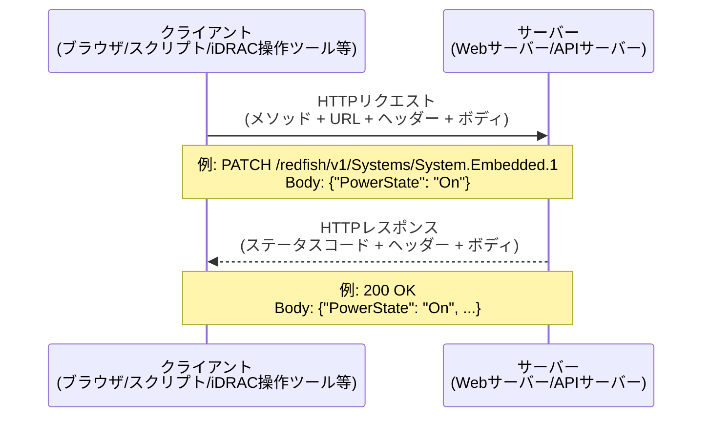
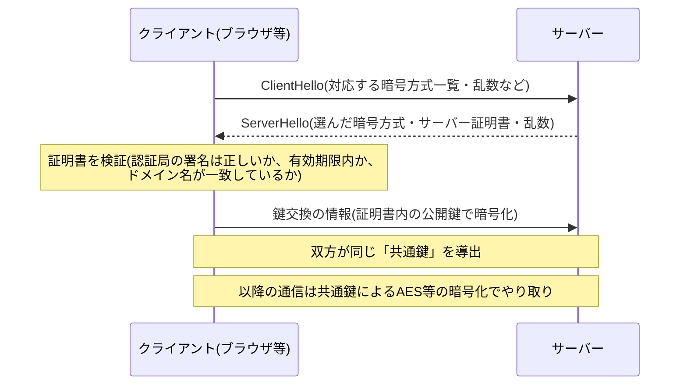
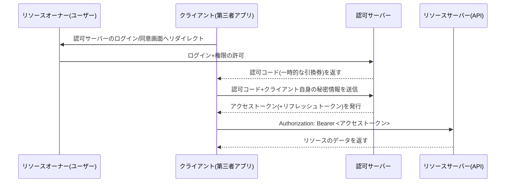

## はじめに

- **この記事で得られること**: 「RESTful API」「HTTPS」「JSON」という、よく見かけるが説明を求められると詰まりがちな用語について、HTTPの基礎からREST設計の思想、認証・べき等性・バージョニングといった実務レベルの設計論まで体系的に理解できます。
- **対象読者**: インフラエンジニアとして就業しており、「APIはURLに対してGET/POSTするものだ」というレベルの理解はあるものの、なぜそのような設計になっているのか、何を守ればRESTfulと呼べるのかを説明できない方。[iDRACとは何か？その仕組みを『上位1%』の視点まで理解する](/articles/idrac-guide) でRedfish（RESTful APIの実例）に触れた流れで読むと理解が深まります。
- **読むのにかかる想定時間**: 約20分

この記事は[『上位1%』シリーズ 全記事ガイド](/sitemap)の一部です。

「Redfishは、iDRACに対してWebサイトを見るのと同じ通信方式で操作できる仕組み」——前提記事ではそう説明しましたが、その「同じ通信方式」の中身、つまりHTTP・REST・JSONが具体的に何をしているのかを、この記事で掘り下げていきます。

## 前提知識

- **API（Application Programming Interface）**: ソフトウェア同士が機能や情報をやり取りするための窓口・約束事のことです。
- **クライアント/サーバーモデル**: 要求する側（クライアント）と、要求に応える側（サーバー）に役割が分かれる通信モデルです。ブラウザとWebサーバーの関係がその代表例です。
- **プロトコル**: 通信の際に守るべき手順・形式のルールです。HTTPはプロトコルの一種です。

## 全体像をつかむ

### 一言で言うと

RESTful APIとは、「**Webサイトを見るのと全く同じ仕組み（HTTP）を使い、操作対象をURLで指定し、GET/POST/PUT/DELETEといった動詞で何をするかを表現する、ソフトウェア同士の統一的な会話のルール**」です。ブラウザで`https://example.com/users/123`を開くとユーザー123のページが表示されるのと同じ発想で、APIでも`https://api.example.com/users/123`というURLに対して「GET（見る）」「DELETE（消す）」といった動詞を組み合わせることで操作を表現します。

### リクエストとレスポンスの全体像



APIというと難しく聞こえますが、実態は「ブラウザがサーバーとやり取りしているのと同じ形式の通信を、人間の代わりにプログラムが行っている」だけです。

## 基礎から徹底解説

### HTTPとは何か

HTTP（HyperText Transfer Protocol）は、クライアントがリクエストを送り、サーバーがレスポンスを返すという1往復の通信を定義したプロトコルです。

**リクエストの構成要素**

| 要素 | 内容 | 例 |
|---|---|---|
| メソッド | 何をしたいかを表す動詞 | `GET`, `POST`, `PUT`, `PATCH`, `DELETE` |
| URL（パス） | 操作対象（リソース）の場所 | `/redfish/v1/Systems/System.Embedded.1` |
| ヘッダー | メタ情報（認証情報、データ形式など） | `Authorization: Basic xxxx`, `Content-Type: application/json` |
| ボディ | 送信するデータ本体（GETでは通常空） | `{"PowerState": "On"}` |

**レスポンスの構成要素**

| 要素 | 内容 |
|---|---|
| ステータスコード | リクエストの結果を表す3桁の数字（後述） |
| ヘッダー | メタ情報（データ形式、キャッシュ指示など） |
| ボディ | 返却されるデータ本体（JSON形式が一般的） |

**ステータスコードの読み方**

| 範囲 | 意味 | 代表例 |
|---|---|---|
| 2xx | 成功 | `200 OK`（成功）、`201 Created`（作成成功）、`204 No Content`（成功だがボディなし） |
| 3xx | リダイレクト | `301 Moved Permanently`（恒久的な移動先あり） |
| 4xx | クライアント側の問題 | `400 Bad Request`（リクエスト自体が不正）、`401 Unauthorized`（認証情報がない/無効）、`403 Forbidden`（認証はOKだが権限不足）、`404 Not Found`（リソースが存在しない）、`429 Too Many Requests`（リクエストしすぎ） |
| 5xx | サーバー側の問題 | `500 Internal Server Error`（サーバー内部エラー）、`503 Service Unavailable`（一時的に処理不能） |

`404 Not Found`が「クライアント側の問題」に分類されているのは、そのリクエスト（存在しないパス・IDを指定した側）に起因する事象だからです。ただし「クライアントが悪い＝バグや不正操作」と断定できるとは限らない点には注意が必要です。たとえば「ついさっきまで存在したリソースが、他の誰かによって削除された直後にアクセスした」というケースでも`404`は返りますが、これはクライアントの実装ミスというより「クライアントが持っていた情報（そのリソースがまだ存在するという前提）が、サーバー側の状態変化によって古くなった」ことが原因です。いずれにせよ「サーバー側の処理は正常に完了しており、単にリクエストされたリソースが今のサーバーの状態には存在しない」という点で、レスポンスの分類としては一貫して4xx（クライアント起因）に区分される、と理解しておくと正確です。

**HTTPS（HTTP + TLS）**

HTTPSは、HTTP通信の内容をTLS（Transport Layer Security）という仕組みで暗号化したものです。通信経路の途中に攻撃者が入り込んでも、内容を盗聴・改ざんされないようにするための仕組みで、認証情報や設定変更コマンドをやり取りするAPI通信では必須の前提となります。

<details>
<summary>TLSは実際に何をしているのか（ハンドシェイクの中身）</summary>

TLSがHTTP通信に対して行っていることは、大きく分けて「なりすましでないことの確認（認証）」と「盗聴・改ざんされない経路の確立（暗号化）」の2つです。通信を始める最初の一瞬に行われる**TLSハンドシェイク**で、この2つを実現するための準備が整います。



1. **サーバー証明書による認証**: サーバーは、認証局（CA: Certificate Authority）が発行した「証明書」（サーバーの公開鍵と、そのドメイン名をCAが保証する電子署名）をクライアントに提示します。クライアントは、この証明書がブラウザ/OSに組み込まれた信頼済みCAの署名によるものか、有効期限内か、アクセスしようとしているドメイン名と証明書の記載が一致しているかを検証します。この検証に失敗すると「この接続はプライバシーが保護されません」といった警告が表示されます。
2. **鍵交換**: 証明書の検証が通ると、クライアントとサーバーは「公開鍵暗号方式」（証明書に含まれる公開鍵で暗号化したものは、対応する秘密鍵を持つサーバーだけが復号できる、という一方向性を利用した方式）を使って、以降の通信を暗号化するための**共通鍵**（双方だけが知る、対称鍵暗号用の鍵）を安全に共有します。公開鍵暗号方式は安全ですが計算コストが高いため、実際のデータのやり取りには使わず、あくまで「最初に共通鍵を安全に受け渡すため」だけに使われます。
3. **共通鍵による暗号化通信**: 以降の実際のHTTPリクエスト・レスポンスは、この共通鍵を使った対称鍵暗号（AESなど、公開鍵暗号より高速に処理できる方式）で暗号化されてやり取りされます。

この一連の流れがあるため、途中の通信経路に攻撃者が割り込んでも、証明書の検証で「なりすまし」を検知でき、仮に通信データを盗み見られても共通鍵を知らない第三者には暗号文にしか見えない、という2重の保護が成立します。

</details>

### RESTとは何か（設計思想）

RESTは「REpresentational State Transfer」の略で、2000年にRoy Fielding氏の博士論文で提唱された、Web APIの設計スタイルです。代表的な原則は次の通りです。

| 原則 | 内容 |
|---|---|
| クライアント/サーバー分離 | UIとデータ管理の関心を分離し、互いに独立して進化できるようにする |
| ステートレス | サーバーはリクエスト間でクライアントの状態を保持しない。各リクエストは、それ単体で処理に必要な情報をすべて含む |
| キャッシュ可能性 | レスポンスがキャッシュ可能かどうかを明示し、パフォーマンスを最適化できる |
| 統一インターフェース | リソースをURLで一意に識別し、GET/POST/PUT/DELETEなど限られた動詞で操作を統一する |
| 階層化システム | クライアントはサーバーと直接通信しているのか、間にロードバランサーやプロキシがあるのかを意識しなくてよい |

「ステートレス」が特に重要です。これは、サーバー側がクライアントごとの「ログイン中かどうか」といった状態をセッションとして保持しないという意味です。そのため、認証情報（トークンなど）は毎回のリクエストに含めて送る必要があります（後述）。

**統一インターフェース（HTTPメソッドの意味とべき等性）**

| メソッド | 意味 | べき等性（同じリクエストを何度送っても結果が同じか） |
|---|---|---|
| GET | リソースを取得する | べき等（何度実行しても状態は変わらない） |
| POST | リソースを新規作成する | 非べき等（実行するたびに新しいリソースが作られうる） |
| PUT | リソースを丸ごと置き換える | べき等（同じ内容で何度送っても結果は同じ） |
| PATCH | リソースの一部だけを更新する | 実装依存（べき等になるよう設計するのが望ましい） |
| DELETE | リソースを削除する | べき等（削除済みのものを再度削除しても状態は変わらない） |

<details>
<summary>「REST」と「RESTful」、そして「実際にはRESTの原則を厳密に満たしていないAPI」について</summary>

「REST」は前述の設計原則そのものを指す言葉で、「RESTful」はその原則に沿って設計されたAPIを形容する言葉です。ただし実務上、世の中で「RESTful API」と呼ばれているものの多くは、Fieldingの原論文が定義する原則（特にHATEOAS: レスポンスの中に次に取れる操作へのリンクを含めるという原則）を厳密には満たしていません。多くの実装は「リソースをURLで表現し、HTTPメソッドを使い分け、JSONでやり取りする」という部分だけを実践した、緩やかな意味での「RESTライク」なAPIです。これは実務上は問題視されることは少なく、「JSON over HTTPで、リソース指向のURL設計になっているAPI」程度の緩い理解でRESTful APIという言葉が使われている、というのが実態に近い理解です。

</details>

### JSONとは何か

JSON（JavaScript Object Notation）は、`{"key": "value"}`という形式でデータをテキストとして表現する記法です。キーと値のペアの集まり（オブジェクト）や、値の並び（配列）を組み合わせて、階層的なデータを表現できます。

```json
{
  "PowerState": "On",
  "Model": "PowerEdge R760",
  "Processors": {
    "Count": 2,
    "Model": "Intel Xeon"
  }
}
```

JSONが広く使われる理由は、XML（かつてSOAP APIで主流だった形式）と比べて構造がシンプルで人間にも読みやすく、JavaScriptとの親和性が高く、多くのプログラミング言語で標準的にパース処理がサポートされているためです。

### ステートレスな世界での認証：トークンという仕組み

RESTの「ステートレス」原則により、サーバーは「このクライアントは先ほどログインした」という状態を覚えていません。そのため、認証情報を**毎回のリクエストに含める**必要があります。代表的な方式は次の通りです。

| 方式 | 概要 |
|---|---|
| Basic認証 | ユーザー名とパスワードをBase64エンコードして`Authorization`ヘッダーに含める。シンプルだが平文同然のため必ずHTTPSと併用する |
| APIキー | サーバーが発行した固定の鍵文字列をヘッダーやクエリパラメータに含める |
| Bearerトークン（セッショントークン） | ログイン処理などで一時的なトークンを発行し、以降のリクエストの`Authorization: Bearer <token>`ヘッダーに含める。iDRACのRedfish APIも、初回にセッションを作成しX-Auth-Tokenを発行する方式を採用しています |
| OAuth 2.0 | 第三者サービスに、ユーザー自身のパスワードを渡さずに限定的な権限だけを委譲する仕組み。大規模なAPIエコシステムで広く使われます |

<details>
<summary>OAuth 2.0の仕組みをもう少し詳しく（認可コードフロー）</summary>

OAuth 2.0には4つの登場人物がいます。

| 登場人物 | 役割 |
|---|---|
| リソースオーナー | データの持ち主本人（例: サービスにログインしているあなた） |
| クライアント | リソースオーナーの代わりにデータへアクセスしたい第三者アプリ |
| 認可サーバー | ログイン・権限の同意画面を提供し、トークンを発行するサーバー |
| リソースサーバー | 実際のデータを持つAPIサーバー（認可サーバーと同一実装のこともある） |

最も代表的な「認可コードフロー」は次のような流れです。



ポイントは、**クライアント（第三者アプリ）はユーザーのパスワードを一度も受け取らない**という点です。ユーザーは認可サーバーの画面上で直接ログイン・権限の同意を行い、クライアントが受け取るのは「このユーザーの、この範囲の権限だけを代行してよい」という引換券（認可コード）とその先に発行される**アクセストークン**だけです。アクセストークンは有効期限が短く設定されるのが一般的で、期限切れ後も再ログインなしで更新できるよう、有効期限の長い**リフレッシュトークン**を組み合わせて使うのが一般的な設計です。

</details>

### Redfishという「RESTful API」の実例

ここまでの内容を踏まえてiDRACのRedfish APIを見ると、次のように読み解けます。

- `GET https://<iDRACのIP>/redfish/v1/Systems/System.Embedded.1` → サーバーの状態（電源状態、モデル名など）というリソースを「取得」する
- `PATCH https://<iDRACのIP>/redfish/v1/Systems/System.Embedded.1` （ボディに`{"PowerState": "On"}` ) → サーバーの状態というリソースの一部を「更新」する
- レスポンスはJSON形式で、`PowerState`や`Model`といったキーと値のペアとして返ってくる
- 認証はセッションベースのトークン（`X-Auth-Token`ヘッダー）または初回のBasic認証で行う

「リモートでサーバーを操作する」という一見特殊な行為が、Webサイトを見るのと同じHTTP・同じJSONの枠組みの上に成り立っている、ということが具体的にイメージできるはずです。

## プロが見ている視点（上位1%の理解）

### べき等性が実務で重要になる理由

ネットワークは信頼できるとは限らず、リクエストを送ったのにタイムアウトでレスポンスが受け取れない、ということが起こり得ます。このとき「同じリクエストをもう一度送ってよいか」を判断する基準がべき等性です。`PUT`や`DELETE`はべき等なので安全にリトライできますが、`POST`は非べき等なため、単純にリトライすると同じリソースが二重作成される危険があります。大規模なAPI連携やリトライ処理を設計する際は、このべき等性の区別が事故を防ぐ土台になります。

具体的に「送金APIに`POST /transfers`で1万円の送金リクエストを送ったが、レスポンスが返ってくる前にタイムアウトした」という場面を考えます。このとき、次のどちらが起きたのかをクライアント側は判別できません。

1. リクエストがサーバーに届く前にネットワークが切れた（送金は実行されていない）
2. サーバーは送金処理を完了させたが、その完了レスポンスがクライアントに届く前にネットワークが切れた（送金は実行済み）

ここで「届いていないかもしれないから」と単純に`POST`をもう一度送ると、2のケースでは送金が2回実行されてしまいます。これが「`POST`は非べき等だから単純リトライは危険」の具体的な意味です。実務では、クライアント側でリクエストごとに一意な**冪等性キー**（Idempotency-Key、UUID等をリクエストヘッダーに含める）を発行し、サーバー側は同じキーのリクエストを受け取ったら「新規に処理するのではなく、前回と同じ結果を返す」ように実装することで、`POST`のような本来非べき等な操作にも安全にリトライできる仕組みを持たせます。これは多くの決済API（Stripe等）で標準的に採用されている設計です。

### ページネーションの仕組み

大量のリソースを扱うAPI（数百台のサーバー一覧を返すRedfish APIなど）では、一度に全件を返さず、`?page=2&limit=50`のようなクエリパラメータで分割して返す「ページネーション」が一般的です。ここで重要なのは、**「残り」はサーバーが自発的に送ってくるものではなく、クライアントが次のページを明示的にリクエストして初めて返ってくる**という点です。RESTはステートレスな仕組みなので、サーバー側は「このクライアントには、まだ2ページ目を送っていない」という状態を覚えていません。クライアントが`?page=2`という具体的なリクエストを送ることで、サーバーはその都度「2ページ目に相当するデータ」を計算して返しているだけです。

ページネーションの実装方式には、代表的に2種類あります。

| 方式 | 仕組み | 長所・短所 |
|---|---|---|
| オフセット方式 | `?page=2&limit=50`のように「何件目から何件」を指定する | 実装が単純で、特定のページに直接ジャンプできる。ただし取得中にデータが追加・削除されると、ページの境目がずれて同じ項目が重複したり抜け落ちたりすることがある |
| カーソル方式 | `?after=<直前の最後の項目のID等>`のように「前回どこまで見たか」を指定する | データの追加・削除があってもズレが生じにくく、大量データに対して安定して動作する。ただし「〇ページ目に直接飛ぶ」ような操作はしにくい |

数百台規模のRedfish API一覧のように、裏側のデータが常に変化しうる（サーバーの追加・撤去が日常的にある）大規模環境では、カーソル方式の方が実務上好まれる傾向があります。

### レートリミット

APIサーバーを保護するために、一定時間内のリクエスト数を制限する「レートリミット」が設けられることが一般的で、超過すると`429 Too Many Requests`が返されます。大規模自動化（数百台のiDRACへ一括でRedfish APIを叩くようなスクリプト）を書く際は、レートリミットに配慮したリトライ・待機処理（バックオフ）の実装が必須になります。

### APIバージョニング

APIの仕様は将来変更されることがあるため、`/v1/`のようにURLにバージョン番号を含める、または`Accept`ヘッダーでバージョンを指定する方式が使われます。古いクライアントが新しいAPI仕様の変更で突然壊れないようにする、実務上非常に重要な設計です。

## よくある誤解・つまずきポイント

- **誤解1: 「JSONでやり取りしていれば、それはRESTful APIだ」**
  JSON形式でデータをやり取りしていても、URL設計がリソース指向になっておらず（例: `/doSomething?action=delete&id=1`のような動詞をURLに埋め込む設計）、実質的にRPC（遠隔手続き呼び出し）をHTTPの皮を被せているだけのAPIも多く存在します。JSON採用とRESTの設計原則採用は別の話です。
- **誤解2: 「HTTPSにしておけばAPIは安全だ」**
  HTTPSは通信経路の暗号化（盗聴・改ざん防止）を保証しますが、認証（誰がアクセスしているか）や認可（その人が何をしてよいか）は別レイヤーの話です。HTTPSでも認証情報が漏洩すれば誰でもなりすませます。
- **誤解3: 「ステートレスとは、サーバーが何もデータを保存しないという意味だ」**
  ステートレスが指しているのは「クライアントとの対話の文脈（セッション状態）を保持しない」という意味であり、データベース上のリソースの状態（サーバーが管理するデータそのもの）を保存しないという意味ではありません。両者を混同しないことが重要です。

## 障害・トラブルシューティングの視点

### APIが期待通りに応答しない場合の切り分け

1. まずステータスコードを確認します。`4xx`はリクエスト側、`5xx`はサーバー側に主な原因があります。
2. `401`/`403`が返る場合は、認証トークンの有効期限切れ、権限不足、ヘッダー名のタイポなどを疑います。
3. `429`が返る場合はレートリミット超過です。一定時間待ってからリトライするか、リクエスト頻度を下げます。
4. タイムアウトが発生する場合は、ネットワーク経路の問題か、サーバー側の処理が重い（大量データの取得など）ことが原因になりえます。`-v`（verbose）オプション付きの`curl`でTCP接続確立からレスポンス受信までのどこで詰まっているかを確認します。

### 予防策・恒久対策

- クライアント側でレートリミット・タイムアウト・リトライ（べき等なメソッドのみ）を適切に実装する。
- APIのバージョンが変わった際の互換性方針（後方互換の維持期間など）を事前に確認しておく。
- 認証トークンの有効期限と更新（リフレッシュ）の仕組みを実装から漏らさない。

## まとめ

- RESTful APIとは、Webサイトを見るのと同じHTTPの仕組みの上で、リソースをURLで指定し、HTTPメソッドで操作を表現する設計スタイルです。
- ステートレスという原則により、認証情報は毎回のリクエストに含める必要があり、トークンベースの認証方式が広く使われています。
- 世の中の「RESTful API」の多くは、Fieldingの原論文の原則を厳密には満たさない緩やかな実装であり、それ自体は実務上問題視されていません。
- べき等性・ページネーション・レートリミット・バージョニングは、APIを大規模に・安全に使いこなすための実務知識です。

**今日から意識すべきこと**
1. 普段触っているAPIのHTTPメソッドとステータスコードを、意識して確認してみましょう。
2. 自動化スクリプトを書くときは、そのAPI呼び出しがべき等かどうかを意識し、リトライ処理を安全に実装しましょう。

## 参考文献

- [Hypertext Transfer Protocol (HTTP/1.1): Semantics and Content | RFC 9110](https://datatracker.ietf.org/doc/html/rfc9110)
- [Architectural Styles and the Design of Network-based Software Architectures (Roy Fielding's dissertation, Chapter 5: REST)](https://ics.uci.edu/~fielding/pubs/dissertation/rest_arch_style.htm)
- [HTTP | MDN Web Docs](https://developer.mozilla.org/en-US/docs/Web/HTTP)
- [JSON | MDN Web Docs](https://developer.mozilla.org/en-US/docs/Glossary/JSON)
- [Redfish Specification | DMTF](https://www.dmtf.org/standards/redfish)
- [iDRAC: Redfish API with Dell Integrated Remote Access Controller | Dell US](https://www.dell.com/support/kbdoc/en-us/000178045/redfish-api-with-dell-integrated-remote-access-controller)
