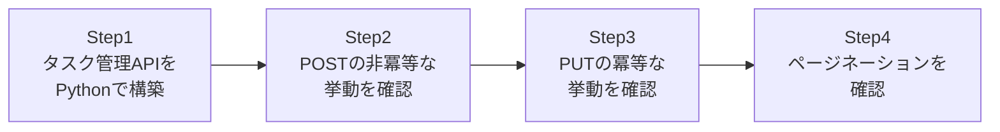

## はじめに

- **この記事で得られること**: [RESTful APIとは何かを『上位1%』の視点で理解する](/articles/restful-api-guide)で学んだ、HTTPメソッドの意味・冪等性・ページネーションといった知識を、**実際に自分でRESTful APIを構築し、curlでリクエストを送って挙動を確認する**ことで検証します。POSTとPUTの冪等性の違いを、座学の説明としてではなく、実際のレスポンスの中身として確認します。
- **対象読者**: RESTful APIの座学は理解したものの、実際にAPIサーバーを構築した経験がなく、冪等性やページネーションといった概念を、手を動かして確認しておきたい方を想定しています。
- **読むのにかかる想定時間**: 約20分(ハンズオン実施込み)

この記事は[『上位1%』シリーズ 全記事ガイド](/sitemap)の一部、[Web/APIシリーズ](/sitemap#シリーズ一覧)の3本目です。[ハンズオン準備マニュアル](/articles/handson-prep-guide)で作成したUbuntu Server環境が1台あれば実施できます。

## 前提知識

- **HTTPメソッドの意味と冪等性**: [RESTful APIとは何か](/articles/restful-api-guide)の「統一インターフェース(HTTPメソッドの意味と冪等性)」で扱った、GET/POST/PUT/PATCH/DELETEそれぞれの意味と、冪等性の違いです。
- **ページネーションの基礎**: 同記事の「ページネーションの仕組み」で扱った、大量のリソースを一度に返さず、分割して返す仕組みです。

## 全体像をつかむ

このハンズオンで行うことは、次の4ステップです。



## ハンズオン手順

### Step 1: タスク管理APIを、Pythonの標準ライブラリだけで構築する

Ubuntu Serverで、次のPythonスクリプトを`api_server.py`として保存します。外部ライブラリを一切使わず、標準ライブラリの`http.server`だけで、インメモリのタスク一覧を管理するAPIサーバーです。

```python
import json
from http.server import BaseHTTPRequestHandler, HTTPServer
from urllib.parse import urlparse, parse_qs

tasks = {}
next_id = [1]

class Handler(BaseHTTPRequestHandler):
    def _send(self, code, body):
        self.send_response(code)
        self.send_header('Content-Type', 'application/json')
        self.end_headers()
        self.wfile.write(json.dumps(body).encode())

    def do_GET(self):
        parsed = urlparse(self.path)
        if parsed.path == '/tasks':
            qs = parse_qs(parsed.query)
            page = int(qs.get('page', ['1'])[0])
            limit = int(qs.get('limit', ['2'])[0])
            all_items = list(tasks.values())
            start = (page - 1) * limit
            page_items = all_items[start:start + limit]
            self._send(200, {
                'page': page, 'limit': limit,
                'total': len(all_items), 'items': page_items,
            })
        else:
            self._send(404, {'error': 'not found'})

    def do_POST(self):
        length = int(self.headers.get('Content-Length', 0))
        body = json.loads(self.rfile.read(length))
        task_id = next_id[0]
        next_id[0] += 1
        tasks[task_id] = {'id': task_id, 'title': body.get('title')}
        self._send(201, tasks[task_id])

    def do_PUT(self):
        parsed = urlparse(self.path)
        task_id = int(parsed.path.split('/')[-1])
        length = int(self.headers.get('Content-Length', 0))
        body = json.loads(self.rfile.read(length))
        tasks[task_id] = {'id': task_id, 'title': body.get('title')}
        self._send(200, tasks[task_id])

    def do_DELETE(self):
        parsed = urlparse(self.path)
        task_id = int(parsed.path.split('/')[-1])
        tasks.pop(task_id, None)
        self._send(204, {})

HTTPServer(('0.0.0.0', 8000), Handler).serve_forever()
```

```bash
python3 api_server.py &
```

### Step 2: POSTの非冪等な挙動を確認する

**同じボディのPOSTリクエストを、2回続けて送信します。**

```bash
curl -s -X POST http://localhost:8000/tasks -d '{"title": "Buy milk"}'
curl -s -X POST http://localhost:8000/tasks -d '{"title": "Buy milk"}'
```

**実行結果:**

```json
{"id": 1, "title": "Buy milk"}
{"id": 2, "title": "Buy milk"}
```

**まったく同じ内容のリクエストを2回送ったにもかかわらず、`id`が1と2という、別々の2つのリソースが作成されたことが確認できました。** これが、[座学で学んだ](/articles/restful-api-guide)POSTの「非冪等」という性質が、実際のレスポンスとして現れた瞬間です。POSTを2回送ってしまうと、意図せず2つの重複したタスクが作られてしまう、という実務上のリスクが、ここで具体的に体感できます。

### Step 3: PUTの冪等な挙動を確認する

**同じボディのPUTリクエストを、同じIDに対して2回続けて送信します。**

```bash
curl -s -X PUT http://localhost:8000/tasks/1 -d '{"title": "Buy milk and eggs"}'
curl -s -X PUT http://localhost:8000/tasks/1 -d '{"title": "Buy milk and eggs"}'
```

**実行結果:**

```json
{"id": 1, "title": "Buy milk and eggs"}
{"id": 1, "title": "Buy milk and eggs"}
```

**今度は、2回とも同じ`id: 1`に対して、同じ内容のレスポンスが返ってきました。** 何回繰り返しても、サーバー側の状態は「id 1のタスクが、このタイトルになっている」という、同じ1つの状態に収束します。これが、PUTの「冪等」という性質です。ネットワークが不安定で、クライアントがリクエストを再送してしまうような状況でも、PUTであれば、再送による予期しない副作用(Step 2で確認したような重複作成)が起きない、という安心感につながります。

### Step 4: ページネーションを確認する

タスクをいくつか追加した状態で、`limit`パラメータを使い、一覧を分割して取得します。

```bash
curl -s -X POST http://localhost:8000/tasks -d '{"title": "Task A"}' > /dev/null
curl -s -X POST http://localhost:8000/tasks -d '{"title": "Task B"}' > /dev/null
curl -s "http://localhost:8000/tasks?page=1&limit=2"
curl -s "http://localhost:8000/tasks?page=2&limit=2"
```

**実行結果(該当部分):**

```json
{"page": 1, "limit": 2, "total": 4, "items": [...2件...]}
{"page": 2, "limit": 2, "total": 4, "items": [...残り2件...]}
```

**`total`という、全件数を示すフィールドと、`items`という、そのページ分だけのデータが、別々に返ってくる**ことが確認できました。クライアント側は、この`total`の値を見て、あと何ページ分の取得が必要かを判断できます。[座学で学んだ](/articles/restful-api-guide)ページネーションの仕組みが、具体的にどのようなレスポンス構造として実装されるのかを、ここで体感できました。

## プロが見ている視点(上位1%の理解)

### 冪等性は、設計者の意図であり、HTTPメソッドが自動的に保証するものではない

このハンズオンで実装したPUTの挙動は、**「同じIDに対して、同じ内容で上書きする」という実装を、サーバー側が意図的に行っているからこそ、冪等になっています。** もしサーバー側が、PUTのリクエストを受け取るたびに、内部的に新しいタスクを追加するような実装をしていれば、PUTであっても非冪等になってしまいます。**冪等性は、HTTPの仕様がサーバーに強制するものではなく、「このメソッドを使うなら、こういう挙動にする」という、設計者と利用者の間の、暗黙の約束事です。** API開発者としてPUTを実装する際は、「本当に冪等になっているか」を、このハンズオンで行ったように、同じリクエストを2回送って自分で確認する習慣が重要です。

## よくある誤解・つまずきポイント

- **誤解1: 「冪等性は、HTTPのメソッド自体が自動的に保証してくれる」**
  冪等性は、サーバー側の実装によって実現されるものです。PUTというメソッド名を使っていても、実装次第で非冪等な挙動になってしまう可能性があります。
- **誤解2: 「POSTを2回送っても、サーバー側が重複を検知して防いでくれる」**
  このハンズオンで確認したとおり、POSTは意図的に非冪等な設計になっているため、重複防止の仕組み(冪等性キーなど)を、別途アプリケーション側で実装する必要があります。
- **誤解3: 「ページネーションのtotalフィールドは、必須の仕様である」**
  totalフィールドを含めるかどうかは、API設計者の判断です。件数が膨大な場合は、totalの計算自体がコストになるため、あえて含めない設計も実務では見られます。

## 障害・トラブルシューティングの視点

1. **POSTを1回しか送っていないのに、タスクが2つ作られている**: クライアント側のリトライ処理(タイムアウト時の自動再送など)が、意図せずPOSTを2回送信していないかを確認します。
2. **PUTで更新したはずのタスクが、古い内容のまま返ってくる**: `id`の指定が正しいか、サーバー側の実装が本当に上書きになっているかを確認します。
3. **ページネーションで、一部のデータが重複または欠落する**: ページを取得する間に、他のクライアントがデータを追加・削除していないかを確認します。リアルタイムに変化するデータに対するページネーションは、この問題への対処も設計段階で検討が必要です。

## まとめ

- POSTは非冪等な設計であり、同じリクエストを2回送ると、2つの別々のリソースが作成されます。
- PUTは冪等な設計であり、同じリクエストを何度送っても、サーバー側の状態は同じ1つの結果に収束します。
- 冪等性は、HTTPの仕様が自動的に保証するものではなく、サーバー側の実装によって実現される、設計上の約束事です。
- ページネーションのレスポンスは、全件数を示す情報と、そのページ分のデータを、別々のフィールドとして返す構造が一般的です。

**今日から意識すべきこと**
1. APIを実装する際は、「このメソッドは本当に冪等か」を、同じリクエストを2回送って確認する習慣をつけましょう。
2. クライアント側でリトライ処理を実装する際は、再送してよいメソッド(冪等なもの)と、再送すべきでないメソッド(POSTなど)を区別しましょう。

## 参考文献

- [RFC 7231 - HTTP/1.1 Semantics and Content, Section 4.2 (Common Method Properties)](https://datatracker.ietf.org/doc/html/rfc7231#section-4.2)
