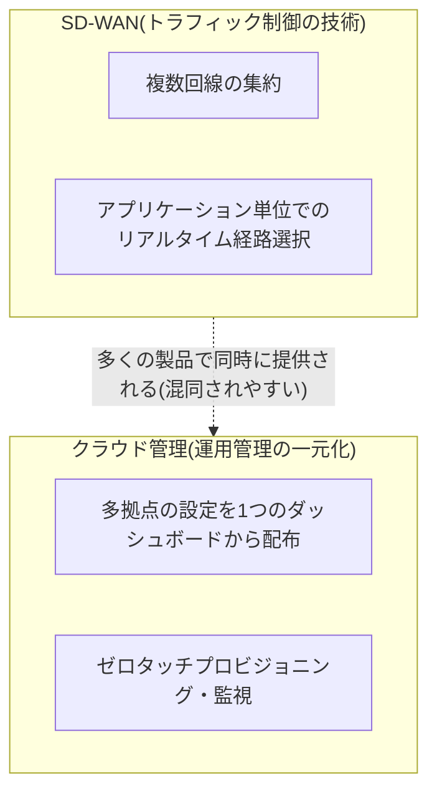
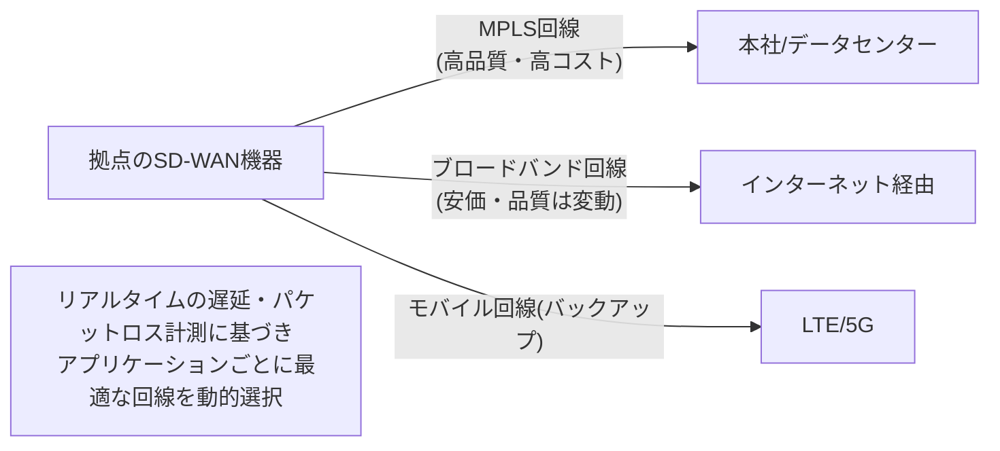

## はじめに

- **この記事で得られること**: 「回線冗長化のためSD-WANの設定をする」という場面に出会ったとき、**SD-WANとはそもそも何を指す技術なのか**、そして「Merakiのように、クラウド上で複数拠点の設定を一括管理できる仕組みとSD-WANは同じものなのか」という疑問に答えます。**SD-WAN(トラフィック制御の技術)とクラウド管理(運用管理の一元化)という、しばしば混同される2つの概念を明確に切り分けた**上で、拠点間VPNの実務でよく比較検討される**FortiGate・YAMAHA・Meraki**という3つの機器・製品ラインの違いと、それぞれのメリット・デメリットまでを体系的に理解します。
- **対象読者**: 拠点のネットワーク機器の選定や、SD-WANの設定に携わったことはあるものの、SD-WANという用語が具体的に何を指しているのか、クラウド管理との関係を含めて説明できない方を想定しています。
- **読むのにかかる想定時間**: 約19分

この記事は[『上位1%』シリーズ 全記事ガイド](/sitemap)の一部、[拠点間VPN(Site-to-Site VPN)シリーズ](/sitemap#シリーズ一覧)の3本目です。拠点間VPNの一般的な仕組みは[拠点間VPN(Site-to-Site VPN)を『上位1%』の視点で理解する](/articles/site-to-site-vpn-guide)を前提にしています。

## 前提知識

- **WAN(Wide Area Network)**: 拠点間や、拠点とデータセンター・クラウドを結ぶ広域網です。専用線(MPLSなど)やブロードバンドインターネット回線が代表的な実現手段です。
- **拠点間VPN**: 拠点間の通信を、IPsecなどで暗号化して保護する技術です。詳しくは[拠点間VPN(Site-to-Site VPN)を『上位1%』の視点で理解する](/articles/site-to-site-vpn-guide)を参照してください。

## 全体像をつかむ

### 一言で言うと

**SD-WAN(Software-Defined WAN)は、「拠点が持つ複数の回線(MPLS・ブロードバンド・モバイル回線など)を、アプリケーションごとの通信品質(遅延・パケットロスなど)にもとづいて動的に使い分ける、トラフィック制御の技術」です。** これに対し、「クラウド上で複数拠点の機器の設定を一括管理できる」という機能は、**SD-WANそのものではなく、運用管理の仕組み(クラウド管理コンソール)という別の概念**です。**多くの製品(Meraki、FortiGateなど)がこの2つを同時に提供しているため混同されやすい**、というのが実務での分かりにくさの正体です。

## 基礎から徹底解説

### SD-WANが解決している課題

従来、拠点間の通信品質を確保する手段として、<strong>MPLS(Multi-Protocol Label Switching)</strong>という、通信事業者が提供する帯域保証付きの専用線サービスが広く使われてきました。MPLSは信頼性が高い一方、**回線調達のコストが高く、新規開通までのリードタイムも長い**という課題があります。

SD-WANは、この課題に対し、**MPLSのような専用線と、安価で手配も速いブロードバンドインターネット回線・モバイル回線(LTE/5Gなど)を、拠点の機器で同時に集約し、通信の種類(アプリケーション)ごとに、その時点で最も品質の良い回線を動的に選んで送信する**というアプローチで応えます。

具体的には、SD-WAN機器は各回線の**遅延(レイテンシ)・ジッター(遅延のばらつき)・パケットロス率**をリアルタイムに計測し続け、あらかじめ設定したポリシー(「音声通話は遅延の少ない回線を優先」「一般的なWebアクセスはコストの低い回線でよい」など)に基づいて、パケットを送信する回線を動的に切り替えます。これにより、**専用線1本に依存する構成より低コストで、かつ単純なバックアップ切り替えより柔軟な信頼性**を実現できる、というのがSD-WAN導入の主な経済的合理性です。

### SD-WANとクラウド管理は別々の概念

ここで、**「SD-WANはMerakiのようにクラウド上で一括した設定を適用できるようなものではないのか」という疑問**に戻ります。答えは、<strong>「SD-WANというトラフィック制御の技術そのものと、クラウド管理という運用の仕組みは、別々の概念である」</strong>というものです。

- **SD-WAN(トラフィック制御)**: 個々の拠点の機器が、その拠点に接続されている複数の回線を、リアルタイムの品質にもとづいて動的に使い分ける機能です。この機能自体は、クラウド上の管理コンソールがなくても、機器単体のローカル設定だけで(限定的にではあれ)実現できます。
- **クラウド管理(運用管理の一元化)**: 多数の拠点に配置された機器の設定投入・監視・ファームウェア更新を、1つのクラウド上のダッシュボードから一括して行う仕組みです。SD-WANのポリシー設定自体も、実務では多くの場合このクラウド管理コンソールから配布されますが、**クラウド管理という仕組み自体は、SD-WAN機能の有無とは独立した、別の軸の話**です。

**多くの現代的なネットワーク製品(Meraki、FortiGateなど)が、SD-WAN機能とクラウド管理機能の両方を同時に提供しているため、この2つが1つの機能のように見えてしまう**のが、実務での混同の原因です。整理すると、次のようになります。

| 概念 | 何を制御しているか |
|---|---|
| SD-WAN | 拠点機器が持つ**複数の回線のうち、どれを使うか**という、トラフィックそのものの経路選択 |
| クラウド管理 | 多数の拠点機器の**設定・監視・運用そのもの**を、どこから・どうやって行うか |
| SASE(Secure Access Service Edge) | SD-WANと、クラウド上のセキュリティ機能(セキュアWebゲートウェイ、[ZTNA](/articles/ztna-guide)など)を統合した、より広い概念。近年よく登場する上位の用語です |

## プロが見ている視点(上位1%の理解)

### FortiGate・YAMAHA・Merakiの違いと選び方

拠点間VPN・SD-WANの実務でよく比較検討される、3つの代表的な機器・製品ラインを整理します。

| 製品 | 特徴 | 強み | 弱み・注意点 |
|---|---|---|---|
| **FortiGate(Fortinet)** | UTM(統合脅威管理、FWにIPS・アンチウイルス・Webフィルタなどを統合)機能とSD-WAN機能を、単体機器のOS(FortiOS)に統合。クラウド管理はFortiManager/FortiCloud | セキュリティ機能の網羅性が高く、拠点のセキュリティ強化とWAN最適化を1台で両立しやすい。CLIによる高度なカスタマイズも可能 | 高機能な分、初期設定・運用にはある程度の専門知識が必要。ライセンス構成が複雑になりやすい |
| **YAMAHA(RTXシリーズ)** | 国内、特に中小企業向けの実績が豊富なルーター・VPN機器。シンプルなVPN・ルーティング機能に強い | コストパフォーマンスが高く、国内でのサポート・技術情報(コミュニティ・マニュアル)が充実している。個々の設定の透明性が高くCLIでの制御に長けたエンジニアに好まれる | 大規模なSD-WAN(複数回線の動的な品質ベース選択)機能は、FortiGate/Merakiほど高度ではない製品が多く、大規模・複雑な要件には別製品との組み合わせが必要になる場合がある |
| **Meraki(Cisco)** | クラウド管理ダッシュボードを前提とした設計思想の製品ライン。SD-WAN機能(Auto VPN、複数回線の自動集約)も統合 | 多拠点への展開・一元管理のしやすさが最大の強み。ゼロタッチプロビジョニングにより、拠点側での専門知識がなくても展開しやすい | サブスクリプション形式のライセンスが必須で、継続的なコストが発生する。CLIでの細かなカスタマイズ性はFortiGateやYAMAHAに比べて限定的 |

**どれが「お勧め」かは、要件によって変わります。**

- **拠点数が多く、展開スピードや拠点側の専門知識に依存しない運用を重視する場合**: Merakiのクラウド管理のしやすさが大きな利点になります。
- **セキュリティ機能(UTM)とWAN最適化を1台で両立させたい、コストとの兼ね合いも重視する場合**: FortiGateが有力な選択肢です。
- **コストを最優先し、要件がシンプルな拠点間VPN・ルーティングにとどまる場合、あるいは国内サポートを重視する場合**: YAMAHAが有力な選択肢です。

### なぜ「クラウド管理への依存」がリスクになりうるのか

クラウド管理コンソールへの依存には、実務上考慮すべきトレードオフもあります。**クラウド管理コンソールとの通信(インターネット経由)が何らかの理由で切断された場合、その拠点の機器はローカルで既存の設定のまま動作を継続できるか、それとも管理機能自体が制限されるか**は、製品・設計によって異なります。多くの製品は、クラウドとの接続が切れても既存の設定に基づいたトラフィック処理自体は継続できるように設計されていますが、**新規の設定変更やリアルタイムの監視は、クラウド接続が復旧するまで行えません。** これは、[iDRACとは何か?その仕組みを『上位1%』の視点まで理解する](/articles/idrac-guide)で扱った帯域外管理(Out-of-Band管理)の考え方——「管理経路そのものが、管理対象の経路と共倒れしないか」という視点——と同じ発想で捉えると理解しやすくなります。

## よくある誤解・つまずきポイント

- **誤解1: 「SD-WANとは、Merakiのようなクラウド管理そのものを指す用語である」**
  SD-WANはトラフィック制御の技術、クラウド管理は運用管理の一元化の仕組みであり、別々の概念です。多くの製品が両方を提供しているため混同されやすいだけです。
- **誤解2: 「SD-WANを導入すれば、MPLSのような専用線は完全に不要になる」**
  SD-WANは複数の回線を組み合わせて使う技術であり、要件によってはMPLSのような高品質な専用線を一部の重要な通信のために継続利用しつつ、SD-WANで他の回線と組み合わせる構成が現実的な場合も多くあります。
- **誤解3: 「FortiGate・YAMAHA・Merakiのうち、どれか1つが絶対的に優れている」**
  それぞれ設計思想と強みが異なり、拠点数・予算・求めるセキュリティレベル・運用体制によって最適な選択は変わります。

## 障害・トラブルシューティングの視点

SD-WAN・エッジルーターのトラブルは、**「トラフィック制御(SD-WAN)の問題か、運用管理(クラウド接続)の問題か」を切り分ける**のが基本です。

1. **特定のアプリケーションの通信品質が悪い**: SD-WANのポリシー設定(どの回線をどの条件で優先するか)と、各回線の実際の遅延・パケットロス計測値が正しく取得できているかを確認します。
2. **回線切り替え(フェイルオーバー)が想定より遅い、または頻発する**: 品質判定のしきい値(遅延・パケットロス率の許容範囲)の設定を見直します。しきい値が厳しすぎると、一時的な品質変動でも頻繁に切り替えが発生します。
3. **クラウド管理コンソールから拠点機器が見えなくなった**: その拠点のインターネット接続自体に問題がないかを確認します。多くの場合、既存の設定によるトラフィック処理自体は継続していることが多いですが、監視・設定変更ができない状態になります。

### 予防策・恒久対策

- SD-WANのポリシー設定は、実際の回線品質の傾向(時間帯による混雑など)を踏まえて、定期的に見直す。
- クラウド管理に依存する製品を選定する場合、管理コンソールへの接続経路自体の冗長性(複数回線での接続)も検討する。
- 機器選定の際は、拠点数・予算・セキュリティ要件・運用体制を総合的に評価し、単一の指標(価格やブランドなど)だけで決めない。

## まとめ

- SD-WANは、複数の回線をアプリケーションごとの通信品質にもとづいて動的に使い分ける、トラフィック制御の技術です。
- クラウド管理は、多数の拠点機器の設定・監視・運用を1つのダッシュボードから一括して行う、運用管理の仕組みであり、SD-WANとは別の概念です。多くの製品が両方を同時に提供しているため混同されやすいだけです。
- FortiGateはセキュリティ機能とSD-WANの両立、YAMAHAはコストパフォーマンスとシンプルな構成、Merakiはクラウド管理のしやすさがそれぞれの強みであり、要件に応じて選定する必要があります。
- クラウド管理に依存する構成では、管理コンソールへの接続経路自体の可用性も、帯域外管理と同じ発想で検討する必要があります。

**今日から意識すべきこと**
1. 「SD-WAN」という用語に出会ったら、トラフィック制御の技術なのか、クラウド管理の話なのかを意識的に区別しましょう。
2. エッジルーターを選定する際は、単一の製品の知名度だけでなく、拠点数・予算・セキュリティ要件・運用体制を総合的に評価しましょう。

## 参考文献

- [What Is SD-WAN? | Fortinet](https://www.fortinet.com/resources/cyberglossary/sd-wan)
- [FortiGate SD-WAN Overview | Fortinet Documentation](https://docs.fortinet.com/document/fortigate/latest/administration-guide/955826/sd-wan)
- [Meraki Auto VPN | Cisco Meraki Documentation](https://documentation.meraki.com/MX/Site-to-site_VPN/AutoVPN%3A_A_Technical_Overview)
- [What is SASE (Secure Access Service Edge)? | Gartner](https://www.gartner.com/en/information-technology/glossary/secure-access-service-edge-sase)
