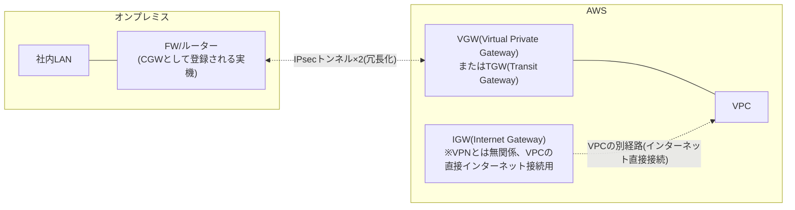

## はじめに

- **この記事で得られること**: オンプレミスのファイアウォールとAWSをIPsec VPNで接続する際に登場する<strong>IGW(Internet Gateway)・VGW(Virtual Private Gateway)・CGW(Customer Gateway)・TGW(Transit Gateway)</strong>というゲートウェイ群が、それぞれAWSのネットワーク構成の中で何を表しているのかを整理します。あわせて、「拠点間VPNの通信は、本当にただの一般的なインターネットを流れているのか、それともAWS専用のネットワークを通っているのか」という疑問に答え、実際に想定される構成・料金の考え方・構築手順の流れまでを体系的に理解します。
- **対象読者**: オンプレミスのFWとAWSをVPN接続する構成を検討・構築したことはあるものの、各ゲートウェイの役割や、通信経路の実際の姿を具体的に説明できない方を想定しています。
- **読むのにかかる想定時間**: 約20分

この記事は[『上位1%』シリーズ 全記事ガイド](/sitemap)の一部、[拠点間VPN(Site-to-Site VPN)シリーズ](/sitemap#シリーズ一覧)の2本目です。IPsecトンネルモードやトラフィックセレクタといった拠点間VPNの一般的な仕組みは[拠点間VPN(Site-to-Site VPN)を『上位1%』の視点で理解する](/articles/site-to-site-vpn-guide)で扱っているため、本記事ではAWS特有のゲートウェイ構成にフォーカスします。

## 前提知識

- **VPC(Virtual Private Cloud)**: AWSアカウント内に作成する、論理的に分離されたプライベートなネットワーク空間です。オンプレミスの1つのネットワークセグメントに相当するものとして捉えると理解しやすくなります。
- **IPsecトンネルモード**: 拠点間VPNで一般的に使われる、元のIPパケット全体を新しいIPパケットでカプセル化する方式です。詳しくは[拠点間VPN(Site-to-Site VPN)を『上位1%』の視点で理解する](/articles/site-to-site-vpn-guide)を参照してください。

## 全体像をつかむ

### 一言で言うと

**AWSとのSite-to-Site VPNは、「オンプレミス側の機器を表す設定情報(CGW)」と「AWS側でVPN接続を終端するゲートウェイ(VGWまたはTGW)」との間に、冗長化された2本のIPsecトンネルを張る構成**です。ここで最初に整理すべきなのは、**IGW・VGW・CGW・TGWという4つの用語が、まったく異なる役割を持っている**という点です。

## 基礎から徹底解説

### 4つのゲートウェイの役割の違い

| 用語 | 正体 | 役割 |
|---|---|---|
| **IGW(Internet Gateway)** | VPCにアタッチする、インターネットへの直接接続用のゲートウェイ | VPC内のリソースが一般的なインターネットと直接通信するための出入口。**VPNとは無関係**の、別の目的のゲートウェイ |
| **VGW(Virtual Private Gateway)** | VPCにアタッチする、VPN接続を終端するAWS側のゲートウェイ | オンプレミスからのIPsec VPN接続を、AWS側で受け止める窓口 |
| **CGW(Customer Gateway)** | **物理的な機器ではなく、AWS上に登録する"設定情報(リソース)"** | オンプレミス側のVPN機器(FWやルーター)の<strong>公開IPアドレスとBGP ASN(自律システム番号)</strong>を、AWSに登録しておくための構成情報 |
| **TGW(Transit Gateway)** | 複数のVPC・VPN接続・Direct Connectを集約するハブとなるゲートウェイ | VGWが1つのVPCに対して1対1で紐づくのに対し、複数のVPCやアカウントをまとめて接続したい場合の集約点 |

**特に誤解しやすいのがCGWです。** 「ゲートウェイ」という名前がついているため、AWS上に何らかの機器やサービスが新設されるように聞こえますが、**CGWの実体は単なる設定情報(リソース)であり、実際にVPN終端の処理を行っている物理的な実機は、あくまでオンプレミス側にあるFWやルーターです。** CGWは、AWS側が「相手のオンプレミス機器のIPアドレスとASNはこれです」と認識するための、登録台帳のようなものだと考えると分かりやすくなります。

### 拠点間VPNの通信は本当にインターネットを流れているのか

**標準的なAWS Site-to-Site VPNの場合、オンプレミス側の機器(CGW)とAWS側のVGW/TGWの間の通信は、暗号化されたIPsecパケットとして、一般的なインターネット網を実際に経由します。** これは、拠点間VPンがそもそも「信頼できないネットワーク(インターネット)上に、暗号化によって安全な通信路を作る」という技術である以上、当然の前提です。

**一方で、AWSには「専用のネットワーク」を使う別の選択肢も用意されています。** それが**AWS Direct Connect**です。Direct Connectは、オンプレミスの拠点からAWSのリージョンまで、インターネットを経由しない**専用の物理的な接続**(AWS Direct Connectロケーションと呼ばれる相互接続ポイント経由)を提供するサービスです。「AWS専用のネットワークもあると思っている」という直感は、**Direct Connectという別サービスの存在を指しているのであれば正しい**、ということになります。

Direct ConnectとVPNを組み合わせる構成

Direct Connect自体は専用の物理線であり、既定では通信が暗号化されません(AWS側のネットワークに閉じた区間だからこそ許容される設計です)。**より高いセキュリティ要件がある場合、Direct Connectの回線の上に、さらにIPsec VPNを構築する「VPN over Direct Connect」という構成も可能**です。この場合、通信は物理的にはDirect Connectの専用線を流れつつ、論理的には暗号化されたVPNトンネルとして保護される、という2重の防御が実現します。また、Direct Connectを主経路としつつ、その回線が万一利用できなくなった場合のバックアップとして、インターネット経由のSite-to-Site VPNを併用する構成も、実務でよく採用される高可用性設計です。

**なお、AWSのリージョン・アベイラビリティゾーン間、あるいは同一リージョン内のAWSサービス同士の通信は、AWS自身が保有する専用のグローバルバックボーンネットワークを経由しています。** つまり「オンプレミスからAWSへの入り口(CGW-VGW間)」は一般にインターネットを経由する一方、「AWSに入った後、AWSの内部を移動する部分」はAWS専用のネットワークを経由する、という**2段階の構造**になっている、と理解すると正確です。

### VGWとTGW:どちらを使うべきか

VGWは、**1つのVPCに対して1対1で紐づく**、シンプルな構成です。VPCが1つだけ、あるいは少数であれば、VGWで十分に要件を満たせます。

一方、**複数のVPC(あるいは複数のAWSアカウント)を運用しており、それぞれをオンプレミスと接続したい**場合、VPCごとに個別のVGWとVPN接続を用意すると、管理対象が増えるだけでなく、VPC間の通信経路も別途設計する必要が出てきます。この場合に使われるのが<strong>TGW(Transit Gateway)</strong>です。TGWは、複数のVPC・VPN接続・Direct Connectを1つのハブに集約し、**星形(ハブアンドスポーク)のネットワーク構成**を実現します。

VPN CloudHub:複数のオンプレミス拠点を1つのVGWでつなぐ古典的な方法

TGWが登場する以前から存在する、より限定的な機能として**VPN CloudHub**があります。これは、**1つのVGWに対して複数のCGW(=複数のオンプレミス拠点)を接続し、動的ルーティング(BGP)を使って、オンプレミスの拠点同士の通信もAWSを経由して中継させる**という構成です。複数拠点間の相互接続だけを目的とする限定的な要件であれば選択肢になりえますが、複数VPCとの接続やDirect Connectとの統合など、より広範な要件がある場合は、現在ではTGWを使う設計が主流です。

### 想定される構築手順の流れ

実際の構築は、大きく次の流れで進みます。

1. **CGW(Customer Gateway)の作成**: オンプレミス側の機器(FW/ルーター)の公開IPアドレスと、BGPを使う場合はASN番号を、AWS側に登録します。
2. **VGW(またはTGW)の作成とVPCへのアタッチ**: AWS側の終端ポイントを用意します。
3. **Site-to-Site VPN接続の作成**: CGWとVGW(またはTGW)を指定し、ルーティング方式(静的ルート、またはBGPによる動的ルート)を選択します。この時点で、**冗長化のため2本のトンネル**(それぞれ異なるAWS側のエンドポイント)が自動的に構成されます。
4. **設定ファイルのダウンロードとオンプレミス機器への投入**: AWSは、指定したベンダー(Cisco、FortiGate、YAMAHAなど主要な機器に対応したテンプレート)向けの設定ファイルを生成できます。これをオンプレミス側の機器へそのまま(あるいは一部調整して)投入します。
5. **ルーティングの伝播確認**: 静的ルートの場合はVPC側のルートテーブルへの反映、BGPの場合はネイバー確立とルート交換が正しく行われているかを確認します。
6. **両方のトンネルの確立とフェイルオーバーの確認**: 2本のうち1本だけ確立して満足せず、両方が正常に確立していること、そして片方を意図的に切った場合にもう一方へ正しく切り替わることまで確認します。

### 料金の考え方

AWS Site-to-Site VPNの料金は、大きく**VPN接続自体の稼働時間に対する料金**と、**VPN経由でAWSから外部へ転送されるデータ量に対する料金**の組み合わせで構成されます(TGWを経由する構成の場合は、TGW自体の稼働時間・処理データ量に対する料金も追加されます)。具体的な料金レートは変更される可能性があるため、構築前に必ずAWSの最新の料金ページで確認することが実務上重要です。Direct Connectと比較すると、Site-to-Site VPN自体の稼働コストは低廉である一方、帯域保証(SLA)がなく、インターネットの状況に応じて遅延・帯域が変動しうる、というトレードオフがあります。

## プロが見ている視点(上位1%の理解)

### 静的ルートとBGP動的ルーティングの選び方

VPN接続のルーティング方式には、**静的ルート**(あらかじめ指定した宛先レンジだけを固定的にルーティングする)と、**BGP動的ルーティング**(オンプレミス側とAWS側がBGPで経路情報を交換し、変更を自動的に反映する)の2つがあります。

拠点・VPCの構成がシンプルで、宛先レンジの変更が稀な環境では、静的ルートの単純さが運用上のメリットになります。一方、**複数の拠点・複数のVPCが絡む構成、あるいは2本のトンネルの優先順位を経路属性で細かく制御したい場合**は、BGPの方が柔軟です。特に、2本のトンネルの片方を優先させたい(アクティブ/スタンバイ構成にしたい)場合、BGPのAS_PATHの長さやローカルプレファレンスといった属性を使って、経路の優先順位を明示的に制御できます。

### 2本のトンネルを両方アクティブに保つ重要性

AWSのSite-to-Site VPN接続は、冗長化のために既定で2本のトンネルが構成されますが、**オンプレミス側の機器の設定によっては、実際には1本しか確立されていない(もう1本は待機状態、あるいは設定ミスで確立されていない)という状態に陥っていることが実務では珍しくありません。** この状態では、AWS側でメンテナンスが行われ現在確立中のトンネルの終端が切り替わった際に、想定していた冗長化が機能せず、接続断が発生します。構築後は必ず、AWSのマネジメントコンソールで**両方のトンネルのステータスが"UP"になっていること**を確認する習慣が重要です。

## よくある誤解・つまずきポイント

- **誤解1: 「CGWは、AWS上に新設される物理的な機器やサービスである」**
  CGWの実体は設定情報(リソース)であり、実際にVPN終端の処理を行う実機はオンプレミス側にあります。
- **誤解2: 「拠点間VPN接続すれば、専用線と同等の帯域保証・低遅延が得られる」**
  標準的なSite-to-Site VPNは一般的なインターネットを経由するため、帯域保証(SLA)はありません。帯域保証が必要な場合はDirect Connectを検討します。
- **誤解3: 「VPN接続を作成すれば、2本のトンネルは自動的に両方使われる」**
  トンネル自体はAWS側で2本構成されますが、オンプレミス側の機器で両方を正しく確立・維持する設定がされているかは別問題です。構築後の確認が必須です。

## 障害・トラブルシューティングの視点

AWSとの拠点間VPNの障害は、**「AWS側とオンプレミス側、どちらの設定に起因するか」を切り分ける**のが基本です。

1. **トンネルがまったく確立しない**: オンプレミス側機器のIKE/IPsecパラメータ(暗号化アルゴリズム、DHグループなど)が、AWSが要求する設定と一致しているかを確認します。CGWに登録した公開IPアドレスが、オンプレミス側機器の実際のIPアドレスと一致しているかも基本的な確認事項です。
2. **トンネルは確立しているが、通信できない**: 静的ルートの場合はルートテーブルへの反映、BGPの場合はネイバー状態とルートの交換状況を確認します。オンプレミス側・AWS側双方のセキュリティグループ・ACL・FWルールも確認します。
3. **片方のトンネルが切れた際に、通信断が発生した**: 前述の通り、もう一方のトンネルが実際にアクティブな状態で維持されていたかを確認します。
4. **オンプレミス側機器のIPアドレスを変更した**: CGWの登録情報を更新し、新しい設定ファイルを再取得してオンプレミス側機器へ反映します。

### 予防策・恒久対策

- 構築後、両方のトンネルのステータスが"UP"であることを定期的に監視する。
- 帯域保証や低遅延が必須の要件がある場合は、Site-to-Site VPN単体ではなくDirect Connectの利用を検討する。
- BGPを使う場合は、経路の優先順位(AS_PATH、ローカルプレファレンスなど)を明示的に設計し、意図した経路が使われることを確認する。

## まとめ

- IGWはVPCの直接インターネット接続用、VGW/TGWはAWS側のVPN終端ゲートウェイ、CGWはオンプレミス機器の情報を登録する設定情報であり、それぞれ役割がまったく異なります。
- 標準的なSite-to-Site VPNの通信は一般的なインターネットを経由しますが、AWSはDirect Connectという専用線サービスも別途提供しており、両者を組み合わせた構成も可能です。
- VGWは1つのVPCに1対1で紐づくシンプルな構成、TGWは複数のVPC・VPN・Direct Connectを集約するハブ型の構成です。
- 冗長化のため2本のトンネルが構成されますが、実際に両方が確立・維持されているかは構築後に必ず確認する必要があります。

**今日から意識すべきこと**
1. AWSとのVPN構成を検討する際は、まずIGW・VGW・CGW・TGWそれぞれの役割を明確に区別しましょう。
2. VPN接続を構築したら、必ず両方のトンネルのステータスが"UP"であることを確認し、意図した冗長化が機能しているかを検証しましょう。

## 参考文献

- [What is AWS Site-to-Site VPN? | AWS Documentation](https://docs.aws.amazon.com/vpn/latest/s2svpn/VPC_VPN.html)
- [Customer gateway options for your Site-to-Site VPN connection | AWS Documentation](https://docs.aws.amazon.com/vpn/latest/s2svpn/cgw-options.html)
- [What is a transit gateway? | AWS Documentation](https://docs.aws.amazon.com/vpc/latest/tgw/what-is-transit-gateway.html)
- [AWS Direct Connect | AWS Documentation](https://docs.aws.amazon.com/directconnect/latest/UserGuide/Welcome.html)
