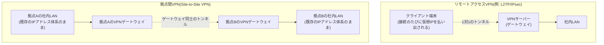
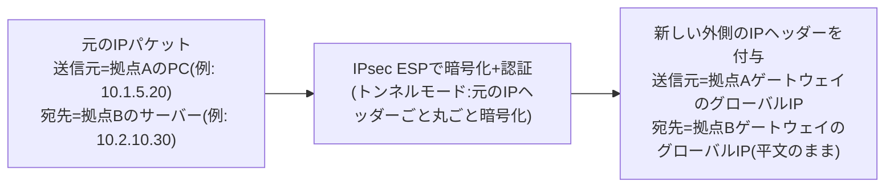

## はじめに

- **この記事で得られること**: リモートアクセスVPN(L2TP/IPsecなど、クライアント個人がVPNサーバーに接続する形態)と拠点間VPN(2つの拠点のネットワーク同士をまるごと接続する形態)がどう違うのか、そして実務でよくある「異なるベンダーの機器同士」——たとえば日本国内拠点のCisco機器と海外拠点のWatchGuard機器——でIPsecトンネルを確立する際に、何を揃えれば接続でき、何が原因でつながらなくなるのかを体系的に理解できます。
- **対象読者**: インフラエンジニアとして、リモートアクセスVPNの仕組み(IKE/ESP、PSKや証明書による認証など)はある程度理解しているものの、拠点間VPN(site-to-site VPN)が具体的にどう違うのか、特に異なるベンダーの機器同士で接続する際に何に気をつければいいのかを説明できない方を想定しています。
- **読むのにかかる想定時間**: 約25分

この記事は[『上位1%』シリーズ 全記事ガイド](/sitemap)の一部です。

## 前提知識

- **VPN(Virtual Private Network)** : インターネットのような公衆網の上に、あたかも専用線のような論理的な通信路を作る技術の総称です。
- **IKE(Internet Key Exchange)** : 暗号鍵を安全に合意し、通信相手を認証するためのプロトコルです。UDPポート500(NAT越え時は4500)を使います。IKEにはIKEv1とIKEv2という2つのバージョンがあり、両者の設計上の違い(EAP認証・Configuration Payload・MOBIKEなど)は[L2TP/IPsecと現代的なVPNプロトコルを『上位1%』の視点で比較する](/articles/vpn-protocols-comparison-guide)で詳しく扱っています。
- **ESP(Encapsulating Security Payload)** : IKEで合意した鍵を使い、実際にデータを暗号化・改ざん検知するプロトコルです。IPプロトコル番号50として扱われます。
- **SA(Security Association)** : IKEやIPsecの通信で使われる、暗号アルゴリズム・鍵・有効期間などの合意済みパラメータの集合に一意のIDを与えたものです。IKEフェーズ1で確立され制御チャネル自体を守る**IKE SA**と、IKEフェーズ2で確立されESPが実データの保護に使う**IPsec SA**の2種類があり、両方が揃って初めて暗号化通信が成立します。
- **事前共有鍵(PSK)/証明書認証**: IKEのネゴシエーションで「相手が正規の相手であること」を証明する2つの代表的な方式です。PSKは双方が同じ秘密の文字列をあらかじめ共有しておく方式、証明書はCA(認証局)が発行した証明書を使う方式です。
- **ACL(Access Control List)** : 送信元・宛先IPアドレスなどの条件でパケットを許可・拒否するルールの集合です。ルーターやファイアウォールで、通信の許可・拒否だけでなく「どの通信を特別扱いするか」を宣言する目的でも使われます。

## 全体像をつかむ

### 一言で言うと

**拠点間VPNとリモートアクセスVPNの最大の違いは、「誰と誰をつなぐか」という接続形態そのものです。** リモートアクセスVPNは「個々のクライアント端末」と「VPNサーバー(ゲートウェイ)」を1対1でつなぎ、接続のたびにクライアントへ新しい仮想IPアドレスを払い出します。一方拠点間VPNは「拠点Aのネットワーク」と「拠点Bのネットワーク」を、既存のIPアドレス体系のまま、ゲートウェイ同士のトンネルでまるごと接続します。



両者の違いを要素ごとに整理すると、次のようになります。

| 観点 | リモートアクセスVPN(L2TP/IPsecなど) | 拠点間VPN(Site-to-Site VPN) |
|---|---|---|
| 接続主体 | 個々のクライアント端末 ⇔ VPNサーバー | 拠点のVPNゲートウェイ ⇔ 拠点のVPNゲートウェイ |
| IPsecの適用モード | トランスポートモード(L2TPなど別の仕組みがすでにトンネルを作っている場合) | トンネルモード(IPsec自身が新しい外側IPヘッダーで元パケット全体を包む) |
| ユーザー認証 | あり(PPP層などでユーザー名・パスワードによる個人認証) | 通常なし(ゲートウェイ単位のPSKまたは証明書による認証のみ) |
| 通信対象の識別方法 | 接続後に払い出される仮想IPアドレス(クライアント1台につき1つ) | IKEフェーズ2の**トラフィックセレクタ**(後述)で「どのローカルサブネットとどのリモートサブネットの組み合わせを通すか」を宣言 |
| 典型的な用途 | 社外の個人端末から社内リソースへのアクセス | 本社-支社間、オンプレミス-クラウド間などネットワーク同士の常時接続 |

### なぜ拠点間VPNはトンネルモードを使うのか

L2TP/IPsecのようなリモートアクセスVPNでは、L2TPというプロトコル自身がすでに「クライアントとサーバーの間に仮想的な1対1のリンクを作る」というトンネルの役目を果たしているため、IPsecは元のIPヘッダーをそのまま残す**トランスポートモード**で済みます(この経緯は[L2TP/IPsecの仕組みを『上位1%』の視点で理解する](/articles/l2tp-ipsec-guide)で詳しく扱っています)。

しかし拠点間VPNには、L2TPのようなトンネル生成専用の仕組みが存在しません。ゲートウェイ同士をつなぐ「トンネルを作る」という役目自体を、IPsecがすべて1人で担う必要があります。そこで使われるのが**トンネルモード**です。



トランスポートモードとの決定的な違いは、**「元のIPヘッダーごと暗号化の対象に含める」** 点です。トランスポートモードでは経路上の機器から「元の送信元・宛先IPアドレス」がそのまま見えていましたが、トンネルモードでは元のIPヘッダー(拠点Aの内部IP・拠点Bの内部IPという、本来インターネット上ではルーティングできないプライベートアドレスであることも多い情報)自体が暗号化された中身に隠れ、経路上から見えるのは新しく付与された「両ゲートウェイのグローバルIPアドレス」だけになります。これにより、拠点内部のアドレス体系を外部に晒すことなく、インターネットという公衆網の上に2つの拠点のネットワークを橋渡しできます。

### トラフィックセレクタ(プロキシID)という考え方

リモートアクセスVPNでは「誰が接続してきたか」をPPP層のユーザー名・パスワードで識別していましたが、拠点間VPNにはそもそも個人の認証という概念がありません。代わりに拠点間VPNが識別するのは、**「どのローカルサブネットとどのリモートサブネットの間の通信を、このトンネルに通すか」** という組み合わせです。これはIKEフェーズ2のネゴシエーションで交換される情報で、**トラフィックセレクタ**(あるいは**プロキシID**)と呼ばれます。

たとえば拠点Aが`10.1.0.0/16`、拠点Bが`10.2.0.0/16`というアドレス体系を持つ場合、トラフィックセレクタは「ローカル: `10.1.0.0/16`、リモート: `10.2.0.0/16`」という形で両ゲートウェイに宣言されます。両ゲートウェイがこの組み合わせについて完全に一致する内容を提案し合わなければ、フェーズ2のネゴシエーションは成立しません。**このトラフィックセレクタの不一致こそが、拠点間VPNのトラブルシューティングで最も頻繁に遭遇する原因**であり、後述の「障害・トラブルシューティングの視点」で詳しく扱います。

## 基礎から徹底解説

### 拠点間VPNの認証モデル:機器を認証し、個人は認証しない

拠点間VPNのIKEフェーズ1では、リモートアクセスVPNのIPsec層と同じく、事前共有鍵(PSK)または証明書による認証が行われます。しかし拠点間VPNには、リモートアクセスVPNにおけるPPP層の認証に相当するもの、つまり「具体的に誰が使っているか」を確認する仕組みが**存在しません**。

これは設計上の欠落ではなく、拠点間VPNというものの性質そのものに由来します。拠点間VPNが接続するのは「拠点Aの誰か」ではなく「拠点Aのネットワークそのもの」です。トンネルを通過した後、個々の利用者が特定の内部サーバーにアクセスしてよいかどうかは、拠点間VPN自体の役目ではなく、既存の社内ファイアウォール・Active Directoryのアクセス権限・内部サーバー側の認証など、**トンネルの先にある別の仕組みに委ねられます**。拠点間VPNは、あくまで「2つの拠点のネットワークを安全に橋渡しする土管」を提供しているだけだ、と捉えると役割分担が整理できます。

### ポリシーベースVPNとルートベースVPN

拠点間VPNの実装には、大きく分けて2つの方式があります。

| 方式 | 動作の仕組み | 通す通信の決め方 |
|---|---|---|
| **ポリシーベースVPN** | 通信内容(ACLやトラフィックセレクタ)そのものが暗号化対象を決める。1つのローカル/リモートサブネットの組み合わせごとに、独立したIPsec SAが作られる | ACLやセレクタで明示的に宣言した組み合わせのみ |
| **ルートベースVPN** | トンネルが仮想的な1本のネットワークインターフェース(トンネルインターフェース)として扱われ、ルーティングテーブルが暗号化対象を決める | 通常のルーティング(静的経路、あるいはOSPF/BGPなどの動的経路)に従う |

**ポリシーベースVPN**は、拠点Aに5つのサブネット、拠点Bに3つのサブネットがあり、そのすべての組み合わせで通信させたい場合、理論上5×3=15個の独立したIPsec SAが必要になります(トラフィックセレクタの組み合わせごとに1つのSAが対応するため)。サブネットが増えるたびに設定・SA数が組み合わせ的に増えていく点が、大規模な多拠点環境では運用負荷になります。

**ルートベースVPN**は、トンネルインターフェースという「実体のある1本の仮想インターフェース」を作り、そこに向けたルーティングエントリ(あるいはOSPF/BGPなどの動的ルーティングプロトコル)で「何をトンネルに流すか」を決めます。IPsec SA自体は広い範囲(あるいは0.0.0.0/0)のセレクタで1つだけ確立し、実際にどの通信をトンネルへ回すかはルーティングテーブル側の責務にできるため、多拠点・多サブネット環境でのスケーラビリティに優れます。動的ルーティングプロトコルをトンネルの上で直接動かせる(拠点が増えても経路が自動的に伝搬する)ことも大きな利点です。

### 実務での典型的な構成:VPNゲートウェイは拠点の境界に1台

拠点内に複数のセグメントが存在する場合でも、実務でよく見られるのは**セグメントの数だけVPNルーターを用意するのではなく、拠点からインターネットへ出る境界(WAN側)に1台のVPNゲートウェイを設置し、拠点内の複数セグメントをまとめて扱う**という構成です。セグメントごとに個別の物理VPNルーターを置くのは機器台数・運用コストの面で非現実的であり、多くの環境では既存のファイアウォールやルーターがVPNゲートウェイの役割を兼務します。

この1台のゲートウェイが複数セグメントをどう扱うかは、ポリシーベースVPNとルートベースVPNで次のように異なります。

- **ポリシーベースVPN**では、VPNゲートウェイ自体は物理的に1台のままですが、前述の通り(ローカルセグメント, リモートセグメント)の組み合わせごとに独立したIPsec SAが確立されます。物理的には1台の機器が、論理的には**セグメントの組み合わせの数だけ仮想的なトンネルを束ねて保持している**、とイメージすると実態に近くなります。
- **ルートベースVPN**では、1台のゲートウェイが持つトンネルインターフェースを拠点内のどのセグメントからでも通過できる状態にしておき、実際にどのセグメント宛の通信をトンネルへ流すかは、拠点内のルーティング(スタティックルート、あるいはOSPF/BGPなどの動的ルーティング)に委ねられます。

<details>
<summary>Cisco・WatchGuardそれぞれの対応状況</summary>

Ciscoは、ACLで暗号化対象を定義する伝統的な**crypto map**(ポリシーベース)と、**VTI(Virtual Tunnel Interface)** による経路ベースの構成の両方をサポートしています。VTIは通常のCisco IOSインターフェースと同じように扱えるため、OSPF/BGPといった動的ルーティングプロトコルをトンネルの上でそのまま動かせる点が大きな利点です。なお、IKEv2でのダイナミックVTI(DVTI)構成はFlexVPNという枠組みの中でのみサポートされる、という制約もあります。

WatchGuard Fireboxは、Gateway(フェーズ1)とTunnel(フェーズ2、ローカル/リモートのネットワークをルートとして明示的に列挙)を手動で組み合わせる**手動BOVPN(Branch Office VPN)** が基本形で、これは実質的にポリシーベースVPNです。これとは別に**BOVPNバーチャルインターフェース**という、トンネルを仮想インターフェースとして扱いルーティングベースで通信を制御する構成も提供されており、クラウド上の仮想ネットワークとの接続や、動的ルーティングを使いたい場合に使われます。

</details>

### Case Study:日本拠点のCiscoと海外拠点のWatchGuardでIPsecトンネルを組む

実務では、合併・買収で拠点ごとに導入時期の異なる機器が混在していたり、本社と海外拠点の調達ルートが別だったりといった経緯で、Cisco⇔Fortinet、Palo Alto⇔Juniper、Cisco⇔WatchGuardといった具合に、異なるベンダーの機器同士で拠点間VPNを組まざるを得ないケースは珍しくありません。ここでは、数あるベンダー混在パターンの一例として、日本国内の本社にCisco機器、海外拠点にWatchGuard Fireboxを設置し、両拠点をIPsecの拠点間VPNで接続するシナリオを具体的に見ていきます。異なるベンダーの機器同士を接続する際に最初にぶつかる壁は、**用語がベンダーごとにまったく異なる**ことです。同じ役割を指す設定項目でも、Ciscoの資料とWatchGuardの資料では呼び方が違うため、まずは対応関係を押さえる必要があります。

| 役割 | Ciscoでの呼び方 | WatchGuard Fireboxでの呼び方 |
|---|---|---|
| フェーズ1(IKE SA)の設定全体 | crypto ikev2 policy / crypto isakmp policy | Gateway(Phase 1設定) |
| フェーズ1の暗号/認証アルゴリズムの提案 | crypto ikev2 proposal | Gatewayの Phase 1 Proposal(暗号化・認証・DHグループの組み合わせ) |
| 事前共有鍵の格納 | crypto ikev2 keyring / crypto isakmp key | Gateway Endpointの認証設定(Pre-Shared Key) |
| ピアの識別方法 | crypto ikev2 profile内のmatch identity | Gateway EndpointのGateway ID(IPアドレス/ドメイン名など) |
| フェーズ2(IPsec SA)の暗号/認証アルゴリズムの提案 | crypto ipsec transform-set / crypto ikev2 ipsec-proposal | TunnelのPhase 2 Proposal |
| トラフィックセレクタ | crypto map内のmatch address(ACL) | TunnelのRoute(Local/Remote Network) |
| 死活監視 | crypto isakmp keepalive / IKEv2のdpd | GatewayのDead Peer Detection設定 |
| 実際のトンネル定義 | crypto map全体、またはVTI(トンネルインターフェース) | Gateway + Tunnelの組み合わせ、またはBOVPNバーチャルインターフェース |

CiscoのIOSでIKEv2ベースの拠点間VPNを組む場合、設定はおおむね次のような要素で構成されます(実際のコマンドはIOSのバージョンや構成によって調整が必要です)。

```
crypto ikev2 proposal PROP1
  encryption aes-cbc-256
  integrity sha256
  group 14

crypto ikev2 policy POLICY1
  proposal PROP1

crypto ikev2 keyring KEYRING1
  peer BRANCH-WG
    address 203.0.113.10
    pre-shared-key <PSK>

crypto ikev2 profile PROFILE1
  match identity remote address 203.0.113.10 255.255.255.255
  authentication local pre-share
  authentication remote pre-share
  keyring local KEYRING1

crypto ipsec transform-set TSET1 esp-aes 256 esp-sha256-hmac
  mode tunnel

crypto map CMAP1 10 ipsec-isakmp
  set peer 203.0.113.10
  set transform-set TSET1
  set ikev2-profile PROFILE1
  match address ACL-TO-BRANCH

ip access-list extended ACL-TO-BRANCH
  permit ip 10.1.0.0 0.0.255.255 10.2.0.0 0.0.255.255
```

一方WatchGuard Firebox側は、Policy ManagerまたはWatchGuard Cloudの管理画面上で、同じ内容をGUIから設定します。**Gateway**の作成画面でPhase 1(暗号化アルゴリズムAES-256、認証SHA-256、DHグループ14に相当する設定、PSK、Gateway Endpointの IPアドレス)を定義し、その下にぶら下がる**Tunnel**の作成画面でPhase 2(ESPの暗号化・認証アルゴリズム、PFSグループ)と、Local/Remote Networkとして`10.1.0.0/16`⇔`10.2.0.0/16`というルートを明示的に登録します。

**両者を実際につなげる際に、特に気をつけるべき不一致ポイント**は次の通りです。

1. **IKEバージョンの不一致**: WatchGuard Fireware は手動BOVPNでIKEv1・IKEv2の両方をサポートしていますが、既定で選ばれるバージョンやテンプレートの組み合わせはCisco側のデフォルトと一致するとは限りません。どちらのバージョンを使うか、両拠点で明示的に合意しておく必要があります。
2. **既定テンプレートのアルゴリズムが一致しない**: Ciscoの既定のISAKMPポリシーと、WatchGuardが用意している既製のPhase 1/Phase 2 Proposalテンプレートは、暗号化アルゴリズム・ハッシュ・DHグループの組み合わせがそのまま一致することはほとんどありません。少なくとも片方のベンダーで**カスタムのプロポーザル**を作成し、もう片方の設定と暗号化アルゴリズム・認証アルゴリズム・DHグループ・ライフタイムのすべてを1対1で完全に一致させる必要があります。1つでもパラメータが食い違うと、フェーズ1またはフェーズ2は「一部だけ成功する」のではなく、その段階そのものが丸ごと失敗します。
3. **ピアの識別方式(ID Type)の不一致**: Ciscoの`match identity remote address`はIPアドレスでピアを識別する設定ですが、WatchGuard側のGateway Endpointでは「IPアドレスで識別する」か「ドメイン名(FQDN)で識別する」かを選択できます。PSK自体が正しくても、この識別方式が両者で食い違っていると認証は失敗します。
4. **NATトラバーサル(NAT-T)の要否**: 海外拠点のWatchGuardが、ISP提供のルーターなどNAT配下に設置されているケースは珍しくありません。この場合、リモートアクセスVPNのL2TP/IPsecにおけるNAT-T([NAT/NAPTの仕組みを『上位1%』の視点で理解する](/articles/nat-guide)で詳しく扱っています)と同じ原理で、UDP4500へのフロートを両ゲートウェイで有効化し、一致させる必要があります。
5. **トラフィックセレクタの粒度の不一致**: Cisco側でVTI(ルートベース)を使い広いセレクタを想定している一方、WatchGuard側は伝統的なポリシーベースのTunnel Routeでサブネットごとに個別のセレクタを列挙する構成である、という組み合わせは特に起こりやすいミスマッチです。たとえば拠点Aに`10.1.0.0/16`と`10.3.0.0/24`という2つの独立したサブネットがあり、どちらも拠点Bと通信させたい場合、WatchGuard側のポリシーベースTunnelには両方の組み合わせを個別のRouteとして登録する必要があり、Cisco側のACLにも対応する`permit`行を漏れなく用意する必要があります。片方にだけ追加を忘れると、「一部のサブネットだけ通信できない」という切り分けの難しい障害になります。実務上は、**両拠点とも同じ粒度でトラフィックセレクタを明示的に列挙する構成に揃える**のが、異なるベンダー間での相互接続性を最も高める定石です。

### IKEv1からIKEv2への移行プロジェクトで気をつけるべきこと

前述の通り、拠点間VPNの新規構築ではIKEv2が選ばれることが増えていますが、実務では「既存のIKEv1構成を、稼働中のままIKEv2へバージョンアップする」という案件も頻繁に発生します(特にレガシー機器のリプレースや、[L2TP/IPsecと現代的なVPNプロトコルを『上位1%』の視点で比較する](/articles/vpn-protocols-comparison-guide)で扱ったIKEv1固有の弱点・モバイル耐性の低さを理由にした移行)。新規構築とは異なり、**すでに本番トラフィックが流れているトンネルを、通信を止めずに(あるいは最小限の停止で)切り替える**という制約が加わるため、押さえるべき注意点も変わってきます。

1. **段階的な移行(並行稼働・順次切り替え)** : いきなり全拠点のIKEバージョンを一斉に切り替えるのではなく、まず影響の小さい拠点(あるいはトラフィック量の少ない時間帯)で1本のトンネルをIKEv2化し、動作を検証してから他拠点へ展開するのが定石です。ゲートウェイによっては、同じピアに対してIKEv1用とIKEv2用の設定を一時的に共存させ、旧SAが有効な間に新SAへ切り替える「並行稼働」構成が可能な場合もあれば、フェーズ1のネゴシエーション自体を1つのポリシー/プロファイルでしか受けられない実装もあるため、対向機種のドキュメントで並行稼働の可否を事前に確認する必要があります。
2. **ベンダー側のバージョン・機能対応状況の事前確認** : IKEv2への対応状況は、機種だけでなくファームウェア/OSのバージョンによっても異なります。前述の「Cisco・WatchGuardそれぞれの対応状況」で触れた通り、CiscoのダイナミックVTI(DVTI)をIKEv2で使う構成はFlexVPNという枠組みでのみサポートされるといった制約があり、既存の設定方式(crypto map単体など)からそのままIKEv2へは移行できない場合があります。移行前に、対向ベンダー双方の対応マトリクス(どのファームウェア以降でIKEv2のどの機能をサポートするか)を確認し、必要であれば先にファームウェアアップデートを計画に組み込みます。
3. **PSK・証明書の再利用可否** : 事前共有鍵方式の場合、IKEv1で使っていたPSKの文字列自体はIKEv2でもそのまま再利用可能なことが一般的ですが、認証方式の設定項目(プロファイル/プロポーザルの紐付け)はバージョンごとに別建てで作成し直す必要がある実装がほとんどです。証明書方式の場合は、IKEv1/IKEv2どちらでも同じ証明書チェーンをそのまま使えますが、IDタイプ(証明書のSubjectをどう識別子として扱うか)の既定値がバージョン間で異なることがあるため、移行後に認証だけが失敗するケースの典型的な原因になります。
4. **メンテナンスウィンドウの設計とロールバック手順** : フェーズ1・フェーズ2のポリシーをまるごと差し替える形の移行では、設定変更の瞬間にトンネルが一度切断されるのが一般的です。切り替え作業は、影響を受ける拠点の業務時間外にメンテナンスウィンドウを確保した上で実施し、**旧IKEv1設定を無効化ではなくコメントアウト・退避という形で残しておき、想定した時間内にIKEv2側でSAが確立しない場合は即座に旧設定へ戻せる**手順を事前に用意しておくことが重要です。特にクロスベンダー環境では、片方の拠点だけ切り替えが先行してしまうと、その間はどちらのバージョンでもトンネルが確立できない空白時間が生まれるため、両拠点の作業担当者の作業タイミングを事前にすり合わせておく必要があります。
5. **DPD/keepaliveなど監視設定の差異** : IKEv1とIKEv2では、Dead Peer Detection(DPD)の実装や既定の間隔・タイムアウト値がベンダーによって異なることがあります。移行後に旧バージョンの監視設定がそのまま残っていると、実際には正常なはずのトンネルが誤って「不通」と判定され、不要なフェイルオーバーやアラートが発生することがあるため、移行作業の一部として監視設定も併せて見直します。

新規構築のようにゼロから設計する場合と異なり、この種の移行案件は「既存の運用・監視の仕組みとの整合性」が成否を分けます。移行対象がリモートアクセスVPNではなく拠点間VPNになりやすい理由は、IKEv1/v2の違いが最も実務インパクトを持つのがゲートウェイ同士の常時接続だからです。モバイル端末のIPアドレス変化に対するMOBIKEの恩恵は、拠点間VPNのようにゲートウェイのIPアドレスが基本的に固定されている構成では相対的に小さく、むしろ本項で挙げた運用面の注意点の方が実務上のウェイトを占めます。

### 拠点間VPNの死活監視と冗長化

リモートアクセスVPNでは1本のトンネルが1人の利用者にしか影響しませんが、拠点間VPNでは1本のトンネルの障害が**拠点全体**の通信断につながります。影響範囲が桁違いに大きいため、Dead Peer Detection(DPD)による死活監視の間隔を適切にチューニングし、可能であれば冗長化構成を検討することが重要です。

- **静的な冗長化**: 拠点ごとに複数のISP回線を持たせ、プライマリのトンネルが落ちたらバックアップ用のゲートウェイ・トンネル定義に切り替える構成です。WatchGuardにはマルチWAN構成やBOVPNのフェイルオーバー機能があり、Ciscoでも複数のcrypto mapやトラッキング機能(IP SLAなど)と組み合わせた経路切り替えが一般的です。
- **動的ルーティングによる冗長化**: ルートベースVPN(CiscoのVTI、WatchGuardのBOVPNバーチャルインターフェース)であれば、複数のトンネルの上でBGPやOSPFといった動的ルーティングプロトコルを動かし、片方のトンネルが落ちたらルーティングプロトコル自身が自動的に迂回経路へ切り替える、という構成が可能です。多拠点(ハブ&スポーク、フルメッシュ)構成に拡張していく場合、この動的ルーティングとの組み合わせが実務上のスケーラビリティを大きく左右します。

## プロが見ている視点(上位1%の理解)

### ポリシーベースVPNの「SA数爆発」問題

前述の通り、ポリシーベースVPNでは(ローカルサブネット, リモートサブネット)の組み合わせごとに独立したIPsec SAが作られます。これは単なる設定項目の増加にとどまらず、**それぞれのSAが独立してフェーズ2のライフタイムに従いリキー(鍵の再ネゴシエーション)される**ことを意味します。拠点数・サブネット数が増えるほど、同時に管理・監視すべきSAの数が組み合わせ的に増大し、どのSAがどの拠点間・サブネット間の通信を担っているかの管理台帳が実務上不可欠になります。多拠点環境で新しいベンダーとの接続や、既存拠点へのサブネット追加が頻繁に発生する組織では、この管理コストが無視できない規模になった段階で、ルートベースVPNへの移行が検討される、というのが実務上のよくある移行の引き金です。

### トンネルモードによる実効MTUの縮小はリモートアクセスVPNより大きい

拠点間VPNのIPsecトンネルモードは、元のIPパケットに**新しい外側のIPヘッダーをまるごと追加**した上でESPの暗号化・認証情報を付与します。これはトランスポートモード(元のIPヘッダーを維持したまま中身だけを保護する方式)より単純にオーバーヘッドが大きく、外側IPヘッダー(20バイト)・ESPヘッダー/トレーラー・ICVを合わせて、条件によっては50〜70バイト程度のオーバーヘッドになります。特に海底ケーブルをまたぐような日本-海外間の拠点間VPNでは、経路上の中継網が持つMTU値の制約や、PMTUD(Path MTU Discovery)用のICMPが経路上のどこかでフィルタされてしまう「PMTUDブラックホール」の問題も相まって、大容量のファイル転送やバックアップ通信だけが不可解に詰まる、という障害が起きやすくなります。実務では、トンネルインターフェースのMTUを1400バイト前後に明示的に固定する、あるいはTCPのMSSクランピングを両ゲートウェイで設定しておくのが定石です。

### 経路広報:静的ルーティングと動的ルーティング

2拠点だけの単純な構成であれば、両ゲートウェイに静的経路(「拠点Bのサブネット宛はこのトンネルへ」)を設定するだけで十分です。しかし、本社を中心に複数の海外拠点をぶら下げるハブ&スポーク構成や、拠点同士が相互に接続するフルメッシュ構成に拡大していくと、拠点が増減するたびに全ゲートウェイの静的経路を手動で更新するのは現実的ではなくなります。ルートベースVPN(VTI・BOVPNバーチャルインターフェース)の上でBGPなどの動的ルーティングプロトコルを稼働させれば、新しい拠点の追加・既存拠点の経路変更が自動的に他拠点へ伝搬するため、多拠点環境の運用負荷を大きく下げられます。これは、2拠点間の接続だけを見ていると気づきにくい、**拠点数が増えたときに初めて顕在化する設計上の分岐点**です。

## よくある誤解・つまずきポイント

- **誤解1: 「拠点間VPNもL2TP/IPsecと同じように、利用者ごとのログインがある」**
  拠点間VPNには個人単位の認証という概念自体が存在しません。認証はあくまでゲートウェイ単位(PSKまたは証明書)で行われ、個々の利用者がどの内部サーバーにアクセスしてよいかは、トンネルの先にある別の仕組み(社内ファイアウォール、Active Directoryなど)に委ねられます。
- **誤解2: 「同じIPsecだから、CiscoとWatchGuardなど違うベンダー同士でも、双方でVPNを有効にするだけで自動的につながる」**
  IKE/IPsecは標準化されたプロトコルですが、実際に接続を成立させるには、暗号化アルゴリズム・ハッシュ・DHグループ・ライフタイム・トラフィックセレクタといった多数のパラメータを、双方でまったく同一の値に揃える必要があります。ベンダーが異なれば既定のテンプレートや呼び方も異なるため、「有効化するだけ」で自動的につながることはまずありません。
- **誤解3: 「トンネルモードを使えば、トランスポートモードより暗号強度が上がる」**
  モードの違いは「パケットのどの範囲を新しい外側ヘッダーで包み直すか」という適用範囲の違いであり、暗号化アルゴリズム自体の強度や鍵長には一切関係しません。トンネルモードが選ばれるのは、拠点間VPNにおいてIPsec自身がトンネル生成の役目も兼ねる必要があるためであり、セキュリティレベルを底上げするためではありません。
- **誤解4: 「トラフィックセレクタは広く(0.0.0.0/0のように)取っておけば、あとで楽になる」**
  ルートベースVPN同士の接続であれば広いセレクタも選択肢になり得ますが、ポリシーベースVPNの相手(WatchGuardの手動BOVPNなど)と接続する場合、広すぎるセレクタはフェーズ2の不一致(相手が狭いセレクタしか提案してこない)を引き起こしやすく、またファイアウォール側での通信の可視性・制御も失われます。実務では、必要なサブネットの組み合わせを明示的に列挙する方が、結果的にトラブルシューティングも容易になります。

## 障害・トラブルシューティングの視点

拠点間VPNの接続トラブルも、L2TP/IPsecと同様に **「どのフェーズで止まっているか」** を切り分けるのが基本ですが、拠点間VPNではさらに「トラフィックセレクタが一致しているか」という固有の切り分けポイントが加わります。

1. **フェーズ1(IKE SA)が確立できない**: PSKの不一致、暗号化/ハッシュ/DHグループのプロポーザルが双方で一致しない、ピアの識別方式(IPアドレス/FQDN)の食い違い、あるいはUDP500/4500がファイアウォールで遮断されている、といった原因が典型的です。Cisco側では`show crypto ikev2 sa`(または`show crypto isakmp sa`)がフェーズ1のSA状態を確認する基本コマンドで、SAが確立されずに再送を繰り返している場合はプロポーザルの不一致を疑います。WatchGuard側ではFirebox System ManagerのTraffic MonitorやVPN診断レポートで、フェーズ1のネゴシエーションが繰り返し失敗している様子や、提案されたプロポーザルの不一致が記録されます。
2. **フェーズ2(IPsec SA)が確立できない——最も頻出するクロスベンダーの障害**: フェーズ1は成功しているにもかかわらず、トラフィックセレクタ(ローカル/リモートサブネットの組み合わせ)が双方で一致していないケースが最も多く見られます。Cisco側では`debug crypto ipsec`で「quick modeのセレクタが一致しない」といった趣旨のログが確認できます。両ゲートウェイのセレクタ定義(CiscoのACL、WatchGuardのTunnel Route)を並べて比較し、サブネットの範囲・順序・記法(ワイルドカードマスクとサブネットマスクの違いなど)に食い違いがないかを確認します。
3. **トンネル自体は確立しているが、特定のサブネットだけ通信できない**: 新しいサブネットを片方の拠点に追加した際、そのサブネットに対応するセレクタ(ACLの`permit`行、あるいはTunnel Route)をもう片方のゲートウェイに追加し忘れているケースが典型的です。
4. **トンネルは確立しているのに、一方向にしか通信が流れない**: IPsec自体の問題ではなく、いずれかの拠点のLAN側で、当該サブネット宛のスタティックルートがVPNゲートウェイを指していない、というルーティングの見落としであることが多くあります。
5. **接続が不安定・断続的に切れる**: 両ゲートウェイのDPD間隔や、フェーズ1/フェーズ2のライフタイム値が大きく異なっていると、片方が切断・リキーしようとしているタイミングでもう片方がまだ有効なSAを使い続けようとし、断続的な切断として観測されることがあります。
6. **大容量の通信だけが詰まる・タイムアウトする**: 前述の実効MTU縮小によるフラグメンテーション、あるいはPMTUDブラックホールが疑われます。トンネルインターフェースのMTU調整やMSSクランピングの設定で改善するケースが多くあります。

### 予防策・恒久対策

- 両ゲートウェイのフェーズ1/フェーズ2パラメータ(暗号化アルゴリズム・ハッシュ・DHグループ・ライフタイム・トラフィックセレクタ)を1つの表にまとめ、異なるベンダー・異なる担当チームで管理する場合でも、単一の正となるドキュメントを共有しておく。
- ポリシーベースVPNの相手と接続する場合は、広すぎるセレクタを避け、必要なサブネットの組み合わせを明示的に列挙する。
- 両ゲートウェイでDPDを有効化し、間隔を揃えておく。
- サブネットが多い・増減が頻繁な多拠点環境では、ポリシーベースVPNのSA数爆発を避けるため、ルートベースVPN(VTI・BOVPNバーチャルインターフェース)と動的ルーティングへの移行を早めに検討する。

## まとめ

- 拠点間VPNとリモートアクセスVPNの違いは、接続主体(ゲートウェイ同士かクライアント-サーバーか)、IPsecの適用モード(トンネルモードかトランスポートモードか)、認証モデル(機器単位かユーザー単位か)、通信対象の識別方法(トラフィックセレクタか仮想IPアドレスか)に整理できます。
- ポリシーベースVPNはトラフィックセレクタの組み合わせごとに独立したSAを作るため多拠点環境ではSA数が爆発しやすく、ルートベースVPNはルーティングテーブル(と動的ルーティングプロトコル)で通す通信を決めるためスケーラビリティに優れます。
- CiscoとWatchGuardのような異なるベンダー同士で拠点間VPNを組む場合、用語の対応関係を押さえた上で、フェーズ1/フェーズ2のあらゆるパラメータを1対1で完全に一致させる必要があり、特にトラフィックセレクタの粒度の不一致が最も頻出するトラブルの原因になります。
- 拠点間VPNは1本のトンネルの障害が拠点全体に影響するため、DPDによる死活監視と冗長化構成の設計がリモートアクセスVPN以上に重要です。

**今日から意識すべきこと**
1. 新しく拠点間VPNを構築する際は、実際に両ベンダーの管理画面・CLIを開く前に、フェーズ1/フェーズ2のパラメータ対応表を先に作りましょう。
2. 既存の拠点間VPNに新しいサブネットを追加する際は、両拠点のゲートウェイでトラフィックセレクタ(ACL・Tunnel Route)を対称に更新することを忘れないようにしましょう。

## 参考文献

- [Security Architecture for the Internet Protocol | RFC 4301](https://datatracker.ietf.org/doc/html/rfc4301)
- [IP Encapsulating Security Payload (ESP) | RFC 4303](https://datatracker.ietf.org/doc/html/rfc4303)
- [Internet Key Exchange Protocol Version 2 (IKEv2) | RFC 7296](https://datatracker.ietf.org/doc/html/rfc7296)
- [IPsec Virtual Tunnel Interfaces | Cisco](https://www.cisco.com/c/en/us/td/docs/ios-xml/ios/sec_conn_vpnips/configuration/xe-3s/sec-sec-for-vpns-w-ipsec-xe-3s-book/sec-ipsec-virt-tunnl.pdf)
- [Configure a Multi-SA Virtual Tunnel Interface on a Cisco IOS XE Router | Cisco](https://www.cisco.com/c/en/us/support/docs/security-vpn/ipsec-negotiation-ike-protocols/214728-configure-multi-sa-virtual-tunnel-interf.html)
- [About Manual IPSec Branch Office VPNs | WatchGuard](https://www.watchguard.com/help/docs/help-center/en-US/Content/en-US/Fireware/bovpn/manual/bovpn_manual_about_c.html)
- [Configure a BOVPN Virtual Interface | WatchGuard](https://www.watchguard.com/help/docs/help-center/en-US/Content/en-US/Fireware/bovpn/manual/bovpn_vif_config_c.html)
- [Configure Phase 1 and Phase 2 Settings | WatchGuard](https://www.watchguard.com/help/docs/help-center/en-US/Content/en-US/Fireware/mvpn/general/ipsec_configure_phase1_phase2_c.html)
