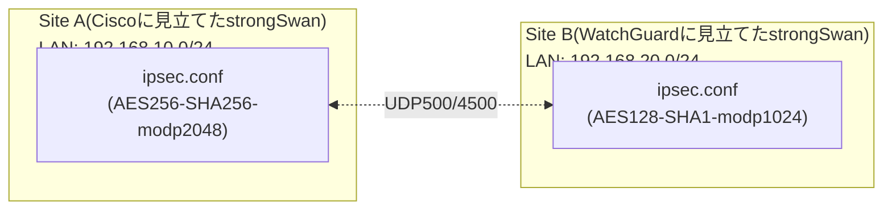

## はじめに

- **この記事で得られること**: [拠点間VPN(Site-to-Site VPN)を『上位1%』の視点で理解する](/articles/site-to-site-vpn-guide)で扱った、異なるベンダー間でのIPsecトンネル構築が、実際にどういうエラーとしてつまずくのかを、2台のstrongSwanサーバーを使って模擬的に再現します。IKEフェーズ2の暗号スイート不一致による`NO_PROPOSAL_CHOSEN`と、トラフィックセレクタの不一致による`TS_UNACCEPTABLE`という、実務で異なるベンダーの機器を接続する際に最も頻繁に遭遇する2つのエラーを、自分の目で確認します。
- **対象読者**: [拠点間VPN(Site-to-Site VPN)](/articles/site-to-site-vpn-guide)をすでに読み、IKEフェーズ1・フェーズ2・トラフィックセレクタという用語は理解しているが、実際に異なるベンダー間で接続する際にどこでつまずくのかを体験したことがない方を想定しています。
- **読むのにかかる想定時間**: 環境構築を含めて約70分

この記事は[『上位1%』シリーズ 全記事ガイド](/sitemap)の一部です。

## 前提知識

- **IKEフェーズ1/フェーズ2、SA(セキュリティアソシエーション)**: [拠点間VPN(Site-to-Site VPN)](/articles/site-to-site-vpn-guide)で扱った、IKE SAとIPsec SAの役割分担を前提とします。
- **strongSwanの基本操作**: `ipsec.conf`・`ipsec.secrets`の編集、`ipsec restart`・`ipsec statusall`の実行ができることを前提とします。不慣れな場合は[L2TP/IPsecサーバーを自作するハンズオン](/articles/l2tp-ipsec-lab-guide)を先に読んでおくとスムーズです。

## 全体像をつかむ

実際に日本拠点のCisco機器・海外拠点のWatchGuard機器を用意することはできないため、2台のLinux VMにstrongSwanをインストールし、**それぞれ異なるベンダーのデフォルト設定を模した暗号スイート**を与えることで、ベンダー間接続特有のつまずきを再現します。



## ハンズオン手順

### Step 1: 双方にstrongSwanをインストールし、あえて不一致な暗号スイートを設定する

両方のVMにstrongSwanをインストールします。

```bash
sudo apt update && sudo apt install -y strongswan
```

Site A(`/etc/ipsec.conf`)には、Cisco機器のデフォルトに近い、比較的強めの暗号スイートを設定します。

```
conn site-a-to-b
    left=%defaultroute
    leftsubnet=192.168.10.0/24
    right=<Site BのグローバルIP>
    rightsubnet=192.168.20.0/24
    authby=secret
    ike=aes256-sha256-modp2048!
    esp=aes256-sha256!
    auto=start
```

Site B(`/etc/ipsec.conf`)には、意図的に、異なる暗号スイートを設定します。

```
conn site-b-to-a
    left=%defaultroute
    leftsubnet=192.168.20.0/24
    right=<Site AのグローバルIP>
    rightsubnet=192.168.10.0/24
    authby=secret
    ike=aes128-sha1-modp1024!
    esp=aes128-sha1!
    auto=start
```

両方に、同じPSKを`/etc/ipsec.secrets`へ設定し、`ipsec restart`を実行します。

### Step 2: NO_PROPOSAL_CHOSENエラーを観測する

Site A側でログを確認します。

```bash
sudo journalctl -u strongswan-starter -f
```

しばらくすると、次のようなログが出力されます。

```
received proposals: AES_CBC_128/HMAC_SHA1_96/PRF_HMAC_SHA1/MODP_1024
configured proposals: AES_CBC_256/HMAC_SHA2_256_128/PRF_HMAC_SHA2_256/MODP_2048
no acceptable proposal found
```

**IKEフェーズ1(または2)は、自分が提示できる暗号スイートの候補リストと、相手が提示してきた候補リストの中に、完全に一致する組み合わせが1つも存在しない限り、SAを確立できません。** これが`NO_PROPOSAL_CHOSEN`です。「だいたい似たような強度の暗号を使っているから繋がるはず」という思い込みは通用せず、**アルゴリズム・鍵長・DHグループのすべてが、文字通り一致している必要があります。**

### Step 3: 暗号スイートを揃え、Phase1/Phase2を確立させる

Site Bの設定を、Site Aに合わせます。

```
    ike=aes256-sha256-modp2048!
    esp=aes256-sha256!
```

再起動後、`ipsec statusall`で、`ESTABLISHED`という状態と、双方のトラフィックセレクタが表示されることを確認します。

```bash
sudo ipsec statusall
```

### Step 4: トラフィックセレクタをずらし、TS_UNACCEPTABLEエラーを再現する

暗号スイートが一致していても、まだつまずくポイントがあります。Site A側の設定で、`rightsubnet`を意図的に、Site Bの実際のLANより狭い範囲に書き換えます。

```
    rightsubnet=192.168.20.0/25
```

再起動してログを確認すると、次のようなメッセージが出力されます。

```
CHILD_SA site-a-to-b{1} establishing failed, TS_UNACCEPTABLE
```

**Phase2で交渉されるのは、暗号スイートだけではありません。「どのローカルサブネットと、どのリモートサブネットの組み合わせを、このトンネルで通すか」という、トラフィックセレクタそのものも、双方の宣言が一致(または片方がもう片方を包含)している必要があります。** `rightsubnet`を`192.168.20.0/24`に戻すと、再び`ESTABLISHED`になることを確認してください。

## プロが見ている視点(上位1%の理解)

### 「同じベンダー同士なら暗黙的に揃う」設定が、異なるベンダー間では顕在化する

同一ベンダーの機器同士(たとえばCisco同士)では、管理画面のウィザードが、双方に同じデフォルトの暗号スイートを提案してくれることが多く、この種の不一致は表面化しにくくなっています。**しかし、日本拠点がCisco、海外拠点がWatchGuardのように異なるベンダーが混在すると、それぞれの機種のデフォルト値・対応アルゴリズムの候補が異なるため、Step 2で再現したような不一致が、実務で高い頻度で発生します。** 異なるベンダー間のIPsec構築を任された際は、最初から「暗号スイートは、双方の管理者が文字通り一致する値を明示的に指定する」という前提で臨むのが、上位1%のエンジニアの定石です。

### トラフィックセレクタの「ナローイング」という、ベンダー固有の挙動差

一部のベンダーの実装は、Phase2のネゴシエーション時に、双方が宣言したサブネットの**共通部分(積集合)だけ**に、実際に確立されるSAの範囲を自動的に狭めてしまう(ナローイングする)挙動を持っています。**この挙動を知らないと、「設定上は/24同士を指定しているはずなのに、一部のホストとしか通信できない」という、Step 4よりもさらに発見しづらい障害に遭遇します。** トラフィックセレクタの不一致を疑う際は、`ipsec statusall`の出力に表示される、実際に確立された範囲(ナローイング後の値)を、設定ファイルに書いた値と突き合わせて確認する習慣が重要です。

## よくある誤解・つまずきポイント

- **誤解1: 「暗号アルゴリズムの『強度』さえ十分であれば、多少違っていても接続できる」**
  IKE/IPsecのSA確立には、アルゴリズム・鍵長・DHグループが、文字通り完全に一致する組み合わせが必要です。
- **誤解2: 「Phase2で交渉されるのは、暗号スイートだけである」**
  トラフィックセレクタ(どのサブネット同士を通すか)も、Phase2で交渉される、独立した合意事項です。
- **誤解3: 「NO_PROPOSAL_CHOSENとTS_UNACCEPTABLEは、同じ原因で起きるエラーである」**
  前者は暗号スイートの不一致、後者はトラフィックセレクタ(サブネット宣言)の不一致という、まったく別の原因で発生します。

## 障害・トラブルシューティングの視点

1. **`NO_PROPOSAL_CHOSEN`が出る**: 双方の`ike=`/`esp=`行を突き合わせ、アルゴリズム・鍵長・DHグループが文字通り一致しているかを確認します。
2. **`TS_UNACCEPTABLE`が出る**: 双方の`leftsubnet=`/`rightsubnet=`が、正しく対になっているかを確認します。
3. **接続は確立するが、一部のホストとしか通信できない**: `ipsec statusall`で、実際に確立されたトラフィックセレクタの範囲が、設定ファイルに書いた範囲より狭くナローイングされていないかを確認します。

## まとめ

- IKE/IPsecのSA確立には、双方の暗号スイート(アルゴリズム・鍵長・DHグループ)が文字通り一致している必要があり、不一致は`NO_PROPOSAL_CHOSEN`エラーになります。
- Phase2では、暗号スイートに加えて、トラフィックセレクタ(サブネットの組み合わせ)も交渉され、不一致は`TS_UNACCEPTABLE`エラーになります。
- 異なるベンダー間の接続では、デフォルト値の違いにより、これらの不一致が同一ベンダー間より高い頻度で発生します。

**今日から意識すべきこと**
1. 異なるベンダー間でIPsecを構築する際は、暗号スイートを両者の管理者間で明示的にすり合わせましょう。
2. 接続確立後も、`ipsec statusall`で実際のトラフィックセレクタの範囲を確認し、ナローイングが起きていないかを確認しましょう。

## 参考文献

- [strongSwan Documentation: IKEv2 Cipher Suites](https://docs.strongswan.org/docs/latest/config/IKEv2CipherSuites.html)
- [strongSwan Documentation: Traffic Selectors](https://docs.strongswan.org/docs/latest/config/trafficSelectors.html)
