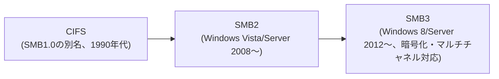

## はじめに

- **この記事で得られること**: 「CIFS共有」という呼び方と「SMB共有」という呼び方の違い、そして**WindowsとLinuxという異なるOS同士でファイル共有が成立する仕組み**を体系的に理解します。
- **対象読者**: [Windows ServerのSMB共有を『上位1%』の視点で理解する](/articles/smb-file-sharing-guide)を読み、SMBについては理解したものの、「CIFS」という別の呼び方との関係や、WindowsとLinuxの間でどうやってファイル共有が成立しているのかに疑問を持った方を想定しています。
- **読むのにかかる想定時間**: 約13分

この記事は[『上位1%』シリーズ 全記事ガイド](/sitemap)の一部、[Windows Server運用シリーズ](/sitemap#シリーズ一覧)の8本目です。SMB自体の基本や接続キャッシュの仕組みは[Windows ServerのSMB共有を『上位1%』の視点で理解する](/articles/smb-file-sharing-guide)で扱っています。

## 前提知識

- **プロトコル**: 通信の当事者間で合意された「約束事」そのものです。詳しくは[プロトコルとは何かを『上位1%』の視点で理解する](/articles/protocol-design-guide)を参照してください。

## 全体像をつかむ

### SMBとCIFS、正体は同じ「プロトコル」だが指している範囲が違う

**SMB(Server Message Block)は、Windowsのファイル共有プロトコルの名称そのものであり、時代とともにバージョンアップを重ねてきました。CIFS(Common Internet File System)は、その中の特定のバージョン——具体的には1990年代にMicrosoftが公開したSMBの初期バージョン(SMB1.0)に、Microsoftが独自に付けた別名**です。



つまり、**「SMB」はプロトコルファミリー全体を指す総称、「CIFS」はその中の初期バージョンの別名**という関係にあります。実務で「CIFS共有」という言葉を耳にすることが今も多いのは、SMB1.0が長年主流だった時代の呼び方が、習慣として定着したまま使われ続けているためです。**現在実際にネゴシエートされているのは、多くの場合SMB2やSMB3であり、技術的に正確には「CIFS」ではありません。**

<details>
<summary>SMB1.0(CIFS)が既定で無効化されている理由</summary>

SMB1.0(CIFS)は設計が古く、暗号化に対応していない、パフォーマンスが低いといった弱点に加え、**2017年に世界的な被害をもたらしたランサムウェア「WannaCry」が悪用した脆弱性(EternalBlue)が、まさにこのSMB1.0の実装に存在していた**ことから、セキュリティ上のリスクが広く知られるようになりました。これを受けて、Windows 10(バージョン1709以降)やWindows Server 2019以降では、SMB1.0(CIFS)クライアント・サーバー機能は既定で無効化されています。

</details>

## 基礎から徹底解説

### なぜ異なるOS同士でファイル共有が成立するのか

WindowsとLinuxという、まったく異なるOSの間でファイル共有が成立するのは、[プロトコルとは何かを『上位1%』の視点で理解する](/articles/protocol-design-guide)で扱った通り、**SMBが「特定の実装」ではなく「文書化された通信の約束事(プロトコル仕様)」だから**です。Microsoftは、SMB2以降のプロトコル仕様を`MS-SMB2`という技術文書として公開しており、**この仕様通りにバイト列を組み立て・解釈できるソフトウェアであれば、どのOS上に実装されていても、原理的に通信が成立します。**

この「仕様さえ満たせば実装は自由」という構造は、複数のブラウザが同じHTTPという仕様を実装することでどのWebサーバーとも通信できるのと、本質的には同じ考え方です。

### Samba——LinuxにSMBを実装したOSSプロジェクト

Linux上でSMBを扱うために使われているのが、**Samba**という、1992年から続くオープンソースプロジェクトです。SambaはSMBプロトコルをLinux(および他のUnix系OS)上に実装したソフトウェア群で、大きく2つの役割を果たします。

| コンポーネント | 役割 |
|---|---|
| **`smbd`/`nmbd`(Sambaサーバー)** | LinuxをSMBサーバーとして動作させ、Linux上のフォルダをWindowsクライアントから見える共有フォルダとして公開する |
| **`cifs-utils`(`mount.cifs`)** | LinuxをSMBクライアントとして動作させ、Windows(またはSamba)が公開している共有フォルダをLinux側にマウントする |

`cifs-utils`という名前には、SMB1.0(CIFS)が主流だった時代の名残が残っていますが、**現在のバージョンは`vers=`オプションでSMB2・SMB3も指定でき、実際にはCIFS(SMB1.0)に限定されたツールではありません。**

### 実際の設定例

**LinuxのフォルダをWindowsから見える共有として公開する**(Sambaサーバー)場合、`/etc/samba/smb.conf`に次のような設定を追加します。

```ini
[shared]
   path = /srv/shared
   browsable = yes
   read only = no
   valid users = alice
```

**Windows(またはSamba)が公開している共有フォルダを、Linux側にマウントする**場合は、次のように`mount`コマンドを使います。

```bash
sudo mount -t cifs //192.168.1.10/shared /mnt/winshare \
  -o username=alice,password=xxxxx,vers=3.0
```

`vers=3.0`のように、**使用するSMBのバージョンを明示的に指定できる**点がポイントです。サーバー側が古いSMB1.0(CIFS)しか有効化していない場合はここを`vers=1.0`にする必要がありますが、前述の通りセキュリティ上の理由から推奨されません。

## プロが見ている視点(上位1%の理解)

### 「CIFS」という言葉が出てきたら、まず実際のバージョンを疑う

実務では、古いドキュメントや社内の慣習で「CIFS」という言葉がそのまま使われ続けていることが少なくありません。**「CIFS」という言葉に出会ったら、それが本当に文字通りのSMB1.0を指しているのか、それとも単に「Windowsのファイル共有」全般を指す口語的な表現として使われているだけなのかを見極める**ことが重要です。実際に使われているSMBのバージョンを確認するには、Windows側では`Get-SmbConnection`(PowerShell)、Linux側では`mount`実行後に`/proc/mounts`や`dmesg`の出力を確認する方法があります。

## よくある誤解・つまずきポイント

- **誤解1: 「SMBとCIFSは、まったく無関係の別々のプロトコルである」**
  CIFSはSMBというプロトコルファミリーの中の、特定の初期バージョン(SMB1.0)にMicrosoftが付けた別名です。まったく無関係ではありません。
- **誤解2: 「WindowsとLinuxの間でファイル共有をするには、専用の変換ソフトウェアが必要である」**
  Sambaは変換ソフトウェアではなく、SMBプロトコルの仕様をLinux上にそのまま実装したソフトウェアです。プロトコル仕様さえ満たしていれば、変換なしに直接通信できます。
- **誤解3: 「`cifs-utils`という名前だから、SMB1.0(CIFS)にしか対応していない」**
  名前に歴史的な名残が残っているだけで、`vers=`オプションによりSMB2・SMB3にも対応しています。

## 障害・トラブルシューティングの視点

1. **Linuxからのマウントが失敗する**: `mount`コマンドのエラーメッセージと`dmesg`の出力を確認し、SMBのバージョンの不一致(サーバー側が要求するバージョンと`vers=`オプションの指定)が原因でないかを確認します。
2. **SMB1.0のみ対応の古い機器と通信できない**: セキュリティリスクを理解した上で、影響範囲を限定したセグメントでのみ`vers=1.0`を許可するなど、恒久的な運用ではなく暫定的な対応として扱います。

### 予防策・恒久対策

- 新しいLinux機器を導入する際は、`cifs-utils`のバージョン指定オプション(`vers=`)を明示的に設定し、意図しない古いバージョンへのフォールバックを防ぐ。
- 「CIFS」という言葉が社内ドキュメントに登場した場合、実際に使われているSMBのバージョンを確認し、必要であれば表記を更新する。

## まとめ

- SMBはプロトコルファミリー全体の名称であり、CIFSはその中の初期バージョン(SMB1.0)にMicrosoftが付けた別名です。
- SMB1.0(CIFS)は脆弱性(EternalBlue)の温床になった経緯から、現在のWindowsでは既定で無効化されています。
- SambaはSMBプロトコルの仕様をLinux上に実装したOSSプロジェクトで、Linuxをサーバー・クライアントいずれとしても動作させられます。
- 異なるOS同士でファイル共有が成立するのは、SMBが文書化された「プロトコル」であり、仕様さえ満たせばどのOS上にも実装しうるためです。

**今日から意識すべきこと**
1. 「CIFS」という言葉を見聞きしたら、それが文字通りのSMB1.0を指しているのか、単なる口語的な表現なのかを見極めましょう。
2. Linuxからのマウント設定を行う際は、`vers=`オプションで使用するSMBバージョンを明示するようにしましょう。

## 参考文献

- [[MS-SMB2]: Server Message Block (SMB) Protocol Versions 2 and 3 | Microsoft Learn](https://learn.microsoft.com/en-us/openspecs/windows_protocols/ms-smb2/5606ad47-5ee0-437a-817e-70c366052962)
- [SMB security enhancements | Microsoft Learn](https://learn.microsoft.com/en-us/windows-server/storage/file-server/smb-security)
- [Samba Project](https://www.samba.org/)
