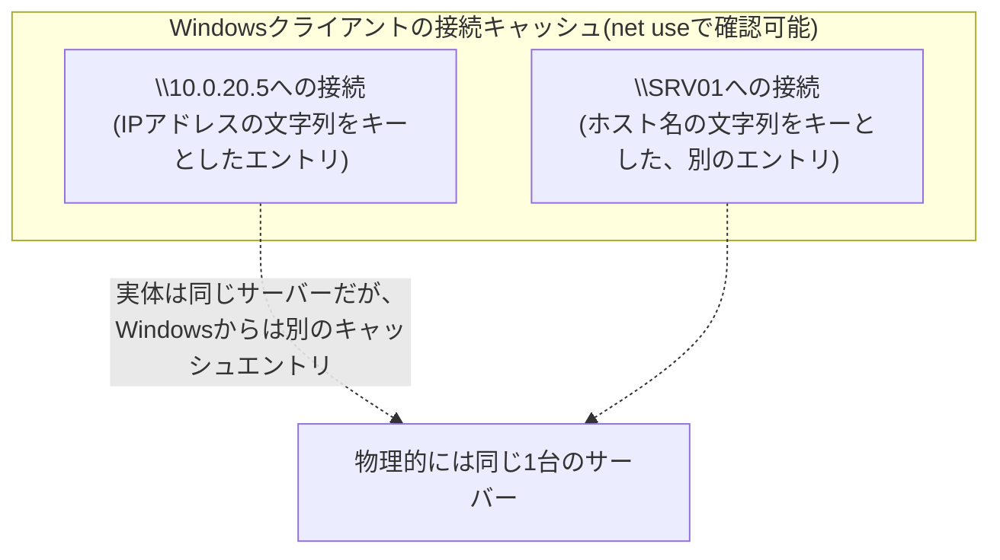
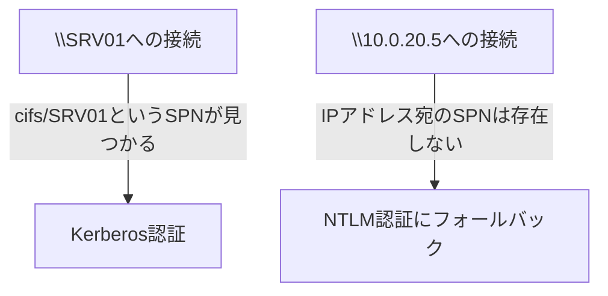

## はじめに

- **この記事で得られること**: Windows Serverでのファイル共有(SMB)にまつわる、次のような実務でよく遭遇する疑問に答えます。**Cドライブ全体を共有し、その配下の特定フォルダにもアクセスできることを確認していた。その後Cドライブ自体の共有を停止したところ、別サーバーから`\\IPアドレス\特定フォルダ`にはアクセスできなくなったが、`\\ホスト名\特定フォルダ`では問題なくアクセスできた。これはなぜか。** この現象を、SMBクライアントの接続キャッシュの仕組みから解き明かします。あわせて、`net share`で表示される`C$`・`IPC$`・`ADMIN$`という管理共有の役割も整理します。
- **対象読者**: Windows Serverのファイル共有(SMB)の運用に携わっているものの、IPアドレスとホスト名でアクセス結果が異なるといった、原因の分かりにくいトラブルに遭遇したことがある方を想定しています。
- **読むのにかかる想定時間**: 約18分

この記事は[『上位1%』シリーズ 全記事ガイド](/sitemap)の一部、[Windows Server運用シリーズ](/sitemap#シリーズ一覧)の5本目です。DC特有のNETLOGON・SYSVOL共有については[DCの正常性確認を『上位1%』の視点で理解する](/articles/dc-health-check-guide)で、SMBと「CIFS」という呼び方の違いやWindows-Linux間のファイル共有については[SMBとCIFSは何が違うのか——Windows-Linux間のファイル共有を『上位1%』の視点で理解する](/articles/smb-cifs-linux-interop-guide)で扱っています。

## 前提知識

- **SMB(Server Message Block)**: Windowsのファイル共有で使われる標準的なプロトコルです。
- **共有アクセス許可とNTFSアクセス許可**: Windowsのファイルサーバーには、共有フォルダ単位で設定する「共有アクセス許可」と、ファイルシステム(NTFS)単位で設定する「NTFSアクセス許可」という、独立した2層のアクセス制御が存在します。両方が設定されている場合、**より厳しい(制限的な)方の設定が実際の実効権限として適用されます。**

## 全体像をつかむ

### 管理共有(C$・IPC$・ADMIN$)の役割

Windows Serverでは、明示的に作成した共有フォルダとは別に、**既定で自動的に用意されている管理共有**が存在します。

| 共有名 | 実体 | 用途 |
|---|---|---|
| `C$`(ドライブレターごとに`D$`なども同様) | `C:\`ドライブ全体 | 管理者権限を持つユーザーが、リモートからそのドライブ全体へアクセスするための共有 |
| `ADMIN$` | `%SYSTEMROOT%`(通常`C:\Windows`) | リモートでの管理操作のための共有 |
| `IPC$` | 実体のあるフォルダーではなく、プロセス間通信用の名前付きパイプ | RPCなどのプロセス間通信をSMB経由で行うための特殊な共有 |

これらの管理共有は、AD DSやDCに固有のものではなく、**Windows Server全般で既定で自動的に作成される**ものです(AD DS環境で追加されるNETLOGON・SYSVOLについては[DCの正常性確認を『上位1%』の視点で理解する](/articles/dc-health-check-guide)を参照してください)。

## 基礎から徹底解説

### SMBクライアントの接続キャッシュという仕組み

ここからが本題です。**Windowsのファイル共有クライアント(SMBリダイレクタ)は、一度確立したサーバーへの接続(セッション)を、内部的にキャッシュして再利用する**という仕組みを持っています。この接続の状況は`net use`コマンドで確認でき、現在確立されている接続の一覧が表示されます。

**ここで極めて重要なのは、Windowsのこの接続キャッシュが、接続先を指定する際に使った"文字列そのもの"(IPアドレスの文字列か、ホスト名の文字列か)を基準に管理されている**という点です。つまり、`\\10.0.20.5\共有名`と`\\SRV01\共有名`が、たとえ**まったく同じ物理サーバーを指していたとしても、Windowsから見れば別々の「接続先」として、別々にキャッシュされ、別々に管理されます。**



### 事例の診断:なぜIPアドレスでのアクセスだけが失敗したのか

前述の実例を、この接続キャッシュの仕組みを踏まえて診断すると、次のように整理できます。

1. **最初に`\\IPアドレス\c$`および`\\IPアドレス\c$\特定フォルダ`へアクセスした時点で、`IPアドレス`という文字列をキーにしたSMB接続(セッション)が、アクセス元のクライアント側に確立・キャッシュされます。**
2. **その後、サーバー側でCドライブ自体の共有(`C$`)を停止しますが、クライアント側に既に確立・キャッシュされている、そのIPアドレス宛の接続自体は、明示的に切断しない限り残り続けます。**
3. **この状態で改めて`\\IPアドレス\特定フォルダ`へアクセスしようとすると、既にキャッシュされている(古い共有構成の前提で確立された)そのIPアドレス宛の接続状態と干渉し、アクセスが失敗します。**(典型的には、同じサーバーに対して異なる資格情報での複数接続を同時に確立できないという、SMBクライアントの制約に起因するエラーになります。)
4. **一方`\\ホスト名\特定フォルダ`は、`IPアドレス`とは異なる文字列をキーとした、まったく新規の接続として扱われるため、古いキャッシュの影響を受けずにクリーンに接続が成立します。**

**つまり、この現象の本質は「サーバー自体の設定変更(C$共有の停止)」そのものではなく、「アクセス元のクライアント側に残り続けていた、IPアドレスをキーとした古い接続キャッシュ」が原因**です。ホスト名でのアクセスが成功したのは、単にそちらが**キャッシュの影響を受けない、まっさらな接続**だったから、と説明できます。

### なぜ「文字列でキャッシュする」という設計になっているのか——認証方式そのものが変わる、というさらに深い理由

「同じサーバーなのに、文字列が違うだけで別扱いになるのは、単に実装が大雑把なだけではないか」と感じるかもしれませんが、実はこの背後には**認証プロトコルそのものが変わりうる**という、より本質的な理由があります。

AD環境でのSMB接続は、可能であれば**Kerberos認証**を使おうとします。[SPN(サービスプリンシパル名)の仕組みを『上位1%』の視点で理解する](/articles/ad-spn-guide)で扱った通り、Kerberosのサービスチケットは**SPN**(`cifs/SRV01`のような、ホスト名に基づく識別子)に対して発行されます。ここで重要なのは、**IPアドレス宛のSPNは通常存在しない**ということです。つまり、`\\SRV01\共有名`への接続はKerberosのSPNマッチングが成立しうる一方、`\\10.0.20.5\共有名`への接続はマッチするSPNが存在しないため、**Kerberosを使えず、NTLM認証にフォールバックします。**



つまり、IPアドレスとホスト名でのアクセスは、**単に接続キャッシュのキーが違うだけでなく、水面下で使われる認証プロトコル自体が異なりうる**のです。接続キャッシュがサーバー名の文字列単位で管理されているのは、この認証コンテキスト(どのSPNに対して、どの認証方式で確立したセッションか)を、接続先ごとに独立して保持する必要があるためだと理解すると、単なる「実装の都合」ではなく、**認証モデルの構造そのものに根ざした設計**であることが見えてきます。

<details>
<summary>「同じユーザー名で複数の接続はできません」というエラー</summary>

SMBクライアントには、**同じサーバーに対して、異なる資格情報を使った複数の接続を同時に確立できない**という制約があります。これは`net helpmsg`にも登録されている既知の制約で、「多重接続」に関するエラーメッセージとして表示されることがあります。前述の事例のように、共有構成の変更前後で認証状態に何らかの変化が生じた場合、この制約に抵触して接続が拒否されることがあります。

</details>

### 解決策:キャッシュされた接続の明示的な切断

この種の問題に遭遇した場合の実務的な対処は、`net use`コマンドで**キャッシュされた接続を明示的に切断してから、改めて接続し直す**ことです。

```powershell
# 現在確立されている接続の一覧を確認する
net use

# 特定のサーバー(IPアドレス指定)への接続を切断する
net use \\10.0.20.5 /delete

# すべてのキャッシュされた接続を切断する場合
net use * /delete
```

キャッシュされた接続を切断した上で改めてアクセスし直すことで、多くの場合この種の「IPアドレスでは失敗するがホスト名では成功する(あるいはその逆)」という現象は解消します。

## プロが見ている視点(上位1%の理解)

### IPアドレスとホスト名、どちらでアクセスすべきか

実務では、**同じサーバーへ、意図的にIPアドレスとホスト名の両方でアクセスする状況が生じることは珍しくありません**(監視ツールがIPアドレスで疎通確認を行い、実際の運用ではホスト名でアクセスする、など)。この場合、前述の接続キャッシュが別々に管理されるという性質を踏まえ、**片方の接続方式で発生した問題が、もう片方の接続方式には直接影響しない(が、逆に問題の切り分けに使える)**、という点を意識しておくと、トラブルシューティングの際に役立ちます。あるサーバーへの接続に問題が起きた際、**IPアドレスとホスト名の両方で接続を試し、結果に差があるかどうかを確認する**こと自体が、原因がサーバー側の設定にあるのか、クライアント側の接続キャッシュにあるのかを切り分ける、簡便で有効な診断手法になります。

## よくある誤解・つまずきポイント

- **誤解1: 「IPアドレスとホスト名は同じサーバーを指すのだから、Windowsから見ても常に同じ1つの接続として扱われる」**
  WindowsのSMBクライアントは、接続先を指定する文字列(IPアドレスかホスト名か)ごとに別々の接続としてキャッシュ・管理します。同じ物理サーバーであっても、これらは別々の接続として扱われます。
- **誤解2: 「サーバー側で共有設定を変更すれば、クライアント側の接続状態も自動的にリセットされる」**
  サーバー側の共有設定の変更は、クライアント側に既に確立・キャッシュされている接続そのものには影響しません。古いキャッシュが残り続け、後続のアクセスに影響を与えることがあります。
- **誤解3: 「アクセスできない場合は、必ずサーバー側の権限設定に問題がある」**
  権限設定に問題がなくても、クライアント側の接続キャッシュが原因でアクセスが失敗することがあります。サーバー側の設定確認と同時に、クライアント側の`net use`の状態も確認することが重要です。

## 障害・トラブルシューティングの視点

SMB共有関連の障害は、**「サーバー側の設定の問題か、クライアント側の接続キャッシュの問題か」を切り分ける**のが基本です。

1. **特定の接続方式(IPアドレスまたはホスト名)でのみアクセスが失敗する**: `net use`でクライアント側に残っているキャッシュされた接続を確認し、該当する接続先を`net use /delete`で明示的に切断してから再度アクセスを試みます。
2. **共有設定を変更した直後からアクセスできなくなった**: サーバー側の共有アクセス許可・NTFSアクセス許可の設定変更内容を確認するとともに、クライアント側のキャッシュされた接続もあわせて疑います。
3. **同じユーザーで複数のサーバーへ、異なる資格情報で同時に接続しようとしてエラーになる**: SMBクライアントの「同じサーバーへの複数資格情報での同時接続不可」という制約に抵触していないかを確認します。

### 予防策・恒久対策

- 共有設定を大きく変更する作業を行う際は、事前に主要なクライアント側で`net use * /delete`を実行し、古いキャッシュをクリアしてから作業に臨む。
- 監視ツールと実際の運用で異なる接続方式(IPアドレス/ホスト名)を使い分けている場合、その違いが将来のトラブルシューティングを複雑にしうることを認識しておく。
- 「IPアドレスでは失敗するがホスト名では成功する」ような現象に遭遇したら、まずクライアント側の接続キャッシュを疑う習慣をつける。

## まとめ

- `C$`・`IPC$`・`ADMIN$`はAD DSやDCに固有のものではなく、Windows Server全般で既定で自動的に作成される管理共有です。
- Windowsのファイル共有クライアントは、接続先を指定した文字列(IPアドレスかホスト名か)ごとに、別々の接続として内部的にキャッシュ・管理します。
- 同じ物理サーバーであっても、IPアドレスとホスト名は別々の接続としてキャッシュされるため、片方でのみ発生した過去の接続状態が、もう片方には影響しないという非対称性が生まれます。
- 「IPアドレスでは失敗するがホスト名では成功する」現象の多くは、クライアント側に残っている古い接続キャッシュが原因であり、`net use /delete`で明示的に切断することで解消できます。
- 接続キャッシュが文字列単位で管理されているのは実装の都合だけではなく、SPNに基づくKerberos認証がホスト名宛にしか成立せず、IPアドレス宛の接続はNTLMにフォールバックするという、認証モデルの構造に根ざした理由があります。

**今日から意識すべきこと**
1. IPアドレスとホスト名でアクセス結果が異なる現象に遭遇したら、まずサーバー側ではなくクライアント側の接続キャッシュ(`net use`)を疑いましょう。
2. 共有設定を大きく変更する前後では、クライアント側のキャッシュされた接続をクリアしてから動作確認を行いましょう。

これでWindows Server運用シリーズ全5記事が完了です。通勤中や家事をしながら内容を振り返りたい場合は、耳だけで復習できる[【音声で聴く】Windows Server運用シリーズ総復習](/articles/windows-server-audio-review-guide)もあわせてどうぞ。

## 参考文献

- [Net use | Microsoft Learn](https://learn.microsoft.com/en-us/windows-server/administration/windows-commands/net-use)
- [Overview of problems that are caused by disabling NTLM or administrative shares | Microsoft Learn](https://learn.microsoft.com/en-us/troubleshoot/windows-server/networking/disable-administrative-shares)
- [Access-Based Enumeration and Share/NTFS Permissions | Microsoft Learn](https://learn.microsoft.com/en-us/windows-server/storage/file-server/ntfs-overview)
