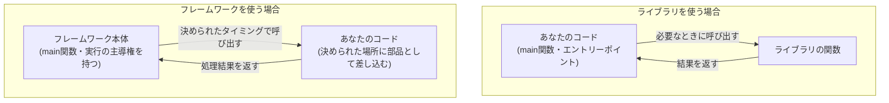

## はじめに

- **この記事で得られること**: ソフトウェアの解説記事を読んでいると必ず登場する**フレームワーク**・**ライブラリ**・**ランタイム**・**SDK**・**API**という5つの用語を、「どちらのコードが、どちらを呼び出しているのか」という1つの軸で整理し、それぞれの違いを具体例とともに体系的に理解します。
- **対象読者**: 「ASP.NETはフレームワークです」「.NET Frameworkをインストールします」といった説明を読んだことはあるものの、フレームワークとライブラリが何が違うのか、SDKやランタイムとはどう関係するのかを具体的に説明できない方を想定しています。
- **読むのにかかる想定時間**: 約14分

この記事は[『上位1%』シリーズ 全記事ガイド](/sitemap)の一部、[Linux/OS基礎シリーズ](/sitemap#シリーズ一覧)の11本目です。この用語の混同は特定のOS・言語に限った話ではないため、独立したテーマとして扱っています。

## 前提知識

- **ライブラリの基本**: 静的リンク・動的リンクの仕組みについては、[ライブラリ(library)とは何か——静的リンク・動的リンクの仕組みを『上位1%』の視点で理解する](/articles/software-library-guide)を先に読んでおくと理解がスムーズです。

## 全体像をつかむ

### すべての違いは「どちらが、どちらを呼び出すか」に集約される

**ライブラリとフレームワークの違いは、機能の多さや複雑さではなく、「制御の流れがどちらを向いているか」という1点に集約されます。** これは**制御の反転**(Inversion of Control)と呼ばれる考え方で、ソフトウェア工学の世界では「**Don't call us, we'll call you.**」(こちらから呼ぶな、そちらが呼ばれる)という、ハリウッドのオーディションになぞらえた言い回しで説明されることもあります。

- **ライブラリを使う場合**: 「**あなたのコードが主人公**」です。あなたが書いたプログラムの流れの中で、必要なタイミングで、必要なライブラリの関数を呼び出します。制御の主導権は常にあなたのコード側にあります。
- **フレームワークを使う場合**: 「**フレームワーク側が主人公**」です。フレームワークが用意した実行の枠組み(HTTPリクエストの受信ループなど)の中で、あなたが書いたコード(コントローラーのメソッドなど)を、フレームワークが決めたタイミングで呼び出します。制御の主導権はフレームワーク側にあります。

## 基礎から徹底解説

### ASP.NETというフレームワークで具体的に確認する

[IISとASP.NETの仕組みを『上位1%』の視点で理解する](/articles/iis-fundamentals-guide)で登場したASP.NETを例に考えると、この違いがはっきりします。ASP.NETを使う開発者は、**「HTTPリクエストを受け付けて、TCPソケットを開いて……」という一連の流れを自分で書くことはありません。** その代わり、「このURLパターンが来たら、このメソッドを実行してください」という**部品(コントローラーのメソッド)だけを用意し、いつ・どの順番でそれが呼ばれるかはASP.NET側にすべて委ねます。** これが「ASP.NETはフレームワークである」という表現の実体です。

一方、[ライブラリ(library)とは何か](/articles/software-library-guide)で扱った暗号化ライブラリや文字列処理ライブラリは、**あなたのコードが「この関数を、このタイミングで呼び出そう」と能動的に決めて使うもの**であり、制御の主導権を渡すことはありません。

### ランタイムとは何か——フレームワークが動くための土台

**ランタイム**(runtime)は、フレームワークやライブラリとは異なる、もう1つの重要な概念です。ランタイムとは、**コンパイル(あるいは中間言語への変換)されたコードを、実際に実行するために必要な環境そのもの**を指します。

代表的な例が、.NETの**CLR**(Common Language Runtime)です。C#で書かれたコードは、CLRという実行環境がなければそもそも動きません。ASP.NETというフレームワークも、内部的にはCLRというランタイムの上で動いています。つまり、フレームワークは「**土台の上に建てる建物の設計図**」、ランタイムは「**その建物が実際に建っている土地そのもの**」というイメージで捉えると整理しやすくなります。

### SDKとは何か——道具箱としてのパッケージ

**SDK**(Software Development Kit)は、フレームワークやライブラリ、ランタイムとは**次元が異なる概念**です。SDKは特定の実行モデルを指す言葉ではなく、「**特定のプラットフォーム向けにソフトウェアを開発するために必要な、道具一式を1つにまとめたパッケージ**」を指します。

`.NET SDK`をインストールすると、その中には、CLR(ランタイム)、フレームワーククラスライブラリ(ライブラリ群)、コンパイラ、コマンドラインツールなど、開発に必要な要素がまとめて含まれています。**「SDKの中に、ランタイムやライブラリが同梱されている」という包含関係**であり、SDK自体が実行時に呼び出される何かというわけではありません。

### APIとは何か——ソフトウェアではなく「契約」

最後に**API**(Application Programming Interface)です。これまでの4つと違い、**APIはソフトウェアの実体ではなく、「このように呼び出せば、このように応答します」という約束事(インターフェースの仕様)そのもの**を指します。

- ライブラリは、内部に具体的な処理を実装しつつ、外部から呼び出すためのAPI(関数のシグネチャ)を公開しています。
- フレームワークも同様に、あなたのコードを差し込むための箇所(APIとして公開されたインターフェースや基底クラス)を提供しています。
- 「Web API」という言葉が指す、ネットワーク越しに呼び出すHTTPベースの契約も、同じ「API」という概念の一種です。

つまりAPIは、ライブラリやフレームワークという「実体」が外部に見せている「**窓口の仕様**」であり、実体そのものではありません。

### 5つの用語の整理表

| 用語 | 正体 | 制御の主導権 |
|---|---|---|
| **ライブラリ** | あなたのコードが能動的に呼び出す、機能の部品集 | あなたのコード側 |
| **フレームワーク** | あなたのコードを部品として組み込む、実行の枠組み | フレームワーク側 |
| **ランタイム** | コードを実際に実行するための環境そのもの | (呼び出す/呼び出されるという概念の外側にある土台) |
| **SDK** | 開発に必要な道具一式(ランタイム・ライブラリ・コンパイラ等)をまとめたパッケージ | (パッケージという包含関係であり、主導権の概念がそもそも当てはまらない) |
| **API** | ソフトウェアの実体ではなく、呼び出し方の約束事(契約) | (実体ではないため主導権の概念が当てはまらない) |

## プロが見ている視点(上位1%の理解)

### なぜこの違いが実務のアーキテクチャ判断に直結するのか

この違いは単なる言葉の整理にとどまらず、**「後から別のものに乗り換えるコストがどれだけ違うか」という、実務上とても重要な判断に直結します。**

- **ライブラリの乗り換え**: 制御の主導権はあなたのコード側にあるため、同じ関数シグネチャ(API)を持つ別のライブラリに差し替えるだけで、比較的小さな変更で済むことが多くあります。
- **フレームワークの乗り換え**: あなたのコード自体が、そのフレームワークの実行の枠組み(基底クラスの継承、決められたメソッド名、決められたディレクトリ構成など)に合わせて書かれているため、別のフレームワークへ乗り換えるには、**そのコードの構造自体を大きく書き直す必要がある**ことがほとんどです。

新しい技術を採用する際に、それが「ライブラリ」なのか「フレームワーク」なのかを見極めることは、**将来の技術的負債の大きさを見積もる**うえで欠かせない視点です。

## よくある誤解・つまずきポイント

- **誤解1: 「ライブラリとフレームワークは、規模の大小の違いにすぎない」**
  規模ではなく、制御の主導権がどちらにあるかという構造的な違いです。小さなフレームワークも、巨大なライブラリも存在します。
- **誤解2: 「.NET FrameworkはSDKの別名である」**
  .NET Frameworkは、ランタイム(CLR)とフレームワーククラスライブラリを内包する実行環境の名前であり、開発ツール一式を指すSDKとは異なる概念です。
- **誤解3: 「APIとは、Web APIのことだけを指す言葉である」**
  Web APIはAPIという概念の一種にすぎません。ローカルで呼び出すライブラリの関数シグネチャも、同じくAPIと呼ばれます。

## 障害・トラブルシューティングの視点

用語の混同は、実務では「**何を、どこまで変更すれば問題が解決するのか**」の見積もりを誤らせるという形で表面化します。

1. **「このライブラリのバージョンを上げたら動かなくなった」**: 多くの場合、公開されているAPI(関数シグネチャ)の変更が原因であり、影響範囲はそのライブラリを呼び出している箇所に限定されます。
2. **「フレームワークのメジャーバージョンを上げたら大量のコードが壊れた」**: フレームワークは制御の主導権を握っているため、内部の実行モデル自体の変更が、あなたのコードの構造そのものに影響することがあります。
3. **「ランタイムのバージョンが合わず起動しない」**: フレームワークやライブラリの問題ではなく、そもそもコードを実行する土台(ランタイム)自体が要求バージョンを満たしていないことが原因です。

### 予防策・恒久対策

- 新しい技術を採用する前に、それが「ライブラリ」か「フレームワーク」かを確認し、乗り換えコストの見積もりに反映する。
- バージョンアップの際は、ランタイム・フレームワーク・ライブラリのどの層の変更なのかを切り分けてから影響範囲を調べる。

## まとめ

- ライブラリとフレームワークの違いは、機能の規模ではなく「制御の主導権がどちらにあるか」という制御の反転(IoC)の考え方に集約されます。
- ランタイムはコードを実行するための環境そのものであり、フレームワークはそのランタイムの上に建てられます。
- SDKは、ランタイム・ライブラリ・コンパイラなどの開発に必要な道具一式をまとめたパッケージという、次元が異なる概念です。
- APIはソフトウェアの実体ではなく、呼び出し方の約束事(契約)そのものを指します。

**今日から意識すべきこと**
1. 新しい技術に出会ったら、まず「これはライブラリなのか、フレームワークなのか」を、制御の主導権がどちらにあるかで判断する習慣をつけましょう。
2. 「SDK」「ランタイム」「API」という言葉に出会ったら、それぞれが指している対象の次元が異なることを意識しましょう。

## 参考文献

- [Inversion of Control Containers and the Dependency Injection pattern | Martin Fowler](https://martinfowler.com/articles/injection.html)
- [.NET architecture guides | Microsoft Learn](https://learn.microsoft.com/en-us/dotnet/architecture/)
- [What is an SDK? | Microsoft Learn](https://learn.microsoft.com/en-us/windows/apps/desktop/modernize/desktop-to-uwp-supported-api)
